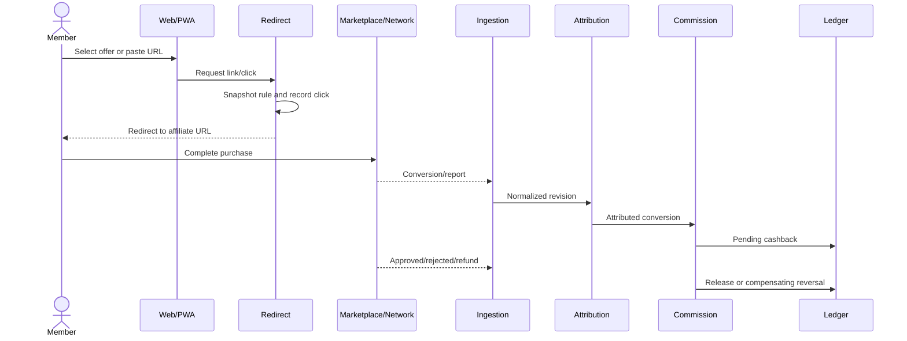

# BRD — Vietnam Cashback and Affiliate Platform

**Version:** 1.0  
**Language:** English  
**Consolidation date:** 2026-07-24  
**Status:** Baseline for validation and MVP planning  
**Related technical document:** [English TDD](../tdd/cashback_affiliate_platform_tdd_en.md)  
**Equivalent version:** [BRD tiếng Việt](./cashback_affiliate_platform_brd_vi.md)

## 1. Document purpose

This document consolidates the market research, System A and ShopBack Vietnam
analysis, affiliate-program research, Shopee Affiliate findings, and implementation
blueprint into one Business Requirements Document. It is intended to:

- align product goals and the business model;
- establish MVP scope;
- define cashback, commission, wallet, and payout rules;
- define operational roles and controls;
- support backlog creation, estimation, and acceptance;
- provide traceability into the TDD.

It is not the contract of any single upstream API. An endpoint observed in browser
traffic remains a private UI endpoint unless current official documentation says
otherwise.

## 2. Evidence classification

| Label                   | Meaning                                                                |
| ----------------------- | ---------------------------------------------------------------------- |
| `Observed`              | Directly observed within authorized account access                     |
| `Officially documented` | Confirmed by current official documentation                            |
| `Inferred`              | Evidence-supported hypothesis with confidence and alternatives         |
| `Third-party reported`  | Reported outside the platform and not independently confirmed          |
| `Proposed`              | Product or technical decision for the new platform                     |
| `Unknown`               | Insufficient evidence or dependent on access, contract, or sample data |

All BRD requirements are `Proposed` unless stated otherwise.

## 3. Executive decision

### 3.1 Product to build

Build a Shopee-priority cashback and affiliate platform for Vietnam that provides:

- behavioral parity with the core observed functions of System A;
- merchant, campaign, offer, and voucher discovery;
- Shopee link conversion with user/click SubIDs;
- first-party redirect and click tracking;
- conversion ingestion through approved APIs, polling, or reports;
- transparent order and cashback states;
- a double-entry wallet, controlled withdrawals, and payouts;
- reconciliation, fraud controls, missing-cashback handling, and audit;
- an integration path to AccessTrade, TikTok Shop, and additional networks.

### 3.2 Integration strategy

The product is **Shopee-first**, while the connector strategy is **hybrid**:

1. Use the officially documented Shopee affiliate redirect format.
2. Use Shopee conversion report/CSV for the no-App-ID/no-App-Secret MVP.
3. Use browser-assisted export only as an operator-authenticated fallback.
4. Add an approved Shopee Affiliate API connector when entitlement exists.
5. Prioritize AccessTrade as the network connector for broader coverage and
   API-based conversion data.
6. Use TikTok Shop through AccessTrade before direct Affiliate API approval if
   that offers the shortest supported route.

Shopee seller APIs must not be treated as affiliate conversion APIs.

### 3.3 Business principles

- Cashback is a financial liability, not an editable UI counter.
- A pending conversion is not withdrawable cash.
- Rates and eligibility rules are snapshotted at click time.
- Commission, refund, and status changes create revisions and adjustments.
- Money is not credited when attribution evidence is insufficient.
- Product-level commission estimates are not the source of payable truth.
- The business must not depend on one marketplace or network.

## 4. Market context and opportunity

### 4.1 Context

The consolidated research indicates that:

- Vietnam e-commerce is large enough to support a specialized product;
- Shopee and TikTok Shop dominate multi-category marketplace activity;
- video and creator commerce are growing rapidly, while order values are often low;
- loyalty/rewards partners continue to drive significant transaction volume;
- first-party and server-side tracking are baseline capabilities;
- advertised commission rates differ from effective commission after cancellation,
  refund, fraud, network fees, caps, and adjustments.

### 4.2 Opportunity

The opportunity is not another generic link shortener. Defensible value comes from:

- reliable tracking;
- fast and transparent status communication;
- clear pre-purchase eligibility;
- evidence-based missing-cashback resolution;
- auditable reconciliation and payout;
- creator, community, and sub-publisher tooling;
- source switching between direct and network integrations without changing the
  member experience.

### 4.3 Revenue model

Planned revenue sources include:

- retained commission after the member cashback share;
- boosted campaigns and merchant-funded placements;
- voucher or promotional commission;
- creator/community platform fees;
- later-stage B2B2C white-label, API, or SDK fees.

Gross commission is not earned revenue until it reaches the relevant approval and
reconciliation gates.

## 5. Vision, objectives, and product principles

### 5.1 Vision

Turn fragmented affiliate data into a trustworthy financial promise:

```text
click recorded
→ terms frozen
→ order tracked
→ commission reconciled
→ cashback accounted for
→ payout explained
```

### 5.2 First-year objectives

- Prove a replayable Shopee click-to-conversion-to-cashback flow.
- Reach behavioral parity with the core System A surface.
- Operate at least one production affiliate-network connector.
- Produce at least one user cohort with repeat tracked orders.
- Measure contribution margin by merchant and campaign.
- Prevent duplicate payouts and explain every balance through the ledger.
- Prevent a single merchant/network from becoming an existential dependency.

### 5.3 UX principles

- Label unapproved commission and cashback as estimated.
- Separate tracked, pending, confirmed, payable, paid, rejected, and reversed.
- Show merchant/campaign-specific ETAs instead of one global promise.
- Explain exclusions and structured rejection reasons.
- Mask source order and sensitive identifiers by default.

## 6. Stakeholders and personas

| Persona                     | Primary need                                                    | Success measure                                      |
| --------------------------- | --------------------------------------------------------------- | ---------------------------------------------------- |
| Shopper/member              | Find offers, create links, see tracked orders, receive cashback | First tracked order, repeat order, successful payout |
| Creator/KOC/community owner | Track channels/SubIDs and revenue share                         | Source conversion, approved commission, retention    |
| Support                     | Resolve missing cashback without raw secrets/PII                | Case SLA, resolution rate, cost per case             |
| Affiliate Operations        | Sync campaigns, import reports, recover connectors              | Freshness, DLQ age, unmatched rate                   |
| Finance/Treasury            | Reconcile receivables, liabilities, and payouts                 | Reconciliation gap, cash coverage, payout accuracy   |
| Risk analyst                | Detect abuse before release and payout                          | Loss rate, false positives, case age                 |
| Administrator               | Manage users, rules, roles, and audit                           | Change accuracy, approval compliance                 |
| Product/Commercial          | Select economically viable merchants/campaigns                  | Contribution margin, concentration, repeat           |

## 7. Scope

### 7.1 MVP scope

- Account registration/login/logout, session, and recovery.
- RBAC for member, support, operations, finance, risk, and admin.
- Merchant, campaign, voucher, and immutable rule versions.
- Shopee URL conversion, direct affiliate links, and five SubID slots.
- First-party redirect and durable click record.
- Shopee CSV import, versioned parsing, and replay.
- AccessTrade campaign/link/transaction connector when approved.
- Conversion, order, and order-line normalization.
- Attribution using SubID/click evidence.
- Commission and cashback calculation.
- Order, fraud, cashback, and payment state tracking.
- Double-entry ledger with pending and available balances.
- One controlled withdrawal and payout flow.
- Reconciliation, adjustments, missing cashback, and audit.
- Member and operations dashboards.
- A System A-equivalent leaderboard with clearly defined eligible metrics.

### 7.2 Post-MVP scope

- Native mobile applications.
- Browser extension.
- Direct TikTok Shop Affiliate connector.
- Direct Shopee Affiliate API connector when entitled.
- Creator/community self-service portal.
- Advanced referral, quest, tier, and boosted rewards.
- Multi-currency.
- White-label/API/SDK B2B2C offering.
- Card-linked or payment-integrated offers.
- Advanced personalization and ranking.

### 7.3 Out of scope

- Marketplace checkout or payment processing.
- Seller inventory, logistics, and order-management functionality.
- Bypassing authentication, CAPTCHA, signatures, or access controls.
- Copying browser cookies or sessions into backend services.
- Reusing credentials or secrets found in public repositories.
- Treating scraping or private endpoints as production contracts.
- Legal, tax, or regulatory advice.
- Copying branding, data, or vulnerabilities from reference systems.

## 8. Lessons from reference systems

### 8.1 System A

`Observed`:

- server-rendered PHP;
- login/remember, profile, and password change;
- KPI dashboard, order table, filters, and pagination;
- row-level order/payment states;
- leaderboard;
- Shopee converter returning metadata and commission estimate;
- no observed self-service wallet or withdrawal flow.

Decision:

- reproduce core behavior, not its implementation;
- keep a more detailed backend state model than the UI;
- replace simple payment markers with an auditable ledger and payout model.

### 8.2 ShopBack

`Observed`:

- consumer and social sign-in;
- merchant discovery, vouchers, rules, and deep links;
- pending, available, and withdrawn balances;
- referrals, quests, and payout;
- OTP, reCAPTCHA, and device controls;
- dedicated missing-cashback support.

Decision:

- use trust, status transparency, and claim handling as benchmarks;
- do not attempt to reproduce the full payment ecosystem in the MVP.

## 9. Functional requirements

Priorities:

- `Must`: required for pilot or launch.
- `Should`: required for closed beta or immediately after MVP.
- `Could`: optimize only after economics are proven.

### 9.1 Identity and account

| ID         | Requirement                                                     | Priority | Business acceptance                               |
| ---------- | --------------------------------------------------------------- | -------: | ------------------------------------------------- |
| BRD-FR-001 | Members can register, sign in, and sign out                     |     Must | Sessions are created/revoked and audited          |
| BRD-FR-002 | Members can recover accounts through a verified channel         |     Must | No account enumeration; recovery expires          |
| BRD-FR-003 | Members can view and edit non-sensitive profile data            |     Must | Sensitive changes require step-up                 |
| BRD-FR-004 | Staff use MFA and approved roles                                |     Must | No staff role receives financial power by default |
| BRD-FR-005 | Admin can suspend/reactivate accounts through reasoned commands |     Must | History is preserved and audited                  |

### 9.2 Catalog and discovery

| ID         | Requirement                                                 | Priority | Business acceptance                                |
| ---------- | ----------------------------------------------------------- | -------: | -------------------------------------------------- |
| BRD-FR-010 | Browse/search merchants, campaigns, and vouchers            |     Must | Results show source and freshness                  |
| BRD-FR-011 | Display rate, cap, exclusions, and confirmation ETA         |     Must | Terms are versioned and snapshotted                |
| BRD-FR-012 | One merchant may use multiple programs/connectors           |     Must | Source switching does not change merchant identity |
| BRD-FR-013 | Campaigns have effective dates and state                    |     Must | Expired campaigns are not promoted as active       |
| BRD-FR-014 | Product metadata failure does not block valid link creation |   Should | Fallback and stale/unknown labels exist            |

### 9.3 Links, clicks, and attribution

| ID         | Requirement                                        | Priority | Business acceptance                         |
| ---------- | -------------------------------------------------- | -------: | ------------------------------------------- |
| BRD-FR-020 | Convert a valid Shopee URL into an affiliate link  |     Must | Affiliate account is server-controlled      |
| BRD-FR-021 | Every click has an opaque click reference          |     Must | It contains no PII and is non-guessable     |
| BRD-FR-022 | Shopee links support five valid SubID slots        |     Must | Slots map user/click/source/campaign/schema |
| BRD-FR-023 | Redirect records the click before redirecting      |     Must | Durable record or bounded fallback exists   |
| BRD-FR-024 | Attribution stores evidence and engine version     |     Must | Ambiguous matches become `unattributed`     |
| BRD-FR-025 | Support channel, creator, and community dimensions |   Should | Reporting works by source/SubID             |
| BRD-FR-026 | Do not append SubIDs to opaque short links         |     Must | Link type uses the correct factory/flow     |

### 9.4 Conversion and cashback

| ID         | Requirement                                                 | Priority | Business acceptance                             |
| ---------- | ----------------------------------------------------------- | -------: | ----------------------------------------------- |
| BRD-FR-030 | Ingest conversions through API, polling, webhook, or report |     Must | All sources normalize into one model            |
| BRD-FR-031 | Preserve immutable, replayable raw payloads/files           |     Must | Replays do not create duplicates                |
| BRD-FR-032 | Manage orders, lines, and revisions                         |     Must | Late corrections never overwrite history        |
| BRD-FR-033 | Calculate cashback from immutable rule snapshots            |     Must | Rate, cap, and exclusions are testable          |
| BRD-FR-034 | Show order/cashback state and history                       |     Must | Structured reject/reverse reasons are visible   |
| BRD-FR-035 | Support partial/full refund and cancellation                |     Must | Adjustments are posted without deleting history |
| BRD-FR-036 | Model Shopee order and fraud status separately              |     Must | Unverified fraud state cannot release funds     |
| BRD-FR-037 | Prevent double-counting product and order commission        |     Must | Commission-base lineage is explicit             |
| BRD-FR-038 | Use net affiliate commission for valid MCN-linked cases     |     Must | MCN management fee is not KOL cashback base     |

### 9.5 Wallet, withdrawal, and payout

| ID         | Requirement                                               | Priority | Business acceptance                                     |
| ---------- | --------------------------------------------------------- | -------: | ------------------------------------------------------- |
| BRD-FR-040 | Show pending, available, reserved, and paid balances      |     Must | Every balance traces to postings                        |
| BRD-FR-041 | Allow withdrawal when eligibility is satisfied            |     Must | Reserve and request are atomic                          |
| BRD-FR-042 | Prevent double payout during retries                      |     Must | Provider idempotency/reference or reconcile path exists |
| BRD-FR-043 | Apply cooling period and step-up after beneficiary change |     Must | No payout during the hold                               |
| BRD-FR-044 | Require dual control for payout batches                   |     Must | Creator cannot self-approve                             |
| BRD-FR-045 | Represent late reversal with compensating entries         |     Must | Paid history is not deleted                             |

### 9.6 Growth and loyalty

| ID         | Requirement                                         | Priority | Business acceptance                               |
| ---------- | --------------------------------------------------- | -------: | ------------------------------------------------- |
| BRD-FR-050 | Leaderboard uses a defined eligible metric          |     Must | Pending/fraudulent orders are excluded or labeled |
| BRD-FR-051 | Basic referral has cap and delayed reward           |   Should | Reward releases after a qualifying event          |
| BRD-FR-052 | Campaign bonus is separate from merchant commission |   Should | Subsidy has a separate ledger account             |
| BRD-FR-053 | Quest/tier/boost rules are versioned                |    Could | Applied rules are immutable                       |

### 9.7 Support and missing cashback

| ID         | Requirement                                           | Priority | Business acceptance                                  |
| ---------- | ----------------------------------------------------- | -------: | ---------------------------------------------------- |
| BRD-FR-060 | Members can file a case after the waiting window      |     Must | A click/trip or explicit exception is required       |
| BRD-FR-061 | Cases store evidence and upstream references securely |     Must | Files are scanned, encrypted, and retained by policy |
| BRD-FR-062 | Support cannot directly add money                     |     Must | Goodwill credit uses adjustment and approval         |
| BRD-FR-063 | Cases have SLA, state, and reason codes               |     Must | Members can follow progress                          |

### 9.8 Admin, connectors, and reconciliation

| ID         | Requirement                                              | Priority | Business acceptance                            |
| ---------- | -------------------------------------------------------- | -------: | ---------------------------------------------- |
| BRD-FR-070 | Operations can sync campaigns and inspect connector runs |     Must | Freshness, cursor, and errors are visible      |
| BRD-FR-071 | Operations can import/replay Shopee CSV                  |     Must | Schema drift is quarantined                    |
| BRD-FR-072 | Finance can perform three-way reconciliation             |     Must | Expected vs statement vs cash                  |
| BRD-FR-073 | Mismatches have taxonomy, owner, and resolution          |     Must | Adjustments require approval                   |
| BRD-FR-074 | Production rules publish as immutable versions           |     Must | Active versions are not edited                 |
| BRD-FR-075 | Sensitive actions create audit events                    |     Must | Actor, reason, and references are retained     |
| BRD-FR-076 | Manual fallback cannot modify source evidence            |     Must | Manual decisions remain separate from raw data |

## 10. Core business workflows

### 10.1 Click to cashback



### 10.2 Shopee without App ID/App Secret

1. Member pastes a Shopee URL.
2. The platform canonicalizes the URL and validates the host.
3. The platform creates user/click/source/campaign/schema SubIDs.
4. The platform builds the direct Shopee affiliate redirect.
5. The first-party redirect records the click.
6. An operator downloads the report after the update window.
7. The immutable CSV is parsed, deduplicated, and mapped through SubID.
8. The conversion creates pending cashback.
9. Later confirmed/cancelled/fraud revisions update projections.
10. Statement/payment reconciliation unlocks payable cashback.

### 10.3 Withdrawal

1. Member requests a withdrawal.
2. The platform validates available balance, holds, and risk.
3. The ledger reserves the amount atomically.
4. Staff/provider processes the payout.
5. Success clears suspense; an unknown result is reconciled before retry.

### 10.4 Missing cashback

```text
draft
→ submitted
→ auto_check
→ waiting_for_user / waiting_for_network
→ accepted / rejected
→ closed
```

## 11. Business rules

### 11.1 Eligibility

A conversion creates cashback only when:

- the campaign/rule was active at click time;
- destination and merchant are valid;
- attribution has upstream SubID/click evidence or an approved decision;
- order/category/customer/payment/coupon satisfy the snapshotted rule;
- the order is not invalid, fraudulent, or rejected;
- commission source and currency are valid.

### 11.2 Cashback states

```text
TRACKED
→ PENDING
→ AVAILABLE/PAYABLE
→ RESERVED
→ PAID

TRACKED/PENDING/AVAILABLE
→ REJECTED/EXPIRED/REVERSED
```

`AVAILABLE/PAYABLE` requires:

```text
order confirmed
AND fraud verified when the source exposes fraud state
AND unique attribution
AND commission approved/locked by policy
AND no active hold
```

### 11.3 Shopee states

| Shopee raw state   | Internal    | Rule                                                     |
| ------------------ | ----------- | -------------------------------------------------------- |
| Unpaid             | `unpaid`    | Never available                                          |
| Pending/processing | `pending`   | May include delivery, receipt, exchange, or return; hold |
| Completed          | `confirmed` | Not sufficient without fraud/settlement gates            |
| Cancelled          | `cancelled` | Reject or reverse                                        |

| Shopee fraud state | Internal     | Rule                                  |
| ------------------ | ------------ | ------------------------------------- |
| Unverified         | `unverified` | Hold                                  |
| Verified           | `verified`   | May release when all other gates pass |
| Fraud              | `fraud`      | Reject/hold and open a risk case      |

### 11.4 Commission

```text
commission_base =
  net_affiliate_commission when MCN-linked and valid
  otherwise order_commission

cashback =
  round_down(commission_base × member_share)
```

Do not calculate:

```text
product_commission_total + order_commission
```

### 11.5 Money and rounding

- Store integer minor units and ISO currency.
- Store rates as ppm/bps, not floating point.
- Rounded UI values are not financial source-of-truth values.
- Shopee exported raw values take precedence over rounded UI display.

### 11.6 Data freshness

- Shopee reports the previous day between 09:00 and 12:00 the following day and
  may be delayed in exceptional cases.
- Primary import runs after the window with retry and overlap.
- Reports are archived because the query window is limited to the recent
  three-month period.
- The platform does not promise one freshness SLA for every connector.

## 12. Roles and permissions

| Permission                    | Member |          Support |             Ops |            Risk |         Finance |           Admin |
| ----------------------------- | -----: | ---------------: | --------------: | --------------: | --------------: | --------------: |
| View own data                 |    Yes |          By case |      No default |         By case |      No default |         Audited |
| View full source order IDs    |     No |           Masked |          Masked |          Masked |      Need-based |     Break-glass |
| Import/replay reports         |     No |               No |             Yes |              No |            Read |             Yes |
| Publish campaign rules        |     No |               No |         Propose |              No |   Margin review |         Approve |
| Create adjustments            |     No | Propose goodwill |         Propose |            Hold |             Yes |             Yes |
| Approve adjustments           |     No |               No | Different actor | Different actor |             Yes |             Yes |
| Create payout batch           |     No |               No |              No |              No |             Yes |             Yes |
| Approve payout batch          |     No |               No |              No |              No | Different actor | Different actor |
| Manage role/secret references |     No |               No |              No |              No |              No |             Yes |

## 13. Business-level non-functional requirements

| ID          | Requirement            | Target                                                        |
| ----------- | ---------------------- | ------------------------------------------------------------- |
| BRD-NFR-001 | Redirect availability  | Initial target 99.99%                                         |
| BRD-NFR-002 | Redirect latency       | p95 below 100 ms, excluding external hop                      |
| BRD-NFR-003 | Ledger integrity       | Zero unbalanced transactions                                  |
| BRD-NFR-004 | Payout integrity       | Zero unapproved or duplicate payouts                          |
| BRD-NFR-005 | Auditability           | Rules, adjustments, payouts, and reconciliation are traceable |
| BRD-NFR-006 | Data privacy           | No raw secrets/PII/source identifiers in logs/events          |
| BRD-NFR-007 | Recoverability         | Raw ingestion is replayable; cursors resume after failure     |
| BRD-NFR-008 | Freshness transparency | Operations and members see the latest source timestamp        |
| BRD-NFR-009 | Accessibility          | Core flows work by keyboard and on mobile web                 |
| BRD-NFR-010 | Localization           | Vietnamese default; English-ready design                      |

## 14. KPIs and operating reports

### 14.1 Acquisition and activation

- verified registration;
- merchant view to outbound click;
- first tracked order;
- cost per activated shopper;
- D7/D30 repeat click and tracked order.

### 14.2 Tracking

- redirect success;
- click-to-track rate;
- p50/p95 tracking latency;
- unmatched conversion;
- duplicate/conflict rate;
- missing cashback cases per order.

### 14.3 Economics

- tracked and approved GMV;
- effective commission rate;
- member share and net take rate;
- contribution margin per order and customer;
- support cost per order;
- reversal/fraud loss;
- CAC payback by cohort.

### 14.4 Treasury

- receivable age;
- liability by state;
- cash coverage;
- approval-to-collection time;
- available-to-payout time;
- payout success/failure;
- stuck suspense and late-reversal exposure.

### 14.5 Concentration

- approved GMV, commission, and receivables by merchant;
- network;
- vertical;
- creator/source;
- connector.

## 15. Operating model

### 15.1 Daily

- inspect connector authentication and freshness;
- poll/import with overlap;
- process schema quarantine and DLQ;
- compare expected results with source data;
- review fraud and payout holds;
- monitor missing-cashback SLAs.

### 15.2 Periodic

- import settlement statements;
- reconcile expected vs statement vs cash;
- resolve mismatches under dual approval;
- lock commission;
- create and approve payout batches;
- close the period only after close guards pass.

### 15.3 Manual fallback

Manual action is permitted for exceptions, but:

- raw source data is immutable;
- reason and evidence are required;
- the same actor cannot create and approve;
- adjustments use compensating ledger transactions;
- every action is audited.

## 16. Roadmap

### Phase 0 — Data proof, 2–4 weeks

- gain access to at least one network/campaign;
- obtain the Shopee CSV schema or a shape-equivalent fixture;
- verify the SubID contract;
- obtain status/refund/correction/settlement samples;
- replay raw → normalized → cashback → balanced ledger.

Exit:

- ten replays do not create duplicates;
- approved then rejected creates the correct adjustment;
- Shopee automatic cashback remains disabled without SubID round-trip evidence.

### Phase 1 — Internal MVP, 6–8 weeks

- identity, RBAC, and audit;
- merchant, campaign, and rule;
- Shopee converter and redirect;
- CSV import;
- AccessTrade polling when approved;
- conversion, attribution, cashback, and ledger;
- admin dashboard.

### Phase 2 — Closed beta, 4–6 weeks

- member wallet/activity;
- missing cashback;
- notifications;
- withdrawal/payout;
- fraud review;
- daily reconciliation;
- security, load, and recovery testing.

### Phase 3 — Public launch

- SLOs, alerts, and runbooks;
- second connector;
- creator/community experiments;
- mobile deep links;
- warehouse/read models;
- direct marketplace connectors when entitlement and economics are proven.

## 17. Go/no-go and acceptance

### 17.1 Before closed beta

- An authorized conversion and commission source exists.
- Status, correction, refund, and commission samples exist.
- SubID/click evidence maps a conversion to a member, or a manual policy is explicit.
- Effective commission covers cashback, fees, support, and loss.
- Payout and settlement timing are known.
- Ledger invariants and replay tests pass.
- Missing cashback has an SLA and owner.

### 17.2 Before production launch

- Production quota and rate behavior are tested.
- Rule and terms snapshots work.
- Duplicate, partial/full refund, and late rejection tests pass.
- No secrets/PII appear in source, logs, screenshots, or artifacts.
- Payout timeout does not create double payment.
- Daily reconciliation has clear ownership.
- RBAC, MFA, step-up, and dual approval work.
- Backup restore and cursor recovery have been exercised.
- Runbooks and escalation contacts are ready.

## 18. Risks and controls

| Risk                              | Control                                                           |
| --------------------------------- | ----------------------------------------------------------------- |
| Marketplace/network concentration | Connector abstraction, concentration cap, alternative source      |
| Last-click overwrite              | First-party click, SubID, guidance, S2S/report repair             |
| Missing tracking                  | Click receipt, latency disclosure, claim workflow                 |
| Rate/commission change            | Immutable rule versions and margin alerts                         |
| Negative cash cycle               | Pending/available separation, reserve, treasury forecast          |
| Duplicate conversion              | Natural keys, revision fingerprints, cross-source conflict checks |
| Referral/conversion fraud         | Velocity, graph, hold, step-up, manual review                     |
| Schema drift or outage            | Raw archive, quarantine, retry/DLQ, manual CSV                    |
| Duplicate payout                  | Atomic reserve, provider reference, reconcile before retry        |
| Staff misuse                      | Least privilege, MFA, dual approval, append-only audit            |
| Unsafe third-party code           | No reused credentials, private APIs, or unaudited network egress  |

## 19. Assumptions and open questions

### 19.1 Assumptions

- The MVP operates in Vietnam with VND as the primary currency.
- Web/PWA is the primary client.
- One payout method can be operated during closed beta.
- Shopee reports or AccessTrade provide at least one reconcilable conversion source.

### 19.2 Mandatory open questions

1. What are the actual Shopee CSV headers, precision, and order-line key?
2. Do all five SubID slots survive round-trip into the row/export?
3. Is fraud status present in CSV or only the UI/private data surface?
4. Which commission is estimated, approved, locked, and paid?
5. Which AccessTrade campaigns and quotas are approved for the account?
6. Does the conversion ID remain stable through refund/correction?
7. Which key links the payment statement to conversion data?
8. Does the payout provider support idempotency and status lookup?
9. What is the policy for late reversals after member withdrawal?
10. Which merchant programs permit incentive/cashback traffic in Vietnam?

## 20. BRD-to-TDD traceability

| BRD group        | TDD section                                |
| ---------------- | ------------------------------------------ |
| BRD-FR-001..005  | Identity, session, and RBAC                |
| BRD-FR-010..014  | Catalog and rule versioning                |
| BRD-FR-020..026  | Link, redirect, and attribution            |
| BRD-FR-030..038  | Ingestion, conversion, and commission      |
| BRD-FR-040..045  | Ledger, withdrawal, and payout             |
| BRD-FR-050..053  | Promotion, referral, and leaderboard       |
| BRD-FR-060..063  | Missing cashback                           |
| BRD-FR-070..076  | Connector, admin, and reconciliation       |
| BRD-NFR-001..010 | Security, SLO, observability, and recovery |

## 21. Source documents

The original research artifacts remain available under
[docs/research](../research/):

- [English research report](../research/cashback_affiliate_research_report.md)
- [Vietnamese research report](../research/cashback_affiliate_research_report_vi.md)
- [2026 market research](../research/cashback_affiliate_market_research_2026_vi.md)
- [Implementation blueprint](../research/cashback_platform_implementation_blueprint_vi.md)
- [Shopee no-App-ID/no-App-Secret strategy](../research/shopee_affiliate_no_appid_strategy_vi.md)
- [Shopee repository technical assessment](../research/shopee_affiliate_repo_technical_assessment_vi.md)
- [API availability matrix](../research/api_availability_matrix.csv)
