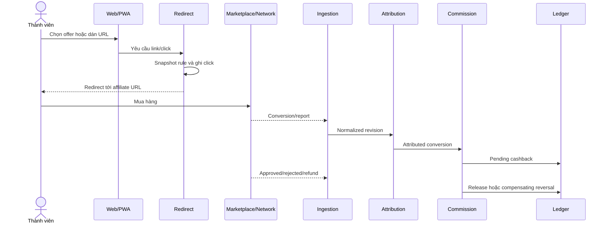

# BRD — Nền tảng Cashback và Affiliate Việt Nam

**Phiên bản:** 1.0  
**Ngôn ngữ:** Tiếng Việt  
**Ngày hợp nhất:** 2026-07-24  
**Trạng thái:** Baseline để thẩm định và lập kế hoạch MVP  
**Tài liệu kỹ thuật liên quan:** [TDD tiếng Việt](../tdd/cashback_affiliate_platform_tdd_vi.md)  
**Bản tương đương:** [BRD English](./cashback_affiliate_platform_brd_en.md)

## 1. Mục đích tài liệu

Tài liệu này hợp nhất nghiên cứu thị trường, phân tích System A, ShopBack Việt Nam,
các chương trình affiliate, Shopee Affiliate và blueprint kỹ thuật thành một
Business Requirements Document có thể dùng để:

- thống nhất mục tiêu sản phẩm và mô hình kinh doanh;
- chốt phạm vi MVP;
- xác định quy tắc cashback, commission, ví và payout;
- xác định vai trò vận hành và kiểm soát;
- lập backlog, ước lượng và nghiệm thu;
- truy vết yêu cầu sang TDD.

Đây không phải tài liệu mô tả một API riêng lẻ và không biến endpoint nội bộ quan
sát được thành API chính thức.

## 2. Phân loại bằng chứng

| Nhãn                    | Ý nghĩa                                                        |
| ----------------------- | -------------------------------------------------------------- |
| `Observed`              | Được quan sát trực tiếp trong phạm vi tài khoản được phép      |
| `Officially documented` | Được tài liệu chính thức hiện hành xác nhận                    |
| `Inferred`              | Suy luận có căn cứ; phải giữ confidence và giải thích thay thế |
| `Third-party reported`  | Nguồn thứ ba, chưa được nền tảng xác nhận                      |
| `Proposed`              | Quyết định sản phẩm hoặc kỹ thuật của hệ thống mới             |
| `Unknown`               | Chưa đủ bằng chứng hoặc cần quyền/hợp đồng/dữ liệu thật        |

Mọi yêu cầu trong BRD là `Proposed` trừ khi có nhãn khác.

## 3. Tóm tắt quyết định

### 3.1 Sản phẩm cần xây

Xây một nền tảng cashback/affiliate ưu tiên Shopee tại Việt Nam, có:

- trải nghiệm hành vi tương đương các chức năng đã quan sát của System A;
- catalog merchant/campaign/voucher;
- chuyển link Shopee có SubID theo user/click;
- first-party redirect và click tracking;
- ingestion conversion bằng API, polling hoặc report;
- trạng thái đơn và cashback minh bạch;
- ví double-entry, withdrawal và payout có kiểm soát;
- đối soát, fraud, missing cashback và audit;
- nền tảng mở rộng sang AccessTrade, TikTok Shop và các network khác.

### 3.2 Chiến lược tích hợp

Sản phẩm là **Shopee-first**, nhưng connector phải **hybrid**:

1. Shopee direct affiliate link theo định dạng chính thức.
2. Shopee conversion CSV/report cho MVP khi chưa có App ID/App Secret.
3. Browser-assisted export chỉ là fallback có operator đăng nhập.
4. Approved Shopee Affiliate API được thêm khi account được cấp quyền.
5. AccessTrade là connector network ưu tiên để mở coverage và làm nguồn
   conversion có API.
6. TikTok Shop có thể đi qua AccessTrade trước khi direct Affiliate API được duyệt.

Không dùng Shopee seller API để suy ra conversion affiliate.

### 3.3 Nguyên tắc kinh doanh

- Cashback là nghĩa vụ tài chính, không phải một con số UI có thể sửa trực tiếp.
- Conversion pending không đồng nghĩa tiền có thể rút.
- Mọi rate/điều kiện phải được snapshot tại thời điểm click.
- Mọi thay đổi commission/refund tạo revision và adjustment.
- Không trả tiền nếu attribution không đủ bằng chứng.
- Không lấy commission preview làm nguồn tiền thật.
- Không phụ thuộc duy nhất một marketplace hoặc network.

## 4. Bối cảnh và cơ hội thị trường

### 4.1 Bối cảnh

Nghiên cứu nguồn chính thức và báo cáo ngành cho thấy:

- thương mại điện tử Việt Nam đủ lớn cho một sản phẩm chuyên biệt;
- Shopee và TikTok Shop chiếm phần lớn giao dịch marketplace đa ngành;
- video/creator commerce tăng nhanh nhưng AOV thường thấp;
- loyalty/rewards vẫn tạo transaction volume lớn;
- tracking first-party và server-to-server là baseline trong môi trường
  trình duyệt hiện đại;
- rate hiển thị không phản ánh effective commission sau hủy, hoàn, fraud,
  network fee và điều chỉnh.

### 4.2 Cơ hội

Cơ hội không nằm ở việc chỉ tạo thêm một website rút gọn link. Giá trị khác biệt
cần đến từ:

- tracking đáng tin cậy;
- báo trạng thái sớm và minh bạch;
- giải thích eligibility trước khi mua;
- missing cashback có evidence và SLA;
- đối soát và payout có thể kiểm toán;
- creator/community/sub-publisher tooling;
- khả năng đổi nguồn direct/network mà không đổi trải nghiệm người dùng.

### 4.3 Mô hình doanh thu

Nguồn doanh thu dự kiến:

- phần commission giữ lại sau khi chia cashback;
- campaign boost/merchant-funded placement;
- voucher hoặc promotion commission;
- creator/community platform fee;
- B2B2C/white-label/API fee ở giai đoạn sau.

Không đưa gross commission toàn bộ vào doanh thu earned trước khi được duyệt và
đối soát.

## 5. Tầm nhìn, mục tiêu và nguyên tắc sản phẩm

### 5.1 Tầm nhìn

Biến dữ liệu affiliate rời rạc thành một lời hứa tài chính đáng tin cậy:

```text
click được ghi nhận
→ điều kiện được đóng băng
→ đơn được theo dõi
→ commission được đối soát
→ cashback được hạch toán
→ payout minh bạch
```

### 5.2 Mục tiêu 12 tháng đầu

- Chứng minh một luồng Shopee click-to-conversion-to-cashback có thể replay.
- Đạt behavioral parity với bề mặt cốt lõi của System A.
- Vận hành ít nhất một connector network production.
- Có một cohort người dùng phát sinh repeat tracked order.
- Đo contribution margin theo merchant/campaign.
- Payout không trùng và mọi số dư giải thích được từ ledger.
- Không để một merchant/network trở thành điểm lỗi duy nhất của mô hình.

### 5.3 Nguyên tắc UX

- Hiển thị “ước tính” cho commission/cashback chưa được upstream xác nhận.
- Tách rõ tracked, pending, confirmed, payable, paid, rejected và reversed.
- Hiển thị ETA dựa trên merchant/campaign, không hứa một thời gian chung.
- Giải thích điều kiện, loại trừ và nguyên nhân từ chối.
- Không hiển thị mã đơn hoặc thông tin nhạy cảm đầy đủ khi không cần thiết.

## 6. Stakeholder và persona

| Persona                     | Nhu cầu chính                                          | Thành công được đo bằng                              |
| --------------------------- | ------------------------------------------------------ | ---------------------------------------------------- |
| Thành viên mua sắm          | Tìm ưu đãi, tạo link, biết đơn đã track, nhận cashback | first tracked order, repeat order, payout thành công |
| Creator/KOC/community owner | Tạo link theo kênh, theo dõi SubID, chia commission    | conversion/source, approved commission, retention    |
| Support                     | Điều tra missing cashback mà không xem secret/PII thô  | SLA case, tỷ lệ giải quyết, cost/case                |
| Affiliate Ops               | Đồng bộ campaign, import report, xử lý lỗi connector   | freshness, DLQ age, unmatched rate                   |
| Finance/Treasury            | Đối soát receivable, liability và payout               | reconciliation gap, cash coverage, payout accuracy   |
| Risk analyst                | Phát hiện abuse trước release/payout                   | loss rate, false-positive, case aging                |
| Admin                       | Quản trị user, rule, role và audit                     | change accuracy, approval compliance                 |
| Product/Commercial          | Chọn merchant/campaign có economics tốt                | contribution margin, concentration, repeat           |

## 7. Phạm vi

### 7.1 Trong MVP

- Email/password hoặc identity provider, session và account recovery.
- RBAC cho member, support, ops, finance, risk và admin.
- Merchant, campaign, voucher và rule version.
- Shopee URL converter, direct affiliate link và năm SubID.
- First-party redirect/click record.
- Shopee CSV import, parser versioned và replay.
- AccessTrade campaign/link/transaction connector nếu account được duyệt.
- Conversion/order/order-line normalization.
- Attribution theo SubID/click evidence.
- Commission/cashback calculation.
- Trạng thái order, fraud, cashback và payment.
- Double-entry ledger, pending/available balance.
- Một withdrawal/payout flow có dual approval.
- Reconciliation, adjustment, missing cashback và audit.
- Dashboard member, dashboard ops và báo cáo cơ bản.
- Leaderboard tương đương System A, nhưng chỉ dùng dữ liệu đủ điều kiện.

### 7.2 Sau MVP

- Native mobile app.
- Browser extension.
- Direct TikTok Shop Affiliate connector.
- Direct Shopee Affiliate API connector nếu được cấp entitlement.
- Creator/community self-service portal.
- Referral/quest/tier nâng cao.
- Multi-currency.
- White-label/API/SDK B2B2C.
- Card-linked hoặc payment-integrated offers.
- Personalization/ranking nâng cao.

### 7.3 Ngoài phạm vi

- Đặt hàng hoặc thanh toán trực tiếp tại marketplace.
- Seller inventory/logistics/order-management.
- Vượt authentication, CAPTCHA, signature hoặc access control.
- Copy cookie/session ra backend.
- Dùng credential hoặc secret của repo/người khác.
- Scraping/private endpoint làm contract production.
- Phân tích pháp lý, thuế hoặc tư vấn tuân thủ chuyên ngành.
- Sao chép branding, dữ liệu hoặc lỗi bảo mật của System A/ShopBack.

## 8. Bài học từ các hệ thống tham chiếu

### 8.1 System A

`Observed`:

- PHP server-rendered;
- login/remember, profile và đổi mật khẩu;
- dashboard KPI, order table, filter và pagination;
- order/payment state theo dòng;
- leaderboard;
- Shopee converter trả metadata và commission estimate;
- chưa thấy ví/withdrawal self-service.

Quyết định:

- clone hành vi cốt lõi, không clone implementation;
- backend giữ state chi tiết hơn UI;
- payment marker của System A được thay bằng ledger/payout auditable.

### 8.2 ShopBack

`Observed`:

- consumer registration và social sign-in;
- merchant discovery, voucher, rule và deep link;
- pending/available/withdrawn balance;
- referral, quests, payout;
- OTP, reCAPTCHA và device control;
- missing cashback support.

Quyết định:

- lấy trust/status/claim workflow làm benchmark;
- không cố sao chép toàn bộ hệ sinh thái payment ngay trong MVP.

## 9. Yêu cầu chức năng

Priority:

- `Must`: bắt buộc để pilot/go-live.
- `Should`: cần cho closed beta hoặc ngay sau MVP.
- `Could`: tối ưu sau khi economics được chứng minh.

### 9.1 Identity và account

| ID         | Yêu cầu                                              | Priority | Acceptance ở mức kinh doanh                      |
| ---------- | ---------------------------------------------------- | -------: | ------------------------------------------------ |
| BRD-FR-001 | Member có thể đăng ký, đăng nhập và đăng xuất        |     Must | Session được tạo/revoke và audit                 |
| BRD-FR-002 | Member có thể khôi phục account qua kênh đã xác minh |     Must | Không lộ account tồn tại; recovery có expiry     |
| BRD-FR-003 | Member xem và cập nhật profile không nhạy cảm        |     Must | Thay đổi nhạy cảm yêu cầu step-up                |
| BRD-FR-004 | Staff dùng MFA và role được phê duyệt                |     Must | Không staff role nào mặc định có quyền tài chính |
| BRD-FR-005 | Admin có thể khóa/mở account bằng command có reason  |     Must | Có audit và không xóa lịch sử                    |

### 9.2 Catalog và discovery

| ID         | Yêu cầu                                         | Priority | Acceptance ở mức kinh doanh                   |
| ---------- | ----------------------------------------------- | -------: | --------------------------------------------- |
| BRD-FR-010 | Duyệt/search merchant, campaign và voucher      |     Must | Kết quả thể hiện source và thời điểm cập nhật |
| BRD-FR-011 | Hiển thị rate, cap, loại trừ và ETA xác nhận    |     Must | Điều kiện được snapshot và có version         |
| BRD-FR-012 | Một merchant có thể có nhiều program/connector  |     Must | Đổi source không đổi merchant identity        |
| BRD-FR-013 | Campaign có thời gian hiệu lực và trạng thái    |     Must | Link hết hạn không được quảng bá như active   |
| BRD-FR-014 | Product metadata lỗi không chặn tạo link hợp lệ |   Should | Có fallback và nhãn stale/unknown             |

### 9.3 Link, click và attribution

| ID         | Yêu cầu                                              | Priority | Acceptance ở mức kinh doanh                                        |
| ---------- | ---------------------------------------------------- | -------: | ------------------------------------------------------------------ |
| BRD-FR-020 | Member chuyển URL Shopee hợp lệ thành affiliate link |     Must | Link dùng affiliate account được cấu hình, không nhận ID từ member |
| BRD-FR-021 | Mỗi click có opaque click reference                  |     Must | Không chứa PII và không đoán được                                  |
| BRD-FR-022 | Shopee link hỗ trợ năm SubID hợp lệ                  |     Must | Slot map user/click/source/campaign/schema                         |
| BRD-FR-023 | Redirect ghi click trước khi chuyển đi               |     Must | Có click receipt hoặc durable fallback                             |
| BRD-FR-024 | Attribution lưu evidence và engine version           |     Must | Không match duy nhất thì `unattributed`                            |
| BRD-FR-025 | Hỗ trợ channel/creator/community dimension           |   Should | Report phân tích được theo source/SubID                            |
| BRD-FR-026 | Không chỉnh SubID bằng cách nối vào shortlink opaque |     Must | Shortlink phải đi qua factory/flow đúng loại                       |

### 9.4 Conversion và cashback

| ID         | Yêu cầu                                                 | Priority | Acceptance ở mức kinh doanh                  |
| ---------- | ------------------------------------------------------- | -------: | -------------------------------------------- |
| BRD-FR-030 | Nhận conversion qua API, polling, webhook hoặc report   |     Must | Mọi nguồn đi qua cùng normalized model       |
| BRD-FR-031 | Lưu raw payload/file bất biến và replayable             |     Must | Replay không tạo duplicate                   |
| BRD-FR-032 | Quản lý order, order line và revision                   |     Must | Late correction không ghi đè lịch sử         |
| BRD-FR-033 | Tính cashback theo immutable rule snapshot              |     Must | Rate/cap/exclusion test được                 |
| BRD-FR-034 | Hiển thị order/cashback status và lịch sử               |     Must | Member thấy lý do reject/reverse có cấu trúc |
| BRD-FR-035 | Hỗ trợ partial/full refund và cancellation              |     Must | Tạo adjustment, không xóa posting cũ         |
| BRD-FR-036 | Hỗ trợ Shopee order status và fraud status độc lập      |     Must | Chưa verified không được release             |
| BRD-FR-037 | Không cộng trùng product commission và order commission |     Must | Commission base có lineage rõ                |
| BRD-FR-038 | Khi có MCN, dùng net affiliate commission nếu hợp lệ    |     Must | MCN fee không được tính vào cashback KOL     |

### 9.5 Wallet, withdrawal và payout

| ID         | Yêu cầu                                         | Priority | Acceptance ở mức kinh doanh                        |
| ---------- | ----------------------------------------------- | -------: | -------------------------------------------------- |
| BRD-FR-040 | Member xem pending, available, reserved và paid |     Must | Balance truy vết được đến posting                  |
| BRD-FR-041 | Member yêu cầu withdrawal khi đủ điều kiện      |     Must | Reserve và request atomic                          |
| BRD-FR-042 | Payout retry không được double pay              |     Must | Provider reference/idempotency hoặc reconcile path |
| BRD-FR-043 | Thay beneficiary có cooling period và step-up   |     Must | Không payout trong hold window                     |
| BRD-FR-044 | Finance duyệt payout batch theo dual control    |     Must | Người tạo không thể tự duyệt                       |
| BRD-FR-045 | Late reversal tạo compensating balance          |     Must | Paid record không bị xóa                           |

### 9.6 Growth và loyalty

| ID         | Yêu cầu                                      | Priority | Acceptance ở mức kinh doanh                          |
| ---------- | -------------------------------------------- | -------: | ---------------------------------------------------- |
| BRD-FR-050 | Leaderboard hiển thị metric đã định nghĩa    |     Must | Không dùng pending/fraudulent order nếu không ghi rõ |
| BRD-FR-051 | Referral cơ bản có cap và delayed reward     |   Should | Reward chỉ release sau qualifying event              |
| BRD-FR-052 | Campaign bonus tách khỏi merchant commission |   Should | Subsidy có ledger account riêng                      |
| BRD-FR-053 | Quest/tier/boosted reward được version hóa   |    Could | Không sửa rule đã áp dụng                            |

### 9.7 Support và missing cashback

| ID         | Yêu cầu                                             | Priority | Acceptance ở mức kinh doanh                 |
| ---------- | --------------------------------------------------- | -------: | ------------------------------------------- |
| BRD-FR-060 | Member tạo missing cashback case sau waiting window |     Must | Có click/trip hoặc reason ngoại lệ          |
| BRD-FR-061 | Case lưu evidence an toàn và upstream reference     |     Must | File được scan, mã hóa và có retention      |
| BRD-FR-062 | Support không thể tự cộng tiền                      |     Must | Goodwill credit dùng adjustment và approval |
| BRD-FR-063 | Case có SLA, trạng thái và reason code              |     Must | Member theo dõi được tiến trình             |

### 9.8 Admin, connector và reconciliation

| ID         | Yêu cầu                                         | Priority | Acceptance ở mức kinh doanh               |
| ---------- | ----------------------------------------------- | -------: | ----------------------------------------- |
| BRD-FR-070 | Ops đồng bộ campaign và theo dõi connector run  |     Must | Có freshness, cursor và error status      |
| BRD-FR-071 | Ops import/replay Shopee CSV                    |     Must | Header/schema drift được quarantine       |
| BRD-FR-072 | Finance import statement và đối soát ba chiều   |     Must | Expected vs statement vs cash             |
| BRD-FR-073 | Mismatch có taxonomy, owner và resolution       |     Must | Adjustment cần approval                   |
| BRD-FR-074 | Rule production publish theo version            |     Must | Không sửa version đang dùng               |
| BRD-FR-075 | Mọi action nhạy cảm có audit event              |     Must | Actor, reason, before/after reference     |
| BRD-FR-076 | Hỗ trợ manual fallback nhưng không sửa raw data |     Must | Manual decision tách khỏi source evidence |

## 10. Luồng nghiệp vụ cốt lõi

### 10.1 Click đến cashback



### 10.2 Shopee không có App ID/App Secret

1. Member dán URL Shopee.
2. Hệ thống canonicalize và validate host.
3. Hệ thống tạo user/click/source/campaign/schema SubID.
4. Hệ thống tạo direct affiliate redirect theo định dạng Shopee.
5. Click được ghi tại first-party redirect.
6. Operator tải report sau cửa sổ cập nhật.
7. CSV được lưu bất biến, parse, dedupe và map SubID.
8. Conversion tạo pending cashback.
9. Revision sau đó xác nhận/hủy/fraud làm thay đổi projection.
10. Statement/payment reconciliation mở khóa payable.

### 10.3 Withdrawal

1. Member yêu cầu rút.
2. Hệ thống kiểm tra available balance, hold và risk.
3. Ledger reserve số tiền trong cùng transaction.
4. Staff/provider xử lý payout.
5. Kết quả thành công clear suspense; kết quả không rõ phải reconcile trước retry.

### 10.4 Missing cashback

```text
draft
→ submitted
→ auto_check
→ waiting_for_user / waiting_for_network
→ accepted / rejected
→ closed
```

## 11. Quy tắc nghiệp vụ

### 11.1 Eligibility

Một conversion chỉ tạo cashback khi:

- campaign/rule active tại click time;
- destination và merchant hợp lệ;
- attribution bằng upstream SubID/click evidence hoặc quyết định được duyệt;
- order/category/customer/payment/coupon thỏa điều kiện snapshot;
- order không invalid/fraud/rejected;
- commission source và currency hợp lệ.

### 11.2 Cashback state

```text
TRACKED
→ PENDING
→ AVAILABLE/PAYABLE
→ RESERVED
→ PAID

TRACKED/PENDING/AVAILABLE
→ REJECTED/EXPIRED/REVERSED
```

`AVAILABLE/PAYABLE` yêu cầu:

```text
order confirmed
AND fraud verified khi nguồn có fraud status
AND attribution unique
AND commission approved/locked theo policy
AND no active hold
```

### 11.3 Shopee status

| Shopee raw      | Nội bộ      | Quy tắc                                     |
| --------------- | ----------- | ------------------------------------------- |
| Chưa thanh toán | `unpaid`    | Không tạo available                         |
| Đang chờ xử lý  | `pending`   | Có thể gồm giao/nhận/đổi/trả; tiếp tục hold |
| Hoàn thành      | `confirmed` | Chưa đủ nếu fraud/settlement chưa đạt       |
| Đã hủy          | `cancelled` | Reject hoặc reverse                         |

| Fraud raw          | Nội bộ       | Quy tắc                    |
| ------------------ | ------------ | -------------------------- |
| Chưa được xác minh | `unverified` | Hold                       |
| Đã xác minh        | `verified`   | Có thể release nếu đủ gate |
| Gian lận           | `fraud`      | Reject/hold và risk case   |

### 11.4 Commission

```text
commission_base =
  net_affiliate_commission nếu MCN-linked và field hợp lệ
  ngược lại order_commission

cashback =
  round_down(commission_base × member_share)
```

Không dùng:

```text
product_commission_total + order_commission
```

### 11.5 Rounding và tiền

- Lưu integer minor units và ISO currency.
- Rate lưu ppm/bps, không dùng float.
- UI rounding không phải source of truth.
- Shopee export raw value là nguồn ưu tiên hơn số hiển thị đã làm tròn.

### 11.6 Data freshness

- Shopee report dữ liệu ngày trước được cập nhật 09:00–12:00 ngày sau và có thể trễ.
- Import chính chạy sau cửa sổ; có retry và overlap.
- Lưu report định kỳ vì lịch sử truy vấn chỉ trong khoảng ba tháng gần nhất.
- Không đặt một SLA chung cho mọi merchant/network.

## 12. Vai trò và quyền

| Quyền                      | Member |          Support |              Ops |             Risk |        Finance |       Admin |
| -------------------------- | -----: | ---------------: | ---------------: | ---------------: | -------------: | ----------: |
| Xem dữ liệu của chính mình |     Có |        Theo case |   Không mặc định |        Theo case | Không mặc định |    Có audit |
| Xem mã đơn đầy đủ          |  Không |           Masked |           Masked |           Masked |   Theo nhu cầu | Break-glass |
| Import/replay report       |  Không |            Không |               Có |            Không |           Read |          Có |
| Publish campaign rule      |  Không |            Không |          Đề xuất |            Không |  Review margin |       Duyệt |
| Tạo adjustment             |  Không | Đề xuất goodwill |          Đề xuất |             Hold |             Có |          Có |
| Duyệt adjustment           |  Không |            Không | Không cùng actor | Không cùng actor |             Có |          Có |
| Tạo payout batch           |  Không |            Không |            Không |            Không |             Có |          Có |
| Duyệt payout batch         |  Không |            Không |            Không |            Không |     Actor khác |  Actor khác |
| Quản lý role/secret ref    |  Không |            Không |            Không |            Không |          Không |          Có |

## 13. Yêu cầu phi chức năng ở mức kinh doanh

| ID          | Yêu cầu                | Mục tiêu                                                |
| ----------- | ---------------------- | ------------------------------------------------------- |
| BRD-NFR-001 | Redirect availability  | 99,99% mục tiêu khởi điểm                               |
| BRD-NFR-002 | Redirect latency       | p95 dưới 100 ms, không tính external hop                |
| BRD-NFR-003 | Ledger integrity       | Zero unbalanced transaction                             |
| BRD-NFR-004 | Payout integrity       | Zero payout thiếu approval hoặc duplicate               |
| BRD-NFR-005 | Auditability           | Mọi rule/adjustment/payout/reconciliation truy vết được |
| BRD-NFR-006 | Data privacy           | Không secret/PII/source ID đầy đủ trong log/event       |
| BRD-NFR-007 | Recoverability         | Raw ingest replayable; cursor resume sau crash          |
| BRD-NFR-008 | Freshness transparency | Ops và user thấy thời điểm dữ liệu mới nhất             |
| BRD-NFR-009 | Accessibility          | Luồng cốt lõi sử dụng được bằng keyboard và mobile web  |
| BRD-NFR-010 | Localization           | Tiếng Việt mặc định; thiết kế cho tiếng Anh             |

## 14. KPI và báo cáo điều hành

### 14.1 Acquisition và activation

- verified registration;
- merchant view → outbound click;
- first tracked order;
- cost per activated shopper;
- D7/D30 repeat click và tracked order.

### 14.2 Tracking

- redirect success;
- click-to-track rate;
- p50/p95 tracking latency;
- unmatched conversion;
- duplicate/conflict;
- missing cashback case/order.

### 14.3 Economics

- tracked/approved GMV;
- effective commission rate;
- member share;
- net take rate;
- contribution margin/order và/customer;
- support cost/order;
- reversal/fraud loss;
- CAC payback theo cohort.

### 14.4 Treasury

- receivable age;
- liability theo state;
- cash coverage;
- approval-to-collection;
- available-to-payout;
- payout success/failure;
- stuck suspense và late reversal exposure.

### 14.5 Concentration

- approved GMV, commission và receivable theo merchant;
- network;
- vertical;
- creator/source;
- connector.

## 15. Mô hình vận hành

### 15.1 Daily

- kiểm tra connector freshness và auth;
- import/poll conversion có overlap;
- xử lý schema quarantine/DLQ;
- đối soát expected vs source;
- kiểm tra fraud/payout hold;
- theo dõi missing cashback SLA.

### 15.2 Theo kỳ

- import statement;
- đối soát expected vs statement vs cash;
- giải quyết mismatch theo dual approval;
- khóa commission;
- tạo và duyệt payout batch;
- đóng period khi đủ guard.

### 15.3 Manual fallback

Manual action được phép cho ngoại lệ nhưng:

- không sửa raw payload;
- phải có reason code và evidence;
- không cùng actor tạo và duyệt;
- adjustment dùng compensating ledger transaction;
- mọi thao tác có audit.

## 16. Roadmap

### Phase 0 — Data proof, 2–4 tuần

- quyền ít nhất một network/campaign;
- Shopee CSV schema hoặc fixture shape;
- SubID contract;
- status/refund/correction/settlement sample;
- replay raw → normalized → cashback → balanced ledger.

Exit:

- replay 10 lần không tạo duplicate;
- approved rồi rejected tạo đúng adjustment;
- chưa có SubID round-trip thì Shopee auto-cashback chưa được bật.

### Phase 1 — Internal MVP, 6–8 tuần

- identity/RBAC/audit;
- merchant/campaign/rule;
- Shopee converter/redirect;
- CSV import;
- AccessTrade polling nếu được duyệt;
- conversion/attribution/cashback/ledger;
- admin dashboard.

### Phase 2 — Closed beta, 4–6 tuần

- member wallet/activity;
- missing cashback;
- notification;
- withdrawal/payout;
- fraud review;
- daily reconciliation;
- security/load/recovery test.

### Phase 3 — Public launch

- SLO/alerts/runbooks;
- second connector;
- creator/community experiments;
- mobile deep links;
- warehouse/read models;
- direct marketplace connector khi đủ entitlement và economics.

## 17. Go/no-go và nghiệm thu

### 17.1 Go/no-go trước closed beta

- Có nguồn conversion/commission được phép sử dụng.
- Có sample status, correction, refund và commission.
- SubID/click evidence map được conversion về user hoặc có manual policy rõ.
- Effective commission đủ bao phủ cashback, phí, support và loss.
- Payout/settlement schedule đã biết.
- Ledger invariant và replay test đạt.
- Missing cashback workflow có SLA.

### 17.2 Go-live

- Production quota/rate behavior đã test.
- Rule/terms snapshot hoạt động.
- Duplicate, partial/full refund và late reject đã test.
- Không secret/PII trong source/log/screenshot/artifact.
- Withdrawal timeout không double pay.
- Daily reconciliation có owner.
- RBAC, MFA, step-up và dual approval hoạt động.
- Backup restore và cursor recovery đã diễn tập.
- Runbook và escalation contact sẵn sàng.

## 18. Rủi ro và kiểm soát

| Rủi ro                          | Kiểm soát                                                         |
| ------------------------------- | ----------------------------------------------------------------- |
| Phụ thuộc Shopee/TikTok/network | Connector abstraction, concentration cap, alternative source      |
| Last-click bị ghi đè            | First-party click, SubID, hướng dẫn, S2S/report repair            |
| Missing tracking                | Click receipt, latency disclosure, claim workflow                 |
| Commission/rate thay đổi        | Immutable rule version, margin alert                              |
| Dòng tiền âm                    | Pending/available separation, reserve, treasury forecast          |
| Duplicate conversion            | Natural key, revision fingerprint, cross-source conflict          |
| Fraud/referral abuse            | Velocity, graph, hold, step-up, manual review                     |
| Schema drift/API outage         | Raw archive, quarantine, retry/DLQ, manual CSV                    |
| Payout duplicate                | Atomic reserve, provider reference, reconcile before retry        |
| Staff misuse                    | Least privilege, MFA, dual approval, append-only audit            |
| Repo/extension không an toàn    | Không dùng credential, private API hoặc network egress chưa audit |

## 19. Giả định và câu hỏi mở

### 19.1 Giả định

- MVP chạy tại Việt Nam, currency chính VND.
- Web/PWA là client chính.
- Một payout method có thể vận hành ở closed beta.
- Shopee report hoặc AccessTrade cung cấp ít nhất một nguồn conversion có thể
  đối soát.

### 19.2 Câu hỏi mở bắt buộc

1. Shopee CSV header, precision và order-line key thực tế là gì?
2. Full năm SubID có round-trip trong row/export không?
3. Fraud status có trong CSV hay chỉ UI/API?
4. Commission nào là estimated, approved, locked và paid?
5. AccessTrade account được duyệt campaign/quota nào?
6. Conversion ID có ổn định qua refund/correction?
7. Payment statement nối conversion bằng khóa nào?
8. Payout provider hỗ trợ idempotency/status lookup không?
9. Chính sách với late reversal sau khi member đã rút?
10. Merchant/campaign nào cho phép cashback incentive tại Việt Nam?

## 20. Truy vết BRD → TDD

| Nhóm BRD         | TDD section                              |
| ---------------- | ---------------------------------------- |
| BRD-FR-001..005  | Identity, session, RBAC                  |
| BRD-FR-010..014  | Catalog và rule version                  |
| BRD-FR-020..026  | Link, redirect và attribution            |
| BRD-FR-030..038  | Ingestion, conversion, commission        |
| BRD-FR-040..045  | Ledger, withdrawal và payout             |
| BRD-FR-050..053  | Promotion/referral/leaderboard           |
| BRD-FR-060..063  | Missing cashback                         |
| BRD-FR-070..076  | Connector, admin và reconciliation       |
| BRD-NFR-001..010 | Security, SLO, observability và recovery |

## 21. Tài liệu nguồn

Các tài liệu nghiên cứu gốc được giữ nguyên tại [docs/research](../research/):

- [Báo cáo nghiên cứu tổng hợp tiếng Việt](../research/cashback_affiliate_research_report_vi.md)
- [Báo cáo nghiên cứu tổng hợp tiếng Anh](../research/cashback_affiliate_research_report.md)
- [Nghiên cứu thị trường 2026](../research/cashback_affiliate_market_research_2026_vi.md)
- [Blueprint triển khai](../research/cashback_platform_implementation_blueprint_vi.md)
- [Chiến lược Shopee không App ID/App Secret](../research/shopee_affiliate_no_appid_strategy_vi.md)
- [Đánh giá repo Shopee Affiliate](../research/shopee_affiliate_repo_technical_assessment_vi.md)
- [Ma trận API](../research/api_availability_matrix.csv)
