# Báo cáo kiểm toán tiến độ, Production Readiness và User Flow — `affweb`

**Ngày đánh giá:** 2026-07-28  
**Phạm vi:** Toàn bộ repository tại thời điểm kiểm tra  
**Phương pháp:** Kiểm tra chỉ đọc, đối chiếu tài liệu với mã thực thi và truy vết các luồng quan trọng từ entry point đến persistence/external service  
**Nguyên tắc:** Mã thực thi hiện tại là nguồn sự thật. Nội dung không đủ bằng chứng được đánh dấu **UNVERIFIED**.

> Báo cáo này là snapshot trạng thái repository tại ngày đánh giá, không phải mô tả kiến trúc mục tiêu. Báo cáo không xác nhận hành vi của dịch vụ bên ngoài hoặc môi trường production nếu không có bằng chứng chạy thực tế. Không migration, seed, integration test có khả năng ghi dữ liệu hoặc production smoke được thực hiện trong quá trình audit.

---

## 1. Executive Summary

`affweb` là một ứng dụng Next.js có domain tương đối rộng: xác thực Clerk, tạo link affiliate, redirect/click tracking, thu nhận conversion, ledger/wallet, payout, tenant/KOC, thông báo, PWA và các trang quản trị. Nhiều luồng nghiệp vụ nội bộ đã có mã thực thi đáng kể; đây không phải repository chỉ có scaffold.

Tuy nhiên, dự án **chưa đủ điều kiện triển khai cho người dùng thật**. Các blocker chính có bằng chứng trực tiếp trong code gồm:

- Lazada webhook có thể đưa conversion vào pipeline mà không xác thực chữ ký.
- Public Shopee product lookup có khả năng thực hiện request tới URL do upstream trả về mà không có allowlist tương xứng, tạo rủi ro SSRF.
- Zalo QR endpoint cho phép thay đổi cấu hình tenant mà không có bằng chứng xác thực/ủy quyền đầy đủ.
- Luồng SaaS/PayOS có fallback demo/fake và chấp nhận trạng thái thiếu secret theo cách không fail-closed.
- Chuỗi migration không thể chứng minh có thể dựng đầy đủ schema hiện tại từ database trống.
- Cashback release có nhánh fail-open khi không có health record hoặc connector chỉ ở trạng thái degraded.
- Môi trường production hiện kiểm tra không đạt 22 yêu cầu cấu hình.

Các kiểm tra an toàn đã thực hiện:

- TypeScript: **PASS** với `pnpm exec tsc --noEmit --incremental false`.
- Prisma schema validation: **PASS**.
- Unit tests trong `src`: **38/38 PASS** trên 12 tệp test.
- Lint: **FAIL** với 7 errors và 13 warnings.
- Format check: **FAIL**, nhiều tệp chưa đúng format.
- Production environment check: **FAIL**, thiếu/không đạt 22 yêu cầu.
- Báo cáo Playwright có sẵn trong repository ghi nhận lần chạy gần nhất thất bại với 2 test ID; không được tính là một lần E2E mới trong audit.

**Overall Development Completion: 60%**  
**Production Readiness: 28%**  
**Launch Verdict: NOT READY**

---

## 2. Current Architecture

Kiến trúc dưới đây chỉ mô tả những thành phần có bằng chứng trong repository:

- **Web application:** Next.js 16 App Router, React 19, TypeScript strict.
- **API/backend:** Route handlers trong `src/app/api`, kết hợp các module nghiệp vụ trong `src/modules`.
- **Identity:** Clerk là identity provider; PostgreSQL lưu authorization và business state. Repository cũng có bridge/local auth phục vụ một số ngữ cảnh.
- **Persistence:** Prisma 7 và PostgreSQL; domain gồm user, tenant, link/click, conversion, journal/ledger, wallet, beneficiary, payout, notification và SaaS-related state.
- **Affiliate flow:** Tạo short link, snapshot rule/rate, lưu click và redirect qua Shopee; có connector/evidence pipeline cho conversion.
- **Financial domain:** Journal balanced, wallet projection, hold/release, beneficiary, payout review/approval và PayOS integration.
- **Async jobs:** QStash-signed job endpoints/runner; một số job dùng Redis và external APIs.
- **Evidence storage:** Có adapter/mã cho AWS S3.
- **Notifications:** Outbox/dispatcher, email, web push và các cấu trúc liên quan.
- **Observability:** Sentry integration và health endpoint có tồn tại.
- **Deployment target:** Có cấu hình theo hướng Vercel.

Không có đủ bằng chứng repository-level cho:

- CI workflow đang hoạt động.
- Infrastructure-as-code.
- Container image/runtime production được kiểm chứng.
- Tự động backup/restore.
- Rollback pipeline.
- Phân tách staging/production được kiểm chứng thực tế.

**No sufficient implementation evidence found.**

---

## 3. Feature Reality Check

| Feature                                  | Status                        | Evidence                                                                                    | Missing Pieces                                                                                                               | Confidence |
| ---------------------------------------- | ----------------------------- | ------------------------------------------------------------------------------------------- | ---------------------------------------------------------------------------------------------------------------------------- | ---------- |
| Public pages và PWA                      | **FUNCTIONAL BUT INCOMPLETE** | App Router pages; service worker tại `src/app/sw.js/route.ts`; có test cho PWA behavior     | Chưa có bằng chứng E2E pass trên cấu hình production; một số UI claim vượt quá backend thực tế                               | HIGH       |
| Clerk identity reconciliation            | **FUNCTIONAL BUT INCOMPLETE** | `src/lib/clerk-identity.ts`; reconcile primary verified email và user state                 | Live Clerk configuration/session behavior chưa được kiểm chứng                                                               | HIGH       |
| Admin authorization và passkey           | **FUNCTIONAL BUT INCOMPLETE** | `src/lib/authz.ts`; `src/modules/admin/webauthn.ts`; role/passkey checks có mã thực thi     | Chưa có authenticated E2E chứng minh toàn bộ boundary; production credential setup chưa được kiểm chứng                      | HIGH       |
| Affiliate link creation và redirect      | **FUNCTIONAL BUT INCOMPLETE** | `src/modules/links/service.ts`; API tạo link; click/snapshot persistence; redirect path     | Live Shopee redirect/provider contract và production DB chưa được kiểm chứng                                                 | HIGH       |
| Shopee product lookup                    | **FUNCTIONAL BUT INCOMPLETE** | `src/app/api/v1/shopee/product/route.ts`; `src/lib/shopee-product.ts`                       | SSRF boundary chưa an toàn; direct provider env không được bao phủ đầy đủ bởi env schema; contract live chưa được kiểm chứng | HIGH       |
| External affiliate connectors            | **UNVERIFIED**                | Có connector classes, job runner và evidence ingestion path                                 | Không có bằng chứng contract test/live provider pass; một số connector có security/data-quality issues                       | HIGH       |
| Conversion ingestion và ledger posting   | **FUNCTIONAL BUT INCOMPLETE** | Conversion revision, journal posting, wallet projection và idempotency-related code tồn tại | Integration test chính bị skip; provider authority path chưa an toàn; chưa chứng minh chạy end-to-end trên DB sạch           | HIGH       |
| Cashback hold/release                    | **PARTIALLY IMPLEMENTED**     | Có hold/release service và connector-health guard                                           | Guard có nhánh fail-open; failure/retry/reconciliation chưa đủ bằng chứng                                                    | HIGH       |
| Wallet, beneficiary và payout request    | **FUNCTIONAL BUT INCOMPLETE** | Beneficiary encryption, wallet reservation, review/approval state flow                      | Concurrency reconciliation có nguy cơ double wallet mutation; production secret/provider chưa được kiểm chứng                | HIGH       |
| PayOS payout execution/reconciliation    | **UNVERIFIED**                | Có PayOS client/service và reconcile path                                                   | Không có live/contract evidence; race condition; thiếu fail-closed nhất quán                                                 | HIGH       |
| Notifications                            | **PARTIALLY IMPLEMENTED**     | Outbox/dispatcher, email/web-push-related code                                              | Failure persistence chưa cho thấy retry đáng tin cậy; delivery providers chưa được kiểm chứng                                | MEDIUM     |
| Tenant onboarding và member link sharing | **PARTIALLY IMPLEMENTED**     | Tenant models/services/UI, owner/member rules và link snapshot logic                        | Acquisition/report ingestion theo từng tenant chưa hoàn chỉnh; external settlement chưa được chứng minh                      | HIGH       |
| SaaS billing/subscription                | **SCAFFOLD / PLACEHOLDER**    | Models, route/UI và helper có tồn tại                                                       | PayOS fallback demo/fake; entitlement/renewal path chưa chứng minh production behavior                                       | HIGH       |
| Zalo integration                         | **SCAFFOLD / PLACEHOLDER**    | QR/config route và helper structures                                                        | Không có bằng chứng send-message API hoàn chỉnh; auth boundary thiếu; outbound behavior có thể self-loop                     | HIGH       |
| Admin operations                         | **FUNCTIONAL BUT INCOMPLETE** | Admin pages/API, role checks và operational actions có mã                                   | Critical actions chưa có authenticated E2E đầy đủ; một số product paths vẫn chưa hoàn chỉnh                                  | MEDIUM     |
| Health và observability                  | **FUNCTIONAL BUT INCOMPLETE** | Health route, logging/Sentry-related setup                                                  | Readiness check nông; không có metrics, tracing/alerts hoặc operational verification đầy đủ                                  | HIGH       |
| CI, release, backup và rollback          | **NOT IMPLEMENTED**           | Không thấy `.github` workflow hoặc pipeline tương đương trong repository                    | Thiếu automated quality gate, release promotion, backup/restore verification và rollback automation                          | HIGH       |

Không có major feature nào đủ bằng chứng để được xếp **PRODUCTION-READY**.

---

## 4. Core User Journey Assessment

### Journey A — User → Authentication → Create affiliate link → Persist click/snapshot → Redirect

1. Clerk/local identity bridge tồn tại.
2. API tạo link gọi service trong `src/modules/links/service.ts`.
3. Service áp dụng policy/rate snapshot và ghi dữ liệu liên quan.
4. Redirect route ghi nhận click và chuyển tới affiliate destination.

**Kết quả:** Luồng nội bộ có vẻ hoàn chỉnh về mặt mã thực thi. Tuy nhiên, live Clerk, production database và Shopee provider contract chưa được kiểm chứng.  
**Phân loại:** **FUNCTIONAL BUT INCOMPLETE**.

### Journey B — Provider/job → Conversion ingestion → Evidence → Ledger → Wallet hold

1. Signed job runner và connector dispatch tồn tại.
2. Raw evidence/canonical conversion pipeline có mã.
3. Conversion revision và journal/wallet posting tồn tại.
4. Money/ledger invariants được thể hiện trong schema/service.

Luồng này bị suy yếu bởi Lazada webhook không xác thực, parsing money qua `number` ở một số connector, integration test chính bị skip và thiếu contract/live-provider evidence.

**Kết quả:** Có implementation đáng kể nhưng chưa chứng minh an toàn hoặc chạy end-to-end.  
**Phân loại:** **FUNCTIONAL BUT INCOMPLETE**.

### Journey C — User → Beneficiary → Payout request → Review/approval → PayOS → Reconcile

1. Beneficiary data có encryption path.
2. Payout request thực hiện reservation và state transitions.
3. Review/approve và PayOS adapter tồn tại.
4. Reconciliation cập nhật payout/journal/wallet.

Tuy nhiên, reconcile path không có bằng chứng locking đủ mạnh để ngăn hai worker cùng cập nhật wallet. Live PayOS contract và production secrets chưa được kiểm chứng.

**Kết quả:** Internal state machine tương đối rõ, nhưng không an toàn để chạy tiền thật.  
**Phân loại:** **FUNCTIONAL BUT INCOMPLETE**.

### Journey D — Tenant owner/member → Tenant link → Tenant conversion → External owner settlement

1. Tenant onboarding/member relationship có model và service.
2. Tenant owner affiliate/rate snapshot được thể hiện ở link time.
3. Tenant conversion có nhánh ghi nhận và đánh dấu trả ngoài hệ thống.

Không có đủ bằng chứng ingestion/report pipeline riêng theo tenant và provider account. UI/documentation cũng quảng bá phạm vi rộng hơn mã thực thi.

**Kết quả:** Luồng dừng trước khi có một chu trình acquisition-to-settlement đáng tin cậy.  
**Phân loại:** **PARTIALLY IMPLEMENTED**.

### Journey E — Tenant → SaaS plan → PayOS payment → Subscription renewal

Models, route và UI có tồn tại, nhưng fallback demo/fake và signature handling không fail-closed khiến luồng không thể được coi là billing thật.

**Kết quả:** Không đủ bằng chứng thực thi production.  
**Phân loại:** **SCAFFOLD / PLACEHOLDER**.

### Journey F — Tenant → Zalo QR/configuration → Notification/reply

QR/config structures có tồn tại, nhưng endpoint mutation thiếu authorization boundary đầy đủ và không tìm thấy send-message execution path hoàn chỉnh.

**Kết quả:** Luồng bị đứt trước external delivery.  
**Phân loại:** **SCAFFOLD / PLACEHOLDER**.

---

## 5. Development Progress

**Overall Development Completion: 60%**

Ước lượng được tính theo trọng số của core user journeys, không theo số file hoặc số route:

| Capability                          | Trọng số | Mức hoàn thành bảo thủ | Điểm đóng góp |
| ----------------------------------- | -------: | ---------------------: | ------------: |
| Identity, session và authorization  |      15% |                    73% |           11% |
| Affiliate link/click/redirect       |      15% |                    80% |           12% |
| Connector và conversion acquisition |      20% |                    50% |           10% |
| Ledger, wallet và cashback          |      15% |                    67% |           10% |
| Beneficiary và payout workflow      |      15% |                    60% |            9% |
| Tenant, SaaS và Zalo                |      15% |                    33% |            5% |
| Admin và operational surface        |       5% |                    60% |            3% |
| **Tổng**                            | **100%** |                        |       **60%** |

Điểm 60% phản ánh lượng business code thực tế đã có. Nó không đồng nghĩa 60% sẵn sàng launch: các phần còn thiếu tập trung ở security boundaries, external contracts, migration safety, concurrency và operations — đều có trọng số production cao.

---

## 6. Production Readiness

**Production Readiness: 28%**

| Area            | Score | Evidence                                                         | Major Gaps                                                                                      |
| --------------- | ----: | ---------------------------------------------------------------- | ----------------------------------------------------------------------------------------------- |
| Core Features   |  4/10 | Link, conversion, wallet và payout có code path đáng kể          | Tenant/SaaS/Zalo chưa hoàn chỉnh; external paths chưa được chứng minh                           |
| Backend         |  4/10 | Module/service/API separation và domain logic rõ                 | Unsafe webhook/lookup routes; failure and concurrency gaps                                      |
| Frontend/Mobile |  5/10 | Next.js UI, dashboard/admin/PWA surfaces tồn tại                 | UI claims vượt backend; critical authenticated E2E chưa pass                                    |
| Database        |  3/10 | Prisma schema, constraints và ledger structures tương đối giàu   | Migration lineage không dựng được schema hiện tại; production migration safety chưa chứng minh  |
| Security        |  1/10 | Có Clerk, role, passkey, encryption và URL policy ở một số luồng | Unsigned webhook, SSRF, unauthenticated mutation, fail-open billing                             |
| Reliability     |  2/10 | Có jobs, idempotency concepts và health state                    | Release fail-open, payout race, retry/recovery chưa đủ                                          |
| Testing         |  3/10 | 38/38 source unit tests pass                                     | Integration test quan trọng bị skip; current E2E không pass; không có production-config test    |
| Infrastructure  |  2/10 | Có Vercel-oriented config và env schema/checks                   | Chưa có CI/IaC/backup/restore/proven environment separation                                     |
| Observability   |  3/10 | Có Sentry/logging/health code                                    | Thiếu metrics, tracing, alerts và verified operational dashboards                               |
| Deployment      |  1/10 | Có build/deployment-oriented configuration                       | Env check fail; không có release/rollback gate; build production chưa được xác minh trong audit |

Trung bình: **2.8/10 = 28%**.

### 6.1 Application

- Core business flows tồn tại nhưng chưa được kiểm chứng end-to-end với external systems.
- Authentication/authorization tốt hơn scaffold, nhưng có route cụ thể đi vòng boundary.
- Validation không đồng đều giữa các API.
- Error handling có `AppError`/response abstraction nhưng external failure recovery chưa hoàn chỉnh.
- Idempotency concepts tồn tại trong ledger/payout, nhưng concurrency protection không đầy đủ.

### 6.2 Database

- Schema có constraints và domain maturity đáng kể.
- Ledger/wallet rules được thể hiện tốt hơn mức trung bình của một prototype.
- Migration chain hiện không đủ bằng chứng để bootstrap schema đang được code sử dụng.
- Không có bằng chứng fresh-database migration test trong CI.
- Runtime DB selection ưu tiên `DIRECT_URL` trước pooled `DATABASE_URL`, không phù hợp production connection-management invariant của repository.

### 6.3 Infrastructure và deployment

- Environment schema/check có tồn tại, nhưng production check hiện fail 22 yêu cầu.
- Không thấy CI/CD workflow, automatic migration gate, staging promotion hoặc rollback pipeline.
- Không có bằng chứng backup/restore automation.
- Health endpoint tồn tại nhưng chưa đủ sâu để làm readiness gate đáng tin cậy.

### 6.4 Reliability

- QStash/job framework và một số retry/idempotency concepts tồn tại.
- Connector failure state có theo dõi nhưng release guard fail-open.
- Notification outbox chưa chứng minh retry/recovery hoàn chỉnh.
- Payout reconcile có nguy cơ race.
- External service timeouts/schema validation/retries không đồng đều.

### 6.5 Security

- Có Clerk, role enforcement, admin passkey và encrypted beneficiary path.
- Có các P0 cụ thể: unsigned webhook, SSRF surface, unauthenticated tenant mutation và SaaS payment fail-open.
- CORS/origin logic tin cậy domain `vercel.app` quá rộng trong một số path.
- Rate limiting/body bounds không được áp dụng nhất quán.

### 6.6 Observability

- Sentry và health/logging code có tồn tại.
- Không có đủ bằng chứng structured metrics, distributed tracing, alerting, audit dashboard hoặc operational SLO.
- Health/readiness chưa kiểm tra đầy đủ dependency quan trọng.

### 6.7 Testing

- Source unit tests pass 38/38.
- TypeScript và Prisma validation pass.
- Lint và formatting fail.
- Critical conversion-ledger integration test bị skip.
- Một integration test có thể ghi dữ liệu nhận dạng kiểu live vào database đang cấu hình.
- Không có current successful E2E evidence cho authenticated financial flows.
- Build/full integration/E2E không được chạy vì audit không được phép tạo artifact hoặc ghi vào database không chứng minh isolated.

---

## 7. Production Blockers

### P0 — Launch Blocker

#### P0.1 — Lazada webhook có thể tạo authoritative conversion mà không xác thực

- **Problem:** Webhook route nhận payload và đưa vào conversion path mà không có signature/authentication boundary đủ bằng chứng.
- **Evidence:** `src/app/api/webhooks/lazada/route.ts:16`, `src/app/api/webhooks/lazada/route.ts:81`.
- **Production impact:** Attacker có thể giả mạo conversion hoặc làm bẩn financial state.
- **Why it matters:** Conversion là đầu vào của commission/ledger; nguồn không xác thực không thể được xem là authoritative.

#### P0.2 — Public Shopee product lookup có SSRF surface

- **Problem:** Code có thể fetch URL do upstream/provider payload trả về mà không áp dụng allowlist chặt tương xứng.
- **Evidence:** `src/lib/shopee-product.ts:29`, `src/lib/shopee-product.ts:134`; public handler tại `src/app/api/v1/shopee/product/route.ts:13`.
- **Production impact:** Server có thể bị lợi dụng truy cập internal/network metadata endpoints.
- **Why it matters:** Endpoint public biến SSRF thành một remotely reachable security boundary.

#### P0.3 — Zalo configuration mutation thiếu authorization boundary

- **Problem:** Route tạo/cập nhật Zalo QR/binding không có đủ bằng chứng authentication và tenant ownership enforcement.
- **Evidence:** `src/app/api/saas/zalo-qr/route.ts:8`; helper behavior tại `src/lib/zalo.ts`.
- **Production impact:** Người không được phép có thể thay đổi tenant messaging configuration.
- **Why it matters:** Đây là cross-tenant integrity và notification-channel takeover risk.

#### P0.4 — SaaS/PayOS path không fail-closed

- **Problem:** Có demo/fake fallback và signature acceptance behavior khi thiếu key/secret.
- **Evidence:** `src/lib/payos.ts:46`, `src/lib/payos.ts:96`.
- **Production impact:** Hệ thống có thể ghi nhận payment/subscription dựa trên dữ liệu không được xác thực.
- **Why it matters:** Billing state phải được ràng buộc với provider transaction, amount, invoice và valid signature.

#### P0.5 — Migration lineage không chứng minh tạo được schema hiện tại

- **Problem:** Các model như `Tenant`, `SubscriptionPlan`, `SaaSInvoice`, `ZaloGroupBinding` không có `CREATE TABLE` tương ứng trong migration chain được kiểm tra, trong khi migration mới lại `ALTER` bảng tenant.
- **Evidence:** `prisma/migrations/202607280001_tenant_affiliate_member_sharing/migration.sql:9`; đối chiếu toàn bộ `prisma/migrations`.
- **Production impact:** Deploy lên database trống hoặc rebuild/restore environment có thể fail hoặc tạo schema lệch.
- **Why it matters:** Không thể launch có trách nhiệm nếu database không reproducible từ migrations.

#### P0.6 — Cashback release connector guard có nhánh fail-open

- **Problem:** Release có thể tiếp tục khi không có health record hoặc connector ở trạng thái degraded nhưng còn mới.
- **Evidence:** `src/modules/conversions/service.ts:495`, `src/modules/conversions/service.ts:510`.
- **Production impact:** Tiền có thể được release khi source data đang không đáng tin cậy.
- **Why it matters:** Financial release phải fail-closed khi authority/health không đủ.

#### P0.7 — Không có production environment khả dụng được chứng minh

- **Problem:** `NODE_ENV=production pnpm env:check` fail 22 yêu cầu.
- **Evidence:** Kết quả command trong phiên audit.
- **Production impact:** App, auth, database, providers hoặc financial features có thể fail hoặc rơi vào unsafe fallback.
- **Why it matters:** Không thể xác nhận một deploy production có thể khởi động và vận hành đúng.

### P1 — High Risk

#### P1.1 — Payout reconciliation race

- **Problem:** Reconcile path không có đủ bằng chứng row lock/serializable protection trước wallet update.
- **Evidence:** `src/modules/payout/service.ts:539`.
- **Production impact:** Hai worker có thể cùng reconcile và làm wallet projection thay đổi hai lần, dù journal key có idempotency.
- **Why it matters:** Idempotent journal insert không tự động bảo vệ side effect khác trong cùng business operation.

#### P1.2 — Money parsing qua `number`/floating point

- **Problem:** Một số connector parse giá trị tiền qua JavaScript `number` trước khi chuyển sang persisted representation.
- **Evidence:** Connector parsing paths được truy vết trong audit.
- **Production impact:** Làm tròn/sai số với amount lớn hoặc decimal provider payload.
- **Why it matters:** Repository invariant yêu cầu persisted money là `bigint` VND, không đi qua float.

#### P1.3 — Tenant product chưa có acquisition path đầy đủ

- **Problem:** Tenant link/snapshot có code nhưng provider ingestion/report ownership chưa hoàn chỉnh.
- **Evidence:** Tenant services/models so với connector/report paths.
- **Production impact:** Tenant conversion và external settlement không thể vận hành tin cậy.
- **Why it matters:** Đây là core promise của tenant/KOC product.

#### P1.4 — Runtime database connection ưu tiên direct URL

- **Problem:** Runtime selection dùng `DIRECT_URL` trước `DATABASE_URL`.
- **Evidence:** `src/lib/db.ts:13`.
- **Production impact:** Serverless production có thể bỏ qua pooled connection và gây connection exhaustion.
- **Why it matters:** Mâu thuẫn trực tiếp với connection-management invariant của repository.

#### P1.5 — Không có CI/release/backup automation

- **Problem:** Không tìm thấy pipeline thực thi lint/typecheck/test/migration/build, release promotion hay backup/restore.
- **Evidence:** Không có `.github` workflow hoặc cấu hình tương đương được tìm thấy.
- **Production impact:** Regression và migration issue có thể đi thẳng vào production; recovery phụ thuộc thao tác thủ công.
- **Why it matters:** Financial application cần quality gate và recovery path có thể lặp lại.

#### P1.6 — Integration test có trạng thái không an toàn/misleading

- **Problem:** Critical ledger integration test bị skip; một test khác ghi live-style user data vào configured DB.
- **Evidence:** `tests/integration/conversion-ledger.test.ts:16`; `tests/integration/seed-live-user-data.test.ts:19`.
- **Production impact:** Có thể bỏ sót financial regression hoặc làm bẩn database nếu test chạy nhầm môi trường.
- **Why it matters:** Test suite hiện không thể được xem là một production gate an toàn.

### P2 — Important

- **Notification outbox recovery:** Failure path chưa đủ bằng chứng bounded retry/dead-letter behavior. Impact: mất hoặc kẹt thông báo.
- **Origin trust quá rộng:** Một số logic chấp nhận domain `vercel.app` tổng quát. Impact: mở rộng trusted-origin boundary ngoài project.
- **Readiness endpoint nông:** Không kiểm tra đầy đủ external dependencies/queue/storage. Impact: traffic có thể được đưa vào instance chưa thực sự ready.
- **Lint/format fail:** 7 lint errors, 13 warnings và nhiều format deviations. Impact: giảm khả năng dùng CI gate và che khuất defect.
- **Không có coverage measurement:** Unit tests pass nhưng không biết critical-path coverage.
- **Thiếu metrics/alerts:** Sentry/logging chưa thay thế operational metrics và alerting.
- **Shopee Open API env nằm ngoài validation đầy đủ:** Có direct env usage chưa được chứng minh nằm trong production env contract.

### P3 — Improvement

- Dọn unused imports/warnings sau khi blocker được xử lý.
- Tối ưu image delivery và một số frontend performance details.
- Mở rộng E2E từ smoke/navigation sang business assertions.
- Đồng bộ README/runbook/product copy với trạng thái triển khai thực.

---

## 8. Implemented vs Claimed

### 8.1 Actually implemented

- Clerk/local identity bridge và reconcile verified primary email.
- Role authorization và admin passkey/WebAuthn primitives.
- Shopee direct affiliate redirect (`an_redir`) path.
- Click và rate/context snapshot persistence.
- URL allowlist/policy ở một số flow.
- Conversion revision/canonicalization structures.
- Balanced journal và wallet projection logic.
- Beneficiary encryption path.
- Payout request/review/approval state workflow.
- QStash signature verification cho job routes.
- S3 evidence adapter/code.
- PWA cache exclusions cho API/auth/admin/financial routes.

### 8.2 Partially implemented

- External conversion synchronization.
- Cashback hold/release.
- PayOS payout/reconciliation.
- Tenant owner/member link sharing.
- Notification delivery.
- Admin operational workflows.
- Sentry/health/observability.

### 8.3 Only scaffolded

- SaaS PayOS fallback/demo behavior.
- Zalo QR/binding workflow.
- Zalo outbound reply/send behavior.
- Plan entitlement/subscription renewal helpers.

### 8.4 Documented but not implemented

- GitHub CI quality gate.
- Protected release flow.
- Nightly backup workflow.
- Reproducible tenant/SaaS migration chain.
- Một số product claims về Lazada, wallet/ATM settlement và Zalo activation/replies.

### 8.5 Impossible to verify

- Live Clerk behavior và session freshness.
- Shopee/Lazada provider contracts.
- QStash schedules và delivery.
- S3 permissions/lifecycle.
- Sentry ingestion/alerts.
- Vercel staging-production separation.
- Backup restoration.
- Real PayOS payout.

**No sufficient implementation evidence found.**

### 8.6 Các mismatch đáng chú ý

- README mô tả CI nhưng repository không có workflow tương ứng.
- Restore/runbook nói tới nightly workflow nhưng không tìm thấy automation.
- Tenant landing/product copy quảng bá phạm vi provider và settlement rộng hơn code path được chứng minh.
- Zalo UI hứa activation/replies nhưng không có external send path hoàn chỉnh và authorization boundary còn thiếu.
- Tên E2E test gợi ý coverage nhiều journey nhưng assertions hiện không đủ chứng minh financial/authenticated flows.

---

## 9. What Is Actually Needed Before Production

### 9.1 Must have before production

1. Xác thực chữ ký/authority đầy đủ cho Lazada webhook hoặc vô hiệu hóa route khỏi production.
2. Đóng SSRF trong Shopee product lookup bằng URL/host policy rõ ràng, redirect policy, timeout và response bounds.
3. Yêu cầu authentication, tenant ownership và audit cho Zalo mutation; nếu chưa hoàn chỉnh thì disable feature.
4. Làm SaaS/PayOS fail-closed; chỉ xác nhận payment khi signature, invoice, amount, payment link và state transition đều hợp lệ.
5. Sửa migration lineage và chứng minh `migrate deploy` thành công trên database trống/isolated với schema đúng.
6. Sửa cashback release guard thành fail-closed khi connector authority/health không đủ.
7. Bảo vệ payout reconciliation bằng lock/isolation/idempotent state transition ở toàn bộ transaction.
8. Loại bỏ đường đi qua floating point cho money ingestion.
9. Hoàn thiện tenant acquisition/report path hoặc disable các tenant feature chưa có execution path và chỉnh product claims.
10. Provision staging/production tách biệt; production env check phải pass; runtime DB phải dùng pooled URL.
11. Thiết lập CI tối thiểu: format, lint, typecheck, Prisma validation, unit/integration trên isolated DB, migration bootstrap và build.
12. Loại bỏ/khóa test có thể ghi dữ liệu vào DB không chứng minh isolated; bật critical ledger integration tests.
13. Có authenticated E2E cho link, admin, beneficiary/payout và các boundary quan trọng.
14. Kiểm chứng thực tế S3, QStash, Sentry, PayOS/provider contracts, backup/restore và rollback procedure.

### 9.2 Can be done after launch

- Mở rộng Lazada/Zalo/custom-domain features nếu chúng bị disable hoàn toàn trước launch.
- Entitlement sophistication và plan matrix nâng cao.
- Distributed tracing và dashboard nâng cao sau khi metrics/alerts tối thiểu đã có.
- Frontend performance/polish không ảnh hưởng critical journey.
- Coverage mở rộng ngoài critical financial/security paths.
- Refactor hoặc abstraction cleanup không liên quan blocker.

---

## 10. Final Verdict

**Development Completion: 60%**  
**Production Readiness: 28%**  
**Launch Verdict: NOT READY**  
**Confidence: HIGH**

> If this project were scheduled to go live today, should it be deployed to real users?

**NO.**

Các lý do trực tiếp:

1. Có nhiều P0 security/integrity issues reachable từ API: unsigned conversion webhook, SSRF surface, unauthenticated tenant mutation và payment validation không fail-closed.
2. Migration history không chứng minh có thể dựng schema hiện tại một cách tái lập.
3. Financial release/reconciliation còn fail-open hoặc có race condition.
4. Production environment validation hiện không đạt.
5. Không có CI, successful critical integration/E2E evidence, backup/restore verification hoặc rollback automation đủ để vận hành an toàn.

Dự án có nền tảng triển khai đáng kể và có thể tiếp tục kiểm thử nội bộ sau khi cô lập các route nguy hiểm. Tuy nhiên, ở trạng thái hiện tại, triển khai cho người dùng thật — đặc biệt với conversion, wallet và payout — là không có cơ sở an toàn.

---

## 11. Các tác nhân đang hoạt động

| Tác nhân                              | Vai trò và hoạt động hiện có                                                                                                       | Trạng thái                                                  |
| ------------------------------------- | ---------------------------------------------------------------------------------------------------------------------------------- | ----------------------------------------------------------- |
| Khách chưa đăng nhập                  | Xem trang public, đăng ký, đăng nhập và truy cập link affiliate được chia sẻ                                                       | Có mã thực thi                                              |
| Platform User — `USER`                | Tạo link affiliate, xem conversion, wallet, beneficiary và yêu cầu payout                                                          | **FUNCTIONAL BUT INCOMPLETE**                               |
| Người mua/người nhận link             | Mở short link, được ghi nhận click và redirect sang Shopee                                                                         | **FUNCTIONAL BUT INCOMPLETE**                               |
| Tenant Owner                          | Tạo/quản lý tenant, cấu hình Shopee Affiliate ID, tỷ lệ hoàn cho member và xác nhận conversion tenant đã thanh toán ngoài hệ thống | **PARTIALLY IMPLEMENTED**                                   |
| Tenant Member                         | Tạo link sử dụng Affiliate ID của tenant owner khi tenant hợp lệ                                                                   | **PARTIALLY IMPLEMENTED**                                   |
| Support — `SUPPORT`                   | Truy cập các chức năng hỗ trợ/admin được role cho phép                                                                             | **FUNCTIONAL BUT INCOMPLETE**                               |
| Finance Reviewer — `FINANCE_REVIEWER` | Kiểm tra payout trước bước phê duyệt                                                                                               | **FUNCTIONAL BUT INCOMPLETE**                               |
| Finance Approver — `FINANCE_APPROVER` | Phê duyệt payout sau reviewer                                                                                                      | **FUNCTIONAL BUT INCOMPLETE**                               |
| Super Admin — `SUPER_ADMIN`           | Quản lý user, rule, connector, tenant, ledger, feature flag, reconciliation và adjustment                                          | **FUNCTIONAL BUT INCOMPLETE**                               |
| Clerk                                 | Xác thực, session và đồng bộ identity                                                                                              | Có integration code; live environment **UNVERIFIED**        |
| Shopee                                | Nhận affiliate redirect; cung cấp product/conversion data qua integration path                                                     | Redirect có code; live contract **UNVERIFIED**              |
| Lazada/AccessTrade/AddLiveTag         | Nguồn conversion/evidence qua connector                                                                                            | **UNVERIFIED**; Lazada webhook hiện không an toàn           |
| QStash                                | Kích hoạt job đồng bộ/reconciliation đã ký                                                                                         | Có verification/runner; vận hành thực tế **UNVERIFIED**     |
| PayOS                                 | Thực thi payout và thanh toán SaaS                                                                                                 | Integration code có; luồng thực tế **UNVERIFIED**           |
| PostgreSQL/Prisma                     | Lưu business state, conversion, journal, wallet, payout và tenant                                                                  | Có schema/code; migration lineage đang có blocker           |
| AWS S3                                | Lưu raw evidence                                                                                                                   | Có adapter; production permissions/lifecycle **UNVERIFIED** |
| Email/Web Push                        | Gửi thông báo từ outbox/dispatcher                                                                                                 | **PARTIALLY IMPLEMENTED**                                   |
| Sentry                                | Thu thập lỗi/observability                                                                                                         | Có cấu hình; ingestion/alerting **UNVERIFIED**              |
| Zalo                                  | QR/binding và messaging tenant                                                                                                     | **SCAFFOLD / PLACEHOLDER**                                  |

`Tenant Owner` và `Tenant Member` không phải role quản trị trong enum `Role`. Tenant owner được xác định qua `Tenant.ownerUserId`; mọi tài khoản vẫn là platform member.

---

## 12. System Context Diagram

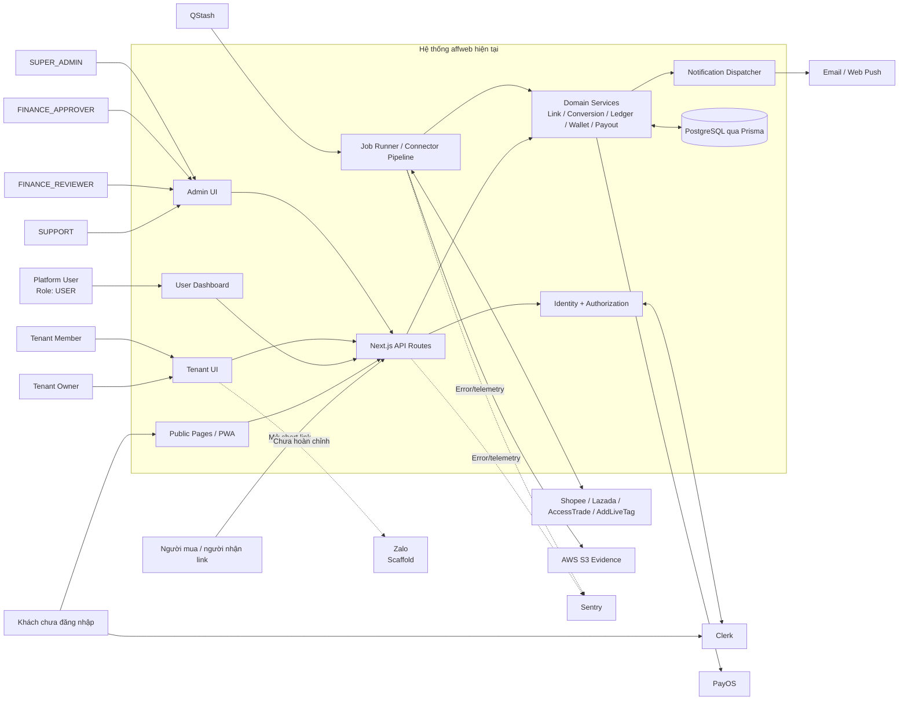

Boundary thực tế:

- Các UI gọi Next.js API hoặc server actions.
- API sử dụng Clerk/authorization trước khi gọi domain service, nhưng có một số route ngoại lệ đang là blocker.
- Domain service đọc/ghi PostgreSQL qua Prisma.
- Job runner thu nhận dữ liệu từ provider rồi đưa vào conversion/ledger pipeline.
- Payout và SaaS gọi PayOS.
- Notification dispatcher gửi email/web push.
- Zalo mới ở mức scaffold; không có đủ bằng chứng về outbound message flow hoàn chỉnh.

---

## 13. Core User Flow tổng thể

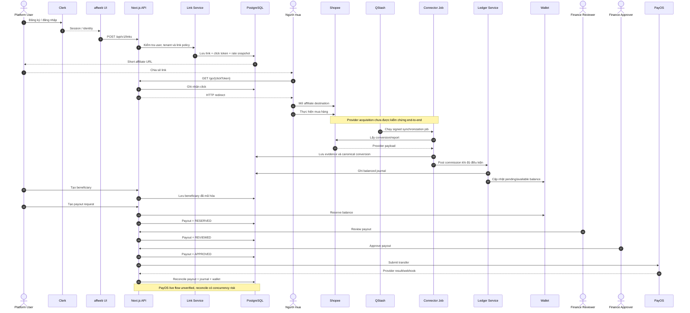

---

## 14. Chi tiết User Flow hiện tại

### 14.1 Đăng ký và đăng nhập

```text
Khách
  → Trang đăng ký/đăng nhập
  → Clerk
  → Xác minh identity
  → Reconcile primary verified email với User trong PostgreSQL
  → Tạo session
  → User Dashboard
```

**Trạng thái:** **FUNCTIONAL BUT INCOMPLETE**

- Clerk integration và identity reconciliation có mã.
- Chỉ primary email đã verify được reconcile.
- Admin còn yêu cầu allowlist, verified Google identity và fresh session.
- Không có bằng chứng live Clerk production đã hoạt động thành công.

Bằng chứng:

- `src/lib/clerk-identity.ts`
- `src/lib/authz.ts`
- `src/app/sign-in/[[...sign-in]]/page.tsx`
- `src/app/sign-up/[[...sign-up]]/page.tsx`

### 14.2 Tạo và chia sẻ affiliate link

```text
User đăng nhập
  → Nhập URL sản phẩm
  → POST /api/v1/links
  → Xác định platform và target
  → Áp dụng user/tenant affiliate configuration
  → Snapshot cashback/rate tại thời điểm tạo link
  → Lưu link và click token
  → Trả short URL
  → User chia sẻ short URL
```

**Trạng thái:** **FUNCTIONAL BUT INCOMPLETE**

- Có API, service, validation và persistence.
- Tenant member chỉ dùng Affiliate ID của owner khi tenant đang hiệu lực và cấu hình đầy đủ.
- Thiếu cấu hình tenant phải fail-closed.
- Live Shopee/provider contract chưa được kiểm chứng.

Bằng chứng:

- `src/app/api/v1/links/route.ts`
- `src/modules/links/service.ts`
- `src/app/app/links/page.tsx`

### 14.3 Người mua mở link

```text
Người mua
  → GET /go/{clickToken}
  → Tìm affiliate link
  → Ghi nhận click
  → Tạo affiliate destination
  → HTTP redirect sang Shopee
```

**Trạng thái:** **FUNCTIONAL BUT INCOMPLETE**

Internal path có mã thực thi tương đối đầy đủ. Việc Shopee ghi nhận attribution thực tế chưa có sufficient execution evidence.

Bằng chứng:

- `src/app/go/[clickToken]/route.ts`

### 14.4 Thu nhận conversion và ghi nhận cashback

```text
QStash
  → Signed job endpoint
  → Connector runner
  → Provider API/report
  → Raw evidence
  → Hash và canonical conversion
  → Conversion revision
  → Commission journal
  → Wallet projection
  → Risk hold
  → Cashback release
```

**Trạng thái:** **FUNCTIONAL BUT INCOMPLETE / UNVERIFIED**

Điểm đang hoạt động trong code:

- Signed job runner.
- Evidence/canonical conversion structures.
- Conversion revision.
- Balanced journal.
- Wallet projection và hold/release logic.

Điểm đứt hoặc chưa đủ an toàn:

- Live provider contracts chưa được kiểm chứng.
- Lazada webhook chưa xác thực nguồn.
- Một số money parser đi qua JavaScript `number`.
- Release guard có trường hợp fail-open.
- Critical conversion-ledger integration test đang bị skip.

### 14.5 Wallet và payout

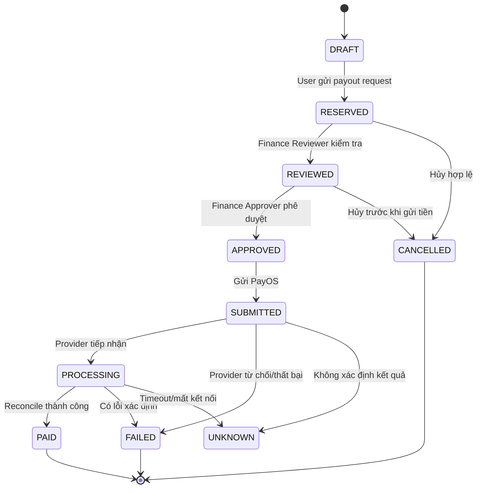

**Trạng thái:** **FUNCTIONAL BUT INCOMPLETE**

Luồng nghiệp vụ hiện có:

1. User khai báo beneficiary.
2. Dữ liệu beneficiary đi qua encryption path.
3. User gửi payout request.
4. Wallet balance được reserve.
5. `FINANCE_REVIEWER` review.
6. `FINANCE_APPROVER` approve.
7. Hệ thống submit PayOS.
8. Webhook/job reconcile kết quả.
9. Journal và wallet được cập nhật.

Điểm chưa production-ready:

- Live PayOS chưa được kiểm chứng.
- Reconcile có nguy cơ hai worker cùng thay đổi wallet.
- Trạng thái `UNKNOWN` có tồn tại nhưng chưa đủ bằng chứng failure-recovery vận hành hoàn chỉnh.
- Production secrets/config chưa sẵn sàng.

---

## 15. Tenant User Flow

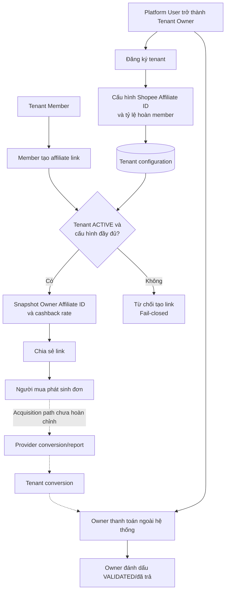

**Trạng thái:** **PARTIALLY IMPLEMENTED**

Điểm quan trọng của mô hình hiện tại:

- Tenant owner là một platform user, không thay thế các role `SUPPORT` hoặc `FINANCE`.
- Một user chỉ được sở hữu tối đa một tenant.
- Member sử dụng Shopee Affiliate ID của owner.
- Thiếu cấu hình không fallback sang Affiliate ID nền tảng.
- Rate được snapshot tại link time.
- Tenant conversion không post vào platform ledger/wallet/payout.
- Owner thanh toán cho member bên ngoài hệ thống và chỉ đánh dấu kết quả trong `affweb`.

Điểm bị đứt: chưa có đủ bằng chứng cho provider report/acquisition pipeline riêng theo Affiliate ID của từng tenant.

---

## 16. Admin và Finance Flow

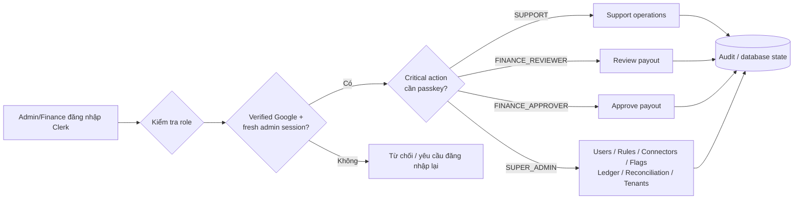

Phân tách trách nhiệm hiện có trong model:

- `FINANCE_REVIEWER`: review.
- `FINANCE_APPROVER`: approve.
- `SUPER_ADMIN`: quyền quản trị rộng.
- `SUPPORT`: hoạt động hỗ trợ.
- Critical admin authentication sử dụng fresh identity/passkey primitives.

Đây là cấu trúc có code thực thi, nhưng chưa có authenticated E2E đủ mạnh để xác nhận toàn bộ authorization boundary.

---

## 17. Các luồng chưa hoàn chỉnh

### 17.1 SaaS subscription

```text
Tenant đăng ký
  → Chọn plan
  → Tạo checkout/PayOS invoice
  → PayOS webhook
  → Cập nhật invoice
  → Gia hạn subscription
```

**Trạng thái:** **SCAFFOLD / PLACEHOLDER**

Có model, API và UI, nhưng demo/fake fallback và signature behavior hiện tại khiến luồng chưa thể dùng làm billing thật.

### 17.2 Zalo

```text
Tenant
  → Tạo QR hoặc group binding
  → Liên kết Zalo group
  → Nhận/gửi notification
  → Reply về user
```

**Trạng thái:** **SCAFFOLD / PLACEHOLDER**

Không có đủ bằng chứng send-message path hoàn chỉnh. Route cấu hình còn thiếu authorization/ownership boundary và không nên được xem là hoạt động production.

---

## 18. Tóm tắt luồng thực tế

```text
ĐÃ CÓ TƯƠNG ĐỐI ĐẦY ĐỦ
User → Clerk → Tạo link → Lưu link → Người mua click → Ghi click → Redirect Shopee

CÓ CODE NHƯNG CHƯA KIỂM CHỨNG END-TO-END
Provider → Connector → Conversion → Journal → Wallet → Hold/Release

CÓ STATE MACHINE NHƯNG CHƯA AN TOÀN CHO TIỀN THẬT
User → Beneficiary → Payout request → Review → Approve → PayOS → Reconcile

MỚI TRIỂN KHAI MỘT PHẦN
Tenant owner/member → Tenant link → Tenant conversion → External settlement

SCAFFOLD/PLACEHOLDER
SaaS subscription và Zalo integration
```

Core flow rõ nhất của hệ thống hiện tại:

> **Platform user tạo affiliate link → người mua được redirect → hệ thống cố gắng thu nhận conversion → conversion được chuyển thành journal/wallet → user yêu cầu payout qua quy trình finance.**

Nửa đầu đến redirect có implementation rõ nhất. Nửa sau từ provider conversion tới money settlement có nhiều mã nghiệp vụ, nhưng vẫn là phần có rủi ro và mức độ chưa kiểm chứng cao nhất.

---

## 19. Diagrams bổ sung

Các sơ đồ trong phần này mở rộng góc nhìn theo component, identity, attribution, conversion, tài chính, trust boundary và notification. Đường nét đứt thể hiện integration hoặc execution path chưa được kiểm chứng đầy đủ.

### 19.1 Modular Monolith Component Diagram

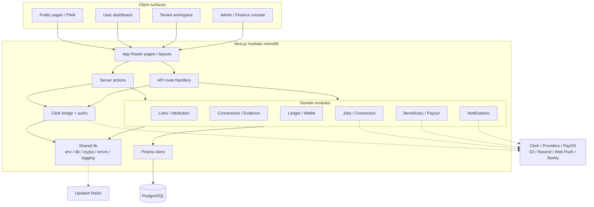

### 19.2 Identity và Access-Control Flow

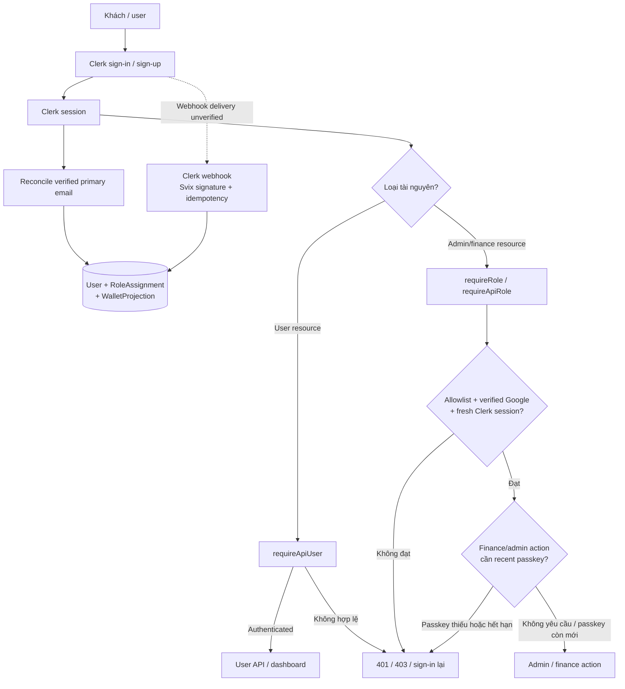

### 19.3 Affiliate Link và Click Lifecycle

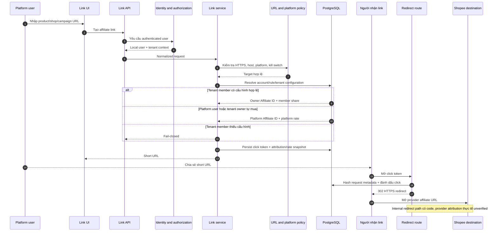

### 19.4 Conversion và Evidence Pipeline

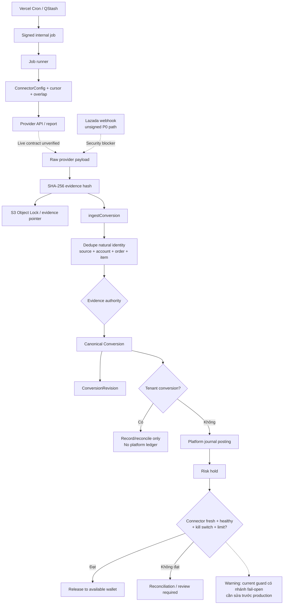

### 19.5 Ledger, Wallet và Payout Fund Flow

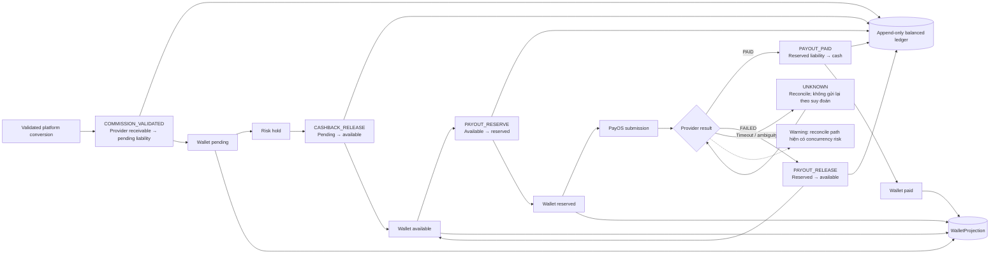

### 19.6 Security Trust-Boundary Diagram

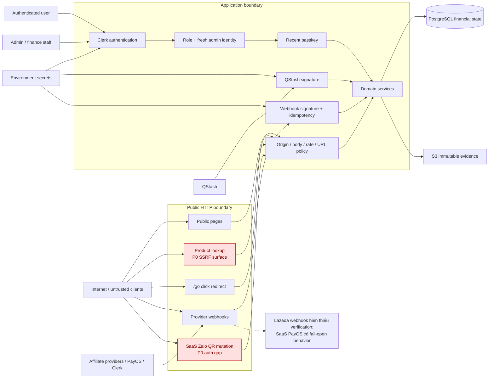

### 19.7 Notification Outbox và Delivery Flow

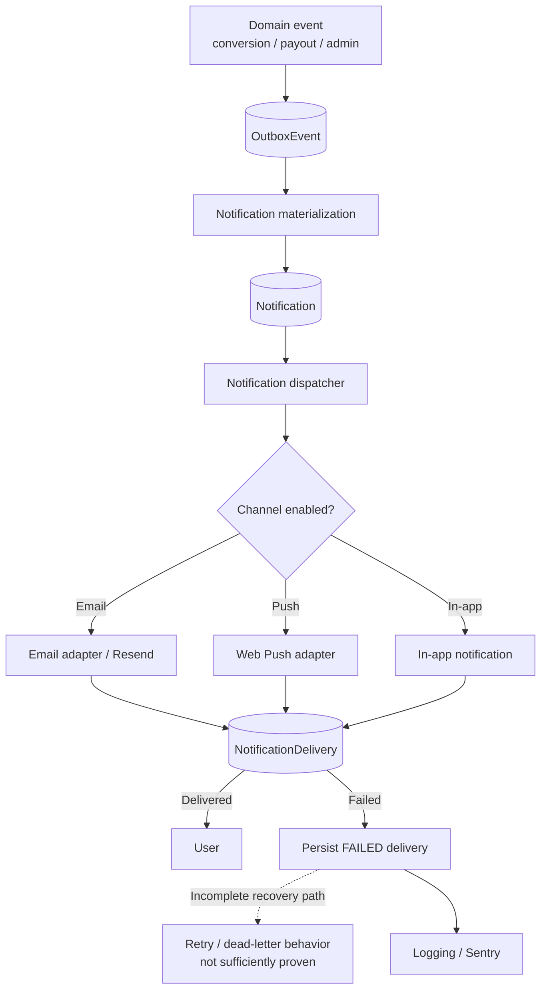

---

## Phụ lục A — Bằng chứng kiểm định

| Check                                        | Result                      | Interpretation                                                    |
| -------------------------------------------- | --------------------------- | ----------------------------------------------------------------- |
| `pnpm exec tsc --noEmit --incremental false` | PASS                        | TypeScript compile-time checks pass                               |
| Prisma schema validation                     | PASS                        | Schema hiện tại hợp lệ về mặt Prisma parser/config                |
| Source unit tests                            | 38/38 PASS, 12 files        | Có unit coverage hữu ích nhưng không thay thế integration/E2E     |
| Lint                                         | FAIL: 7 errors, 13 warnings | Repository chưa đạt quality gate                                  |
| Format check                                 | FAIL                        | Nhiều tệp chưa đúng configured formatting                         |
| Production env check                         | FAIL: 22 requirements       | Không có production configuration hoàn chỉnh được chứng minh      |
| Existing Playwright last-run report          | FAIL, 2 test IDs            | Bằng chứng lịch sử; không phải current rerun                      |
| Full integration tests                       | NOT RUN                     | Có thể ghi DB; không có isolated disposable DB được chứng minh    |
| Production build                             | NOT RUN                     | Có thể tạo generated artifacts; ngoài phạm vi audit chỉ đọc       |
| Current E2E                                  | NOT RUN                     | Có thể khởi tạo server/browser state; ngoài phạm vi audit chỉ đọc |

## Phụ lục B — Giới hạn của kết luận

- Audit đánh giá repository và các artifact hiện có, không đánh giá console/provider account bên ngoài.
- Không đọc hoặc xuất giá trị secret từ `.env.local`.
- Không chạy migration, seed, database-writing integration tests hoặc production smoke.
- Một feature có code nhưng phụ thuộc external service được giữ ở mức **UNVERIFIED** hoặc **FUNCTIONAL BUT INCOMPLETE** nếu thiếu execution evidence.
- Khi tài liệu và code không nhất quán, báo cáo dùng code hiện tại làm nguồn sự thật.
