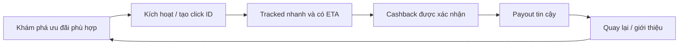

# Nghiên cứu thị trường Cashback và Affiliate 2026

**Ngày kiểm chứng:** 2026-07-23  
**Phạm vi địa lý trọng tâm:** Việt Nam và Đông Nam Á; tham chiếu mô hình toàn cầu  
**Mục đích:** Cung cấp cơ sở thương mại, sản phẩm và vận hành trước khi nâng cấp tài liệu kỹ thuật “Cashback and Affiliate Systems: Technical Research and Reference Architecture”  
**Nhãn bằng chứng:** **Được tài liệu chính thức xác nhận**, **Báo cáo ngành**, **Do doanh nghiệp công bố**, **Bên thứ ba ước tính**, **Suy luận**, **Đề xuất**, **Chưa xác minh**

> Tài liệu này không phải dự báo đầu tư. Các số liệu có định nghĩa, phạm vi và mẫu khác nhau; không cộng hoặc so sánh trực tiếp nếu chưa chuẩn hóa mẫu số.

## 1. Kết luận điều hành

1. **Được tài liệu chính thức xác nhận:** Thương mại điện tử Việt Nam có quy mô đủ lớn để hỗ trợ một doanh nghiệp cashback/affiliate chuyên biệt. Báo cáo của cơ quan nhà nước và các tổ chức ngành ghi nhận tổng thị trường bán lẻ trực tuyến năm 2024–2025 quanh mức 32 tỷ USD, tăng trưởng khoảng 27% so với năm trước và chiếm khoảng 12% tổng bán lẻ. Tuy nhiên, con số này không phải doanh số có thể hưởng hoa hồng.
2. **Báo cáo ngành:** Kinh tế số Đông Nam Á dự kiến vượt 300 tỷ USD GMV trong năm 2025; riêng thương mại điện tử khoảng 185 tỷ USD GMV. Video commerce chiếm xấp xỉ một phần tư GMV thương mại điện tử khu vực. Việt Nam có mức tăng rất nhanh về số người bán và giao dịch video commerce, nhưng giá trị đơn hàng phổ biến tương đối thấp.
3. **Bên thứ ba ước tính:** Phần lớn GMV sàn đa ngành tại Việt Nam tập trung ở Shopee và TikTok Shop. Các báo cáo dùng mẫu số khác nhau nhưng đều cho thấy mức phụ thuộc rất cao vào hai nền tảng này. Đây vừa là nguồn tần suất mua hàng, vừa là rủi ro tập trung đối tác.
4. **Báo cáo ngành:** Affiliate không còn chỉ là một kênh “đặt link rồi nhận CPA”. Các mô hình tăng trưởng mạnh gồm loyalty/rewards, creator commerce, embedded offers, card-linked offers, voucher, retail media và B2B partner infrastructure.
5. **Suy luận — độ tin cậy cao:** Một sản phẩm chỉ sao chép giao diện ShopBack, cạnh tranh bằng tỷ lệ hoàn tiền và phụ thuộc hoàn toàn vào cookie/link redirect sẽ khó tạo lợi thế bền vững. Hào lũy nằm ở độ tin cậy của tracking, minh bạch điều kiện, xử lý khiếu nại nhanh, dữ liệu đối soát, tích hợp trực tiếp, kênh phân phối và thói quen sử dụng.
6. **Suy luận — độ tin cậy cao:** Đơn hàng marketplace tạo tần suất nhưng chưa chắc tạo biên lợi nhuận tốt. Travel, tài chính, bảo hiểm, SaaS/dịch vụ số, viễn thông, giáo dục và các ngành AOV/LTV cao có thể tạo contribution margin tốt hơn, dù chu kỳ xác nhận dài và yêu cầu tuân thủ cao hơn.
7. **Đề xuất:** Nên khởi động bằng mô hình hybrid:
   - affiliate network để có độ phủ và dữ liệu chuyển đổi nhanh;
   - click/redirect first-party và sổ cái nội bộ ngay từ đầu;
   - một số ngành giá trị cao để tạo lợi nhuận;
   - marketplace để tạo tần suất;
   - sau khi có dữ liệu thật mới đầu tư tích hợp trực tiếp, công cụ creator/community và embedded rewards.
8. **Đề xuất:** Quyết định go/no-go phải dựa trên dữ liệu sản xuất hoặc báo cáo mẫu của đối tác: tỷ lệ track, tỷ lệ duyệt, thời gian xác nhận, tỷ lệ hủy/hoàn, effective commission, chi phí hỗ trợ và thời gian thu tiền. Không nên quyết định chỉ từ bảng commission quảng cáo.

## 2. Phương pháp và thang bằng chứng

### 2.1 Thứ tự ưu tiên nguồn

| Cấp | Loại nguồn                                                                  | Cách sử dụng                                                              |
| --- | --------------------------------------------------------------------------- | ------------------------------------------------------------------------- |
| A   | Cơ quan nhà nước, hồ sơ tài chính, tài liệu developer/help/terms chính thức | Có thể dùng cho khẳng định chính, nhưng vẫn ghi rõ phạm vi và ngày        |
| B   | Nghiên cứu ngành có mô tả mẫu/phương pháp                                   | Dùng cho benchmark; không mặc định đại diện toàn cầu                      |
| C   | Báo cáo analyst/đơn vị đo lường thị trường                                  | Dùng như ước tính; phải nêu mẫu số/phương pháp nếu biết                   |
| D   | Số liệu marketing do doanh nghiệp tự công bố                                | Dùng để hiểu định vị và quy mô tự công bố; không coi là kiểm toán độc lập |
| E   | Suy luận từ nhiều bằng chứng                                                | Phải ghi độ tin cậy, bằng chứng hỗ trợ và giải thích thay thế             |

### 2.2 Các giới hạn chính

- “GMV thương mại điện tử”, “GMV bốn sàn”, “retail e-commerce” và “doanh số do affiliate tạo ra” là các mẫu số khác nhau.
- “Người dùng”, “thành viên”, “người mua”, “active annual members” và “tài khoản đăng ký” không thể dùng thay thế nhau.
- Commission rate niêm yết không bằng effective commission rate sau giới hạn ngành hàng, hủy/hoàn, đơn không hợp lệ, thuế, network fee và điều chỉnh.
- Tỷ lệ hoàn tiền hiển thị không phản ánh phần đóng góp thực nếu phần lớn đơn không track hoặc bị từ chối.
- Nhiều điều khoản affiliate, attribution window, quota và payout là theo tài khoản hoặc hợp đồng, không được công khai.

## 3. Quy mô và cấu trúc thị trường

### 3.1 Việt Nam

- **Được tài liệu chính thức xác nhận:** Hướng dẫn thương mại điện tử Việt Nam của International Trade Administration, dẫn nguồn Bộ Công Thương, ghi nhận thị trường khoảng 32 tỷ USD, tăng 27% so với năm trước, chiếm khoảng 12% tổng bán lẻ và có thể đạt khoảng 63 tỷ USD vào năm 2030.
- **Được tài liệu chính thức xác nhận:** Báo cáo thị trường trong nước 2025 của Bộ Công Thương ghi nhận bán lẻ trực tuyến khoảng 32 tỷ USD; riêng bán lẻ hàng hóa trực tuyến khoảng 22,5 tỷ USD.
- **Báo cáo ngành:** VECOM cũng ghi nhận mốc khoảng 32 tỷ USD cho năm 2024 và tốc độ tăng 27%.
- **Suy luận — độ tin cậy cao:** Ba nguồn cùng hội tụ quanh một mức quy mô, nhưng có thể khác nhau về năm cơ sở và định nghĩa. Khi lập mô hình kinh doanh nên dùng một chuỗi số liệu duy nhất, không trộn các định nghĩa.

### 3.2 Đông Nam Á

- **Báo cáo ngành:** e-Conomy SEA 2025 ước tính kinh tế số khu vực vượt 300 tỷ USD GMV, tăng khoảng 15%; thương mại điện tử đạt khoảng 185 tỷ USD GMV và 41 tỷ USD doanh thu.
- **Báo cáo ngành:** Khoảng ba trong năm người tiêu dùng khu vực mua hàng trực tuyến; hơn 60% thanh toán được thực hiện bằng phương thức số.
- **Báo cáo ngành:** Video commerce đạt khoảng 25% GMV thương mại điện tử khu vực.
- **Báo cáo ngành:** Việt Nam đạt khoảng 39 tỷ USD quy mô kinh tế số năm 2025. Số người bán và số giao dịch video commerce cùng tăng khoảng 60% so với năm trước; mức AOV phổ biến được báo cáo chỉ khoảng 5,5–7 USD.
- **Suy luận — độ tin cậy cao:** Video/creator commerce là kênh discovery quan trọng nhưng AOV thấp làm chi phí tracking, hỗ trợ và payout trên mỗi đơn trở nên đáng kể. Cần tối ưu theo contribution margin/order, không chỉ theo GMV.

### 3.3 Mức độ tập trung sàn tại Việt Nam

| Nguồn/định nghĩa                                   |   Giai đoạn | Shopee | TikTok Shop | Ghi chú                                               |
| -------------------------------------------------- | ----------: | -----: | ----------: | ----------------------------------------------------- |
| Metric, bốn sàn lớn                                | Cả năm 2025 | 56,04% |      41,31% | GMV bốn sàn khoảng 429,7 nghìn tỷ VND                 |
| Momentum Works, GMV nền tảng                       |        2025 |  57,5% |       39,6% | Ước tính bên thứ ba                                   |
| Euromonitor, company share trong retail e-commerce |        2025 |    41% |         31% | Mẫu số rộng hơn; không so trực tiếp với hai hàng trên |

**Kết luận:** Các con số không mâu thuẫn nếu mẫu số khác nhau. Điều đáng tin cậy hơn con số tuyệt đối là kết luận định tính: Shopee và TikTok Shop chi phối phần lớn giao dịch sàn đa ngành tại Việt Nam.

**Hệ quả chiến lược:**

- Chỉ một thay đổi commission, tracking policy hoặc điều kiện chương trình có thể ảnh hưởng lớn đến doanh thu.
- TikTok Shop vừa là merchant channel vừa sở hữu creator affiliate native, nên cashback bên ngoài cạnh tranh trực tiếp cho last-click.
- Cần giới hạn tỷ trọng doanh thu/receivable theo một merchant, một network và một vertical.
- Catalog và rate nên có khả năng đổi nguồn giữa direct program và network mà không làm thay đổi trải nghiệm người dùng.

## 4. Bản đồ mô hình kinh doanh

### 4.1 Click-out cashback

**Ví dụ:** TopCashback, Rakuten Rewards và phần cashback truyền thống của ShopBack.

Luồng cơ bản:

1. Người dùng kích hoạt ưu đãi.
2. Nền tảng tạo click/tracking ID và redirect sang merchant.
3. Merchant/network báo conversion pending.
4. Conversion được xác nhận hoặc từ chối sau kỳ hoàn trả.
5. Nền tảng chia một phần commission cho người dùng.

**Ưu điểm:** dễ hiểu, khởi động nhanh qua network, không cần sở hữu checkout.  
**Nhược điểm:** last-click dễ bị ghi đè; missing cashback tạo chi phí support; biên lợi nhuận mỏng; phụ thuộc điều khoản merchant.

### 4.2 Cashback cộng thanh toán, voucher và card-linked offers

**Ví dụ:** ShopBack.

Tài liệu doanh nghiệp và developer của ShopBack cho thấy mô hình rộng hơn click-out:

- merchant commission chia sẻ với người dùng;
- direct merchant tracking bằng server-to-server hoặc universal tracking;
- app-to-app/deep-link;
- voucher theo mô hình redemption hoặc consignment;
- ShopBack Pay, PayLater, card-linked offers và loyalty;
- phí nền tảng, merchant discount rate, transaction/refund processing, merchant-funded promotions, voucher commission và adjustments;
- báo cáo/billing theo ngày, tháng hoặc on-demand.

**Suy luận — độ tin cậy cao:** Các nguồn thu bổ sung giảm phụ thuộc vào chênh lệch commission-cashback và tạo thêm điểm chạm sở hữu first-party.

### 4.3 Embedded performance offer network

**Ví dụ:** Ibotta Performance Network.

Ibotta phân phối rewards qua:

- tài khoản loyalty được liên kết;
- receipt upload;
- gift card;
- nền tảng bán lẻ/nhà phát hành bên thứ ba.

Client tài trợ phần thưởng; nền tảng kiếm tiền từ redemption, data và targeting. Đây là mô hình B2B2C, không chỉ là một website redirect.

**Ý nghĩa:** Khi đã có dữ liệu và connector ổn định, một nền tảng Việt Nam có thể bán “rewards infrastructure” cho ngân hàng, ví điện tử, cộng đồng, creator hoặc merchant thay vì chỉ tự mua traffic.

### 4.4 Marketplace-native creator affiliate

**Ví dụ:** TikTok Shop Affiliate, Shopee Affiliate/KOL.

Creator gắn sản phẩm trực tiếp vào video, livestream hoặc nội dung native. Discovery, attribution và checkout đều nằm trong hệ sinh thái marketplace.

**Ưu điểm:** conversion gần nội dung, ít bước hơn, phân phối thuật toán.  
**Nhược điểm với cashback độc lập:** nền tảng bên ngoài khó giữ last-click, khó tạo khác biệt nếu chỉ đưa lại cùng một link.

### 4.5 Affiliate network/infrastructure

**Ví dụ toàn cầu:** Impact, Awin, CJ, Partnerize.  
**Ví dụ Việt Nam:** AccessTrade, MasOffer, AdFlex, Ecomobi.

Network gom merchant, publisher, tracking, reporting và settlement. Các mô hình tính tiền thường gồm CPS/CPA/CPL/CPO/CPI/CPC tùy chương trình.

**Ưu điểm:** nhanh có độ phủ và schema tương đối thống nhất.  
**Nhược điểm:** thêm lớp margin và dependency; dữ liệu có thể trễ; sub-ID, API, claim và payout phụ thuộc từng network.

### 4.6 Loyalty/community/creator white-label

Nền tảng cung cấp:

- storefront hoặc deep link có thương hiệu riêng;
- sub-publisher/channel tracking;
- chia sẻ commission nhiều tầng;
- dashboard đối soát;
- API/SDK/widget;
- payout cho cộng đồng hoặc creator.

**Đề xuất:** Đây là hướng phân phối đáng thử sau khi engine tracking/ledger ổn định vì có khả năng giảm CAC trực tiếp và tận dụng cộng đồng có sẵn.

## 5. Bản đồ đối thủ và bài học

| Doanh nghiệp/mô hình  | Bằng chứng quy mô hoặc vận hành                                                                                                                       | Điểm mạnh                                                                           | Rủi ro/giới hạn                                                            | Bài học cho Việt Nam                                                                |
| --------------------- | ----------------------------------------------------------------------------------------------------------------------------------------------------- | ----------------------------------------------------------------------------------- | -------------------------------------------------------------------------- | ----------------------------------------------------------------------------------- |
| ShopBack              | Do doanh nghiệp công bố: 20 triệu active annual members, 20.000 đối tác, 500.000 giao dịch/ngày, 13 thị trường; trang khác dùng hơn 60 triệu shoppers | Đa sản phẩm, direct integration, payment/voucher/card-linked, vận hành đối soát sâu | Các chỉ số người dùng có định nghĩa khác nhau; mô hình phức tạp và tốn vốn | Không nên chỉ sao chép UI; phần khó là tracking, billing, liability và distribution |
| TopCashback           | Do doanh nghiệp công bố: khoảng 7.000 retailer tại Mỹ; hơn 5 triệu thành viên tại Anh                                                                 | Value proposition “chia commission”, nhiều payout/gift card                         | Cashback không được bảo đảm trước khi retailer thanh toán                  | Cần truyền thông rõ pending/confirmed và nguồn tiền                                 |
| Rakuten Rewards       | Help center chính thức công bố state và payout theo quý                                                                                               | Thương hiệu, extension, card-linked, nhiều bề mặt kích hoạt                         | Chu kỳ payout và rule phụ thuộc merchant                                   | Extension/app reminder là kênh tạo thói quen, không chỉ tiện ích                    |
| Ibotta                | Hồ sơ SEC: trung bình 18,2 triệu redeemer trong 2025; lợi nhuận GAAP mỏng so với doanh thu                                                            | B2B embedded network, first-party retailer surfaces, data/targeting                 | Tích hợp bán lẻ phức tạp; cần enterprise sales và dữ liệu                  | Hướng dài hạn hấp dẫn hơn pure click-out nhưng không phù hợp MVP                    |
| Cashrewards           | ANZ dừng hoạt động tháng 9/2025; ghi giảm goodwill 78 triệu AUD                                                                                       | Từng có quy mô và hậu thuẫn ngân hàng                                               | Không đạt lý do kinh tế/chiến lược theo ANZ                                | Quy mô thành viên không thay thế contribution margin và strategic fit               |
| TikTok Shop Affiliate | TikTok công bố tăng trưởng affiliate creator, LIVE và short-video GMV mạnh tại SEA                                                                    | Discovery-commerce native, creator supply, checkout liền mạch                       | Sở hữu attribution; phụ thuộc nền tảng                                     | Cashback cần creator/community tools hoặc lợi ích bổ sung, không chỉ link           |
| AccessTrade           | Do doanh nghiệp tự công bố hàng nghìn brand và hàng triệu publisher; có developer portal                                                              | Độ phủ Việt Nam, nhiều mô hình chiến dịch, API publisher                            | Số liệu marketing chưa kiểm toán; API/quyền theo tài khoản                 | Ứng viên tốt cho connector MVP nhưng phải thẩm định dữ liệu thật                    |
| MasOffer              | Trang chính thức nêu CPA, last-click và chu kỳ thanh toán                                                                                             | Địa phương hóa, mô hình đơn giản                                                    | Phạm vi API công khai hạn chế                                              | Phù hợp làm nguồn bổ sung/report-based                                              |
| AdFlex                | Tài liệu đăng ký mô tả CPO/CPA/CPI/CPC và payout                                                                                                      | Mạnh ở CPO/performance                                                              | Chất lượng lead/order và quy tắc xác nhận khác cashback retail             | Có thể dùng cho vertical lead-gen, phải tách state machine khỏi retail order        |
| Ecomobi               | Trang doanh nghiệp cũ công bố mạng KOL khu vực                                                                                                        | Creator/social commerce                                                             | Nguồn công khai hiện tại hạn chế, một số trang có thể cũ                   | Chỉ onboard sau due diligence kỹ thuật và thương mại                                |

## 6. Những xu hướng quyết định sản phẩm

### 6.1 Loyalty/rewards vẫn tạo volume lớn

**Báo cáo ngành:** Benchmark 2025 của Impact trên 2.368 retail brand Bắc Mỹ cho biết loyalty/rewards partner nhận khoảng 33% brand spend và tạo khoảng 50% transaction. Đây là bằng chứng về vai trò của rewards, nhưng không thể suy rộng nguyên trạng sang Việt Nam.

### 6.2 Creator tăng nhanh nhưng không thay thế loyalty

- **Báo cáo ngành:** Cùng benchmark của Impact ghi nhận influencer transaction volume tăng 65%.
- **Do doanh nghiệp công bố:** TikTok tại Đông Nam Á ghi nhận số creator affiliate và GMV từ LIVE/short video tăng mạnh trong năm 2025.
- **Suy luận — độ tin cậy cao:** Loyalty và creator giải quyết hai giai đoạn khác nhau: creator tạo discovery/intention; cashback tạo activation, price assurance và retention. Sản phẩm tốt nên hỗ trợ cả hai thay vì coi chúng loại trừ nhau.

### 6.3 “Post-cookie” thực tế là first-party và server-to-server

- **Được tài liệu chính thức xác nhận:** WebKit chặn cookie bên thứ ba mặc định và có cơ chế chống tracking qua redirect/bounce.
- **Được tài liệu chính thức xác nhận:** WebKit khuyến nghị lưu attribution phía server và dùng link decoration.
- **Được tài liệu chính thức xác nhận:** Awin yêu cầu S2S và app tracking trong Conversion Protection Initiative; MasterTag dùng first-party cookie.
- **Được tài liệu chính thức xác nhận:** Impact hỗ trợ first-party referral parameter, S2S POST và batch/FTP.
- **Được tài liệu chính thức xác nhận:** Chrome không tiếp tục lộ trình xóa toàn bộ third-party cookie như kế hoạch cũ, nhưng quyền lựa chọn người dùng, trình duyệt khác và ad blocker vẫn làm client-only tracking kém tin cậy.

**Kết luận kỹ thuật:** First-party click ID, server-side mapping, app deep-link handoff, S2S conversion ingestion và report repair không phải tối ưu tùy chọn; đó là baseline.

### 6.4 Non-commission spend và paid placement tăng

**Báo cáo ngành:** Impact ghi nhận khoảng 14% spend không phải commission trong mẫu nghiên cứu.  
**Suy luận — độ tin cậy trung bình:** Merchant sẵn sàng trả thêm cho placement, content, technology hoặc campaign activation. Đây là nguồn doanh thu tiềm năng nhưng cần tách khỏi cashback liability và công bố nội dung tài trợ phù hợp.

### 6.5 Tốc độ “tracked” là tính năng niềm tin

Người dùng không cần tiền được duyệt ngay, nhưng cần tín hiệu sớm rằng đơn đã được ghi nhận. Tách rõ:

- click received;
- order tracked;
- merchant pending;
- confirmed/available;
- rejected/reversed;
- paid.

**Suy luận — độ tin cậy cao:** Thông báo tracked nhanh, ETA thực tế và lý do từ chối có cấu trúc làm giảm support cost và tăng tỷ lệ quay lại.

## 7. Từ TAM đến SAM và SOM

### 7.1 Không dùng toàn bộ GMV làm TAM kiếm tiền

Một mô hình bottom-up nên bắt đầu từ:

```text
Eligible GMV
= tổng GMV của merchant/program đã ký
× tỷ lệ category/SKU đủ điều kiện
× tỷ lệ traffic có thể gắn attribution
× tỷ lệ địa lý/thiết bị/kênh được chấp nhận
```

```text
Tracked GMV
= Eligible GMV × click-to-track success rate
```

```text
Approved GMV
= Tracked GMV × approval rate sau hủy/hoàn/gian lận
```

```text
Gross commission
= Σ(Approved item value × effective commission rate)
+ fixed CPA/CPL đã được duyệt
```

### 7.2 SAM khả dụng cho MVP

SAM không phải “toàn bộ người mua online tại Việt Nam”. Nó là GMV hoặc conversion thuộc:

- merchant có hợp đồng hoặc qua network;
- cho phép cashback/incentive publisher;
- có tracking và report đủ để đối soát;
- có payout phù hợp pháp nhân/tài khoản;
- có điều kiện công bố được cho người dùng;
- có biên lợi nhuận sau cashback, chi phí hỗ trợ và reversal.

### 7.3 SOM thực tế

SOM 12–18 tháng nên dựa trên:

- lưu lượng có thể mua hoặc sở hữu;
- activation rate;
- repeat rate;
- số merchant/vertical thực sự live;
- quota/API/report latency;
- vốn lưu động;
- năng lực xử lý missing cashback;
- giới hạn payout và KYC;
- contribution margin dương theo cohort.

## 8. Unit economics

### 8.1 Công thức cốt lõi

```text
Approved GMV = Tracked GMV × Approval rate

Gross commission =
  Approved eligible GMV × Effective commission rate
  + Approved fixed bounties

Member cashback =
  rule(gross commission, fixed reward, tier, campaign subsidy, cap)

Platform gross margin =
  Gross commission
  - Member cashback
  - Upstream/network fees
  + Placement/advertising revenue
  + Merchant-funded promotion revenue
  + Voucher/payment/technology revenue

Contribution margin =
  Platform gross margin
  - Payout fees
  - Fraud and unrecovered reversal loss
  - Variable support cost
  - Acquisition subsidy
  - Variable infrastructure/communication cost
```

### 8.2 Ví dụ minh họa, không phải benchmark thị trường

Giả sử:

- tracked GMV: 100 tỷ VND;
- approval rate: 70%;
- effective commission: 4%;
- chia 70% gross commission cho thành viên.

Kết quả:

- approved GMV: 70 tỷ VND;
- gross commission: 2,8 tỷ VND;
- member cashback: 1,96 tỷ VND;
- phần commission còn lại: 840 triệu VND;
- biên trước network fee, payout, fraud, support, marketing và hạ tầng chỉ bằng **0,84% tracked GMV**.

**Suy luận — độ tin cậy cao:** Chỉ một vài điểm phần trăm thay đổi ở approval rate, effective commission hoặc member share có thể xóa phần lớn lợi nhuận. Phải mô phỏng theo merchant/category chứ không dùng một rate bình quân cho toàn doanh nghiệp.

### 8.3 Cash conversion cycle và reward liability

Các mốc cần theo dõi độc lập:

- thời điểm order tracked;
- thời điểm merchant/network xác nhận;
- thời điểm receivable được ghi nhận;
- thời điểm tiền thực nhận;
- thời điểm cashback available;
- thời điểm người dùng yêu cầu payout;
- thời điểm payout hoàn tất;
- thời điểm reversal có thể không còn thu hồi được.

**Đề xuất:** Không tự động chuyển cashback sang available chỉ vì conversion có trạng thái “approved” nếu hợp đồng có rủi ro điều chỉnh hoặc chưa đủ chắc chắn. Chính sách phải xác định rõ khi nào nền tảng chấp nhận cấp tín dụng trước.

### 8.4 Waterfall theo cohort

Mỗi cohort merchant × tháng click cần có waterfall:

```text
Clicks
→ tracked orders
→ eligible orders
→ approved orders
→ invoiced commission
→ collected cash
→ cashback available
→ cashback paid
→ late reversals / bad debt
```

Không đánh giá hiệu quả acquisition trước khi cohort đi qua đủ kỳ hoàn/hủy.

## 9. Vertical prioritization

| Vertical             |        Tần suất |         AOV/LTV | Thời gian duyệt |  Biên tiềm năng | Rủi ro chính                           | Vai trò đề xuất                 |
| -------------------- | --------------: | --------------: | --------------: | --------------: | -------------------------------------- | ------------------------------- |
| Marketplace đa ngành |             Cao | Thấp–trung bình |      Trung bình | Thấp–trung bình | rate đổi nhanh, last-click, exclusions | Tạo thói quen và traffic        |
| Travel/hotel/flight  | Thấp–trung bình |             Cao |             Dài |  Trung bình–cao | hủy, ngày lưu trú, seasonality         | Tạo gross profit                |
| Tài chính/bảo hiểm   |            Thấp |     LTV/CPA cao |             Dài |             Cao | lead quality, compliance, clawback     | Thử có kiểm soát                |
| Dịch vụ số/SaaS      |      Trung bình |      Trung bình | Ngắn–trung bình |             Cao | subscription churn, geo restriction    | Ưu tiên sớm                     |
| Viễn thông/utility   |      Trung bình |      Trung bình |      Trung bình |      Trung bình | KYC/activation                         | Tạo retention                   |
| F&B/local commerce   |             Cao |            Thấp |            Ngắn |            Thấp | chi phí payout/support/order           | Chỉ tốt nếu card-linked/payment |
| Beauty/fashion D2C   |      Trung bình |      Trung bình |      Trung bình |      Trung bình | returns cao                            | Tích hợp merchant trực tiếp     |
| Education            |            Thấp |             Cao |             Dài |             Cao | lead qualification/refund              | Acquisition có mục tiêu         |

**Đề xuất:** MVP nên chọn 2–3 vertical lợi nhuận và dùng marketplace như sản phẩm tần suất, thay vì để marketplace chiếm gần toàn bộ economics.

## 10. Định vị sản phẩm khả thi

### 10.1 Không nên định vị chỉ bằng “hoàn cao nhất”

Rate cao dễ sao chép và có thể được trợ giá tạm thời. Value proposition bền hơn:

- “theo dõi rõ, báo tracked nhanh”;
- “điều kiện dễ hiểu trước khi mua”;
- “khiếu nại có SLA và bằng chứng”;
- “nhận tiền bằng phương thức địa phương thuận tiện”;
- “một nơi so sánh ưu đãi, voucher và cashback thực nhận”;
- “công cụ link/reward cho creator và cộng đồng”.

### 10.2 Product loop đề xuất



### 10.3 Distribution surfaces

- web/app discovery;
- browser extension hoặc share-sheet;
- deeplink mở app marketplace;
- Telegram/Zalo/community bot hoặc mini storefront nếu chính sách cho phép;
- creator link hub;
- email/push price/cashback alerts;
- B2B widget/API cho ngân hàng, ví, loyalty program.

Mỗi surface phải giữ cùng click ID/sub-ID lineage và không tự ghi đè attribution ngoài ý muốn.

## 11. Chiến lược gia nhập thị trường

### Giai đoạn 0 — thẩm định bằng dữ liệu, 4–6 tuần

1. Ký hoặc xin sandbox/report mẫu từ ít nhất một affiliate network.
2. Thu thập 3–6 tháng dữ liệu ẩn danh hoặc sample về trạng thái, commission, hủy/hoàn và payout.
3. Chọn 10–20 merchant thuộc 2–3 vertical.
4. Lập unit economics theo merchant, không dùng rate quảng cáo.
5. Thử ba thông điệp: tỷ lệ hoàn; độ tin cậy/tracked; công cụ creator/community.
6. Đặt ngưỡng go/no-go trước khi xây rộng.

### Giai đoạn 1 — consumer MVP, 8–12 tuần

- network-first;
- first-party redirect/click service;
- merchant/rule catalog;
- polling + CSV repair;
- cashback pending/available;
- double-entry ledger;
- một phương thức payout;
- missing cashback case;
- admin/reconciliation;
- analytics theo cohort.

### Giai đoạn 2 — distribution và margin

- creator/community/sub-publisher portal;
- referral chia sẻ có cap và fraud controls;
- browser/app activation surface;
- merchant-funded placements;
- direct merchant S2S cho merchant có volume;
- voucher và offer stack có rule engine.

### Giai đoạn 3 — platform/B2B2C

- white-label rewards;
- partner API/SDK;
- card-linked/payment nếu có đối tác phù hợp;
- multi-tenant ledger và settlement;
- recommendation/personalization;
- direct integrations theo volume và margin.

## 12. KPI và dashboard điều hành

### 12.1 Acquisition và activation

- verified registrations;
- first merchant view → outbound click;
- first tracked order;
- cost per activated shopper;
- activation theo source/creator/community;
- day-7/day-30 repeat click và repeat tracked order.

### 12.2 Tracking và conversion

- click redirect success;
- click-to-track rate;
- p50/p95 track latency;
- missing cashback claim rate;
- approval/rejection/reversal rate;
- unmatched conversion rate;
- duplicate/conflict rate;
- percentage S2S/postback/poll/report.

### 12.3 Economics

- tracked và approved GMV;
- effective commission rate;
- member share;
- net take rate trên tracked và approved GMV;
- contribution margin/order và/customer;
- promotion subsidy burn;
- support cost/order;
- fraud/reversal loss;
- CAC payback theo cohort.

### 12.4 Treasury và payout

- receivable age;
- reward liability theo state;
- cash coverage;
- days from approval to collection;
- days from available to payout;
- payout success/failure/retry;
- breakage, nếu chính sách cho phép và được đo đúng;
- late reversal exposure.

### 12.5 Concentration

- % approved GMV, gross commission và receivable theo merchant;
- theo network;
- theo vertical;
- theo creator/source;
- theo quốc gia/currency.

## 13. Rủi ro thị trường và biện pháp

| Rủi ro                         | Dấu hiệu sớm                                | Biện pháp                                                                 |
| ------------------------------ | ------------------------------------------- | ------------------------------------------------------------------------- |
| Phụ thuộc Shopee/TikTok        | >40% gross commission từ một sàn            | cap concentration, network switching, mở vertical khác                    |
| Rate giảm/exclusion tăng       | effective rate giảm dù GMV ổn               | versioned rules, margin alert, stop subsidy tự động                       |
| Last-click bị ghi đè           | click cao nhưng track thấp                  | hướng dẫn rõ, extension/app activation, S2S, claim diagnostics            |
| Dòng tiền âm                   | cashback available trước khi thu receivable | reserve, availability policy, payout threshold, treasury forecast         |
| Missing cashback quá cao       | case/order và support cost tăng             | rule pre-check, tracked notification, evidence pipeline, merchant SLA     |
| Gian lận referral/payout       | device/payment overlap, velocity tăng       | graph/risk score, hold, step-up verification                              |
| Creator traffic kém chất lượng | click tăng, approval thấp                   | source-level cohort, delayed bonus, clawback                              |
| Network outage/data drift      | lag, schema error, missing report           | raw archive, cursor checkpoint, polling repair, DLQ                       |
| Mô hình không có lợi nhuận     | repeat tốt nhưng contribution âm            | giảm member share theo merchant, paid placement, direct deal, dừng cohort |
| Scale ảo                       | registrations tăng nhưng first tracked thấp | tối ưu activated shopper, không tối ưu signup                             |

## 14. Sổ giả thuyết cần kiểm chứng

| Giả thuyết                                        | Bằng chứng hiện có                                            |    Tin cậy | Giải thích thay thế                                    | Cách kiểm chứng                                                |
| ------------------------------------------------- | ------------------------------------------------------------- | ---------: | ------------------------------------------------------ | -------------------------------------------------------------- |
| Rate cao làm người dùng quay lại                  | Các đối thủ dùng rate làm thông điệp                          |    Thấp–TB | Tin cậy, tiện lợi hoặc payout quan trọng hơn           | A/B value proposition và cohort repeat                         |
| AccessTrade đủ độ phủ cho MVP                     | Có developer portal và mạng merchant/publisher lớn tự công bố | Trung bình | Quyền API hoặc chương trình cashback có thể hạn chế    | Xin tài khoản production/sample report và merchant eligibility |
| Marketplace tạo tần suất nhưng biên thấp          | AOV video commerce thấp, mô hình chia commission mỏng         |        Cao | Campaign bonus có thể cải thiện margin tạm thời        | Unit economics 90 ngày theo merchant/category                  |
| Direct S2S tăng chất lượng tracking               | ShopBack, Awin, Impact đều dùng/khuyến nghị S2S               |        Cao | Merchant implementation kém vẫn gây mất dữ liệu        | So sánh direct cohort với network cohort                       |
| Creator/community giảm CAC                        | Creator commerce tăng nhanh                                   | Trung bình | Revenue share có thể thay CAC chứ không giảm tổng cost | Contribution margin theo source sau reversal                   |
| Thông báo tracked nhanh tăng trust                | Help flows của các cashback lớn nhấn mạnh tracking state      | Trung bình | Rate/payout có thể quan trọng hơn                      | Thử nghiệm notification và đo repeat/support                   |
| Payout timing của network phù hợp UX              | Chưa có dữ liệu hợp đồng                                      |  Chưa biết | Chu kỳ đối soát có thể quá dài                         | Đo invoice-to-cash và thiết kế availability policy             |
| Người dùng chấp nhận pending dài ở travel/finance | Ngành có chu kỳ xác nhận dài                                  |       Thấp | Họ có thể bỏ sản phẩm hoặc khiếu nại nhiều             | Disclosure test + support/contact rate                         |

## 15. Tiêu chí go/no-go trước khi xây rộng

Đặt ngưỡng bằng dữ liệu pilot; các con số dưới đây là **khung quyết định**, không phải benchmark bắt buộc:

1. Có ít nhất một nguồn conversion/commission có quyền sử dụng rõ ràng.
2. Có schema trạng thái và lịch sử correction/refund đủ để thiết kế state machine.
3. Track latency và click-to-track rate đo được theo merchant.
4. Effective commission sau rejection đủ bao phủ cashback, phí và support.
5. Không một merchant duy nhất làm toàn bộ mô hình mất khả năng hoạt động khi rate giảm.
6. Có cơ chế đối soát invoice/receivable trước khi tạo liability không kiểm soát.
7. Có ít nhất một cohort cho thấy repeat purchase chứ không chỉ săn bonus đăng ký.
8. Missing claim có evidence và SLA xử lý khả thi.
9. Payout/KYC vận hành được với người dùng Việt Nam.
10. Chính sách merchant cho phép incentive/cashback và cách quảng bá dự kiến.

## 16. Ảnh hưởng trực tiếp đến kiến trúc kỹ thuật

Nghiên cứu thị trường thay đổi ưu tiên kiến trúc như sau:

- `MerchantOffer` phải tách khỏi `ConnectorProgram`, để một merchant có thể đổi direct/network.
- Rule catalog phải version theo thời gian, category, SKU, device, channel, cap và new/existing customer.
- `Source/Publisher/SubPublisher/Creator/Community` phải là domain chính, không chỉ là chuỗi `sub_id`.
- Sổ cái phải tách commission receivable, cashback liability, promotional subsidy và cash payout.
- Conversion phải giữ raw event, normalized revision và lineage để xử lý correction nhiều tháng sau.
- Analytics phải hỗ trợ cohort click month, order month, approval month và cash collection month.
- Treasury forecast và concentration dashboard là chức năng MVP, không phải báo cáo hậu kỳ.
- Connector contract phải hỗ trợ postback, polling, report import và manual exception cùng một state model.
- Product surfaces phải dùng cùng first-party click ID và attribution context.
- Mỗi merchant rule cần disclosure snapshot gắn vào click để xử lý tranh chấp khi điều khoản thay đổi.

## 17. Quyết định sản phẩm đề xuất

### Nên làm

- Xây tracking/ledger/reconciliation đúng ngay từ MVP.
- Bắt đầu hẹp theo vertical và merchant có economics đo được.
- Hiển thị trạng thái và ETA trung thực.
- Tạo missing cashback workflow có evidence.
- Thiết kế cho creator/community/sub-publisher từ data model.
- Tách merchant brand khỏi nguồn tích hợp.
- Giữ polling/report làm recovery ngay cả khi có postback.

### Chưa nên làm sớm

- Trợ giá cashback diện rộng để mua đăng ký.
- Tự hứa payout tức thì trước khi hiểu cash conversion cycle.
- Tích hợp trực tiếp mọi marketplace chỉ vì có seller API.
- Xây native app đầy đủ trước khi chứng minh activation/repeat.
- Đầu tư recommendation AI trước khi catalog/rule/tracking sạch.
- Coi registered users, clicks hoặc GMV là thành công nếu contribution margin âm.

## 18. Nguồn và ngày kiểm chứng

Tất cả nguồn được kiểm tra ngày **2026-07-23**.

### Quy mô thị trường

- [International Trade Administration — Vietnam eCommerce](https://www.trade.gov/country-commercial-guides/vietnam-ecommerce)
- [Bộ Công Thương — Vietnam Domestic Market Report 2025](https://www.dms.gov.vn/documents/d/guest/bc-ttnd2025-tieng-anh-pdf)
- [VECOM — Vietnam E-Business Report 2025](https://en.vecom.vn/vietnam-e-business-report-2025)
- [Temasek/Google/Bain — e-Conomy SEA 2025](https://www.temasek.com.sg/en/news-and-resources/news-room/news/2025/e-conomy-sea-2025-report-aseans-digital-economy-poised-to-surpass-300-billion)
- [Vietnam e-Conomy SEA 2025 country report](https://services.google.com/fh/files/misc/vietnam_e_conomy_sea_2025_report.pdf)

### Thị phần và cạnh tranh tại Việt Nam

- [VnExpress — Metric 2025 marketplace estimate](https://vnexpress.net/shopee-tiktok-shop-chiem-8-thi-phan-nganh-ban-le-5005886.html)
- [Vietnam Investment Review — four-platform estimate](https://vir.com.vn/shopee-and-tiktok-shop-account-for-8-per-cent-of-vietnam-s-retail-market-144853.html)
- [Vietnam Economic Times — top-four GMV estimate](https://en.vneconomy.vn/2025-revenue-for-top-4-e-commerce-giants-estimated-at-165-bln.htm)
- [Momentum Works estimate reported by Index](https://index.vn/en/news/tiktok-shop-narrows-market-share-gap-with-shopee-in-vietnam)
- [Euromonitor — Retail E-Commerce in Vietnam](https://www.euromonitor.com/retail-e-commerce-in-vietnam/report)

### Affiliate/rewards benchmark

- [Performance Marketing Association — 2025 U.S. Affiliate Marketing Industry Study](https://thepma.org/25industrystudy/)
- [Impact — 2025 Affiliate Marketing Benchmark](https://impact.com/affiliate/affiliate-marketing-benchmark/)
- [Impact — State of Affiliate Marketing 2025](https://impact.com/research-reports/state-of-affiliate-marketing/)

### Mô hình doanh nghiệp

- [ShopBack corporate](https://corporate.shopback.com/)
- [ShopBack consumer guide](https://www.shopback.com/guide/basics/how-shopback-works)
- [ShopBack for Business](https://business.shopback.com/)
- [ShopBack S2S integration](https://docs.shopback.com/docs/server-to-server)
- [ShopBack universal tracking](https://docs.shopback.com/docs/universal-tracking)
- [ShopBack validation](https://docs.shopback.com/docs/validation)
- [ShopBack billing and reports](https://docs.shopback.com/docs/billing-and-activity-reports)
- [ShopBack activity report summary](https://docs.shopback.com/docs/activity-report-summary)
- [ShopBack payments report](https://docs.shopback.com/docs/activity-report-payments)
- [ShopBack voucher reporting](https://docs.shopback.com/docs/activity-report-vouchers)
- [TopCashback US](https://www.topcashback.com/)
- [TopCashback UK company story](https://www.topcashback.co.uk/about/our-story/)
- [TopCashback terms](https://www.topcashback.com/terms/)
- [Ibotta 2025 Form 10-K](https://investors.ibotta.com/sec-filings/all-sec-filings/content/0001628280-26-011838/ibta-20251231.htm)
- [Ibotta FY2025 results](https://investors.ibotta.com/sec-filings/all-sec-filings/content/0001628280-26-011669/0001628280-26-011669.pdf)
- [ANZ — Cashrewards wind-down and write-off](https://www.exclusives.anz.com.au/newsroom/media/2025/october/significant-items-in-second-half-2025-results/)
- [ANZ 2025 Annual Report](https://www.anz.com.au/content/dam/anzcom/shareholder/2025-annual-report/anz-2025-annual-report.pdf)

### Creator/social commerce

- [TikTok Shop Summit Vietnam 2025](https://newsroom.tiktok.com/tiktok-shop-summit-2025?lang=vi-VN)
- [TikTok — Best of 2025 in Singapore](https://newsroom.tiktok.com/best-of-2025-powered-by-you?lang=en-SG)
- [TikTok Shop Creator Fest 2025](https://newsroom.tiktok.com/tiktok-shop-celebrates-the-power-of-content-and-commerce-at-creator-fest-2025?lang=en-SG)

### Việt Nam affiliate networks

- [AccessTrade for Business](https://biz.accesstrade.vn/)
- [AccessTrade Affiliate Marketing Report 2025](https://accesstrade.vn/bao-cao-affiliate-marketing-2025/)
- [MasOffer](https://masoffer.com/)
- [AdFlex CPO](https://cpo.adflex.vn/)
- [AdFlex registration and payment terms](https://cpo.adflex.vn/register)
- [Ecomobi public company landing page](https://fb4.lp.ecomobi.com/)

### Tracking và attribution

- [WebKit Tracking Prevention Policy](https://webkit.org/tracking-prevention/)
- [WebKit Intelligent Tracking Prevention](https://webkit.org/blog/7675/intelligent-tracking-prevention/)
- [Awin MasterTag](https://help.awin.com/advertisers/docs/en/understanding-awin-mastertag)
- [Awin Conversion Protection Initiative](https://help.awin.com/advertisers/docs/en/awins-conversion-protection-initiative)
- [Awin Tracking FAQ](https://help.awin.com/advertisers/docs/en/tracking-faqs)
- [Awin De-duplication](https://help.awin.com/advertisers/docs/en/de-duplication)
- [Impact API tracking integration](https://integrations.impact.com/impact-brand/docs/api-tracking-integration)
- [Impact tracking best practices](https://go.impact.com/rs/280-XQP-994/images/PDFdownload-PC-ED-Best-Practices-for-Tracking-Your-Partnerships.pdf)
- [Google — current third-party cookie status](https://developers.google.com/workspace/classroom/add-ons/developer-guides/third-party-cookies)

## 19. Những điểm còn phải xác minh bằng dữ liệu đối tác

- Merchant nào cho phép cashback/incentive publisher tại Việt Nam.
- Effective commission theo category và loại khách hàng mới/cũ.
- Sub-ID granularity, retention và report latency.
- Tỷ lệ lost tracking theo web-to-app và app-to-app.
- Attribution window và de-duplication với paid search/creator/coupon.
- Thời gian merchant validation, invoice và cash collection.
- Refund/cancellation correction sau khi đã approve.
- Network API quota, pagination, history window và replay behavior.
- Missing order claim schema, SLA và evidence requirements.
- Có hay không S2S postback cho tài khoản được phê duyệt.
- Payout/KYC/tax handling phù hợp hoạt động tại Việt Nam.
- Chi phí thực của payout provider và thất bại theo ngân hàng/ví.
- Tỷ lệ fraud/referral abuse và chi phí manual review.
- Mức CAC thực tế cho người dùng có first tracked order và first paid cashback.

## 20. Kết luận

Thị trường đủ lớn, nhưng cơ hội không nằm ở việc dựng thêm một trang tổng hợp link hoàn tiền. Cơ hội nằm ở một hệ thống có thể biến dữ liệu affiliate rời rạc thành một lời hứa tài chính đáng tin cậy: click được ghi nhận, điều kiện được đóng băng tại thời điểm mua, conversion được đối soát, cashback được hạch toán đúng và payout diễn ra minh bạch.

Chiến lược khả thi nhất là bắt đầu bằng network để học nhanh, dùng một số vertical biên cao để nuôi economics, dùng marketplace để tạo tần suất, và xây data/ledger/reconciliation đủ tốt để sau đó mở rộng sang direct merchant, creator/community và B2B embedded rewards. Bằng chứng quyết định phải đến từ cohort sản xuất và dòng tiền thực, không phải từ GMV thị trường hoặc commission rate quảng cáo.
