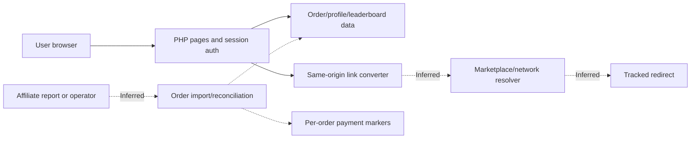
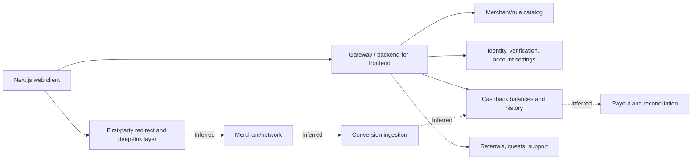
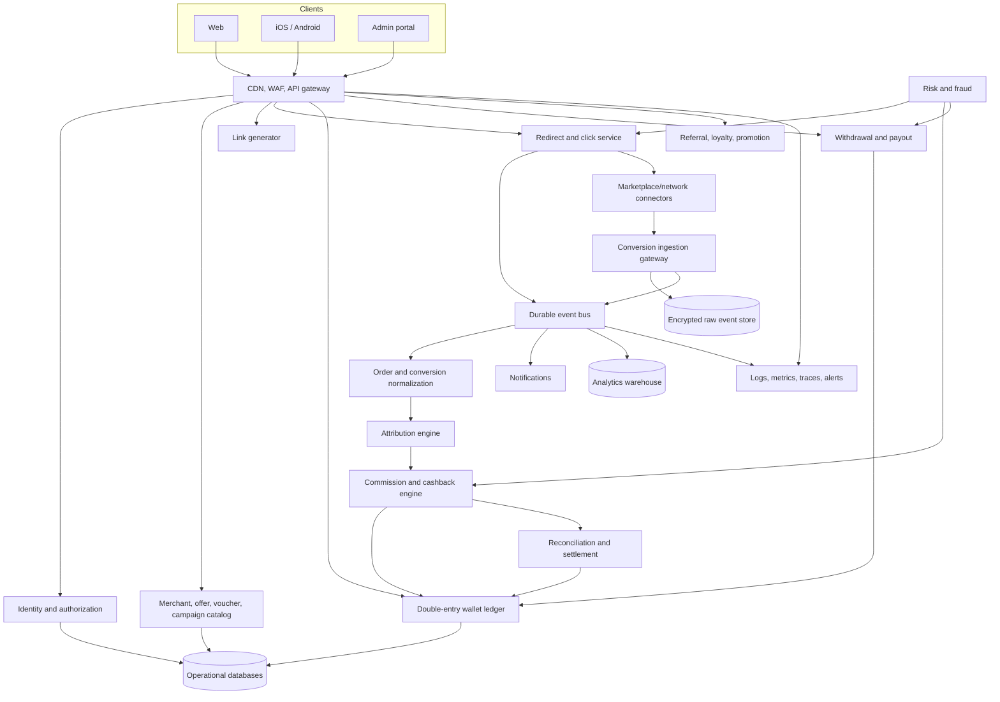
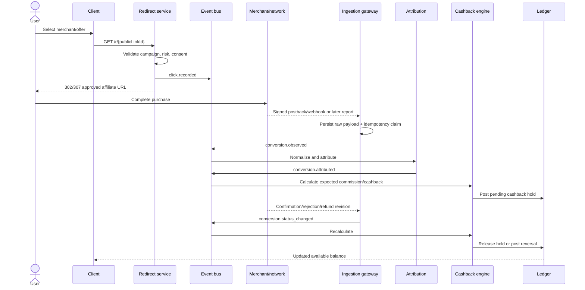
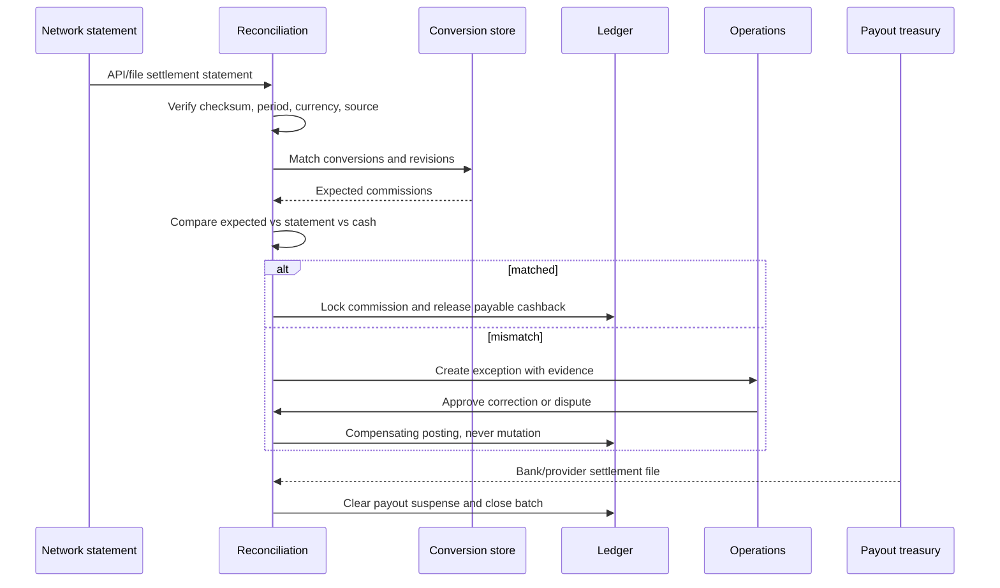
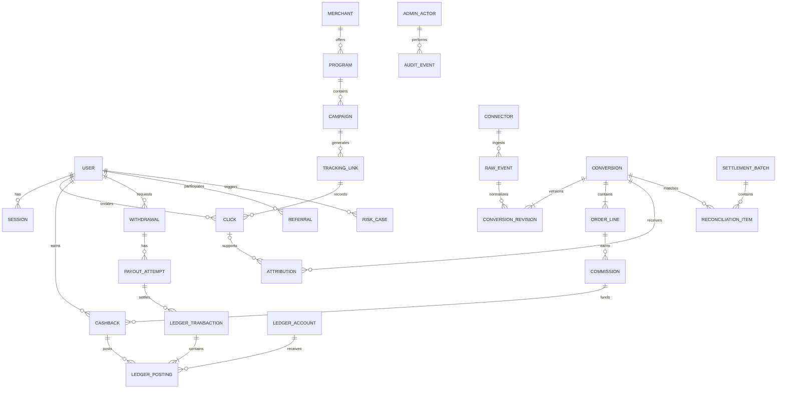
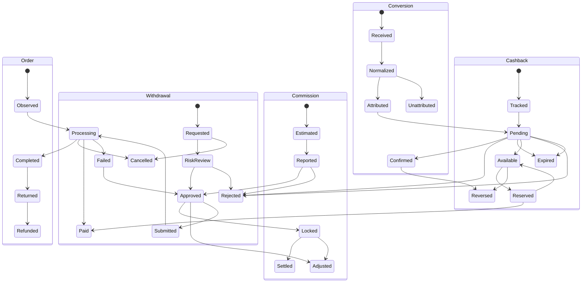

# Cashback and Affiliate Systems: Technical Research and Reference Architecture

**Verification date:** 2026-07-23  
**Timezone:** Asia/Ho_Chi_Minh  
**Scope:** Read-only product and technical observation of two authorized accounts; current official documentation research; architecture design.  
**Evidence labels:** **Observed**, **Officially documented**, **Inferred**, **Third-party reported**, **Unknown**.

Evidence labels apply to claims about existing systems and programs. Sections 14–18 are explicitly a proposed design: their diagrams, interfaces, controls, and requirements are normative recommendations rather than claims that any inspected system implements them.

**Companion market dossier:** [Vietnamese market, competitor, unit-economics and market-entry research](cashback_affiliate_market_research_2026_vi.md)

## 1. Executive summary

- **Observed:** System A is a compact, server-rendered PHP cashback portal. It exposes a private account dashboard, order/commission history, a Shopee-oriented link converter, a leaderboard, a profile page, and a password-change form. Registration and recovery are admin-assisted rather than self-service. No wallet ledger or user-initiated withdrawal flow was visible.
- **Observed:** System B, ShopBack Vietnam, is a mature consumer cashback application built with Next.js. It has merchant discovery, per-merchant eligibility rules, account balances, cashback history, missing-cashback support, referrals, quests, identity verification, payout gating, device/login controls, and web-to-app deep links. The inspected account had no cashback history, so live state transitions and duplicate handling could not be exercised.
- **Observed:** No outbound affiliate redirect, order, payout, password, profile, enrollment, OTP, or other state-changing action was executed. Redirect chains and conversion creation therefore remain unverified.
- **Officially documented:** Marketplace APIs and affiliate APIs are not interchangeable. Shopee Open Platform and Lazada Open Platform primarily serve sellers/partners. They must not be treated as sources of publisher click, conversion, or commission data without a separately documented affiliate entitlement.
- **Officially documented:** The strongest currently documented programmatic publisher integrations in this research are TikTok Shop Affiliate APIs, Taobao Alliance/TBK, AccessTrade, Impact, Awin, CJ, and Partnerize. Amazon Creators API and eBay Browse API are principally product/link APIs; conversion reporting remains in their affiliate reporting surfaces.
- **Officially documented:** Shopee Vietnam publicly documents portal-based affiliate links, up to five `sub_id` components, a partner Product Feed, conversion statuses, and reconciliation interfaces. No current official public publisher conversion endpoint was verified.
- **Officially documented:** Taobao Alliance provides a broad official affiliate API catalog—product, coupon, link conversion, order, refund, and report methods—but real-name Alipay, media registration, app approval, permission packages, and mainland-China operational dependencies are substantial constraints for a Vietnam-based cashback business.
- **Recommendation:** Start with a hybrid connector strategy: direct integrations where an approved affiliate API exists, affiliate networks for fragmented or inaccessible marketplaces, webhook/postback ingestion when supported, incremental polling and scheduled reports as durable recovery paths, and manual reconciliation only as an exception process.
- **Recommendation:** Use an append-only conversion journal and a double-entry wallet ledger. Treat upstream amounts and statuses as versioned evidence, not mutable facts. Idempotency, deduplication, event lineage, replayable imports, and reconciliation are core product features, not later optimizations.
- **Officially documented / industry reported:** Vietnam's online retail market was reported around US$32 billion in 2024–2025, while Southeast Asian e-commerce was projected around US$185 billion GMV in 2025. These headline figures are context, not cashback-addressable GMV.
- **Third-party reported:** Shopee and TikTok Shop jointly account for the large majority of multi-category marketplace GMV in Vietnam under multiple measurement methodologies. The resulting partner concentration and last-click competition are first-order commercial risks.
- **Inferred — high confidence:** A generic cashback clone competing primarily on the displayed reward rate is unlikely to create a durable advantage. Tracking confidence, terms transparency, claim resolution, payout trust, owned distribution, direct integrations, and merchant/creator tooling are more defensible.
- **Recommendation:** Validate the business bottom-up before broad implementation: obtain production or representative partner data, model effective commission after rejection and reversal, measure the click-to-track funnel, and prove contribution margin and repeat usage in two or three vertical cohorts.

## 2. Research method, safety boundary, and limitations

- **Observed:** Both systems were accessed only through the supplied authorized accounts and normal browser interactions.
- **Observed:** Credentials were entered only into the login interfaces. No credential, token, cookie value, personal identifier, order identifier, payment detail, or referral code is reproduced in this report.
- **Observed:** Forms that could change data were not submitted. Affiliate redirect CTAs were not activated because they could create click/attribution records.
- **Observed:** Browser storage values were not inspected. Client code references to storage keys and public unauthenticated HTTP response metadata were recorded without values.
- **Observed:** System A's client JavaScript disclosed the shape of its converter request and response. The endpoint itself was not called.
- **Unknown:** Redirect hops, final network/publisher IDs, first-party cookie lifetime, live conversion delivery latency, duplicate-event behavior, payout execution, and administrative functions could not be verified safely.
- **Unknown:** Some official developer portals are login-protected, JavaScript-gated, region-restricted, or publish per-account quotas. Those cells are explicitly marked Unknown in the matrix rather than inferred.

## 3. System A — detailed analysis

### 3.1 Product surface and workflows

- **Observed:** The public login page accepts a username, phone number, or email plus password and offers a “remember login” option.
- **Observed:** “Create account” and “forgot password” do not expose automated workflows; both direct the user to an administrator through an external support channel. The contact value is redacted.
- **Observed:** Successful authentication redirects to `/dashboard.php`. The authenticated navigation contains Dashboard, Leaderboard, a link-conversion tool, Profile, and Logout.
- **Observed:** Logout is represented as a GET link containing a logout query parameter. It was not invoked.
- **Observed:** The dashboard presents aggregate order and commission figures, recent orders, a filterable order table, and pagination.
- **Observed:** Order filters use GET parameters for order status, payment status, order date range, and payment date range.
- **Observed:** Displayed order states included “unpaid,” “cancelled,” “processing,” and “completed”; displayed settlement states included “unpaid” and “paid.”
- **Observed:** Each order row can include upstream order status, order time, product metadata, price, order value, original commission, member amount, payment date, and payment status.
- **Observed:** No wallet balance, ledger, withdrawal request, bank-account management, payout method, or user-controlled payout action was visible.
- **Observed:** The leaderboard exposes rank, user, order count, and commission aggregates. User values were not retained.
- **Observed:** The profile page contains personal information, a password-change form, and recent orders. The password form has current/new-password fields, a hidden action field, and a hidden CSRF value. It was not submitted.
- **Observed:** No administrative navigation, role switcher, report export, merchant management, campaign management, or reconciliation console was exposed to this account.

### 3.2 Link conversion and observable client behavior

- **Observed:** The converter is a standalone page titled as a Shopee link converter.
- **Observed:** It accepts a display/contact name and free-form Shopee content, can prefill content from `url` or `link` query parameters, and has clear/submit controls.
- **Observed:** Client JavaScript intercepts submission and prepares a JSON POST to a same-origin endpoint:

```http
POST /ajax_convert.php
Content-Type: application/json

{
  "slug": "<redacted-or-public-slug>",
  "name": "<redacted-user-supplied-name>",
  "content": "<source-product-or-campaign-URL>"
}
```

- **Observed:** The client expects either an object or array wrapper containing success information and item-shaped data such as item ID, product name, commission rate, minimum price, commission, image URL, and final affiliate URL/message. Identifier and URL values were not collected.
- **Observed:** The client renders product image/name, price, estimated commission/rate, and a final outbound URL.
- **Observed:** The UI disables submission while the request is in flight and has explicit invalid-data and network-error messages.
- **Observed:** A name value can be persisted in local storage, and a support-widget dismissal flag can be persisted in session storage. Storage values were not inspected.
- **Observed:** The client multiplies a returned commission figure by `10/6` before displaying one estimate.
- **Inferred — high confidence:** The converter backend resolves product metadata and produces a network or marketplace tracking URL. **Evidence:** the JSON contract contains source content and returns product/commission/final-link fields. **Alternative:** the endpoint may proxy an automation service that performs those functions outside the PHP application.
- **Inferred — low confidence:** An automation/webhook service may sit behind the converter. **Evidence:** an inline code comment anticipates an array-shaped automation response. **Alternative:** the comment may merely document a generic response wrapper; no automation endpoint was observed.
- **Unknown:** Whether converter submission creates a persistent click, lead, or audit record. It was not called.
- **Unknown:** The semantics of the `10/6` estimate transform. It may gross up a network share, compensate for a configured split, or reflect legacy arithmetic.

### 3.3 Cashback and commission behavior

- **Observed:** The UI states that the member share is 79.11% after personal income tax.
- **Inferred — high confidence:** Displayed member commission is approximately `original commission × 79.11% × 90%`, with small differences caused by rounding or higher-precision upstream amounts. **Evidence:** multiple displayed examples were close to a net factor of approximately 71.2%. **Alternative:** a different fee or tier produces the same effective factor.
- **Observed:** Settlement is represented per order with a payment state and optional payment date.
- **Inferred — medium confidence:** Settlement is administered in batches or by an operator rather than through a wallet withdrawal request. **Evidence:** per-order payment markers exist, but no wallet or withdrawal UI exists. **Alternative:** a hidden or role-restricted payout module may exist.
- **Inferred — medium confidence:** Orders are ingested asynchronously from an affiliate report or partner source. **Evidence:** the dashboard shows delayed order/commission statuses while the browser-facing application exposes no order-creation flow. **Alternative:** an administrator may import orders manually.
- **Unknown:** Attribution window, last-/first-click policy, validation interval, rejection reason codes, refund handling, duplicate conversion rules, and commission lock date.

### 3.4 Frontend, authentication, and security observations

- **Observed:** Pages are server-rendered PHP documents with direct `.php` navigation, same-origin static CSS/JavaScript, and ordinary HTML forms rather than a client-side router.
- **Observed:** Authentication persisted across authenticated navigation and a newly opened page during the inspection.
- **Observed:** The password-change form carries a CSRF token.
- **Unknown:** Session cookie name/value, rotation behavior, absolute/idle timeout, remember-me lifetime, cookie flags, server-side session store, login throttling, and logout invalidation.
- **Observed:** No CAPTCHA, MFA, self-service recovery, or device-management UI was visible.
- **Observed:** No destructive or unauthorized test was performed.

### 3.5 System A architecture hypothesis register

| Hypothesis                                                                               | Supporting evidence                                                                    | Confidence | Plausible alternatives                                                  |
| ---------------------------------------------------------------------------------------- | -------------------------------------------------------------------------------------- | ---------: | ----------------------------------------------------------------------- |
| **Inferred:** PHP monolith for account, order, and reporting views                       | Direct `.php` routes; server-rendered forms and tables; same-origin converter endpoint |       High | PHP front controller or multiple services behind a shared reverse proxy |
| **Inferred:** Relational persistence for users, orders, commissions, and payment markers | Filterable/paginated rows, stable status fields, aggregates, per-order payment dates   |       High | Document database with relational-shaped projections                    |
| **Inferred:** Scheduled or operator-triggered conversion import                          | Historical external orders without an in-app order workflow                            |     Medium | Real-time postback plus later status polling                            |
| **Inferred:** Batch settlement process                                                   | Per-order paid/unpaid markers and dates; no withdrawal UI                              |     Medium | Hidden wallet/payout UI or external bank process                        |
| **Inferred:** Converter may delegate to an automation worker                             | Array-wrapper comment and enriched response contract                                   |        Low | Synchronous PHP service or third-party API call                         |

## 4. System B — ShopBack Vietnam detailed analysis

### 4.1 Product surface and account lifecycle

- **Observed:** The public site is a Next.js application. Next.js static assets, server-rendered application data, and an `x-powered-by` response header were observable.
- **Observed:** The login flow first requests phone/email, then password. Google/social authentication is offered, and the interface is protected by reCAPTCHA.
- **Observed:** The password policy shown by the interface requires at least eight characters with upper/lowercase and a digit.
- **Observed:** Password recovery exists. Password change requires an OTP delivered through an existing verification channel; no OTP was requested.
- **Observed:** Account settings include profile editing, promotional-notification settings, logged-in-device/login settings, social connections, and account deletion. No change was made.
- **Observed:** Logout exists but was not invoked.
- **Observed:** A public unauthenticated response set hardened cookie metadata, including an HttpOnly/Secure/SameSite-restricted gateway-scoped cookie. Values were not retained.
- **Observed:** Public response headers included HSTS, same-origin frame protection, MIME-sniffing protection, and Cloudflare delivery indicators.
- **Unknown:** Exact authenticated cookie lifecycle, refresh behavior, idle timeout, rotation, session revocation semantics, CSRF mechanism, and multi-device limits.

### 4.2 Discovery, offers, vouchers, and merchant rules

- **Observed:** The home experience exposes merchant/category discovery, promotional placements, referral entry points, quests, and tracked navigation.
- **Observed:** Merchant links carry an opaque `content_uid`-style parameter. No value is reproduced.
- **Inferred — medium confidence:** The opaque content parameter identifies a placement/impression/navigation context rather than a publisher conversion ID. **Evidence:** it appears across home-page content elements with UI metadata. **Alternative:** it may be a general analytics correlation ID or experiment identifier.
- **Observed:** Public merchant pages contain a rate, inclusions/exclusions, tracking-time expectation, confirmation-time expectation, return/cancellation conditions, and a shopping CTA.
- **Observed:** The Shopee merchant page displayed an app-only cashback offer, a 3-day tracking expectation, a 20-day confirmation expectation, category exclusions, and no cashback for rejected, cancelled, exchanged, or returned orders. Rates and rules are time-sensitive.
- **Observed:** The Taobao merchant page displayed a 4-day tracking expectation, a 120-day confirmation expectation, exclusions for some purchase types, a rule excluding products added to cart before entering through ShopBack/Ai Taobao, and cashback based on the amount actually paid after discounts. Rates and rules are time-sensitive.
- **Observed:** Same-origin redirect routes have the form `/sboc/redirects/<opaque-id>`. Outbound hops were not followed.
- **Observed:** The page includes `shopback://` deep links and an `app.shopback.com` app-link surface with campaign parameters.
- **Inferred — high confidence:** ShopBack uses a first-party redirect service to create or resolve tracked marketplace destinations. **Evidence:** opaque same-origin redirect routes and merchant CTAs. **Alternative:** the route may only select a pre-generated external link and log nothing.
- **Unknown:** Redirect status codes, hop count, affiliate network, publisher ID, marketplace campaign ID, click-ID format, cookie scope, or universal-link fallback because the route was not activated.

### 4.3 Cashback, wallet, referral, and payout

- **Observed:** The cashback page separates total, available, pending, and withdrawn balances.
- **Observed:** The empty-state guidance says partner information can take up to 48 hours to appear.
- **Observed:** Login onboarding says cashback is generally tracked within 72 hours, confirmation averages 45–90 days, and available balance can be withdrawn from a stated minimum threshold. Merchant-specific pages can override timing expectations.
- **Observed:** A missing-cashback support workflow and help-center entry point exist.
- **Observed:** Payout access requires both phone and email verification. Verification was not initiated.
- **Observed:** Referral pages show a personal referral link and processing/completed tabs. The link was not copied or retained.
- **Observed:** Quests/promotions can reward first purchases or specified merchants. Enrollment buttons were not activated.
- **Unknown:** Actual withdrawal methods, bank validation, payout fee, review states, failure/refund workflow, and payment provider because payout was gated and no state-changing action was allowed.
- **Unknown:** Live cashback status vocabulary beyond the empty account's unconfirmed state, and the transition times for a real order.

### 4.4 Frontend, tracking, and operational controls

- **Observed:** Third-party analytics/marketing scripts included Braze, TikTok, Meta, and Google tag infrastructure.
- **Observed:** Public server-rendered application data contains merchant/curation/UI metadata and cashback-rate data.
- **Observed:** Security and abuse controls visible to a normal user include reCAPTCHA, OTP for password change, dual-contact verification for payout, logged-in device/settings surfaces, and same-origin redirect indirection.
- **Inferred — medium confidence:** A backend-for-frontend or gateway serves the Next.js client. **Evidence:** a gateway-scoped public cookie and server-rendered application data. **Alternative:** the path may be a reverse-proxy convention over multiple backends.
- **Inferred — high confidence:** Cashback rules are merchant/configuration driven. **Evidence:** merchant-specific rates, exclusions, tracking delays, and confirmation windows. **Alternative:** pages may be manually authored while backend rules live elsewhere.
- **Inferred — medium confidence:** Missing-cashback claims feed an operations/reconciliation queue. **Evidence:** a dedicated support action adjacent to cashback history. **Alternative:** the action may create a generic customer-support ticket without automated reconciliation.
- **Unknown:** Administrative roles, merchant onboarding, campaign authoring, fraud-review tooling, network connector implementation, event bus, database technology, and report ingestion.

## 5. Feature and technical comparison

| Capability           | System A                                                                 | System B                                                                       |
| -------------------- | ------------------------------------------------------------------------ | ------------------------------------------------------------------------------ |
| Registration         | **Observed:** Admin-assisted external contact                            | **Observed:** Consumer registration and social sign-in                         |
| Recovery             | **Observed:** Admin-assisted                                             | **Observed:** Self-service recovery; OTP involved in password change           |
| Frontend             | **Observed:** Server-rendered PHP                                        | **Observed:** Next.js web application                                          |
| Merchant discovery   | **Observed:** Merchant support claim; converter focused on Shopee        | **Observed:** Rich multi-merchant/category discovery                           |
| Link generation      | **Observed:** Private JSON converter contract                            | **Observed:** First-party redirect routes and app deep links                   |
| Redirect chain       | **Unknown:** Not activated                                               | **Unknown:** Not activated                                                     |
| Order visibility     | **Observed:** Detailed per-order rows                                    | **Observed:** Cashback history; empty inspected account                        |
| Statuses             | **Observed:** Order and per-order payment states                         | **Observed:** Pending/available/withdrawn balance model; merchant timing rules |
| Cashback calculation | **Observed:** Fixed displayed member-share rule and derived net behavior | **Observed:** Merchant/category/rule driven                                    |
| Wallet               | **Observed:** No wallet UI found                                         | **Observed:** Total, available, pending, withdrawn balances                    |
| Withdrawal           | **Observed:** No user request flow found                                 | **Observed:** Verification-gated payout flow                                   |
| Referral/loyalty     | **Observed:** Leaderboard only                                           | **Observed:** Referrals, quests, promotional programs                          |
| Missing cashback     | **Unknown:** No claim workflow found                                     | **Observed:** Dedicated support path                                           |
| CSRF/security        | **Observed:** Password form CSRF                                         | **Observed:** reCAPTCHA, OTP, verification, device/settings controls           |
| Admin/RBAC           | **Unknown**                                                              | **Unknown**                                                                    |
| Public API           | **Unknown/private endpoint only**                                        | **Unknown/private consumer backend**                                           |

## 6. Documented user and cashback workflows

### 6.1 System A

```text
Admin-assisted account creation
  → login
  → dashboard/order history
  → optional Shopee URL conversion
  → user follows returned outbound link (not tested)
  → external purchase
  → asynchronous order appears
  → processing/completed/cancelled
  → per-order unpaid/paid settlement marker
```

- **Observed:** The first, second, dashboard, converter UI, order history, and settlement markers exist.
- **Inferred — medium confidence:** External purchase and asynchronous ingestion connect the converter to order history. **Evidence:** converter and imported order history coexist. **Alternative:** orders may originate from unrelated manually managed affiliate links.

### 6.2 ShopBack

```text
Register/login
  → discover merchant and inspect eligibility
  → activate ShopBack redirect/deep link
  → purchase at merchant
  → partner reports transaction
  → cashback appears pending
  → merchant/network confirms or rejects
  → available balance
  → verified payout request
  → paid/withdrawn
```

- **Observed:** Every UI stage except activation, purchase, a live transaction, and payout execution was visible.
- **Inferred — high confidence:** Partner/network confirmation controls the pending-to-available transition. **Evidence:** merchant pages publish long confirmation intervals and cancellation/return exclusions. **Alternative:** ShopBack may pre-fund some promotions before upstream settlement.

## 7. Redacted API and tracking observations

| System | Observation                                                                             | Classification |
| ------ | --------------------------------------------------------------------------------------- | -------------- |
| A      | JSON POST from converter to `/ajax_convert.php` with slug/name/content                  | **Observed**   |
| A      | Response model includes product, price, commission, rate, image, and final URL          | **Observed**   |
| A      | Dashboard filtering via GET; pagination via page query                                  | **Observed**   |
| A      | Password POST includes hidden CSRF and action fields                                    | **Observed**   |
| A      | Local/session storage keys are referenced for convenience UI only; values not inspected | **Observed**   |
| B      | Same-origin `/sboc/redirects/<opaque-id>` links                                         | **Observed**   |
| B      | Opaque `content_uid`-style content tracking parameter                                   | **Observed**   |
| B      | `shopback://` mobile deep links and `app.shopback.com` app links                        | **Observed**   |
| B      | Next.js server-rendered merchant/curation metadata                                      | **Observed**   |
| B      | Public response sets hardened gateway-scoped session metadata; values redacted          | **Observed**   |
| Both   | Network/private API inventory beyond normal visible behavior                            | **Unknown**    |

## 8. Shopee: affiliate and Open Platform

### 8.1 Shopee Affiliate Program

- **Officially documented:** The Vietnam program is active and provides an Affiliate dashboard for programs, product commissions, links, conversions, income/reconciliation, referrals, and payment/tax settings ([overview](https://help.shopee.vn/portal/10/article/123035), [dashboard guide](https://help.shopee.vn/portal/10/article/152867)).
- **Officially documented:** The manual redirect format accepts an encoded origin URL, affiliate ID, and up to five `sub_id` segments. The landing URL can carry affiliate UTM and tracking parameters. Product Feed is available to eligible partners through the Affiliate portal ([link and Product Feed guide](https://help.shopee.vn/portal/10/article/172955)).
- **Officially documented:** Conversion reporting distinguishes pending, completed, and cancelled results; income and reconciliation are surfaced in the portal ([dashboard guide](https://help.shopee.vn/portal/10/article/152867)).
- **Officially documented:** The KOL/KOC routes, MCN interfaces, tax/payment configuration, anti-fraud rules, and reconciliation requirements vary by partner type ([affiliate hub](https://doitac.shopee.vn/cam-nang-affiliate/), [MCN portal](https://help.shopee.vn/portal/10/article/148615), [payment settings](https://help.shopee.vn/portal/10/article/180808), [anti-fraud policy](https://help.shopee.vn/portal/10/article/199468)).
- **Officially documented:** A 10% withholding rule can apply to qualifying individual payments, and a service fee has been documented for the relevant Vietnam affiliate settlement program. Applicability depends on partner type and current contract ([tax guide](https://help.shopee.vn/portal/10/article/163104), [service-fee notice](https://help.shopee.vn/portal/10/article/174381)).
- **Officially documented:** ShopeeFood has separately documented last-click, seven-day, first-order and pending/complete/cancel behavior. This must not be generalized to standard Shopee marketplace attribution ([ShopeeFood affiliate guide](https://help.shopee.vn/portal/10/article/174171)).
- **Unknown:** A current official public endpoint for publisher clicks, conversions, orders, commissions, webhooks, or postbacks was not verified.
- **Unknown:** The standard Shopee marketplace cookie/attribution window, public API quota, affiliate sandbox, and programmatic downloadable conversion format were not publicly verified.

### 8.2 Shopee Open Platform

- **Officially documented:** Shopee maintains an official Open Platform developer portal ([official developer guide](https://open.shopee.com/developer-guide/31)).
- **Officially documented:** It is a marketplace seller/partner integration surface, not evidence of an affiliate-publisher reporting API.
- **Unknown:** Exact current method names, quotas, sandbox coverage, webhook inventory, and access tiers were not asserted because the public portal is JavaScript/login gated and current official pages reviewed did not support those details directly.
- **Key rule:** Never use seller-order access as a substitute for affiliate conversion truth. A seller sees its own commerce orders; a cashback publisher needs cross-merchant attribution, publisher IDs, click lineage, commission status, cancellation/refund adjustments, and payout reconciliation.

### 8.3 Practical Shopee cashback integration

1. **Officially documented:** Generate links using the approved affiliate ID and structured `sub_id` values. Store no personal data in URLs.
2. **Recommendation:** Allocate an internal click ID and encode a short, non-guessable reference in an approved `sub_id` slot; retain the full click context server-side.
3. **Recommendation:** Ingest Product Feed only when officially entitled; otherwise use the portal or an approved network feed for product/campaign data.
4. **Recommendation:** Obtain conversion data from an approved affiliate partner interface, network API, or authorized report—not Shopee seller APIs.
5. **Recommendation:** Poll incrementally by update time, retain raw snapshots, and upsert conversion revisions using upstream order/conversion key plus line-item identity.
6. **Recommendation:** Keep `pending → confirmed/cancelled` reversible until the commission is locked; create compensating ledger entries for refunds or rejected commissions.
7. **Unknown:** Direct Shopee publisher API access. The implementation should allow Shopee to be connected through AccessTrade or another approved network until direct entitlements exist.

## 9. Taobao, Tmall, Alimama, and the Chinese ecosystem

### 9.1 Taobao Alliance / Alimama

- **Officially documented:** The current Alibaba developer catalog lists Taobao affiliate (`tbk`) methods for product search/detail, promotion materials, coupons, general and activity link conversion, order details, refund/after-sale queries, and reports ([API catalog](https://developer.alibaba.com/docs/api.htm?apiId=74168)).
- **Officially documented:** TOP requests use the official router, app key, signature method/signature, method name, and a session when authorization is required. Method permissions and quotas vary; there is no safe global quota to quote.
- **Officially documented:** A publisher registers a Taobao Alliance media property and maps it to an app key. Default permission packages can be self-applied; advanced packages can be invitation-only and reviewed ([media/app-key guide](https://developer.alibaba.com/docs/doc.htm?articleId=118970&docType=1&treeId=713)).
- **Officially documented:** Legacy official onboarding guidance requires a Taobao account bound to real-name verified Alipay; it also describes a formal-test quota and sandbox behavior. Because the page is legacy, current account-specific confirmation is required ([developer onboarding](https://developer.alibaba.com/docs/doc.htm?articleId=101163&docType=1&treeId=1)).
- **Officially documented:** Tmall goods can participate through the same Taobao/Alimama affiliate ecosystem where permissions and campaign rules allow. No separate public Tmall affiliate API was verified.
- **Unknown:** Whether a Vietnam entity without mainland identity/payment infrastructure can obtain all production permissions. Official material reviewed does not provide a simple cross-border eligibility guarantee.

### 9.2 Alibaba.com, 1688, and AliExpress

- **Officially documented:** 1688 Open Platform is a B2B seller/sourcing/distribution platform, not Taobao Alliance affiliate reporting ([1688 Open Platform](https://aop.alibaba.com/)).
- **Officially documented:** AliExpress Portals and designated APIs are recognized in the current program agreement; access can be suspended if publisher information is incomplete or requirements are not met ([AliExpress affiliate agreement](https://cdn.contract.alibaba.com/terms/b_platform_service_agreement/20250305142526766/20250305142526766.html?lng=en)).
- **Officially documented:** AliExpress seller Open Platform exposes seller product/order operations; it does not establish publisher conversion access ([seller Open Platform guide](https://developer.alibaba.com/docs/doc.htm?articleId=120678&docType=1&treeId=727)).
- **Officially documented:** An older public AliExpress affiliate API article is explicitly deprecated. It is not used as current endpoint evidence.
- **Unknown:** Current public AliExpress affiliate endpoint inventory, quotas, sandbox, sub-ID rules, and webhook support because the live affiliate documentation is portal/approval protected.

### 9.3 JD Union, Pinduoduo, and related programs

- **Officially documented:** JD Union provides promotion-link, product/promotion information, order query, status change, and commission-oriented capabilities through JOS/Union permissions ([JD Union portal](https://jos.jd.com/jdunion), [permission notice](https://news.jd.com/153_1.html)).
- **Officially documented:** Union permissions can depend on continued performance and may be withdrawn after inactivity or insufficient qualifying volume.
- **Officially documented:** An older Pinduoduo/Duoduo Jinbao guide describes an official affiliate product library, API, and SDK ([official historical guide](https://funimg.pddpic.com/ddjb/2020-12-04/4f8c0c46-e2c3-40e4-bfee-5ac05ba96607.pdf)).
- **Unknown:** Current Duoduo Jinbao production methods, approval, quotas, and cross-border availability were not verifiable from a current public official portal.
- **Third-party reported:** Commercial Taobao/Pinduoduo API resellers and scraping services advertise simplified product/link/order interfaces.
- **Risk:** Unless the marketplace publicly identifies the provider as an authorized partner, such services are not official APIs. Risks include brittle schemas, missing commission truth, credential custody, consent/contract breaches, data provenance problems, silent rate changes, and sudden shutdown.

### 9.4 Constraints for a Vietnam-based platform

- Mainland identity, real-name payment accounts, company verification, media-property registration, app-key mapping, invitation-only permission packages, Chinese-language operations, and mainland settlement/tax processes can be harder than the API code.
- Direct TBK/JD Union access is technically attractive when approved because it includes refund/status information. For an MVP, a reputable Vietnam affiliate network may reduce onboarding and settlement complexity.
- Product and coupon data can come from an official marketplace API while conversion truth comes from an affiliate network, but connector lineage must record which party owns attribution and payment.

## 10. Other major marketplace and affiliate APIs

### 10.1 Lazada

- **Officially documented:** LazAffiliates is active in Vietnam; the app supports enrollment, product-link generation, successful-order commission, bonuses, and vouchers ([LazAffiliates](https://www.lazada.vn/blog/gioi-thieu-lazaffiliates/), [current hub](https://www.lazada.vn/blog/)).
- **Officially documented:** A separate KOL program publishes a 10,000-follower criterion ([KOL Affiliate](https://pages.lazada.vn/wow/i/vn/corp/lazada-kolab?hybrid=1)).
- **Officially documented:** Lazada Open Platform supports seller/ISV product, order, marketing, payment, and related operations. Requests are signed; Vietnam uses its documented regional production base ([Open Platform introduction](https://open.lazada.com/apps/doc/doc?docId=108149&nodeId=10552), [endpoints](https://open.lazada.com/apps/doc/doc?docId=108065&nodeId=10443), [signature process](https://open.lazada.com/apps/doc/doc?docId=108136&nodeId=10540)).
- **Unknown:** No current official public LazAffiliates publisher conversion API was verified.

### 10.2 TikTok Shop

- **Officially documented:** TikTok Shop has distinct Seller, Creator, and Partner Affiliate APIs; affiliate APIs are inactive by default and require application/approval. Seller and creator OAuth grants are separate ([Affiliate integration](https://partner.tiktokshop.com/docv2/page/affiliate-integration), [overview](https://partner.tiktokshop.com/docv2/page/affiliate-partner-api-overview)).
- **Officially documented:** Production requests use the global Open API base, access token, and request signature. Development shops and test creators exist. A promotion-link method generates one product link per call.
- **Officially documented:** Creator authorization supports Vietnam. Public guidance documents creator eligibility and scope restrictions; creators cannot be programmatically onboarded ([creator authorization](https://partner.tiktokshop.com/docv2/page/creator-authorization-guide)).
- **Officially documented:** QPS is dynamically assigned per app and authorized shop. Handle 429/503 with backoff ([rate limits](https://partner.tiktokshop.com/docv2/page/rate-limits)).
- **Officially documented:** Webhooks are signed with HMAC-SHA256, must use HTTPS, and should be backed by scheduled pulling because webhook delivery alone is not considered sufficient ([webhook overview](https://partner.tiktokshop.com/docv2/page/tts-webhooks-overview), [configuration](https://partner.tiktokshop.com/docv2/page/configuration-guide)).
- **Caution:** TikTok Shop Ads attribution windows are advertising rules and must not be used as creator-affiliate attribution rules.

### 10.3 Amazon

- **Officially documented:** Product Advertising API 5.0 was retired on 2026-05-15; Creators API is the current product-catalog API ([deprecation notice](https://affiliate-program.amazon.com/creatorsapi/docs/en-us/paapiv5-deprecation)).
- **Officially documented:** Creators API offers item search/detail/variation/browse-node operations, OAuth 2.0, partner tags, and official SDKs ([Creators API](https://affiliate-program.amazon.com/creatorsapi/docs/), [migration](https://affiliate-program.amazon.com/creatorsapi/docs/en-us/migrating-to-creatorsapi-from-paapi)).
- **Officially documented:** Access requires an Associates account in a target locale and qualifying sales. Initial limits are 1 TPS and 8,640 requests/day, with performance-based capacity; inactivity can remove access ([rates](https://affiliate-program.amazon.com/creatorsapi/docs/en-us/concepts/api-rates)).
- **Officially documented:** Singapore is a documented marketplace; Vietnam is not. Associates reports can be downloaded in common file formats ([request parameters/marketplaces](https://affiliate-program.amazon.com/creatorsapi/docs/en-us/concepts/common-request-headers-and-parameters), [reports](https://affiliate-program.amazon.com/help/node/topic/GQ5FS7J76MT59WLW)).
- **Limitation:** Creators API is product/link infrastructure, not a customer order or affiliate conversion API.

### 10.4 eBay, Rakuten Advertising, and Coupang

- **Officially documented:** eBay Browse API provides catalog search and affiliate URLs where the marketplace supports them; EPN campaign/reference parameters are passed through the affiliate context header ([Browse API](https://developer.ebay.com/develop/api/buy/browse_api), [affiliate link guide](https://developer.ebay.com/api-docs/buy/static/ref-epn-link.html)).
- **Officially documented:** The affiliate URL field is not supported for the Singapore marketplace, an important Southeast Asia limitation ([item type](https://developer.ebay.com/api-docs/buy/browse/types/gct%3AItem)).
- **Officially documented:** EPN transaction and tracking reports are separate from Browse product data ([EPN tracking parameters](https://partnernetwork.ebay.com/solutions/optimizing-using-tracking-parameters)).
- **Officially documented:** Rakuten Advertising exposes report APIs for events/commissions/payments with published report quotas ([Advanced Reports API](https://pubhelp.rakutenadvertising.com/hc/en-us/articles/5949824361485-Advanced-Reports-API), [API reports](https://pubhelp.rakutenadvertising.com/hc/en-us/articles/360061521052-Run-Reports-Via-API)).
- **Officially documented:** Coupang Partners is active and publishes a partner guide; Coupang seller Open API is separate ([Partners guide](https://partners.coupangcdn.com/partners-guide/partners-guide-20250324160743.pdf), [seller developers](https://developers.coupangcorp.com/hc/en-us)).
- **Unknown:** A current public official Coupang Partners API was not verified.

### 10.5 Affiliate networks

- **Officially documented:** AccessTrade Vietnam exposes token-authenticated campaign, cashback campaign, link creation, and transaction APIs. Transaction polling supports pagination and update-time filters; documented states include hold, approved, and rejected; the transaction endpoint is limited to 10 calls/minute ([publisher API](https://developers.accesstrade.vn/), [tracking links](https://developers.accesstrade.vn/api-publisher-vietnamese/tao-tracking-link), [transactions](https://developers.accesstrade.vn/api-publisher-vietnamese/lay-danh-sach-giao-dich)).
- **Officially documented:** AccessTrade publishes a 200,000 VND approved-balance threshold and twice-monthly payment schedule, subject to current account compliance ([payment policy](https://help.accesstrade.vn/knowledgebase/chinh-sach-doi-soat-va-thanh-toan/)).
- **Officially documented:** Impact Partner API supports tracking links, deep links, `SubId1–3`, `SharedId`, actions, action lifecycle postbacks, inquiries, reports, and mobile attribution ([Partner API](https://integrations.impact.com/impact-publisher), [tracking links](https://integrations.impact.com/impact-publisher/reference/create-a-tracking-link), [action updates](https://integrations.impact.com/impact-publisher/reference/the-action-updates-object)).
- **Officially documented:** Awin Publisher API supports Link Builder, offers, programs, commission groups, transactions, and reports with a documented 20 calls/minute/user limit ([API introduction](https://help.awin.com/apidocs/introduction-1), [API types](https://success.awin.com/articles/en_US/Knowledge/what-types-of-api-calls-does-awin-offer)).
- **Officially documented:** CJ exposes Link Search REST, Product Feed GraphQL, and Commission Detail GraphQL; Link Search publishes 25 requests/minute ([CJ Developers](https://developers.cj.com/), [Link Search](https://developers.cj.com/docs/rest-apis/link-search)).
- **Officially documented:** Partnerize Partner API provides links/deep links, campaigns, clicks, conversions, commissions/payables, cursor pagination, and asynchronous CSV exports with permission-scoped Basic authentication ([Partner API](https://api-docs.partnerize.com/partner/)).
- **Officially documented:** MasOffer and Ecomobi are active consumer/publisher networks, but no current official public publisher API documentation was verified ([MasOffer](https://masoffer.com/), [Ecomobi Help Center](https://ecomobi.com/help-center/)).
- **Officially documented:** AdFlex Vietnam is accepting publisher registrations; public technical material found for offer APIs/postbacks is old and should not be treated as current without partner confirmation ([registration](https://cpo.adflex.vn/register), [outdated guide](https://old.adflex.vn/huong-dan-su-dung-website-publisher/)).

## 11. API availability and access-requirement matrix

The complete 26-column comparison is maintained in [api_availability_matrix.csv](./api_availability_matrix.csv). It includes every requested column and rows for the two inspected systems, marketplace affiliate programs, seller/open platforms, Chinese programs, and major affiliate networks.

Key matrix interpretation:

- **Official documentation** means a current first-party source was verified on 2026-07-23.
- **Unknown** means the capability was not established by current official material; it does not mean the capability cannot exist under a private contract.
- **Seller/Open Platform** rows deliberately show affiliate click/conversion/commission fields as unavailable or unknown unless separately documented.
- Rate limits are quoted only when an official source publishes a number. Dynamic or account-specific quotas remain descriptive.

## 12. Conversion-ingestion and attribution approaches

| Approach                            | Freshness                         | Reliability and duplicates                                                         | Complexity and recovery                                             | MVP                               | High volume                               |
| ----------------------------------- | --------------------------------- | ---------------------------------------------------------------------------------- | ------------------------------------------------------------------- | --------------------------------- | ----------------------------------------- |
| Direct marketplace affiliate API    | Seconds to hours                  | Strong lineage if click/sub-ID is supported; platform corrections create revisions | High onboarding and connector maintenance; poll/replay per platform | Good only for one anchor platform | Excellent when contract and quotas scale  |
| Affiliate network API               | Minutes to days                   | Normalized but may lose marketplace detail; network/platform duplicates possible   | Medium; one connector covers many merchants; settlement is simpler  | **Best default**                  | Strong with multi-network dedupe          |
| Hybrid direct + network             | Best available                    | Highest coverage; greatest cross-source duplicate risk                             | High; requires source precedence and contract-aware routing         | Add after MVP                     | **Best production model**                 |
| Browser redirect + server ingestion | Immediate click; conversion later | Reliable click capture; conversion depends on upstream                             | Medium; redirect must stay highly available; queue writes           | **Essential**                     | Essential; isolate as low-latency service |
| API polling                         | Quota/interval bound              | Recoverable and auditable; overlap windows produce intentional duplicates          | Medium; incremental cursor, overlap, backoff, checkpoints           | **Good**                          | Good with sharding and adaptive schedules |
| S2S postback                        | Near real time                    | Good if signed and retried; at-least-once means duplicates                         | Medium; signature, allowlist, idempotency, DLQ                      | Good when offered                 | **Excellent**, paired with polling        |
| Webhooks                            | Near real time                    | Topic coverage/order can be incomplete; duplicates/reordering expected             | Medium; durable ingress and periodic repair required                | Good                              | **Excellent**, never sole source          |
| Scheduled CSV/report                | Hours to days                     | Good for authoritative reconciliation; schema drift and repeated rows common       | Low/medium; checksum, version, quarantine, replay                   | **Very good fallback**            | Good for settlement, not live UX          |
| Manual reconciliation               | Days/weeks                        | Human review can resolve exceptions but is inconsistent                            | Low build cost, high operating cost; weak scale                     | Acceptable exception path         | Only for edge cases                       |

### Required integration behavior

- Use at-least-once ingestion and idempotent processing.
- Store raw immutable payloads before normalization.
- Poll with an overlap window by upstream `updated_at`, not only creation time.
- Treat webhooks/postbacks as accelerators and polling/reports as repair/authority paths.
- Define source precedence by contract: e.g., a network that pays the platform is settlement authority even if a marketplace feed is fresher.
- Use a stable natural-key hierarchy: upstream network + advertiser + conversion ID + line-item ID; fall back to hashed order reference + SKU + event time bucket only when contracts permit.
- Never expose raw upstream order/customer identifiers to users; use internal public IDs.

## 13. Observed and inferred architecture

### 13.1 System A



### 13.2 System B



All dotted components are hypotheses. Their supporting evidence, confidence, and alternatives are recorded in Sections 3.5 and 4.4.

## 14. Proposed production architecture

### 14.1 High-level architecture



### 14.2 Domain boundaries

| Domain         | Owns                                                       | Does not own                  |
| -------------- | ---------------------------------------------------------- | ----------------------------- |
| Identity       | users, credentials, sessions, verification, roles          | cashback balances             |
| Catalog        | merchants, programs, campaigns, vouchers, terms snapshots  | conversion truth              |
| Tracking       | links, redirects, clicks, attribution context              | commission approval           |
| Connectors     | upstream auth/config, polling cursors, webhooks, files     | normalized business policy    |
| Conversion     | raw events, normalized orders/line items, revisions        | wallet entries                |
| Attribution    | click-to-conversion decision and evidence                  | upstream commission           |
| Commission     | upstream commission, share policy, cashback calculation    | cash custody                  |
| Ledger         | immutable accounts, postings, holds, balances              | marketplace polling           |
| Payout         | beneficiary verification, withdrawal, provider transfer    | source commission calculation |
| Reconciliation | statements, expected-vs-actual, adjustments, close periods | user authentication           |
| Promotion      | referrals, bonuses, quests, voucher incentives             | affiliate network settlement  |
| Risk           | device, velocity, graph, anomaly, review cases             | final accounting balances     |
| Admin/Audit    | RBAC, approvals, immutable activity history                | direct database mutation      |

### 14.3 Click-to-conversion-to-cashback sequence



### 14.4 Reconciliation sequence



## 15. Data model and state machines

### 15.1 Entity relationship model



### 15.2 State machines



Rules:

- State transitions append a revision/event; they do not overwrite history.
- “Paid” cashback is not mutated after a late refund. Post a recoverable negative adjustment subject to consumer policy, or create a platform loss account.
- Commission and cashback states are separate. A confirmed order can still have commission pending or adjusted.
- Withdrawal reserves available funds atomically before provider submission.

## 16. Core APIs, events, and connector interface

### 16.1 Core REST APIs

```text
POST   /v1/auth/sessions
DELETE /v1/auth/sessions/current
POST   /v1/auth/recovery-challenges
POST   /v1/auth/recovery-completions
GET    /v1/merchants
GET    /v1/merchants/{merchantId}/campaigns
GET    /v1/vouchers
POST   /v1/tracking-links
GET    /r/{publicLinkId}
GET    /v1/cashbacks?status=&cursor=
GET    /v1/wallet
GET    /v1/wallet/transactions?cursor=
POST   /v1/withdrawals
GET    /v1/withdrawals/{withdrawalId}
POST   /v1/missing-cashback-claims
GET    /v1/referrals
GET    /v1/quests
POST   /v1/connectors/{connectorId}/webhooks/{topic}
POST   /v1/admin/reconciliation-runs
GET    /v1/admin/reconciliation-runs/{runId}
POST   /v1/admin/risk-cases/{caseId}/decisions
```

Mutation APIs require an `Idempotency-Key`, actor/session binding, request hash, and audit context. Admin APIs require step-up authentication and dual approval for money movement or rule publication.

### 16.2 Event envelope

```json
{
  "eventId": "evt_<opaque>",
  "eventType": "conversion.status_changed",
  "eventVersion": 1,
  "occurredAt": "2026-07-23T00:00:00Z",
  "recordedAt": "2026-07-23T00:00:01Z",
  "aggregateType": "conversion",
  "aggregateId": "cnv_<opaque>",
  "sequence": 4,
  "source": "connector:<name>",
  "correlationId": "cor_<opaque>",
  "causationId": "evt_<opaque>",
  "idempotencyKey": "sha256:<digest>",
  "data": {
    "previousStatus": "pending",
    "status": "confirmed",
    "currency": "VND",
    "commissionMinor": 12345
  }
}
```

No raw personal data, access token, full upstream order ID, or destination payment detail belongs in event logs. Store sensitive source values encrypted in a restricted vault/table and reference them by internal ID.

### 16.3 Connector interface

```ts
interface AffiliateConnector {
  capabilities(): Promise<ConnectorCapabilities>;
  authorize(input: AuthorizationInput): Promise<AuthorizationResult>;
  refreshAuthorization(ref: SecretReference): Promise<SecretReference>;
  listMerchants(cursor?: Cursor): Promise<Page<MerchantRecord>>;
  listCampaigns(since?: Instant, cursor?: Cursor): Promise<Page<CampaignRecord>>;
  listProducts(query: ProductQuery): Promise<Page<ProductRecord>>;
  listVouchers(since?: Instant, cursor?: Cursor): Promise<Page<VoucherRecord>>;
  generateLink(input: LinkInput): Promise<GeneratedLink>;
  pullConversions(window: TimeWindow, cursor?: Cursor): Promise<Page<RawConversion>>;
  pullAdjustments(window: TimeWindow, cursor?: Cursor): Promise<Page<RawAdjustment>>;
  pullSettlements(period: Period, cursor?: Cursor): Promise<Page<SettlementRecord>>;
  verifyWebhook(input: WebhookRequest): Promise<VerifiedWebhook>;
  normalize(input: RawEnvelope): Promise<NormalizedEvent[]>;
  health(): Promise<ConnectorHealth>;
}
```

`ConnectorCapabilities` must explicitly distinguish product data, affiliate link generation, clicks, conversions, orders, commissions, postbacks, webhooks, reports, refunds, settlement, sandbox, attribution parameters, and regional coverage. Unsupported methods return a typed `CAPABILITY_NOT_SUPPORTED`, never an empty success.

### 16.4 Idempotency, ordering, retries, and dead letters

- **Ingress key:** HMAC of connector ID, upstream event type, stable upstream conversion/order/line ID, revision/status, monetary fields, and effective time.
- **API key:** tenant + actor + route + client `Idempotency-Key` + canonical request hash.
- **Ledger key:** business event ID + posting-purpose version. A unique constraint prevents double posting.
- **Files:** source + statement period + object checksum + row natural key.
- Use per-conversion aggregate sequence numbers after normalization. Out-of-order events remain stored; a state transition guard recomputes from the complete revision set.
- Retry transient 429/5xx/timeouts with exponential backoff and jitter. Honor `Retry-After`.
- Do not retry schema, signature, or authorization failures blindly. Quarantine them and page the connector owner.
- Dead-letter after a connector-specific attempt/age budget. Preserve payload reference, error class, attempts, and replay authorization.
- Replay is idempotent and auditable. Operators cannot edit raw payloads.

## 17. Security, fraud, reconciliation, and observability

### 17.1 Security model

- OIDC/OAuth identity, WebAuthn or TOTP MFA for staff, step-up authentication for payout/rule changes.
- Argon2id password hashing, breached-password screening, rate limits, device/risk-based challenges, and session rotation.
- HttpOnly, Secure, SameSite cookies; CSRF tokens for browser mutations; short-lived access tokens and rotating refresh tokens for mobile.
- Vault-managed connector secrets; envelope encryption; per-connector key scopes; automated rotation; no secrets in logs or event payloads.
- Tenant-aware RBAC plus attribute controls: support can view redacted cases; finance can reconcile; treasury can release payouts; no single actor can create and approve a payout batch.
- WAF, bot controls, egress allowlists, signed webhook verification, timestamp/replay windows, IP controls only as supplemental evidence.
- Immutable audit log for authentication, rule versions, campaign publication, balance adjustments, reconciliation, case decisions, and secret access.
- Data minimization, field-level encryption for payment identity, tokenized payout destinations, retention schedules, and privacy-safe analytics IDs.

### 17.2 Fraud controls

- Click velocity, repeated self-referral, device/account/payment graph, emulator/root indicators, datacenter/proxy anomalies, impossible geography, rapid account cycling, coupon abuse, and merchant-specific conversion-rate outliers.
- Hold cashback until upstream confirmation and risk clearance; extend holds for high-risk sources.
- Compare click time, merchant session, device family, region, basket/order time, and upstream sub-ID without treating any one signal as proof.
- Detect duplicate upstream conversions across direct and network sources using canonical merchant/order hashes and economic identity.
- Limit missing-cashback claims by evidence quality and rate; prevent claim submission from directly crediting funds.
- Human review uses explainable signals and records disposition; model scores never mutate the ledger directly.

### 17.3 Reconciliation and settlement

- Three-way match: normalized conversions, network/marketplace statement, and actual cash receipt.
- Maintain commission receivable, cashback liability pending, cashback liability available, payout suspense, network clearing, cash, fees/tax, and platform revenue accounts.
- Snapshot campaign/rate/tax rules at click and conversion time. Recalculation emits a new version and compensating postings.
- Close periods only after late-arrival thresholds; reopen through controlled adjustment batches.
- Track statement completeness, currency, source timezone, generation time, checksum, and row count.

### 17.4 Multi-currency and timezone

- Store money as ISO-4217 currency plus integer minor units; special-case zero/three-decimal currencies through currency metadata.
- Never sum currencies without an explicit FX conversion.
- Store event instants in UTC, source local time and timezone, source business date, and DST-aware reporting zone.
- Snapshot FX rate, provider, timestamp, and rounding mode for every conversion and payout. Keep upstream commission currency separate from user wallet currency.

### 17.5 Observability

- Structured logs with trace/correlation IDs and redaction at source.
- OpenTelemetry traces across redirect, webhook, event, calculation, ledger, and payout.
- Metrics: redirect p50/p95/p99 and error rate; click write loss; webhook signature failures; queue lag; connector quota; polling lateness; conversion match rate; pending age; reversal rate; commission variance; payout failure; ledger imbalance; DLQ age.
- SLO examples: redirect availability 99.99%, p95 under 100 ms excluding external hop; webhook durable acceptance under 500 ms; ledger always balanced; payout batch has zero unapproved mutations.
- Alerts use burn rates and business impact, not raw error count. Dashboards segment by connector, market, campaign, currency, and release version.

## 18. MVP roadmap and scaling plan

### Phase 0 — contracts and data proof (2–4 weeks)

- Secure one affiliate network with conversion/commission access and one anchor marketplace/program.
- Obtain sample reports and status/refund histories before coding.
- Define authoritative source, attribution parameters, payout terms, and allowed user-facing disclosures.

### Phase 1 — safe MVP (8–12 weeks)

- Responsive web client, identity, merchant/campaign catalog, redirect/click service.
- One network connector using incremental polling; CSV reconciliation fallback.
- Normalized conversion store, deterministic attribution, configurable cashback rules.
- Double-entry ledger, pending/available balances, one payout provider.
- Admin review, audit log, basic fraud velocity/device rules, notifications, missing-cashback cases.
- Operational dashboards, connector replay, and daily three-way reconciliation.

### Phase 2 — reliability and breadth

- Add signed postbacks/webhooks plus polling repair.
- Add Shopee through approved direct entitlement or AccessTrade; add TikTok Affiliate API when approved.
- Add referrals/quests/vouchers, mobile apps/deep links, multi-currency, automated settlement imports.
- Separate connector workers from the core domain; adopt schema contracts and replayable raw storage.

### Phase 3 — high volume

- Globally distributed stateless redirect edge with asynchronous click persistence fallback and regional failover.
- Partition conversion/event storage by tenant/source/time; queue partitions by conversion aggregate.
- Read models/materialized views for dashboards; warehouse/lakehouse for analytics.
- Adaptive poll scheduling based on upstream quota, lag, and correction frequency.
- Treasury controls, multiple payout providers, connector circuit breakers, chaos/replay testing, and formal SLO/error-budget reviews.

## 19. Open questions and unverified findings

### Systems

- System A session timeout/rotation, logout semantics, upstream network, redirect chain, live converter side effects, attribution rules, duplicate handling, reconciliation job, payout mechanism, admin roles, audit trail, and fraud controls.
- ShopBack private API inventory, redirect hops, click/sub-ID format, authenticated cookie lifecycle, live state transitions, payout provider, duplicate rules, admin tooling, and connector sources.

### Programs and APIs

- Direct Shopee publisher conversion API availability under private partner agreements; standard marketplace attribution window; affiliate webhook/postback; quotas and sandbox.
- LazAffiliates publisher API, export schema, tracking parameters, attribution window, and quotas.
- Current AliExpress Portals API reference and production access; Taobao/JD/Pinduoduo eligibility for a Vietnam legal entity.
- Current official Coupang Partners and Temu Affiliate API availability.
- Current publisher API details for MasOffer, AdFlex, and Ecomobi.
- Exact regional availability, minimum payout, cookie window, and sandbox for programs whose official public documentation leaves them advertiser/account specific.

## 20. Source register

All sources below were checked on **2026-07-23**. “Official” means first-party developer portal, program site, help center, terms page, or official CDN. A current page can still contain legacy material; those cases are labeled in the report.

### Official marketplace and program sources

- [Shopee Affiliate overview](https://help.shopee.vn/portal/10/article/123035)
- [Shopee Affiliate dashboard](https://help.shopee.vn/portal/10/article/152867)
- [Shopee affiliate link and Product Feed](https://help.shopee.vn/portal/10/article/172955)
- [Shopee Affiliate hub](https://doitac.shopee.vn/cam-nang-affiliate/)
- [Shopee Open Platform](https://open.shopee.com/developer-guide/31)
- [LazAffiliates Vietnam](https://www.lazada.vn/blog/gioi-thieu-lazaffiliates/)
- [Lazada Affiliate current hub](https://www.lazada.vn/blog/)
- [Lazada KOL Affiliate](https://pages.lazada.vn/wow/i/vn/corp/lazada-kolab?hybrid=1)
- [Lazada Open Platform introduction](https://open.lazada.com/apps/doc/doc?docId=108149&nodeId=10552)
- [Lazada API endpoints](https://open.lazada.com/apps/doc/doc?docId=108065&nodeId=10443)
- [TikTok Shop Affiliate integration](https://partner.tiktokshop.com/docv2/page/affiliate-integration)
- [TikTok Shop Affiliate API overview](https://partner.tiktokshop.com/docv2/page/affiliate-partner-api-overview)
- [TikTok Shop rate limits](https://partner.tiktokshop.com/docv2/page/rate-limits)
- [TikTok Shop webhooks](https://partner.tiktokshop.com/docv2/page/tts-webhooks-overview)
- [Taobao/TBK API catalog](https://developer.alibaba.com/docs/api.htm?apiId=74168)
- [Taobao Alliance media and app-key guide](https://developer.alibaba.com/docs/doc.htm?articleId=118970&docType=1&treeId=713)
- [Alibaba developer portal](https://developer.alibaba.com/)
- [1688 Open Platform](https://aop.alibaba.com/)
- [AliExpress Affiliate agreement](https://cdn.contract.alibaba.com/terms/b_platform_service_agreement/20250305142526766/20250305142526766.html?lng=en)
- [AliExpress seller Open Platform](https://developer.alibaba.com/docs/doc.htm?articleId=120678&docType=1&treeId=727)
- [JD Union](https://jos.jd.com/jdunion)
- [Duoduo Jinbao historical official guide](https://funimg.pddpic.com/ddjb/2020-12-04/4f8c0c46-e2c3-40e4-bfee-5ac05ba96607.pdf)
- [Amazon Creators API](https://affiliate-program.amazon.com/creatorsapi/docs/)
- [Amazon Creators API rates](https://affiliate-program.amazon.com/creatorsapi/docs/en-us/concepts/api-rates)
- [eBay Browse API](https://developer.ebay.com/develop/api/buy/browse_api)
- [eBay Partner Network](https://partnernetwork.ebay.com/)
- [Rakuten Advertising Advanced Reports API](https://pubhelp.rakutenadvertising.com/hc/en-us/articles/5949824361485-Advanced-Reports-API)
- [Coupang Partners guide](https://partners.coupangcdn.com/partners-guide/partners-guide-20250324160743.pdf)
- [Coupang seller developers](https://developers.coupangcorp.com/hc/en-us)
- [Temu Affiliate recruitment](https://www.temu.com/uy/affiliate_recruit.html)
- [Temu Partner Platform](https://partner.temu.com/documentation)

### Official affiliate-network sources

- [AccessTrade publisher API](https://developers.accesstrade.vn/)
- [AccessTrade payment policy](https://help.accesstrade.vn/knowledgebase/chinh-sach-doi-soat-va-thanh-toan/)
- [Impact Partner API](https://integrations.impact.com/impact-publisher)
- [Awin API documentation](https://help.awin.com/apidocs/introduction-1)
- [CJ Developers](https://developers.cj.com/)
- [Partnerize Partner API](https://api-docs.partnerize.com/partner/)
- [MasOffer](https://masoffer.com/)
- [Ecomobi Help Center](https://ecomobi.com/help-center/)
- [AdFlex Vietnam registration](https://cpo.adflex.vn/register)

## 21. Final assessment

System A is suitable as a lightweight affiliate-order viewer but lacks observable self-service identity, wallet, withdrawal, merchant-rule, exception, and operational controls expected of a production cashback platform. ShopBack demonstrates the consumer product breadth and risk gates, but its private implementation cannot be treated as a reusable public API.

For a new Vietnam platform, the best MVP is an affiliate-network-first architecture with a first-party redirect service, incremental conversion polling, immutable raw imports, deterministic attribution, and a double-entry ledger. Add direct marketplace APIs only where publisher access is explicitly approved and produces conversion/commission truth. Keep seller APIs in separate connectors for catalog or merchant operations and never infer affiliate attribution from them.

## 22. Market landscape and commercial viability update

This section was added after a market-focused research pass. All linked sources were rechecked on **2026-07-23**. Market claims retain their source scope; company claims are not treated as audited market facts.

### 22.1 Market context

- **Officially documented:** The U.S. International Trade Administration's Vietnam e-commerce guide, citing Vietnam's Ministry of Industry and Trade, reports an approximately US$32 billion market, roughly 27% annual growth and approximately 12% of retail, with a projection near US$63 billion by 2030.
- **Officially documented:** Vietnam's 2025 domestic-market report states approximately US$32 billion of online retail and approximately US$22.5 billion of online goods retail.
- **Industry reported:** The Google/Temasek/Bain e-Conomy SEA 2025 study projects Southeast Asia's digital economy above US$300 billion GMV, including approximately US$185 billion of e-commerce GMV and US$41 billion of e-commerce revenue. Video commerce represents approximately 25% of regional e-commerce GMV.
- **Industry reported:** The Vietnam country report estimates a US$39 billion digital economy in 2025. Video-commerce sellers and transactions both grew approximately 60% year over year, while commonly observed order value was only US$5.5–7.

**Interpretation:** Large and growing e-commerce creates demand, but total market GMV is not cashback TAM. Only merchant programs that permit incentive traffic, expose usable tracking and reporting, settle to the operator, and leave positive contribution margin are economically addressable.

### 22.2 Vietnam marketplace concentration

| Source and denominator                               | Period | Shopee | TikTok Shop | Classification       |
| ---------------------------------------------------- | -----: | -----: | ----------: | -------------------- |
| Metric, four major platforms                         | FY2025 | 56.04% |      41.31% | Third-party reported |
| Momentum Works, platform GMV estimate                |   2025 |  57.5% |       39.6% | Third-party reported |
| Euromonitor, broader retail e-commerce company share |   2025 |    41% |         31% | Third-party reported |

The values must not be merged because their denominators and methods differ. They do consistently support a highly concentrated market.

- **Inferred — high confidence:** A Vietnam cashback operator dependent on general-marketplace volume has material Shopee/TikTok policy and revenue-concentration risk. **Evidence:** all three estimates show the two platforms dominating their respective denominators. **Alternative:** a vertical-focused operator could generate most economics from travel, finance, digital services, or direct merchants and use marketplaces only for frequency.
- **Inferred — high confidence:** TikTok's native creator-affiliate system competes with external cashback for user attention and last-click attribution. **Evidence:** TikTok publicly reports rapid growth in affiliate creators, LIVE GMV and short-video GMV. **Alternative:** a cashback platform can complement creator discovery by providing price assurance, rewards, claim handling, or creator/community tools.

### 22.3 Affiliate-channel scale and mix

- **Industry reported:** The Performance Marketing Association's 2025 U.S. study reports affiliate spend rising from US$9.1 billion in 2021 to US$13.62 billion in 2024 and attributing US$113 billion of U.S. e-commerce sales. The study covers the United States, eight networks and more than 50 publishers; it is not a global market estimate.
- **Industry reported:** Impact's 2025 North American retail benchmark covers 2,368 same-store brands, nearly one billion transactions and more than US$116 billion of GMV. Loyalty/rewards partners received 33% of brand spend and generated 50% of transactions; influencer transactions increased 65%; technology-solution transactions increased 16%.
- **Industry reported:** Impact's separate survey reports that leading brands use several partner types and are experimenting with alternative attribution. The sample spans brands, publishers and creators in eight countries; the vendor-sponsored survey should be treated as directional.

**Inferred — high confidence:** The market is converging around a portfolio of loyalty, creators, commerce content, technology partners and direct merchant integrations rather than one publisher type. **Alternative:** individual merchants or verticals may remain dominated by one channel.

## 23. Competitive models and transferable lessons

### 23.1 ShopBack: cashback as one layer of a broader commerce stack

- **Company reported:** Current ShopBack corporate pages describe 20 million active annual members, 20,000 brand partners, 500,000 daily transactions and 13 markets. Other official releases refer to more than 60 million shoppers. The two user measures have different definitions and must not be conflated.
- **Officially documented:** ShopBack for Business describes merchant-funded revenue sharing and direct cookieless pixel, server-to-server and app-to-app integrations.
- **Officially documented:** Its S2S flow passes a ShopBack transaction ID to the merchant, creates a pending order through a server call, and later supports validation or rejection, including line-item decisions.
- **Officially documented:** Its reporting and settlement model includes platform fees, merchant discount rate, transaction/refund fees, merchant-funded promotions, cashback return, vouchers, loyalty bonuses and adjustments. Validation may be API-driven or manually reconciled.
- **Inferred — high confidence:** ShopBack's moat is not merely the consumer cashback rate. It combines demand aggregation, first-party activation surfaces, direct tracking, settlement operations, vouchers/payments and merchant tooling. **Alternative:** in an individual market, brand and promotional subsidies may matter more than technical breadth.

### 23.2 TopCashback and Rakuten: trust, states and activation surfaces

- **Company reported:** TopCashback advertises approximately 7,000 U.S. retailers; its U.K. company page reports more than five million members.
- **Officially documented:** TopCashback's terms state that cashback is not guaranteed until retailer funds are received and that returns may reverse rewards.
- **Officially documented:** Rakuten and TopCashback expose explicit processing/pending/confirmed/ineligible or payable states, with payout schedules and multiple activation surfaces such as browser extensions, apps or card-linked offers.
- **Inferred — high confidence:** Transparent states and activation reminders are central product features because they reduce ambiguity around a delayed, conditional financial benefit. **Alternative:** users acquired through a single high-value vertical may interact infrequently and value support more than reminders.

### 23.3 Ibotta: embedded rewards rather than click-out only

- **Official filing:** Ibotta's 2025 Form 10-K and annual results report an average 18.2 million Ibotta Performance Network redeemers in 2025. FY2025 GAAP net income was US$3.6 million while adjusted net income was US$51.4 million.
- **Official filing:** Ibotta distributes offers through linked loyalty accounts, receipt capture, gift cards and third-party publisher surfaces. Client-funded rewards are passed through, while revenue includes redemption, data and targeting economics.
- **Inferred — high confidence:** Embedded B2B2C rewards can create owned merchant/partner integrations and additional revenue streams, but requires enterprise sales and implementation capacity beyond an MVP. **Alternative:** local banks, wallets or retailers may prefer a white-label network operator, allowing earlier B2B2C entry.

### 23.4 Cashrewards: a failure case that constrains optimism

- **Officially documented:** ANZ wound down Cashrewards in September 2025, stating that the non-bank activity lacked sufficient economic or strategic rationale, and recorded an A$78 million goodwill impairment.
- **Inferred — high confidence:** User scale and a bank parent do not ensure a viable cashback business when unit economics, strategic fit or integration benefits are insufficient. **Alternative:** company-specific execution, ownership or market conditions—not the model category alone—may have driven the closure.

### 23.5 Vietnam networks

| Network     | Current public positioning                                                     | Evidence caution                                                                    | Potential role                                      |
| ----------- | ------------------------------------------------------------------------------ | ----------------------------------------------------------------------------------- | --------------------------------------------------- |
| AccessTrade | Performance network, publisher developer portal, broad local campaign coverage | Scale figures are company marketing claims; production rights are account-specific  | Primary MVP connector candidate                     |
| MasOffer    | CPA, last-click, monthly reconciliation/payment descriptions                   | Public technical API detail is limited                                              | Supplementary network/report connector              |
| AdFlex      | CPO/CPA/CPI/CPC campaigns with local payout terms                              | CPO/lead states differ from retail-order states                                     | Lead-generation vertical connector                  |
| Ecomobi     | Creator/social-commerce positioning across Southeast Asia                      | Some public pages appear dated; current technical access is insufficiently verified | Due-diligence candidate, not an assumed integration |

## 24. Market sizing and unit economics

### 24.1 Bottom-up addressable market

```text
Eligible GMV
= contracted merchant/program GMV
× eligible category/SKU share
× attributable channel/device/geography share

Tracked GMV
= Eligible GMV × click-to-track success

Approved GMV
= Tracked GMV × post-return approval rate

Gross commission
= approved item value × effective commission rate
+ approved fixed bounties
```

SAM should include only programs that permit cashback or incentive traffic, expose a usable conversion truth source, support the operator's legal/settlement account, and produce positive contribution after reversals and service costs.

### 24.2 Profitability equations

```text
Platform gross margin
= gross commission
- member cashback
- upstream/network fees
+ paid placement and advertising
+ merchant-funded promotion
+ voucher/payment/technology revenue

Contribution margin
= platform gross margin
- payout fees
- fraud and unrecovered reversal loss
- variable support cost
- acquisition subsidy
- variable infrastructure and messaging cost
```

### 24.3 Illustrative scenario

This scenario is a proposed sensitivity example, not a market benchmark:

| Input                            |          Value |
| -------------------------------- | -------------: |
| Tracked GMV                      | VND100 billion |
| Approval rate                    |            70% |
| Effective commission rate        |             4% |
| Member share of gross commission |            70% |

The scenario produces VND70 billion approved GMV, VND2.8 billion gross commission, VND1.96 billion member cashback and VND840 million before network, payout, fraud, support, acquisition and infrastructure costs. The residual is only **0.84% of tracked GMV**.

- **Inferred — high confidence:** Small changes in approval rate, effective rate or member share can remove most contribution margin. **Evidence:** the arithmetic and delayed/reversible nature of documented affiliate rewards. **Alternative:** paid placement, fixed bounties, voucher economics or merchant-funded bonuses can materially improve a cohort.

### 24.4 Cash conversion and liability

The operating model must distinguish:

```text
tracked
→ merchant approved
→ receivable recognized
→ invoice issued
→ cash collected
→ cashback available
→ withdrawal requested
→ payout completed
→ possible late correction
```

Cashback availability should be a deliberate credit policy, not an automatic alias for upstream `approved`. The platform needs reserves, aging buckets, coverage metrics and a policy for corrections after a user has been paid.

### 24.5 Required cohort waterfall

For every merchant × click-month cohort:

```text
clicks
→ tracked orders
→ eligible orders
→ approved orders
→ invoiced commission
→ collected cash
→ available cashback
→ paid cashback
→ late reversals and bad debt
```

Acquisition performance should not be declared before a cohort traverses the relevant return, validation and collection windows.

## 25. Product, distribution and tracking trends

### 25.1 Video and creator commerce

- **Company reported:** TikTok Shop Vietnam reported 1.8× platform growth in 2024 versus 2023 and identifies affiliate, LIVE and short video among its growth drivers.
- **Company reported:** TikTok reported strong year-over-year growth in affiliate creator participation and LIVE/short-video GMV in Southeast Asian markets during 2025.
- **Inferred — medium confidence:** Creator/community distribution can reduce conventional paid-media CAC, but revenue share can replace rather than eliminate acquisition cost. **Alternative:** low-quality creator traffic can create clicks, fraud or support load without approved conversions.

### 25.2 Tracking under browser restrictions

- **Officially documented:** WebKit blocks third-party cookies by default, mitigates redirect/bounce tracking and recommends server-side attribution storage plus decorated first-party links.
- **Officially documented:** Awin's Conversion Protection Initiative calls for server-to-server and app tracking; its MasterTag uses first-party cookies.
- **Officially documented:** Impact documents first-party referral identifiers, S2S conversion POST and batch/FTP alternatives.
- **Officially documented:** Chrome no longer plans the originally proposed blanket third-party-cookie deprecation, but user choice, Safari/Firefox behavior and blocking technologies still limit client-only attribution.

**Architecture implication:** first-party click IDs, server-side mappings, app handoff, S2S ingestion and report-based repair are baseline requirements. “Post-cookie” must not be inaccurately described as “Chrome removed all third-party cookies.”

### 25.3 Defensible consumer value

Competing solely on displayed cashback rate is fragile. More defensible value includes:

- fast tracked confirmation and realistic ETA;
- versioned, understandable eligibility terms;
- evidence-based missing-cashback claims with an SLA;
- reliable local payout;
- cross-merchant offer and voucher comparison based on expected net value;
- creator/community tools;
- merchant-funded exclusives and direct integrations.

### 25.4 Distribution surfaces

The same first-party click lineage should span:

- web and mobile discovery;
- browser extension or share sheet;
- marketplace deep links;
- creator link hubs;
- community storefronts;
- push/email price and reward alerts;
- B2B widgets, APIs or embedded loyalty partners.

## 26. Recommended Vietnam market-entry model

### Phase 0 — evidence before build, 4–6 weeks

1. Obtain approved access and representative production/report data from at least one affiliate network.
2. Analyze three to six months of anonymized status, correction, commission and payout history.
3. Select 10–20 merchants across two or three cohorts.
4. Model effective—not advertised—commission by merchant/category.
5. Test three value propositions: highest reward, tracking confidence, and creator/community tooling.
6. Define quantitative go/no-go thresholds before a broad build.

### Phase 1 — focused consumer MVP, 8–12 weeks

- Network-first conversion access, with AccessTrade a due-diligence candidate rather than an assumed dependency.
- Marketplace offers for purchase frequency.
- Two or three higher-value verticals—such as travel, digital services, telecom, education or qualified financial leads—for gross profit.
- First-party redirect, merchant/rule catalog, incremental polling, CSV repair, versioned conversions, deterministic cashback, double-entry ledger, one payout provider, claim handling and operational reconciliation.

### Phase 2 — distribution and margin

- Creator/community/sub-publisher portal.
- Referral rewards with caps, delayed release and graph/velocity controls.
- Browser/mobile activation surfaces.
- Merchant-funded placement separated from cashback liability.
- Direct S2S integrations for merchants with proven volume and margin.
- Voucher and offer stacking governed by versioned rules.

### Phase 3 — platform model

- White-label rewards for banks, wallets, communities and retailers.
- Partner API/SDK and multi-tenant settlement.
- Card-linked/payment integration where partner access is practical.
- Recommendation based on clean eligibility and economics.
- Direct connectors prioritized by volume, tracking loss and recoverable network margin.

## 27. Market hypothesis and evidence register

| Claim                                                       | Evidence                                                             | Classification | Confidence | Plausible alternative                                     | Required test                                             |
| ----------------------------------------------------------- | -------------------------------------------------------------------- | -------------- | ---------: | --------------------------------------------------------- | --------------------------------------------------------- |
| Higher rates cause repeat usage                             | Competitor messaging emphasizes reward rates                         | Inferred       | Low–medium | Trust, convenience or payout matters more                 | Value-proposition A/B test and repeat cohort              |
| AccessTrade can cover an MVP                                | Local developer portal and broad company-reported coverage           | Inferred       |     Medium | API or incentive rights may be account/program restricted | Production access, sample report, eligible-merchant audit |
| Marketplace creates frequency but thin margin               | Concentration, low video-commerce AOV, commission sharing arithmetic | Inferred       |       High | Campaign bonuses may temporarily improve margin           | Ninety-day merchant/category cohort                       |
| Direct S2S improves tracking quality                        | ShopBack, Awin and Impact use or recommend S2S                       | Inferred       |       High | Poor merchant implementation can still lose events        | Direct-versus-network cohort                              |
| Creator/community lowers CAC                                | Creator commerce is growing rapidly                                  | Inferred       |     Medium | Revenue share may only substitute for CAC                 | Post-reversal contribution by source                      |
| Fast tracked notification improves trust                    | Major cashback products expose tracking states and claim flows       | Inferred       |     Medium | Rate or payout speed dominates                            | Notification experiment, support and repeat metrics       |
| Upstream payout timing supports the proposed UX             | No contract data yet                                                 | Unknown        |    Unknown | Validation and collection may be too slow                 | Invoice-to-cash study and availability policy             |
| Users tolerate long pending periods in high-value verticals | Travel/finance naturally validate later                              | Inferred       |        Low | Users abandon or contact support excessively              | Disclosure test and support/contact rate                  |

## 28. Market-operating metrics and new source register

### 28.1 Required metrics

**Acquisition and activation**

- verified registration;
- first outbound click;
- first tracked order;
- cost per activated shopper;
- day-7/day-30 repeat click and tracked-order rates.

**Tracking and conversion**

- redirect success;
- click-to-track rate;
- p50/p95 tracking latency;
- missing-claim rate;
- approval, rejection and reversal rates;
- unmatched and duplicate/conflict rates;
- ingestion mix by postback, poll and report.

**Economics and treasury**

- tracked/approved GMV;
- effective commission;
- member share and net take rate;
- contribution margin per approved order and customer;
- support cost per order;
- CAC payback;
- receivable aging and reward liability;
- approval-to-cash and available-to-payout duration;
- late reversal exposure and cash coverage.

**Concentration**

- approved GMV, gross commission and receivable by merchant, network, vertical, source and currency.

### 28.2 Additional sources checked 2026-07-23

#### Market size and channel structure

- [U.S. International Trade Administration — Vietnam eCommerce](https://www.trade.gov/country-commercial-guides/vietnam-ecommerce)
- [Vietnam Ministry of Industry and Trade — Domestic Market Report 2025](https://www.dms.gov.vn/documents/d/guest/bc-ttnd2025-tieng-anh-pdf)
- [VECOM — Vietnam E-Business Report 2025](https://en.vecom.vn/vietnam-e-business-report-2025)
- [Temasek/Google/Bain — e-Conomy SEA 2025](https://www.temasek.com.sg/en/news-and-resources/news-room/news/2025/e-conomy-sea-2025-report-aseans-digital-economy-poised-to-surpass-300-billion)
- [Vietnam e-Conomy SEA 2025 country report](https://services.google.com/fh/files/misc/vietnam_e_conomy_sea_2025_report.pdf)
- [VnExpress — Metric 2025 platform estimate](https://vnexpress.net/shopee-tiktok-shop-chiem-8-thi-phan-nganh-ban-le-5005886.html)
- [Momentum Works estimate reported by Index](https://index.vn/en/news/tiktok-shop-narrows-market-share-gap-with-shopee-in-vietnam)
- [Euromonitor — Retail E-Commerce in Vietnam](https://www.euromonitor.com/retail-e-commerce-in-vietnam/report)

#### Affiliate and rewards benchmarks

- [Performance Marketing Association — 2025 U.S. Affiliate Marketing Industry Study](https://thepma.org/25industrystudy/)
- [Impact — 2025 Affiliate Marketing Benchmark](https://impact.com/affiliate/affiliate-marketing-benchmark/)
- [Impact — State of Affiliate Marketing 2025](https://impact.com/research-reports/state-of-affiliate-marketing/)

#### Business-model evidence

- [ShopBack corporate](https://corporate.shopback.com/)
- [ShopBack for Business](https://business.shopback.com/)
- [ShopBack S2S integration](https://docs.shopback.com/docs/server-to-server)
- [ShopBack validation](https://docs.shopback.com/docs/validation)
- [ShopBack billing and reports](https://docs.shopback.com/docs/billing-and-activity-reports)
- [ShopBack activity-report summary](https://docs.shopback.com/docs/activity-report-summary)
- [TopCashback terms](https://www.topcashback.com/terms/)
- [Ibotta 2025 Form 10-K](https://investors.ibotta.com/sec-filings/all-sec-filings/content/0001628280-26-011838/ibta-20251231.htm)
- [Ibotta FY2025 results](https://investors.ibotta.com/sec-filings/all-sec-filings/content/0001628280-26-011669/0001628280-26-011669.pdf)
- [ANZ — Cashrewards wind-down](https://www.exclusives.anz.com.au/newsroom/media/2025/october/significant-items-in-second-half-2025-results/)

#### Creator commerce and tracking

- [TikTok Shop Summit Vietnam 2025](https://newsroom.tiktok.com/tiktok-shop-summit-2025?lang=vi-VN)
- [TikTok Shop Creator Fest 2025](https://newsroom.tiktok.com/tiktok-shop-celebrates-the-power-of-content-and-commerce-at-creator-fest-2025?lang=en-SG)
- [WebKit Tracking Prevention Policy](https://webkit.org/tracking-prevention/)
- [Awin Conversion Protection Initiative](https://help.awin.com/advertisers/docs/en/awins-conversion-protection-initiative)
- [Impact API tracking integration](https://integrations.impact.com/impact-brand/docs/api-tracking-integration)
- [Google — current third-party-cookie status](https://developers.google.com/workspace/classroom/add-ons/developer-guides/third-party-cookies)

### 28.3 Updated decision

The recommended implementation remains network-first and ledger-first, but the market evidence narrows the strategy:

1. Do not launch as an undifferentiated general-marketplace cashback clone.
2. Use marketplace rewards for frequency, not as the sole profit engine.
3. Prove two or three vertical cohorts with positive post-reversal contribution margin.
4. Treat creator/community tooling as a distribution product and direct merchant S2S as a margin/tracking product.
5. Preserve a path from consumer cashback to B2B2C embedded rewards without requiring that enterprise model in the MVP.
