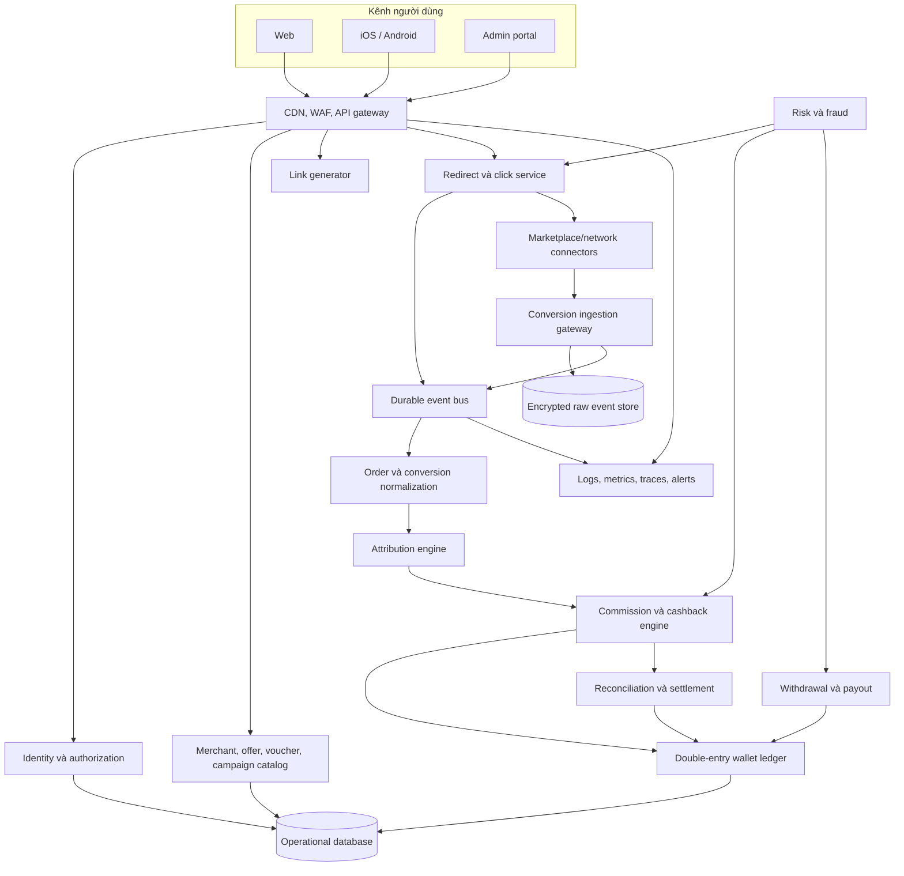
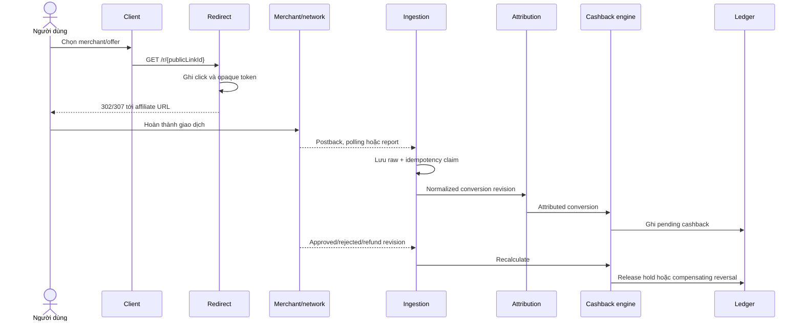
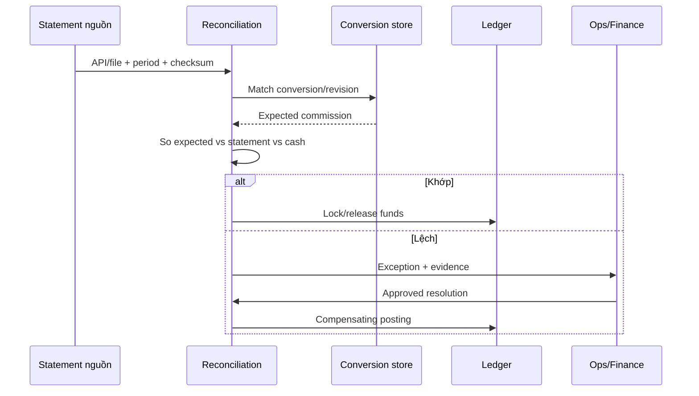
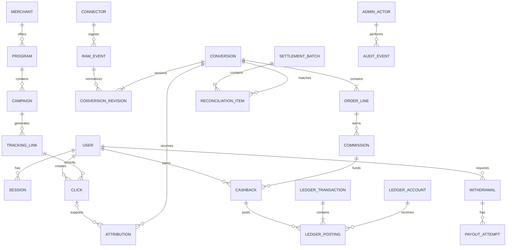
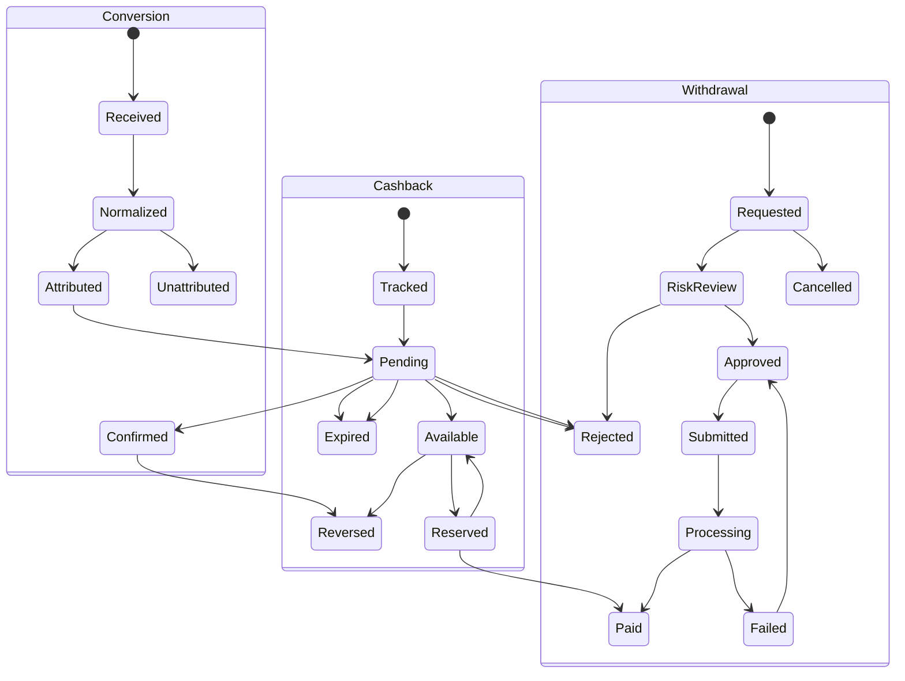

# Hệ Thống Cashback và Affiliate: Nghiên Cứu Kỹ Thuật và Kiến Trúc Tham Chiếu

Ngày xác minh: 2026-07-23

Tài liệu này là bản tiếng Việt của báo cáo nghiên cứu gốc. Các nhãn mức độ bằng chứng được giữ nguyên để dễ đối chiếu:

- `Observed`: Quan sát trực tiếp trong phạm vi truy cập hợp lệ.
- `Officially documented`: Xác nhận từ tài liệu chính thức hiện hành.
- `Inferred`: Suy luận có căn cứ, nhưng chưa được xác minh trực tiếp.
- `Third-party reported`: Nguồn thứ ba, chưa được kiểm chứng độc lập.
- `Unknown`: Chưa đủ bằng chứng.

Lưu ý phạm vi:

- Chỉ dùng các hành vi đọc-bằng-quyền-hợp-lệ.
- Không ghi lại hoặc tái hiện mật khẩu, cookie, token, mã OTP, hoặc dữ liệu cá nhân nhạy cảm.
- Không tạo đơn hàng, rút tiền, đổi cấu hình, hoặc thay đổi dữ liệu.

## 1. Tóm tắt điều hành

Hai hệ thống có hai phong cách rất khác nhau:

- System A trông giống một cổng affiliate/cashback dạng PHP cổ điển, tập trung vào bảng đơn hàng, trạng thái hoa hồng, và một bộ chuyển link nội bộ.
- System B là một nền tảng consumer cashback hiện đại hơn, dựng trên Next.js, có luồng đăng ký/đăng nhập, referral, ví số dư, hỗ trợ merchant, và deep link/app link.

Các điểm nổi bật:

- System A có dữ liệu đơn hàng và trạng thái thanh toán cấp dòng rất rõ, nhưng thiếu hẳn lớp ví/rút tiền tự phục vụ.
- System B có lớp UX và kiểm soát an toàn tốt hơn: đăng nhập xã hội, OTP, reCAPTCHA, quản lý thiết bị, referral, quests, và số dư ví.
- Với các nền tảng affiliate/marketplace hiện nay, khả năng tích hợp thực tế nhất cho một cashback platform thường là mô hình lai:
  - redirect click nhanh trên server riêng,
  - nhận conversion bằng webhook/postback nếu có,
  - polling/report download để đối soát,
  - và CSV/manual reconciliation làm lớp dự phòng.

## 2. Phương pháp, ranh giới an toàn và hạn chế

Mọi kết luận về hai hệ thống đều dựa trên quan sát hợp lệ khi duyệt web và trên tài liệu chính thức công khai của các nền tảng affiliate/marketplace.

Mọi điểm không trực tiếp kiểm chứng đều được gắn nhãn `Inferred` hoặc `Unknown`.

Các API public, API seller, API affiliate publisher, và endpoint nội bộ bị quan sát trong trình duyệt được tách bạch rõ:

- API seller/open platform không được mặc định coi là API conversion affiliate.
- Endpoint nội bộ thấy trong traffic trình duyệt không được trình bày như API public.

## 3. System A — Phân tích chi tiết

### 3.1 Bề mặt sản phẩm và luồng người dùng

Quan sát chính:

- Giao diện là các trang `.php` render phía server.
- Có dashboard hiển thị danh sách đơn, trạng thái đơn, trạng thái thanh toán theo từng dòng.
- Có lọc theo tham số URL và phân trang bằng query string.
- Có form đổi mật khẩu với CSRF token, nhưng không thực hiện gửi.
- Có dấu hiệu liên hệ quản trị để đăng ký/khôi phục, thay vì self-service đầy đủ.

### 3.2 Chuyển link và hành vi client quan sát được

Quan sát chính:

- Có một endpoint JSON nội bộ dùng cho chuyển link.
- Payload quan sát được mang tính mô tả sản phẩm/link đích, thay vì một API affiliate chuẩn hóa rộng.
- Response có vẻ chứa dữ liệu như sản phẩm, giá, hoa hồng, rate, ảnh, và URL cuối.

### 3.3 Cashback và hoa hồng

Quan sát chính:

- Có hiển thị tỷ lệ chia sẻ/hoa hồng trên giao diện.
- Có trạng thái thanh toán theo từng đơn.
- Không thấy một luồng ví/rút tiền tự phục vụ rõ ràng.

Suy luận:

- `Inferred`: Đây có thể là mô hình settlement theo batch, nơi payout được xử lý bên ngoài hoặc ở luồng quản trị riêng.
- `Confidence`: Trung bình.
- `Alternative`: Có thể có ví/payout nội bộ nhưng bị ẩn khỏi vùng quan sát.

### 3.4 Frontend, xác thực và bảo mật

Quan sát chính:

- Mô hình PHP server-rendered.
- Có CSRF trên các form nhạy cảm.
- Có dùng localStorage/sessionStorage cho một số tiện ích giao diện.

### 3.5 Sổ suy luận kiến trúc System A

| Giả thuyết                                                          | Bằng chứng hỗ trợ                              | Mức tin cậy | Phương án thay thế                                        |
| ------------------------------------------------------------------- | ---------------------------------------------- | ----------: | --------------------------------------------------------- |
| `Inferred`: Monolith PHP cho account, order, reporting              | Route `.php`, form và bảng render server       |         Cao | Front controller PHP hoặc nhiều service sau reverse proxy |
| `Inferred`: Lưu trữ quan hệ cho users/orders/commissions            | Bảng lọc được, status ổn định, ngày thanh toán |         Cao | Document DB nhưng bề mặt giống relational projection      |
| `Inferred`: Import conversion theo batch hoặc do operator kích hoạt | Có đơn lịch sử ngoài luồng đặt hàng trong app  |  Trung bình | Postback thời gian thực rồi polling sau                   |
| `Inferred`: Đối soát theo batch                                     | Có paid/unpaid theo đơn, không thấy payout UI  |  Trung bình | Payout ẩn hoặc qua quy trình ngân hàng ngoài hệ thống     |

## 4. System B — Phân tích chi tiết ShopBack Vietnam

### 4.1 Sản phẩm và vòng đời tài khoản

Quan sát chính:

- Nền tảng web hiện đại, dựng bằng Next.js.
- Có đăng ký/đăng nhập, khôi phục mật khẩu, quản lý thiết bị, thay đổi thông tin tài khoản.
- Có reCAPTCHA và OTP trong một số luồng nhạy cảm.
- Có social sign-in.

### 4.2 Discovery, offers, vouchers và quy tắc merchant

Quan sát chính:

- Có catalog merchant/campaign/offer phong phú.
- Có voucher, ưu đãi, và các quy tắc theo merchant.
- Có deep link và app link.

### 4.3 Cashback, ví, referral và payout

Quan sát chính:

- Có số dư tổng/tạm treo/có thể rút/đã rút.
- Có referral, quests, và chương trình khuyến mại.
- Payout bị ràng buộc bởi xác minh kênh liên hệ.

### 4.4 Frontend, tracking và kiểm soát vận hành

Quan sát chính:

- Có redirect route cùng với content tracking opaque.
- Có deep link kiểu `shopback://` và app link.
- Có session metadata được làm cứng từ gateway; không trích xuất giá trị nhạy cảm.

## 5. So sánh tính năng và kỹ thuật

| Khả năng           | System A                                                    | System B                                               |
| ------------------ | ----------------------------------------------------------- | ------------------------------------------------------ |
| Đăng ký            | `Observed`: Hỗ trợ qua admin/contact                        | `Observed`: Consumer registration và social sign-in    |
| Khôi phục          | `Observed`: Qua admin                                       | `Observed`: Self-service, OTP liên quan đổi mật khẩu   |
| Frontend           | `Observed`: PHP render server                               | `Observed`: Next.js                                    |
| Tìm merchant       | `Observed`: Có merchant support, converter tập trung Shopee | `Observed`: Discovery đa merchant/category             |
| Sinh link          | `Observed`: Contract JSON converter nội bộ                  | `Observed`: Redirect routes và app deep links          |
| Dòng chuyển hướng  | `Unknown`                                                   | `Unknown`                                              |
| Hiển thị đơn       | `Observed`: Bảng đơn chi tiết                               | `Observed`: Lịch sử cashback; tài khoản kiểm tra trống |
| Trạng thái         | `Observed`: Order/payment states                            | `Observed`: Pending/available/withdrawn                |
| Cách tính cashback | `Observed`: Quy tắc chia sẻ cố định hiển thị                | `Observed`: Theo merchant/category/rule                |
| Ví                 | `Observed`: Không thấy UI ví                                | `Observed`: Có số dư ví                                |
| Rút tiền           | `Observed`: Không thấy luồng yêu cầu                        | `Observed`: Có luồng payout gắn xác minh               |
| Referral/loyalty   | `Observed`: Leaderboard                                     | `Observed`: Referral, quests, promo                    |
| Missing cashback   | `Unknown`                                                   | `Observed`: Có đường hỗ trợ riêng                      |
| CSRF/security      | `Observed`: CSRF ở form mật khẩu                            | `Observed`: reCAPTCHA, OTP, device controls            |
| Admin/RBAC         | `Unknown`                                                   | `Unknown`                                              |

## 6. Luồng người dùng và cashback đã được ghi nhận

### 6.1 System A

1. Người dùng vào dashboard.
2. Xem danh sách đơn và trạng thái.
3. Dùng công cụ chuyển link để tạo link affiliate nội bộ.
4. Đơn hiển thị trạng thái payment riêng, có thể đối soát theo từng hàng.

### 6.2 System B

1. Người dùng đăng ký hoặc đăng nhập.
2. Duyệt merchant/campaign/voucher.
3. Đi qua redirect tracking.
4. Cashback đi vào pending, sau đó available/withdrawn theo quy tắc.
5. Người dùng có thể truy cập referral, quest, và payout khi đủ điều kiện.

## 7. Quan sát API và tracking đã redacted

| Hệ thống | Quan sát                                                  | Phân loại  |
| -------- | --------------------------------------------------------- | ---------- |
| A        | POST JSON tới endpoint converter nội bộ                   | `Observed` |
| A        | Response có product/price/commission/rate/image/final URL | `Observed` |
| A        | Lọc dashboard qua GET, phân trang qua page query          | `Observed` |
| A        | POST đổi mật khẩu có CSRF và action field                 | `Observed` |
| B        | Route redirect cùng domain với ID opaque                  | `Observed` |
| B        | Tracking param dạng opaque `content_uid`                  | `Observed` |
| B        | Deep link `shopback://` và app links                      | `Observed` |
| B        | Metadata merchant/curation render từ Next.js              | `Observed` |
| Cả hai   | Inventory API private vượt quá quan sát thông thường      | `Unknown`  |

## 8. Shopee: affiliate và Open Platform

### 8.1 Shopee Affiliate Program

Kết luận chính:

- Nền tảng affiliate Shopee có tài liệu chính thức hiện hành.
- Có link generation, manual link, product feed, và tracking `sub_id`.
- Không xác nhận được một endpoint conversion publisher public đầy đủ để dùng như API mở cho mọi publisher.

### 8.2 Shopee Open Platform

Kết luận chính:

- Đây là seller/partner platform, không nên nhầm với affiliate publisher API.
- Dùng để tích hợp bán hàng, shop, logistics, và dữ liệu vận hành.

### 8.3 Kiến trúc tích hợp thực tế

- Dùng affiliate API/portal cho link và reporting của publisher.
- Dùng open platform chỉ cho phần seller/merchant khi thật sự cần.
- Dùng polling + report download để đối soát commission.

### 8.4 Báo cáo conversion của account Việt Nam

`Observed — 2026-07-23`

Ảnh account cung cấp xác nhận trang Báo cáo chuyển đổi có:

- batch dữ liệu ngày trước đó được cập nhật trong cửa sổ 09:00–12:00 ngày hôm
  sau; trường hợp đặc biệt có thể lâu hơn;
- bộ lọc thời gian đặt hàng, trạng thái, Order ID, shop, sản phẩm, loại shop,
  loại sản phẩm, ngành hàng, loại hoa hồng, kênh, loại hình ghi nhận, SubID,
  đối tác chiến dịch và trạng thái người mua;
- nhóm cột chi tiết đơn hàng, cửa hàng, sản phẩm, ưu đãi, giá trị đơn hàng,
  hoa hồng sản phẩm và hoa hồng đơn hàng;
- cấu hình cột và chức năng xuất dữ liệu;
- nút export bị vô hiệu hóa khi report không có row.

Nội dung trang giải thích account-authenticated còn xác nhận:

- Checkout ID ở cấp lượt thanh toán/giỏ hàng, Order ID ở cấp shop/order;
- Promotion ID ở cấp gói giao dịch và Model ID ở cấp biến thể;
- bốn order status: chưa thanh toán, đang chờ xử lý, hoàn thành, đã hủy;
- ba fraud status: chưa xác minh, đã xác minh, gian lận;
- order commission là tổng cấp order, product commission là breakdown cấp sản phẩm;
- net affiliate commission là phần KOL thực nhận sau thỏa thuận MCN;
- SubID là giá trị được truyền qua affiliate link;
- số trên UI được làm tròn hai chữ số, còn export cung cấp giá trị gốc;
- report chỉ truy vấn order theo thời gian mua trong ba tháng gần nhất.

`Officially documented — 2026-07-23`

Shopee công bố report có thời gian đơn, trạng thái, giá trị đơn, commission và nguồn
phát sinh; file export là CSV và mỗi lần chọn tối đa ba tháng gần nhất.

`Unknown`

Chưa có conversion nên chưa xác nhận được header CSV, order-line key, đơn vị tiền,
precision export và cách chuỗi năm SubID xuất hiện trong row thật. Enum trạng thái
và sự tồn tại của trường SubID đã được nâng lên `Observed`. MVP có thể triển khai
importer bằng contract nội bộ và fixture synthetic, nhưng chỉ bật auto-cashback khi
CSV thật chứng minh được SubID/click reference round-trip.

Phân tích schema, idempotency, lỗi của repo extension và acceptance gate nằm tại
[Shopee Affiliate Việt Nam không có App ID/App Secret: chiến lược triển khai](./shopee_affiliate_no_appid_strategy_vi.md).

## 9. Taobao, Tmall, Alimama và hệ sinh thái Trung Quốc

### 9.1 Taobao Alliance / Alimama

Kết luận chính:

- Có bộ API affiliate chính thức cho product, coupon, link, order, refund, và report.
- Thường yêu cầu tài khoản/ứng dụng và điều kiện phê duyệt.
- Cơ chế ký request và ràng buộc thực tế với thị trường Trung Quốc khá chặt.

### 9.2 Alibaba.com, 1688 và AliExpress

Kết luận chính:

- Cần phân biệt rõ affiliate API với seller open platform.
- AliExpress có bằng chứng chính thức về affiliate programs/portals APIs, nhưng không nên coi mọi tài liệu cũ là còn sống.

### 9.3 JD Union, Pinduoduo và các chương trình liên quan

Kết luận chính:

- JD Union có hệ sinh thái affiliate riêng.
- Với Pinduoduo, bằng chứng công khai hiện tại yếu hơn; độ tin cậy thấp hơn.

### 9.4 Ràng buộc cho nền tảng ở Việt Nam

- Rào cản ngôn ngữ, KYC, pháp nhân, và xác minh thị trường có thể khá cao.
- Một số API chỉ thật sự thực dụng khi có đối tác hoặc entity phù hợp ở Trung Quốc.

## 10. Các API marketplace và affiliate lớn khác

### 10.1 Lazada

- Có affiliate program và open platform.
- Cần phân biệt publisher API với seller API.

### 10.2 TikTok Shop

- Có affiliate API và open platform theo tài liệu chính thức.
- Thường yêu cầu phê duyệt và môi trường thử nghiệm riêng.

### 10.3 Amazon

- Product Advertising API hiện tại là API chính cho link/product.
- Không nên kỳ vọng conversion API affiliate public tương tự mạng lưới cashback.

### 10.4 eBay, Rakuten Advertising và Coupang

- Có API public/publisher tuỳ nền tảng.
- Mức mở, quota, và reporting khác nhau đáng kể.

### 10.5 Affiliate networks

- AccessTrade, AdFlex, MasOffer, Ecomobi, Impact, Awin, CJ, Partnerize là các lớp network quan trọng để gom coverage.

## 11. Bảng khả dụng API và yêu cầu truy cập

Xem file CSV kèm theo:

- [Ma trận API](./api_availability_matrix.csv)

File này giữ nguyên 26 cột yêu cầu để tiện đối chiếu kỹ thuật.

## 12. So sánh các cách ingest conversion và attribution

| Cách tiếp cận                       | Độ tươi         | Độ tin cậy / trùng lặp                      | Độ phức tạp                    | MVP                            | High volume                 |
| ----------------------------------- | --------------- | ------------------------------------------- | ------------------------------ | ------------------------------ | --------------------------- |
| Direct marketplace affiliate API    | Từ giây đến giờ | Tốt nếu có click/sub-ID; có revision        | Cao                            | Tốt cho một platform neo       | Rất tốt khi quota đủ        |
| Affiliate network API               | Phút đến ngày   | Chuẩn hoá nhưng có thể mất detail           | Trung bình                     | **Lựa chọn mặc định tốt nhất** | Mạnh với dedupe đa nguồn    |
| Hybrid direct + network             | Tốt nhất có thể | Coverage cao nhất                           | Cao                            | Sau MVP                        | **Tốt nhất cho production** |
| Browser redirect + server ingestion | Gần realtime    | Capture click tốt                           | Trung bình                     | **Thiết yếu**                  | Thiết yếu                   |
| API polling                         | Phụ thuộc quota | Có audit, overlap tạo duplicate có chủ đích | Trung bình                     | Tốt                            | Tốt                         |
| S2S postback                        | Gần realtime    | Tốt nếu có signature/idempotency            | Trung bình                     | Tốt                            | **Rất tốt**                 |
| Webhooks                            | Gần realtime    | Có thể thiếu coverage/order                 | Trung bình                     | Tốt                            | **Rất tốt**                 |
| CSV/report định kỳ                  | Giờ đến ngày    | Tốt cho reconciliation                      | Thấp-trung bình                | **Fallback rất tốt**           | Tốt cho settlement          |
| Manual reconciliation               | Ngày/tuần       | Giải quyết ngoại lệ tốt nhưng chậm          | Thấp về build, cao về vận hành | Chấp nhận được                 | Chỉ cho edge cases          |

## 13. Kiến trúc hệ thống suy luận

### 13.1 System A

- `Inferred`: PHP monolith hoặc kiến trúc gần monolith.
- `Inferred`: Dữ liệu quan hệ cho users/orders/commissions.
- `Inferred`: Import conversion theo batch hoặc operator-driven.
- `Inferred`: Settlement chạy theo đợt.

### 13.2 System B

- `Inferred`: Next.js frontend + backend API/BFF.
- `Inferred`: Tracking/redirect service riêng.
- `Inferred`: Ví và settlement tách khỏi catalog/discovery.
- `Inferred`: Event-driven hoặc job-driven processing cho pending/available/withdrawn.

## 14. Kiến trúc sản phẩm cashback mới đề xuất

### 14.1 Kiến trúc tổng quan

Các khối chính:

- Web/mobile client
- Auth/identity
- Merchant & campaign catalog
- Link generator
- Redirect/click tracking
- Attribution engine
- Conversion ingestion
- Connectors cho marketplace/network
- Webhook/postback receiver
- Polling/report workers
- Normalization
- Commission/cashback calculation
- Double-entry wallet ledger
- Withdrawal/payout
- Reconciliation/settlement
- Fraud detection
- Referral/promotion engine
- Admin portal
- RBAC/audit
- Notification/logging/metrics/tracing

### 14.2 Ranh giới domain

| Domain         | Sở hữu                                            | Không sở hữu           |
| -------------- | ------------------------------------------------- | ---------------------- |
| Identity       | users, credentials, sessions, verification, roles | cashback balances      |
| Catalog        | merchants, programs, campaigns, vouchers          | conversion truth       |
| Tracking       | links, redirects, clicks                          | commission approval    |
| Connectors     | upstream auth/config/cursors/webhooks/files       | business policy        |
| Conversion     | raw events, normalized orders, revisions          | wallet entries         |
| Attribution    | quyết định click-to-conversion                    | upstream commission    |
| Commission     | commission và cashback policy                     | cash custody           |
| Ledger         | postings, holds, balances                         | marketplace polling    |
| Payout         | beneficiary verification, transfer                | source commission calc |
| Reconciliation | statements, adjustments, close periods            | auth                   |
| Promotion      | referrals, bonuses, quests                        | settlement             |
| Risk           | device/velocity/anomaly/review                    | final accounting       |
| Admin/Audit    | RBAC, approvals, immutable logs                   | direct DB mutation     |

### 14.3 Chuỗi click-to-cashback

1. User click link.
2. Redirect service ghi click idempotent.
3. Marketplace nhận attribution.
4. Conversion về qua webhook/postback/polling/report.
5. Normalizer chuẩn hoá order và line items.
6. Attribution engine nối conversion với click.
7. Commission engine tính cashback.
8. Ledger ghi hold/pending/available.
9. Payout tạo withdrawal khi đủ điều kiện.

### 14.4 Chuỗi reconciliation

1. Import report từ network/marketplace.
2. So khớp với bản ghi nội bộ.
3. Tìm lệch do hủy/hoàn tiền/invalid.
4. Ghi adjustment.
5. Đóng kỳ và phát hành settlement.

## 15. Mô hình dữ liệu và state machines

### 15.1 ERD khái niệm

Thực thể cốt lõi:

- user
- identity_verification
- merchant
- campaign
- voucher
- tracking_link
- click
- raw_conversion_event
- normalized_order
- normalized_order_item
- attribution_decision
- commission_record
- cashback_ledger_entry
- wallet_account
- withdrawal_request
- payout_transfer
- reconciliation_statement
- adjustment
- fraud_case
- audit_event

### 15.2 State machines

- Order: `received -> attributed -> pending -> confirmed -> payable -> paid` với nhánh `rejected/cancelled/expired/refunded`.
- Cashback: `pending -> available -> withdrawn` với nhánh `reversed/expired`.
- Withdrawal: `requested -> verified -> processing -> paid -> failed/cancelled`.

## 16. API lõi, event và connector interface

### 16.1 REST APIs lõi

- `POST /auth/login`
- `POST /links`
- `POST /clicks`
- `POST /conversions/ingest`
- `POST /webhooks/{source}`
- `GET /wallet/balance`
- `POST /withdrawals`
- `GET /reconciliation/statements`
- `POST /admin/adjustments`

### 16.2 Event envelope

Mỗi event nên có:

- `event_id`
- `event_type`
- `source`
- `occurred_at`
- `received_at`
- `idempotency_key`
- `correlation_id`
- `payload`
- `signature`

### 16.3 Connector interface

Một connector tối thiểu cần:

- auth/config
- link generation
- click reporting
- conversion ingest
- report polling
- reconciliation export
- retry/idempotency metadata

### 16.4 Idempotency, ordering và dead letters

- Dùng key ổn định theo nguồn + order/transaction id + revision.
- Cho phép xử lý at-least-once.
- Các bản ghi lỗi chuyển vào DLQ để replay an toàn.

## 17. Bảo mật, fraud, reconciliation và observability

### 17.1 Security model

- Auth tách khỏi tracking.
- RBAC rõ ràng cho admin, ops, finance, support.
- Audit log bất biến cho mọi thay đổi tài chính.

### 17.2 Fraud controls

- Device fingerprint nhẹ.
- Velocity check.
- Graph anomaly.
- Duplicate click/conversion detection.
- Review queue cho trường hợp rủi ro.

### 17.3 Observability

- Log có correlation id.
- Metrics theo source/network/merchant/job.
- Tracing cho click-to-conversion path.
- Dashboard theo settlement lag, duplicate rate, payout success, reconciliation gap.

## 18. Lộ trình MVP và chiến lược scale

### MVP

- 1 redirect service.
- 1-2 connector ưu tiên.
- 1 ledger đơn giản double-entry.
- 1 payout flow.
- 1 reconciliation worker.

### Scale

- Tách tracking khỏi admin.
- Chạy connector độc lập.
- Chuẩn hoá event bus.
- Partition theo merchant/source/time.
- Dùng replayable raw events làm nguồn sự thật.

## 19. Nguồn và ngày xác minh

Các nguồn chính gồm:

- tài liệu chính thức Shopee Affiliate/Open Platform
- tài liệu chính thức Taobao/Alimama/TOP
- tài liệu chính thức TikTok Shop Affiliate/Open Platform
- tài liệu chính thức Amazon PA-API/Creators API
- tài liệu chính thức eBay, Rakuten Advertising, Impact, Awin, CJ, Partnerize
- tài liệu/portal chính thức của Lazada, AliExpress, JD Union, Coupang, Temu
- quan sát hợp lệ trên System A và System B

Ngày xác minh của báo cáo này: `2026-07-23`.

## 20. Câu hỏi còn mở

- Có hay không một API publisher conversion public đầy đủ cho từng platform trong từng khu vực.
- Quota/rate limit thay đổi theo partnership level thế nào.
- Điều kiện phê duyệt tại từng thị trường SEA cụ thể.
- Cơ chế commission revision/cancellation chi tiết ở từng network.

## 21. Ghi chú cuối

Nghiên cứu bổ sung và đặc tả có thể triển khai được đặt tại:

- [Blueprint triển khai nền tảng](./cashback_platform_implementation_blueprint_vi.md)
- [Đánh giá kỹ thuật ba repo Shopee Affiliate và đặc tả MVP clone System A](./shopee_affiliate_repo_technical_assessment_vi.md)
- [Chiến lược Shopee Affiliate Việt Nam không có App ID/App Secret](./shopee_affiliate_no_appid_strategy_vi.md)

Blueprint bổ sung:

- hồ sơ connector AccessTrade với endpoint, status mapping, quota và polling;
- phân tích direct TikTok Shop Affiliate so với đi qua network;
- cách dùng Shopee `sub_id` an toàn;
- stack MVP, domain boundary, schema, API, event và connector contract;
- rule engine, double-entry ledger, reconciliation và missing-cashback;
- idempotency, retry, DLQ, security, fraud, observability và SLO;
- roadmap, acceptance criteria, go-live checklist và câu hỏi cần đóng trước
  production.

Kết luận triển khai cập nhật:

- `Proposed`: dùng AccessTrade làm connector đầu tiên, vì bộ Publisher API có
  đủ campaign, link, transaction, order, item, product và voucher cho MVP.
- `Officially documented`: Transaction và Order V2 của AccessTrade giới hạn
  10 request/phút; connector phải dùng cursor, overlap, dedupe và repair job.
- `Officially documented`: TikTok Shop Affiliate API bị tắt mặc định và cần
  manager approval; seller/creator/partner authorization tách riêng.
- `Inferred` với confidence cao: direct TikTok không nên là đường găng của MVP;
  có thể dùng campaign TikTok qua network trong lúc xin quyền direct.
- `Unknown`: public Shopee publisher conversion API dùng được bởi mọi
  cashback publisher vẫn chưa được xác minh; không dùng Shopee seller API để
  thay thế conversion truth.
