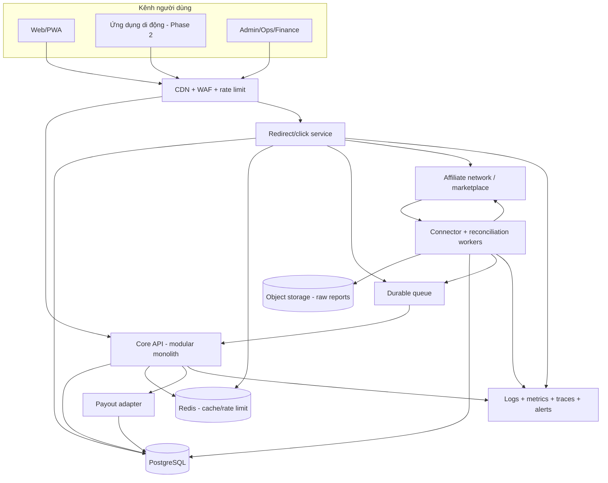
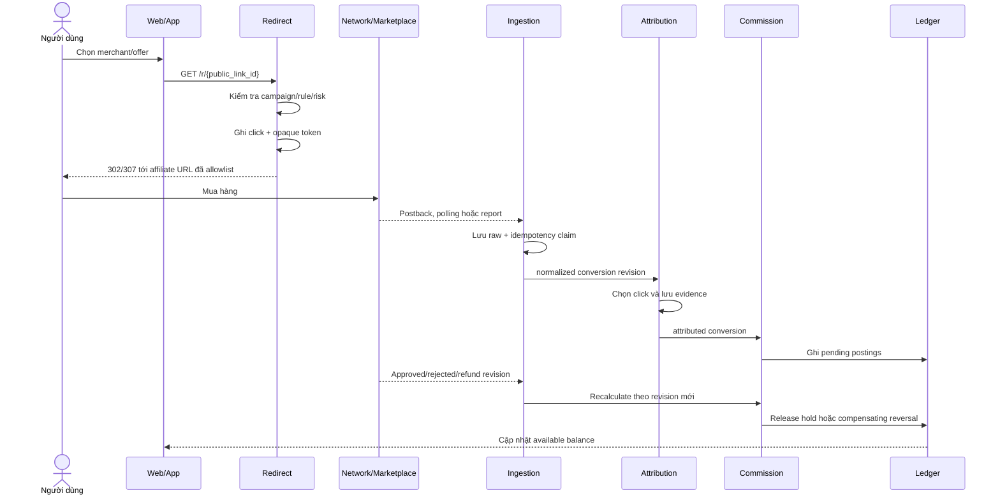
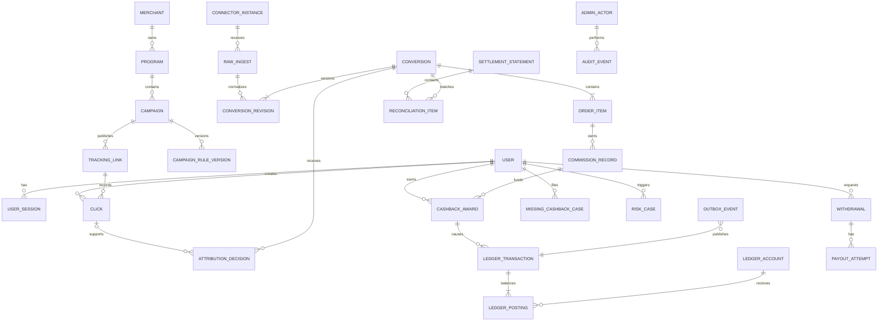
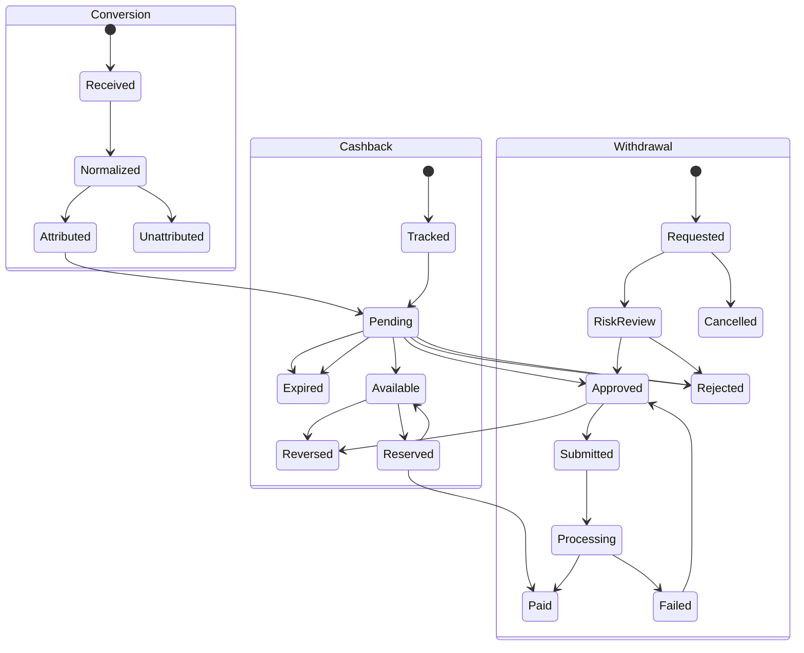
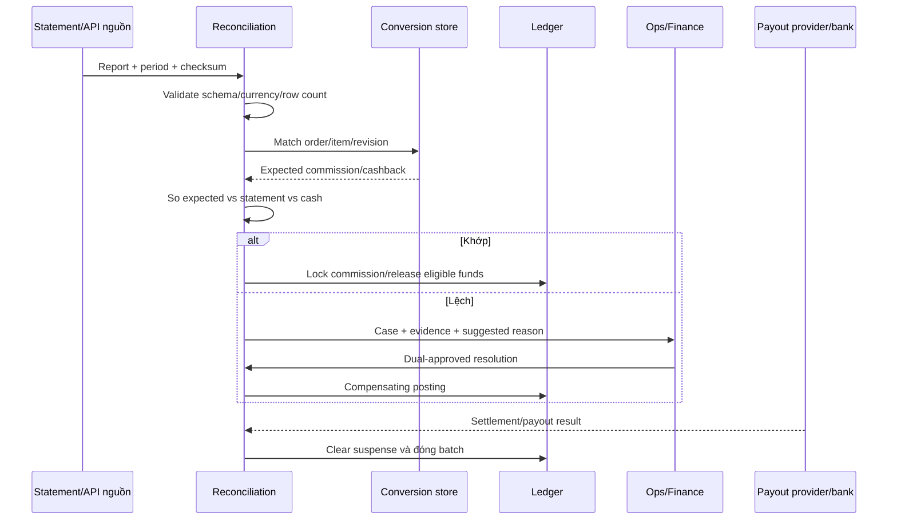

# Blueprint triển khai nền tảng cashback và affiliate tại Việt Nam

Ngày xác minh và thiết kế: `2026-07-23`

Tài liệu này chuyển phần nghiên cứu trong
`cashback_affiliate_research_report_vi.md` thành một đặc tả đủ cụ thể để bắt
đầu thiết kế, ước lượng và triển khai MVP.

## 1. Phạm vi và cách đọc bằng chứng

- `Officially documented`: được xác nhận bằng tài liệu chính thức còn truy
  cập được tại ngày xác minh.
- `Observed`: được quan sát trong phạm vi tài khoản hợp lệ của hai hệ thống
  nghiên cứu; không thực hiện thao tác thay đổi dữ liệu.
- `Inferred`: suy luận từ bằng chứng, luôn kèm mức tin cậy và cách giải thích
  thay thế.
- `Proposed`: quyết định thiết kế cho sản phẩm mới, không phải mô tả một API
  hay hệ thống đang tồn tại.
- `Unknown`: cần tài khoản đối tác, hợp đồng hoặc dữ liệu mẫu để xác minh.

Không có mật khẩu, cookie phiên, khóa API, access token, định danh thanh toán,
định danh đơn hàng đầy đủ hoặc dữ liệu cá nhân nào được đưa vào tài liệu này.

## 2. Kết luận để ra quyết định triển khai

### 2.1 Mô hình nên chọn

`Proposed`: MVP nên dùng mô hình **affiliate-network-first**:

1. Tích hợp AccessTrade làm connector đầu tiên.
2. Tự sở hữu redirect/click service và opaque click ID.
3. Nhận conversion chủ yếu bằng incremental polling.
4. Lưu raw payload bất biến, sau đó chuẩn hóa sang mô hình nội bộ.
5. Dùng báo cáo/CSV làm lớp đối soát và phục hồi.
6. Chỉ thêm direct marketplace connector khi đã có quyền publisher affiliate
   rõ ràng và dữ liệu conversion/commission thật.

Lý do:

- `Officially documented`: AccessTrade có API cho campaign, link, transaction,
  order, order item, datafeed, voucher và tham số `sub1` đến `sub4`.
- `Officially documented`: Shopee có cách tạo affiliate link và `sub_id`,
  nhưng chưa xác minh được public publisher conversion API cho mọi publisher.
- `Officially documented`: TikTok Shop Affiliate API tồn tại, nhưng tắt mặc
  định và cần phê duyệt; seller, creator và partner dùng quyền riêng.
- `Unknown`: LazAffiliates chưa có public publisher conversion API được xác
  minh từ tài liệu công khai hiện tại.

### 2.2 Những gì có thể xây trước khi được cấp API production

`Proposed`:

- Identity, merchant catalog, campaign/rule snapshot.
- Link abstraction và redirect domain.
- Click event, attribution context và consent record.
- Connector simulator và import file mẫu đã ẩn dữ liệu.
- Normalized order/conversion model.
- Rule engine, double-entry ledger và ví pending/available.
- Admin, audit, missing-cashback case, reconciliation và fraud rules.
- Contract test cho connector.

### 2.3 Những gì không thể chứng minh chỉ bằng code

`Unknown` cho đến khi có hợp đồng hoặc tài khoản đối tác:

- Quyền truy cập production và quota thực tế theo tài khoản.
- Trường dữ liệu thật của từng campaign/merchant.
- Độ trễ conversion, lịch duyệt, refund và commission lock.
- Attribution window và quy tắc last-click cụ thể.
- Khả năng truyền sub-ID qua app/deep link ở từng merchant.
- Schema báo cáo settlement và lịch nhận tiền.
- Payout minimum, withholding hoặc adjustment theo hợp đồng.

Đây là các điều kiện đầu vào của Phase 0, không nên để đến cuối dự án mới xác
minh.

## 3. Kiến trúc MVP khuyến nghị

### 3.1 Hình dạng hệ thống

`Proposed`: bắt đầu bằng **modular monolith + worker riêng**, không cần tách
microservice sớm. Redirect có thể triển khai như một service nhỏ độc lập vì
SLO và tải của nó khác phần quản trị.



### 3.2 Stack tham chiếu

`Proposed`, có thể thay bằng stack tương đương:

| Lớp              | Lựa chọn MVP                           | Lý do                                                    |
| ---------------- | -------------------------------------- | -------------------------------------------------------- |
| Web/admin        | Next.js + TypeScript                   | Một codebase, SSR cho catalog, hệ sinh thái tốt          |
| API              | TypeScript + Fastify/NestJS            | Validation, module boundary, OpenAPI                     |
| Database         | PostgreSQL                             | Transaction, unique constraint, ledger và reconciliation |
| Cache/rate limit | Redis                                  | Dữ liệu tạm, không làm nguồn sự thật tài chính           |
| Queue            | Managed queue hoặc RabbitMQ            | Retry, DLQ, tách connector khỏi API                      |
| Raw files        | S3-compatible object storage           | Giữ nguyên report và checksum                            |
| Observability    | OpenTelemetry + metrics/log backend    | Theo dấu click đến ledger                                |
| IaC/CI           | Terraform tương đương + migration gate | Môi trường lặp lại và audit được                         |

Không dùng Redis làm nguồn sự thật cho click, conversion, balance hoặc
withdrawal.

### 3.3 Domain boundaries

| Domain         | Sở hữu dữ liệu                                     | Không được tự làm               |
| -------------- | -------------------------------------------------- | ------------------------------- |
| Identity       | user, session, verification, role                  | cập nhật balance                |
| Catalog        | merchant, program, campaign, voucher, rule version | xác nhận conversion             |
| Tracking       | public link, redirect, click, trip                 | duyệt commission                |
| Connector      | upstream config, cursor, raw payload, report       | tự quyết định cashback          |
| Conversion     | order, item, revision, normalization               | ghi trực tiếp balance           |
| Attribution    | click-to-order decision và evidence                | thay đổi upstream status        |
| Commission     | commission và cashback calculation version         | giữ tiền                        |
| Ledger         | account, balanced postings, balance projection     | gọi marketplace API             |
| Payout         | beneficiary, withdrawal, transfer attempt          | sửa ledger cũ                   |
| Reconciliation | statement, match, discrepancy, close period        | bỏ qua dual approval            |
| Promotion      | referral, bonus, quest                             | trộn bonus với commission nguồn |
| Risk           | signal, rule, score, case, decision                | tự ghi tiền                     |
| Admin/Audit    | command, approval, immutable audit event           | sửa DB ngoài command API        |

## 4. Hồ sơ tích hợp ưu tiên: AccessTrade

### 4.1 Khả năng đã xác minh

| Năng lực                   | Bằng chứng chính thức                                    |
| -------------------------- | -------------------------------------------------------- |
| Xác thực                   | Header `Authorization: Token <giá trị được bảo mật>`     |
| Danh sách campaign         | `GET https://api.accesstrade.vn/v1/campaigns`            |
| Commission chuẩn hóa       | `GET https://api.accesstrade.vn/v1/cashback/campaigns`   |
| Tạo link                   | `POST https://api.accesstrade.vn/v1/product_link/create` |
| Conversion line            | `GET https://api.accesstrade.vn/v1/transactions`         |
| Order tổng hợp             | `GET https://api.accesstrade.vn/v1/order-list`           |
| Sản phẩm của order         | `GET https://api.accesstrade.vn/v1/order-products`       |
| Product feed               | `GET https://api.accesstrade.vn/v1/datafeeds`            |
| Voucher/offer              | Nhóm `GET /v1/offers_informations/...`                   |
| TikTok product feed V2     | `GET /v2/tiktokshop_product_feeds`                       |
| Tạo TikTok product link V2 | `POST /v2/tiktokshop_product_feeds/create_link`          |

Nguồn: [AccessTrade Publisher API](https://developers.accesstrade.vn/).

### 4.2 Mapping dữ liệu

`Officially documented`:

- Transaction status: `0 = pending/hold`, `1 = approved`,
  `2 = rejected`.
- Transaction có các trường thời gian click, sale, update, confirm; giá trị
  giao dịch; commission; merchant; product; conversion và lý do reject.
- Order V2 trả số item pending/approved/rejected và publisher commission.
- Order item trả campaign, click time, billing, commission, quantity và
  reject reason ở cấp sản phẩm.
- Campaign trả `cookie_duration` và mô tả `cookie_policy`.
- Link API nhận `sub1` đến `sub4` cùng các UTM.
- Transaction và Order V2 được tài liệu công bố ở mức 10 request/phút.
- Order V2 có cache một phút và page size tối đa 300.
- Datafeed có page size tối đa 200.

`Proposed` mapping:

| AccessTrade               | Nội bộ                                             |
| ------------------------- | -------------------------------------------------- |
| merchant                  | `merchant.external_key`                            |
| transaction_id/order_id   | `order.source_order_hmac` + encrypted source value |
| conversion_id             | `conversion.source_conversion_key`                 |
| product_id                | `order_item.source_product_key`                    |
| status                    | `conversion_revision.upstream_status`              |
| is_confirmed              | `conversion_revision.reconciliation_confirmed`     |
| commission                | `commission.upstream_amount_minor`                 |
| transaction_value/billing | `order_item.eligible_value_minor` sau normalize    |
| click_time                | `attribution.evidence_clicked_at`                  |
| update_time               | cursor và revision ordering                        |
| reason_reject             | `conversion_revision.reason_code/raw_reason`       |
| sub1..sub4                | opaque tracking dimensions, không chứa PII         |

### 4.3 Chiến lược polling

`Proposed`:

1. Backfill theo lát thời gian nhỏ, lưu checkpoint sau mỗi page.
2. Incremental poll dùng `update_time_start` và `update_time_end` khi endpoint
   hỗ trợ, đồng thời giữ cửa sổ overlap.
3. Dedupe theo stable conversion key; mỗi thay đổi status/commission là một
   revision mới.
4. Chạy rolling repair cho lịch sử gần và daily repair cho khoảng dài hơn.
5. Order V2 dùng làm projection/check, không thay thế transaction line làm
   nguồn revision.
6. Mỗi tháng import report/statement độc lập để đối soát ba chiều.

Lịch khởi điểm:

| Job                     |        Nhịp đề xuất | Ghi chú                           |
| ----------------------- | ------------------: | --------------------------------- |
| Recent transaction poll |              5 phút | Có overlap; giữ dưới quota        |
| Recent repair           |               1 giờ | Quét lại các conversion chưa khóa |
| Long-tail correction    |           Hàng ngày | Bắt late reject/refund            |
| Campaign/rule sync      |          30–60 phút | Version hóa mọi thay đổi          |
| Product/voucher sync    |             1–6 giờ | Theo độ tươi sản phẩm             |
| Reconciliation          | Hàng ngày + theo kỳ | Statement là bằng chứng độc lập   |

Các nhịp trên là `Proposed`, không phải SLA của AccessTrade.

### 4.4 Natural key và revision

`Proposed`:

```text
aggregate_key =
  connector_instance_id + source_conversion_key

revision_fingerprint =
  HMAC(connector_instance_id,
       source_conversion_key,
       upstream_status,
       commission_currency,
       commission_amount_minor,
       eligible_value_minor,
       source_updated_at)
```

Nếu `conversion_id` không ổn định trong dữ liệu production, fallback key phải
được xác nhận bằng sample report trước go-live; không tự ghép mơ hồ mà không có
collision report.

## 5. TikTok Shop: quyết định direct hay qua network

### 5.1 Điều đã xác minh

`Officially documented`:

- Affiliate API bị tắt mặc định và partner/ISV phải xin quyền qua Account
  Manager hoặc Partner Manager.
- Có app Affiliate public/custom và connector custom; review phụ thuộc loại
  app và quy mô authorization.
- Seller, creator và partner có authorization token/scope riêng.
- Request production dùng access token trong header và chữ ký HMAC-SHA256.
- Có API sinh product promotion link.
- Seller và creator affiliate order search trả order/product cho phạm vi đã
  được ủy quyền.
- Seller affiliate order search dùng cursor pagination, page size tối đa 100.
- TikTok có development shop và testing tool.
- Changelog tháng 4/2026 công bố offline export cho Affiliate Seller Compass.

Nguồn:

- [TikTok Shop Affiliate integration](https://partner.tiktokshop.com/docv2/page/affiliate-integration)
- [Search Seller Affiliate Orders](https://partner.tiktokshop.com/docv2/page/search-seller-affiliate-orders)
- [Search Creator Affiliate Orders](https://partner.tiktokshop.com/docv2/page/search-creator-affiliate-orders)
- [API request signing](https://partner.tiktokshop.com/docv2/page/sign-your-api-request)
- [Affiliate Data Compass offline export](https://partner.tiktokshop.com/docv2/page/4brha1mn)

### 5.2 Hệ quả cho cashback

`Inferred`, confidence cao:

- API trực tiếp phù hợp nhất với sản phẩm có vai trò seller/creator/TAP partner,
  không mặc định tương đương một publisher cashback đại chúng.
- Bằng chứng: model scope và authorization xoay quanh seller, creator, partner
  asset; API bị phê duyệt riêng.
- Giải thích thay thế: TikTok có thể cấp quyền/hợp đồng riêng cho cashback
  publisher nhưng tài liệu công khai không chứng minh quyền đó.

`Proposed`: MVP nên lấy TikTok Shop qua AccessTrade nếu campaign được duyệt.
Song song, nộp hồ sơ direct TikTok nếu mô hình kinh doanh thật sự phù hợp với
Affiliate Partner/ISV. Không giữ MVP chờ phê duyệt direct.

## 6. Shopee: cách dùng đúng trong MVP

### 6.1 Điều đã xác minh

`Officially documented`:

- Link affiliate có thể dùng redirect của Shopee với `affiliate_id`.
- `sub_id` được mô tả dưới dạng năm phần.
- Với Product Feed partner, Shopee mô tả cách truyền sub-publisher ID, network
  click ID, referral source và custom value.
- Shopee tự sinh một số tham số tracking ở landing URL.
- Product Feed chỉ dành cho đối tác có quyền tương ứng.

Nguồn:
[Shopee hướng dẫn tạo link Affiliate](https://help.shopee.vn/portal/10/article/172955).

### 6.2 Thiết kế sub-ID

`Proposed`:

- Không đưa email, số điện thoại, user ID tuần tự hoặc order ID vào sub-ID.
- Dùng opaque base62 click token do hệ thống phát hành.
- Lưu mapping click token → user/campaign trong DB mã hóa.
- Chừa dimension cho channel/campaign version nếu giới hạn đối tác cho phép.
- Xác nhận charset, độ dài và cách escape bằng tài liệu/tài khoản partner trước
  production; các giới hạn này hiện là `Unknown`.

### 6.3 Ranh giới quan trọng

`Officially documented`: Shopee Open Platform là seller/partner API.

`Unknown`: một public Shopee publisher conversion endpoint dùng được bởi mọi
publisher cashback.

`Proposed`: nếu đi qua AccessTrade, conversion truth phải lấy từ AccessTrade;
không ghép order từ Shopee seller API để tự kết luận attribution.

## 7. Luồng click đến cashback



### 7.1 Yêu cầu redirect service

`Proposed`:

- Chỉ redirect tới destination đã được campaign/connector allowlist.
- Canonicalize URL và chống open redirect/SSRF.
- Không chờ queue hoặc network để trả redirect.
- Click write phải durable; nếu DB tạm lỗi, dùng durable queue/buffer có giới
  hạn và cảnh báo mất click.
- Tạo `click_id` ngẫu nhiên, không đoán được; public link ID tách khỏi click ID.
- Snapshot campaign/rate/terms ở thời điểm click.
- Trả `Cache-Control: no-store`; không log toàn bộ affiliate URL.
- Phân biệt 302 và 307 bằng test contract; GET redirect thường dùng 302.

### 7.2 Attribution decision

`Proposed`: attribution là một record có version, không phải cột `click_id`
được sửa tùy ý.

Mỗi decision lưu:

- conversion aggregate và revision dùng để quyết định;
- click được chọn;
- merchant/program/campaign;
- rule version;
- source sub-ID hoặc evidence đã được token hóa;
- attribution method;
- confidence;
- alternative candidates;
- decision time và engine version.

Nếu upstream đã trả click/sub-ID hợp lệ, upstream evidence là nguồn chính.
Không dùng probabilistic fingerprint để ghi tiền khi không có bằng chứng đủ
mạnh; chuyển sang missing-cashback/manual review.

## 8. Commission và cashback rule engine

### 8.1 Rule snapshot

`Proposed`: mỗi rule version có:

- merchant/program/campaign/category/customer type;
- thời gian hiệu lực;
- loại rate: percentage/fixed/revenue-share;
- eligible base;
- excluded shipping/tax/fees/category/SKU;
- coupon/payment/customer restrictions;
- per-order/per-user cap;
- upstream commission floor;
- user cashback;
- platform margin;
- rounding mode;
- confirmation/hold policy;
- terms URL và checksum.

Rule đã dùng cho click hoặc conversion không được sửa tại chỗ. Publish version
mới; recalculation phải ghi revision và compensating ledger entries.

### 8.2 Công thức

`Proposed`:

```text
eligible_base =
  item_subtotal
  - excluded_discounts
  - excluded_shipping
  - excluded_tax
  - excluded_fees

estimated_cashback =
  min(
    configured_cap,
    round_down(eligible_base * cashback_rate_ppm / 1_000_000)
  )

final_cashback =
  min(
    estimated_cashback_after_final_order_value,
    upstream_approved_commission - protected_platform_cost
  )
```

Nếu campaign dùng revenue share:

```text
final_cashback =
  round_down(upstream_approved_commission * member_share_ppm / 1_000_000)
```

Không hiển thị “được đảm bảo” khi upstream mới chỉ pending. UI phải chỉ rõ
tracked/estimated/pending/available.

## 9. Mô hình dữ liệu cốt lõi



### 9.1 Các bảng tối thiểu

| Bảng                        | Khóa/constraint quan trọng                          |
| --------------------------- | --------------------------------------------------- |
| `users`                     | opaque UUID; unique normalized identity             |
| `merchant/program/campaign` | unique connector + external key                     |
| `campaign_rule_versions`    | immutable version; non-overlap effective range      |
| `tracking_links`            | unique public ID; destination checksum              |
| `clicks`                    | random click ID; unique source tracking token       |
| `connector_instances`       | secret reference, không chứa secret thô             |
| `poll_cursors`              | connector + stream unique; compare-and-swap version |
| `raw_ingests`               | source + external event/file checksum unique        |
| `conversions`               | connector + source conversion key unique            |
| `conversion_revisions`      | aggregate + revision fingerprint unique             |
| `order_items`               | conversion + source line key unique                 |
| `attribution_decisions`     | aggregate + decision version unique                 |
| `commission_records`        | order item + calculation version unique             |
| `cashback_awards`           | commission + user + version unique                  |
| `ledger_transactions`       | business idempotency key unique                     |
| `ledger_postings`           | transaction; sum debit = sum credit                 |
| `withdrawals`               | user idempotency key unique                         |
| `payout_attempts`           | provider + provider request key unique              |
| `settlement_statements`     | source + period + checksum unique                   |
| `reconciliation_items`      | statement row + match version unique                |
| `audit_events`              | append-only; chained hash tùy mức đảm bảo           |
| `outbox_events`             | aggregate + event version unique                    |

### 9.2 Tiền và thời gian

`Proposed`:

- Tiền lưu bằng `amount_minor BIGINT` + ISO-4217 currency.
- Rate lưu bằng phần triệu (`ppm`) để tránh float.
- Không cộng tiền khác currency nếu chưa có FX conversion record.
- Event time lưu UTC, đồng thời giữ source timezone và source business date.
- Mọi conversion FX lưu provider, timestamp, rate và rounding.
- Source order ID lưu mã hóa; tạo keyed HMAC riêng để lookup/dedupe.

## 10. State machines



State guard:

- Không có `pending -> available` nếu commission chưa approved/locked theo
  policy.
- Không có withdrawal nếu available balance không đủ.
- Reserve balance và tạo withdrawal phải trong cùng DB transaction.
- Một revision cũ đến trễ không được hạ state nếu không phải correction hợp lệ.
- `paid` không bị xóa; late refund tạo compensating entry.

## 11. Double-entry ledger

`Proposed`: tách balance view khỏi ledger. Balance là projection từ postings,
không phải số được cộng/trừ trực tiếp.

Tài khoản khái niệm:

- commission receivable pending/approved;
- cashback liability pending/available;
- platform revenue deferred/earned;
- payout suspense;
- network clearing;
- cash;
- fees/tax;
- platform loss/recovery.

Ví dụ commission 100, cashback thành viên 70, margin nền tảng 30:

```text
Khi ghi nhận pending
  Debit  Commission receivable pending       100
  Credit Cashback liability pending           70
  Credit Platform revenue deferred            30

Khi upstream reject
  Ghi giao dịch đảo đúng 100/70/30; không xóa giao dịch cũ

Khi commission được duyệt và cashback available
  Chuyển các account pending sang approved/available bằng posting cân bằng

Khi người dùng tạo withdrawal
  Debit  Cashback liability available
  Credit Payout suspense

Khi provider trả thành công
  Debit  Payout suspense
  Credit Cash
```

Đây là mô hình kỹ thuật khái niệm; chart of accounts, thuế và cách ghi nhận
doanh thu cần được finance/accounting phê duyệt trước production.

Invariant bắt buộc:

- Tổng debit bằng tổng credit theo currency trong mỗi ledger transaction.
- Unique business event + posting purpose + version.
- Ledger transaction append-only.
- Adjustment luôn tham chiếu giao dịch bị điều chỉnh.
- Không cho phép admin sửa posting bằng SQL/UI.

## 12. API nội bộ

### 12.1 Consumer

```text
POST   /v1/auth/sessions
DELETE /v1/auth/sessions/current
GET    /v1/merchants
GET    /v1/merchants/{merchantId}
GET    /v1/campaigns/{campaignId}
POST   /v1/tracking-links
GET    /r/{publicLinkId}
GET    /v1/cashback-activity
GET    /v1/wallet/balance
POST   /v1/missing-cashback-cases
GET    /v1/missing-cashback-cases/{caseId}
POST   /v1/withdrawals
GET    /v1/withdrawals/{withdrawalId}
```

### 12.2 Connector/admin

```text
POST   /v1/connectors/{connectorId}/sync
POST   /v1/connectors/{connectorId}/webhooks/{topic}
POST   /v1/connectors/{connectorId}/reports
GET    /v1/connectors/{connectorId}/runs
POST   /v1/conversions/{conversionId}/reattribute
POST   /v1/reconciliation/statements
POST   /v1/reconciliation/items/{itemId}/resolve
POST   /v1/admin/campaign-rules/{ruleId}/publish
POST   /v1/admin/ledger-adjustments
POST   /v1/admin/payout-batches/{batchId}/approve
```

Mutation API cần `Idempotency-Key`, request hash, actor/session và audit
context. Tác vụ tiền/rule production cần step-up authentication và dual
approval.

## 13. Event contract

```json
{
  "event_id": "opaque-uuid",
  "event_type": "conversion.status_changed",
  "event_version": 1,
  "aggregate_type": "conversion",
  "aggregate_id": "internal-opaque-id",
  "aggregate_version": 4,
  "source": "connector-name",
  "occurred_at": "2026-07-23T00:00:00Z",
  "received_at": "2026-07-23T00:00:02Z",
  "correlation_id": "opaque-id",
  "causation_id": "opaque-id",
  "idempotency_key": "keyed-digest",
  "data_classification": "confidential",
  "payload": {
    "status": "approved",
    "currency": "VND",
    "amount_minor": 10000
  }
}
```

Không đưa PII thô, access token, source order ID đầy đủ, affiliate URL đầy đủ
hoặc thông tin tài khoản nhận tiền vào event/log.

Các event MVP:

- `click.recorded`
- `conversion.raw_received`
- `conversion.normalized`
- `conversion.attributed`
- `conversion.unattributed`
- `conversion.status_changed`
- `commission.calculated`
- `cashback.pending`
- `cashback.available`
- `cashback.reversed`
- `withdrawal.requested`
- `withdrawal.approved`
- `payout.submitted`
- `payout.succeeded`
- `payout.failed`
- `statement.imported`
- `reconciliation.mismatch_detected`

## 14. Connector interface

```ts
interface AffiliateConnector {
  identity(): {
    connectorType: string;
    market: string;
    capabilities: string[];
  };

  validateConfig(secretRef: string): Promise<void>;

  syncCampaigns(cursor?: Cursor): Promise<Page<ExternalCampaign>>;
  syncProducts?(cursor?: Cursor): Promise<Page<ExternalProduct>>;
  syncVouchers?(cursor?: Cursor): Promise<Page<ExternalVoucher>>;

  createTrackingLink(input: LinkInput): Promise<ExternalTrackingLink>;

  pollConversions(window: TimeWindow, cursor?: Cursor): Promise<Page<RawConversion>>;

  pollOrders?(window: TimeWindow, cursor?: Cursor): Promise<Page<RawOrder>>;

  downloadStatements?(period: StatementPeriod): Promise<StatementArtifact[]>;

  verifyWebhook?(request: RawHttpRequest): Promise<VerifiedWebhook>;
  normalize(raw: RawIngest): Promise<NormalizedRevision[]>;

  classifyError(error: unknown): {
    retryable: boolean;
    authFailure: boolean;
    rateLimited: boolean;
    retryAfterMs?: number;
  };
}
```

Capability phải được phát hiện theo connector/account, không hard-code rằng
mọi platform đều có webhook, product feed hoặc conversion API.

## 15. Idempotency, ordering và retry

### 15.1 Idempotency

`Proposed`:

- Ingress: unique `connector + source event/file checksum + natural row key`.
- Revision: unique `conversion aggregate + revision fingerprint`.
- API: `tenant + actor + route + Idempotency-Key + canonical request hash`.
- Ledger: unique `business event + posting purpose + calculation version`.
- Payout: internal withdrawal ID làm provider idempotency reference nếu provider
  hỗ trợ; nếu không, phải có lookup/reconcile trước retry.
- File: `source + statement period + object checksum`.

Không coi HTTP 200 là bằng chứng duy nhất rằng payout chưa/đã chạy; luôn lưu
provider reference và thực hiện status reconciliation.

### 15.2 Event ordering

- Dùng aggregate version sau normalization.
- Giữ mọi out-of-order revision.
- State reducer tính lại từ tập revision hợp lệ.
- Upstream `updated_at` chỉ là một tín hiệu; dùng received time làm tie-breaker.
- Không dùng global ordering.

### 15.3 Retry/DLQ

- Retry timeout, 429 và 5xx với exponential backoff + jitter.
- Tôn trọng `Retry-After`.
- Không retry mù signature, schema và authorization error.
- Circuit-breaker theo connector/market.
- DLQ giữ payload reference, error class, attempt count và replay authorization.
- Replay idempotent, có audit và không cho operator sửa raw payload.

## 16. Reconciliation



Phân loại mismatch:

- missing internal;
- missing upstream;
- amount mismatch;
- status mismatch;
- currency/FX mismatch;
- duplicate;
- late correction;
- unmatched order item;
- payout provider mismatch;
- statement completeness/checksum failure.

Close period chỉ khi:

- statement đã đủ;
- không có mismatch nghiêm trọng chưa xử lý;
- cash receipt/payout batch đã match;
- ledger cân bằng;
- late-arrival threshold đã qua;
- có actor phê duyệt và audit event.

## 17. Missing cashback

### 17.1 Benchmark chính thức

- `Officially documented`: ShopBack cho biết order thường có thể mất đến 48
  giờ để xuất hiện; claim chỉ mở sau khoảng chờ và yêu cầu order/amount/currency
  cùng bằng chứng. Investigation có thể kéo dài đến 120 ngày.
- `Officially documented`: ShopBack nêu các nguyên nhân mất tracking như không
  bắt đầu từ ShopBack, ad blocker, coupon ngoài hệ thống, click quảng cáo khác,
  sửa URL, hủy/đổi/trả hàng.
- `Officially documented`: TopCashback tách pending, confirmed và payable.
- `Officially documented`: Rakuten tách processing, pending, confirmed và
  ineligible; thời gian xác nhận phụ thuộc merchant và return window.

Nguồn:

- [ShopBack missing cashback](https://support.shopback.com/hc/en-us/articles/38642796895891-How-to-report-missing-Cashback)
- [ShopBack tracking and calculation](https://support.shopback.com/hc/en-us/articles/34640184721683-Cashback-tracking-and-calculation-guide)
- [TopCashback statuses](https://www.topcashback.com/help/cash-back-statuses/)
- [Rakuten cashback status](https://www.rakuten.com/help/article/tracking-your-cash-back-360002117107)

### 17.2 Workflow đề xuất

```text
draft -> submitted -> auto_check -> waiting_for_user
      -> waiting_for_network -> accepted/rejected -> closed
```

Guard:

- Chỉ cho claim nếu có shopping trip/click phù hợp hoặc lý do ngoại lệ rõ.
- Delay claim theo merchant tracking SLA.
- Rate limit theo user/device/merchant.
- Evidence upload quét malware, mã hóa và retention ngắn.
- Không để support agent tự cộng tiền từ case.
- Nếu goodwill credit, dùng adjustment riêng, reason code và approval.
- Liên kết case với upstream ticket và reconciliation item.

## 18. Fraud và abuse controls

### 18.1 Trước click

- Rate limit bot/scraper.
- Reject destination ngoài allowlist.
- Device/account velocity.
- Phát hiện redirect token bị sửa/replay.

### 18.2 Khi conversion về

- Duplicate across direct/network connectors.
- Self-referral và account/device/payment graph.
- Click-to-order time bất thường.
- Conversion rate/average order/commission outlier theo campaign.
- Same order claim từ nhiều user.
- Source/order/customer mismatch nếu upstream cho phép.

### 18.3 Trước payout

- Step-up authentication.
- Beneficiary change cooling period.
- Một payout destination không được gắn hàng loạt account bất thường.
- Available balance và negative adjustment check.
- Sanctions/KYC/AML nếu mô hình và provider yêu cầu; phạm vi pháp lý cần tư vấn
  riêng.
- Dual approval cho batch và manual adjustment.

Risk score không được tự ghi ledger. Nó chỉ hold, route review hoặc yêu cầu
step-up.

## 19. Security model

- OIDC/OAuth cho identity; Argon2id nếu tự giữ password.
- HttpOnly + Secure + SameSite cookie; CSRF cho browser mutation.
- Session rotation sau login/step-up và revoke theo device.
- MFA bắt buộc cho staff; WebAuthn/TOTP ưu tiên.
- Secrets chỉ lưu qua secret manager; DB giữ `secret_ref`.
- Per-connector egress allowlist.
- Webhook signature + timestamp/replay window.
- Field-level encryption cho beneficiary/source identifiers.
- Audit append-only cho auth, rule, adjustment, payout, reconciliation và secret
  access.
- Least privilege cho support, ops, finance, treasury và developer.
- Không actor nào vừa tạo vừa duyệt payout batch.
- Log redaction tại source; structured allowlist tốt hơn blacklist.

## 20. Observability và SLO

### 20.1 Metrics

- Redirect availability, p50/p95/p99, error rate.
- Click durable-write loss.
- Connector request rate, quota, 429/5xx, auth failure.
- Poll lag, page lag, cursor age.
- Raw-to-normalized error và DLQ age.
- Attribution match/unmatch rate.
- Pending age, rejection/reversal rate.
- Expected-vs-approved commission variance.
- Ledger imbalance count, luôn phải bằng 0.
- Withdrawal success, provider latency, stuck suspense.
- Reconciliation mismatch amount/count.

### 20.2 SLO khởi điểm

`Proposed`:

- Redirect availability `99.99%`.
- Redirect p95 `<100 ms`, không tính external hop.
- Webhook durable acceptance p95 `<500 ms`.
- Ledger imbalance `0`.
- Không payout nào không có approval hợp lệ.
- Conversion freshness theo connector được hiển thị công khai trong ops
  dashboard; không đặt một SLA chung khi upstream khác nhau.

### 20.3 Runbook bắt buộc

- connector authorization expired;
- 429/quota exhaustion;
- upstream schema drift;
- polling cursor stuck;
- duplicate spike;
- attribution rate drop;
- ledger invariant failure;
- payout timeout/unknown result;
- settlement mismatch;
- raw report corrupt hoặc thiếu;
- secret rotation;
- replay từ DLQ.

## 21. Product benchmark và feature scope

`Officially documented` từ các help center:

- ShopBack dùng `Pending`, `Confirmed`, `Rejected`, available balance và
  withdrawn amount.
- TopCashback có thêm `Payable`, tách merchant confirmation khỏi thời điểm
  có thể rút.
- Rakuten có `Processing` trước `Pending`, giúp giải thích thời gian merchant
  chưa gửi order.
- Browser extension là kênh activation phổ biến ở Rakuten/TopCashback.
- Missing cashback và exclusion explanation là tính năng cốt lõi, không phải
  ticket hỗ trợ phụ.

`Proposed` cho MVP Việt Nam:

| Nhóm       | MVP                                   | Sau MVP                                   |
| ---------- | ------------------------------------- | ----------------------------------------- |
| Discovery  | merchant, campaign, voucher, search   | personalization/ranking                   |
| Activation | web redirect, click receipt           | browser extension, mobile app             |
| Cashback   | processing/pending/available/rejected | payable tách riêng nếu settlement yêu cầu |
| Wallet     | pending + available + history         | multi-currency                            |
| Withdrawal | một phương thức, batch có kiểm soát   | nhiều provider, instant option            |
| Support    | missing cashback case                 | automated upstream case integration       |
| Growth     | referral cơ bản                       | quest, tier, boosted campaign             |
| Risk       | velocity/device/manual review         | graph/model-assisted review               |

Không nên đưa browser extension vào MVP trừ khi acquisition strategy phụ
thuộc mạnh vào extension; chi phí privacy review, store review và merchant DOM
compatibility khá cao.

## 22. Kế hoạch triển khai

### Phase 0 — data proof và hợp đồng, 2–4 tuần

- Được duyệt ít nhất một network/campaign production.
- Lấy sample transaction/order/item/report đã ẩn dữ liệu.
- Xác minh status, correction, refund, timezone, currency, pagination và quota.
- Chốt sub-ID contract và ký tự/độ dài.
- Chốt payout/settlement schedule.
- Viết connector contract tests trước business UI.

Exit criteria:

- Có thể replay sample từ raw → normalized → commission → balanced ledger.
- Cùng một sample replay 10 lần không tạo thêm posting.
- Một approved rồi rejected revision tạo đúng compensating entries.

### Phase 1 — MVP nội bộ, 6–8 tuần

- Identity, RBAC và audit.
- Merchant/campaign/rule snapshot.
- Redirect/click.
- AccessTrade connector polling.
- Conversion normalization/attribution.
- Cashback calculation và ledger.
- Admin order/case/reconciliation.
- Dashboard vận hành.

Exit criteria:

- E2E synthetic click-to-cashback pass.
- Không secret/PII trong logs.
- Cursor resume sau crash.
- DLQ replay an toàn.
- Ledger invariant test ở mọi transition.

### Phase 2 — closed beta, 4–6 tuần

- Wallet UI, missing cashback, notification.
- Withdrawal qua một provider hoặc controlled bank batch.
- Fraud rules và review queue.
- Daily three-way reconciliation.
- Merchant terms/exclusion UX.
- Load, failover, recovery và security test.

Exit criteria:

- Payout duplicate test pass.
- Unknown provider timeout có reconcile path.
- Finance có thể giải thích từng đồng balance từ ledger đến source evidence.
- Support không cần truy cập dữ liệu nhạy cảm thô.

### Phase 3 — public launch

- SLO/alert/runbook trực chiến.
- Incident owner và escalation với network.
- Direct connector thứ hai chỉ sau khi AccessTrade flow ổn định.
- Mobile deep link, referral và growth experiments.
- Data warehouse/read model tách khỏi OLTP.

## 23. Backlog P0 có acceptance criteria

1. **Campaign sync**
   - Upsert idempotent.
   - Mọi thay đổi rate/terms tạo version.
   - Campaign mất khỏi feed không tự xóa lịch sử.

2. **Tracking link**
   - Destination allowlist.
   - Opaque click token.
   - `sub1..sub4` không có PII.
   - Link generation failure không tạo active public link.

3. **Redirect**
   - Durable click trước redirect hoặc durable fallback.
   - p95 đạt SLO trong load test.
   - Không open redirect/SSRF.

4. **Conversion ingestion**
   - Raw payload checksum.
   - Stable aggregate/revision unique key.
   - Out-of-order test.
   - Schema quarantine.

5. **Attribution**
   - Evidence và engine version.
   - Không match thì `unattributed`, không tự đoán để cộng tiền.

6. **Cashback calculation**
   - Rule snapshot.
   - Integer money/rate.
   - Cap/exclusion/partial refund tests.

7. **Ledger**
   - Balanced transaction.
   - Append-only.
   - Pending/available/reserve/pay/reverse tests.

8. **Withdrawal**
   - Atomic reserve.
   - Idempotent provider request.
   - Unknown-result reconciliation.
   - Dual approval.

9. **Reconciliation**
   - Row-level evidence.
   - Mismatch taxonomy.
   - Compensating adjustment.
   - Period close guard.

10. **Missing cashback**
    - Eligibility window.
    - Evidence security.
    - Upstream case reference.
    - Không direct credit.

## 24. Go-live checklist

- [ ] API access và campaign approval đã có bằng chứng.
- [ ] Production quota và rate-limit behavior đã test.
- [ ] Terms/rate/cookie/attribution snapshot hoạt động.
- [ ] Sub-ID round-trip đã xác minh bằng conversion test được phép.
- [ ] Raw ingest encrypted và replayable.
- [ ] Duplicate, partial refund, full refund và late rejection đã test.
- [ ] Ledger cân bằng qua mọi state transition.
- [ ] Withdrawal timeout/retry không double pay.
- [ ] Daily reconciliation và exception ownership rõ.
- [ ] Secrets không xuất hiện trong source, logs, screenshots hoặc artifacts.
- [ ] RBAC/step-up/dual approval hoạt động.
- [ ] Backup restore và cursor recovery đã diễn tập.
- [ ] Merchant terms, exclusions và estimated timelines hiển thị cho user.
- [ ] Missing cashback SLA và evidence retention đã chốt.
- [ ] Dashboard/alerts/runbooks và escalation contact sẵn sàng.

## 25. Câu hỏi phải đóng trước khi code connector production

1. AccessTrade account được duyệt campaign nào và link API nào?
2. `conversion_id` có ổn định qua correction không?
3. Cửa sổ tối đa của `since/until` và retention API là bao lâu?
4. `update_time` có thay đổi với mọi refund/reject/commission correction không?
5. Order item có stable line ID hay phải dùng composite key?
6. Source timezone và cách hiểu đầu/cuối ngày?
7. Report settlement có row key nào và có checksum không?
8. Commission nào là estimated, approved, locked và paid?
9. Khi partial refund, commission được sửa line hay phát revision riêng?
10. TikTok/Shopee campaign qua AccessTrade truyền sub-ID round-trip thế nào?
11. Payout provider có idempotency key và status lookup không?
12. Chính sách với late reversal sau khi user đã rút tiền là gì?

## 26. Nguồn chính thức bổ sung

Xác minh ngày `2026-07-23`:

- [AccessTrade Publisher API](https://developers.accesstrade.vn/)
- [AccessTrade authentication](https://developers.accesstrade.vn/api-publisher-vietnamese/authentication)
- [AccessTrade tracking link](https://developers.accesstrade.vn/api-publisher-vietnamese/tao-tracking-link)
- [AccessTrade transactions](https://developers.accesstrade.vn/api-publisher-vietnamese/lay-danh-sach-giao-dich)
- [AccessTrade Order V2](https://developers.accesstrade.vn/api-publisher-vietnamese/lay-danh-sach-don-hang-v2)
- [AccessTrade order products](https://developers.accesstrade.vn/api-publisher-vietnamese/lay-thong-tin-san-pham-cua-don-hang)
- [AccessTrade TikTok link V2](https://developers.accesstrade.vn/api-publisher-vietnamese/tich-hop-api-publisher-at-cho-chien-dich-tiktok-shop/version-2-updated-version/create-link-v2)
- [AccessTrade TikTok product feed V2](https://developers.accesstrade.vn/api-publisher-vietnamese/tich-hop-api-publisher-at-cho-chien-dich-tiktok-shop/version-2-updated-version/tiktok-product-search-v2)
- [Shopee affiliate link](https://help.shopee.vn/portal/10/article/172955)
- [TikTok Shop Affiliate integration](https://partner.tiktokshop.com/docv2/page/affiliate-integration)
- [TikTok Shop seller affiliate orders](https://partner.tiktokshop.com/docv2/page/search-seller-affiliate-orders)
- [TikTok Shop creator affiliate orders](https://partner.tiktokshop.com/docv2/page/search-creator-affiliate-orders)
- [TikTok Shop request signing](https://partner.tiktokshop.com/docv2/page/sign-your-api-request)
- [ShopBack cashback guide](https://support.shopback.com/hc/en-us/articles/34640184721683-Cashback-tracking-and-calculation-guide)
- [ShopBack missing cashback](https://support.shopback.com/hc/en-us/articles/38642796895891-How-to-report-missing-Cashback)
- [TopCashback status model](https://www.topcashback.com/help/cash-back-statuses/)
- [Rakuten status model](https://www.rakuten.com/help/article/tracking-your-cash-back-360002117107)
