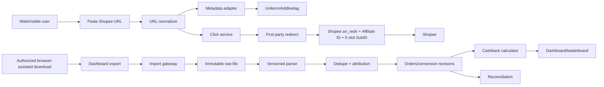
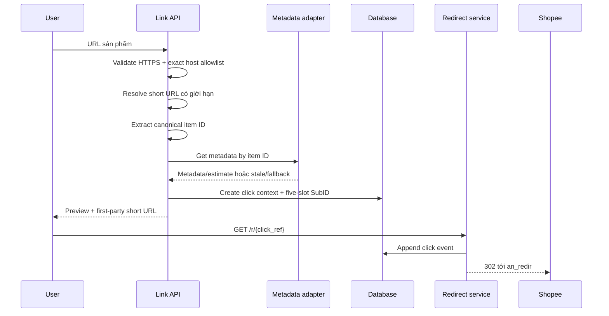

# Shopee Affiliate Việt Nam không có App ID/App Secret: đánh giá nguồn và chiến lược triển khai

**Ngày kiểm chứng:** 2026-07-23  
**Trọng tâm:** MVP cashback Shopee-first tại Việt Nam khi tài khoản không được cấp App ID/App Secret  
**Phạm vi:** Đọc tài liệu công khai, audit mã nguồn public, một request GET bình thường tới API công khai; không dùng cookie Shopee, credential trong repo hoặc endpoint vượt quyền

## 1. Kết luận

Không cần “vượt” chữ ký của Shopee để triển khai MVP.

Hướng tốt nhất là tách ba bài toán:

1. **Tạo và theo dõi link:** tự tạo `an_redir` theo định dạng Shopee công bố, sử dụng Affiliate ID và `sub_id`; không cần App Secret.
2. **Hiển thị sản phẩm/hoa hồng ước tính:** dùng Shopee Product Data API của Addlivetag/Unikorn qua một adapter có cache và fallback; chỉ coi là nguồn metadata/estimate.
3. **Đơn hàng và hoa hồng thực tế:** nhập báo cáo chuyển đổi xuất từ Affiliate Dashboard; ban đầu upload CSV thủ công, sau đó có thể dùng browser profile đã đăng nhập để hỗ trợ tải file định kỳ.

```text
Link trực tiếp + SubID
        +
Product metadata adapter
        +
Dashboard conversion export
        =
MVP cashback không cần App ID/App Secret
```

Không nên:

- giả chữ ký GraphQL;
- dùng App Secret của repo/người khác;
- copy session cookie ra service;
- gọi endpoint dashboard private như API production;
- dùng commission từ Product Data API để ghi nhận số dư phải trả.

## 2. Phân loại bằng chứng

- `Officially documented`: tài liệu Shopee công khai hiện hành.
- `Observed`: trực tiếp đọc mã nguồn hoặc kiểm tra response trong phạm vi công khai.
- `Third-party reported`: tác giả/dịch vụ bên thứ ba công bố.
- `Inferred`: suy luận kỹ thuật từ bằng chứng, kèm độ tin cậy.
- `Unknown`: chưa có đủ dữ liệu.

## 3. Tài liệu tạo link của Shopee Việt Nam

Nguồn:

- [Shopee Việt Nam — Hướng dẫn tạo link Tiếp thị liên kết rút gọn](https://help.shopee.vn/portal/10/article/172955-H%C6%B0%E1%BB%9Bng-d%E1%BA%ABn-t%E1%BA%A1o-link-Ti%E1%BA%BFp-th%E1%BB%8B-li%C3%AAn-k%E1%BA%BFt-r%C3%BAt-g%E1%BB%8Dn)

### 3.1 Điều được xác nhận chính thức

`Officially documented`

Link có thể được dựng theo cấu trúc:

```text
https://s.shopee.vn/an_redir
  ?origin_link=<URL_SHOPEE_DA_ENCODE>
  &affiliate_id=<AFFILIATE_ID_DUOC_CAP>
  &sub_id=<VALUE_1>-<VALUE_2>-<VALUE_3>-<VALUE_4>-<VALUE_5>
```

Shopee mô tả năm vị trí SubID cho đối tác Product Feed theo ý nghĩa:

1. sub-publisher ID;
2. network click ID;
3. referral source;
4. custom value;
5. custom value.

Khi redirect hoàn tất:

- Shopee tự tạo tracking ID nội bộ;
- `sub_id` được chuyển tiếp trong thông tin tracking của URL đích;
- Affiliate ID được thể hiện trong nguồn affiliate của URL đích.

### 3.2 Ý nghĩa đối với MVP

`Inferred — confidence high`

App có thể tự tạo link theo từng user/click mà không gọi GraphQL:

```text
slot 1 = opaque user reference
slot 2 = opaque click reference
slot 3 = source
slot 4 = campaign/rule version
slot 5 = schema version
```

Bằng chứng:

- Shopee công bố trực tiếp định dạng link;
- Shopee cho phép năm thành phần SubID;
- Affiliate ID hiển thị trong phần thiết lập tài khoản Affiliate.

Giải thích thay thế:

- một số loại tài khoản/chiến dịch có thể yêu cầu link được sinh từ dashboard;
- report của một account cụ thể có thể không trả lại đủ năm slot.

Điểm thứ hai phải được xác minh bằng file export thực tế trước khi bật cashback tự động.

### 3.3 Bằng chứng từ giao diện account Việt Nam

`Observed — ảnh và nội dung trang do người dùng cung cấp ngày 2026-07-23 và 2026-07-24`

Modal tạo link tại trang Hoa hồng Xtra thể hiện:

- hai chế độ SubID: **Tiêu chuẩn** và **Nâng cao**;
- chế độ Nâng cao có đúng năm ô `Sub_id1` đến `Sub_id5`;
- ba placeholder đầu minh họa product/category, nguồn đăng và campaign;
- nút “Thêm vào Link” tạo lại link có tracking;
- kết quả là một link rút gọn để sao chép;
- ghi chú UI chỉ cho phép chữ và số: `a-z`, `A-Z`, `0-9`;
- giao diện có thao tác lấy link theo danh sách và lấy link hàng loạt.

Ảnh cũng hiển thị menu Product Feed và Open API, nhưng sự xuất hiện của menu không
chứng minh account đã được cấp App ID/App Secret.

Ràng buộc quan trọng:

```text
Giá trị trong từng slot: [A-Za-z0-9]+
Dấu "-" chỉ là delimiter giữa các slot
```

Do đó, code trong một số repo cho phép `_` hoặc `-` bên trong từng SubID không phù
hợp với ràng buộc UI hiện tại.

## 4. Shopee Open API khi chưa có quyền

Trang được repo dẫn làm nguồn:

- [Shopee Affiliate Open API](https://affiliate.shopee.vn/open_api/list)

### 4.1 Trạng thái quan sát

`Observed`

Khi truy cập không có phiên đăng nhập, URL này hiển thị trang đăng nhập Shopee. Nội dung API không phải tài liệu công khai có thể đọc và kiểm chứng độc lập.

Điều này có nghĩa:

- URL có tồn tại;
- tài liệu/quyền có thể phụ thuộc account;
- không thể dùng nội dung repo làm bằng chứng rằng mọi publisher Việt Nam được cấp API;
- không thể xác nhận public các endpoint, field, quota hoặc entitlement chỉ từ URL này.

### 4.2 Rào cản kỹ thuật

Affiliate GraphQL mẫu trong các repo dùng chữ ký:

```text
SHA256(app_id + timestamp + exact_request_body + app_secret)
```

Không có App Secret thì không thể tạo chữ ký hợp lệ theo cách này. Đây là đặc tính mật mã, không phải lỗi frontend có thể giải quyết bằng đổi header hoặc cookie.

## 5. Audit `bcat95/shopee-aff`

Nguồn:

- [GitHub — bcat95/shopee-aff](https://github.com/bcat95/shopee-aff)

Revision kiểm tra: `f32bb6c`

### 5.1 Thành phần

```text
README.md
product-data-api.md
Code/nodejs/
Code/php/
Postman/
bc-custom-link/
```

Repo không có file license.

### 5.2 Code Node.js/PHP

`Observed`

Hai implementation:

- gửi POST tới Affiliate GraphQL host Việt Nam;
- tạo signature bằng App ID, timestamp, request body và App Secret;
- có query/mutation mẫu cho offer, short link, conversion report và validated report;
- đọc credential từ `.env`;
- không dùng Shopee session cookie.

Kiểm tra cục bộ:

- Node syntax check đạt;
- 3/3 unit test đạt;
- không gọi API Shopee thật;
- PHP runtime không có trong môi trường kiểm tra nên chỉ audit tĩnh.

### 5.3 `bc-custom-link`

`Observed`

Ứng dụng PHP:

- có UI nhập link và tối đa năm SubID;
- tạo một first-party user ID và lưu trong cookie của chính website;
- đưa user ID và timestamp vào hai slot SubID;
- gọi GraphQL để tạo short link;
- log link gốc, tracking link, SubID, user reference, app reference, thời gian và IP vào MySQL.

Cookie trong repo là cookie nhận diện của web demo, không phải cookie Shopee.

Chế độ `demo` không vượt authentication:

- frontend gửi cặp giá trị placeholder;
- backend vẫn phải thay bằng App ID/App Secret thật;
- source public không chứa một credential hợp lệ để dùng.

### 5.4 Phần có thể tái sử dụng

- thiết kế năm SubID;
- mapping first-party user/link;
- GraphQL variables thay vì nối trực tiếp input vào query;
- log link-generation event;
- signature implementation nếu sau này được cấp quyền;
- test chữ ký/payload.

### 5.5 Phần phải viết lại

- validation hostname hiện chỉ kiểm tra chuỗi `shopee.` và có thể nhận nhầm domain;
- tin `X-Forwarded-For` mà không giới hạn trusted proxy;
- CORS wildcard;
- không có CSRF/rate limit/idempotency;
- user reference có thể được gửi từ client và cần được lấy từ authenticated session;
- random ID cũ không đủ mạnh;
- không có conversion importer, ledger hoặc cashback state machine;
- credential có thể đi qua form demo, không phù hợp production.

### 5.6 Độ tin cậy của README

README tự nhận tổng hợp API chính thức, nhưng:

- nguồn chính dẫn tới tài liệu login-protected;
- một số REST endpoint/product claim không tìm thấy trong tài liệu Shopee công khai;
- code chạy thực tế trong repo chỉ minh họa Affiliate GraphQL;
- Product Data API được chính README tách riêng là API không chính thức.

Kết luận:

| Claim                                                | Phân loại         | Confidence |
| ---------------------------------------------------- | ----------------- | ---------: |
| Cách ký GraphQL xuất hiện nhất quán trong code       | Observed          |        Cao |
| App ID/App Secret vẫn bắt buộc cho GraphQL           | Observed          |        Cao |
| Mọi endpoint trong README hiện được Shopee VN hỗ trợ | Unknown           |       Thấp |
| Repo giúp account không có secret gọi GraphQL        | Sai theo mã nguồn |        Cao |
| Mẫu SubID/logging hữu ích cho cashback               | Inferred          |        Cao |

## 6. Audit Shopee Product Data API trên Unikorn/Addlivetag

Nguồn:

- [Unikorn — Shopee Product Data API](https://unikorn.vn/p/shopee-product-data-api)
- [GitHub — tài liệu Product Data API](https://github.com/bcat95/shopee-aff/blob/main/product-data-api.md)

### 6.1 Khả năng được công bố

`Third-party reported`

API nhận:

- `item_id`; hoặc
- URL sản phẩm.

Response được mô tả có:

- tên/ảnh/shop;
- giá;
- số bán và rating;
- product link;
- commission estimate;
- phần seller commission và Shopee commission;
- cờ cap/Xtra;
- price statistics;
- nguồn `api`, `db` hoặc `fallback`.

Tác giả công bố:

- cache;
- fallback khi nguồn upstream lỗi;
- rate limit theo IP;
- nên dùng `item_id` thay short link.

### 6.2 Kiểm tra trực tiếp

`Observed — 2026-07-23`

Một request GET bình thường với item mẫu công khai trả:

- HTTP 200;
- JSON;
- CORS `*`;
- `status=success`;
- `productInfo`;
- `dataSource=db`;
- các nhóm field metadata, commission estimate, cap và price history.

Không thực hiện stress test, enumeration hoặc gọi endpoint ngoài tài liệu.

### 6.3 Giới hạn quan trọng

1. Backend của Product Data API không có trong repo.
2. Không biết upstream thật là:
   - API affiliate có entitlement;
   - API/web endpoint nội bộ;
   - scraping;
   - database được feed từ nguồn khác;
   - hoặc kết hợp nhiều nguồn.
3. Cache được mô tả không nhất quán:
   - phần overview nói khoảng 3 giờ;
   - tài liệu/release cũ nói khoảng 24 giờ.
4. Rate limit do nhà cung cấp tự công bố, không phải Shopee xác nhận.
5. Commission được mô tả là đã qua user rate, cap và thuế của hệ thống tác giả.
6. Không có SLA, versioned contract hoặc backend source để self-host.
7. API không cung cấp conversion truth hoặc order status.

### 6.4 Cách sử dụng đúng

Chỉ dùng làm:

- product enrichment;
- preview UX;
- commission estimate có nhãn “ước tính”;
- cache warmer;
- fallback metadata.

Không dùng làm:

- xác nhận đơn;
- xác nhận attribution;
- nguồn commission phải trả;
- nguồn duyệt cashback;
- reconciliation với Shopee.

### 6.5 Adapter production

```text
ProductMetadataConnector
  input: canonical item_id
  output:
    item_id
    name
    shop_name
    image_url
    observed_price
    estimated_commission
    source
    source_timestamp
    stale
    warning
```

Yêu cầu:

- gọi từ backend, không gọi trực tiếp từ browser;
- chỉ gửi `item_id`, không gửi link chứa user/sub-ID;
- timeout ngắn;
- circuit breaker;
- cache local;
- stale-while-revalidate;
- giới hạn concurrency;
- lưu nguồn và thời điểm quan sát;
- không làm thất bại luồng tạo link nếu metadata lỗi.

## 7. Nguồn đơn hàng không dùng App Secret

### 7.1 Dashboard conversion report

Nguồn chính thức:

- [Shopee — Hướng dẫn sử dụng hệ thống Affiliate](https://help.shopee.vn/portal/10/article/152867-H%C6%B0%E1%BB%9Bng-d%E1%BA%ABn-s%E1%BB%AD-d%E1%BB%A5ng-h%E1%BB%87-th%E1%BB%91ng-Shopee-Affiliate)
- [Shopee — Hướng dẫn thao tác Affiliate Dashboard](https://help.shopee.vn/portal/10/article/122906-H%C6%B0%E1%BB%9Bng%20d%E1%BA%ABn%20thao%20t%C3%A1c%20tr%C3%AAn%20trang%20Affiliate%20Dashboard)
- [Shopee — FAQ Affiliate KOL/KOC](https://help.shopee.vn/portal/4/article/91992)

`Officially documented`

Dashboard có:

- click report;
- conversion report;
- thời gian đơn;
- trạng thái;
- giá trị đơn;
- commission;
- nguồn phát sinh;
- xuất dữ liệu;
- lịch sử thanh toán.

FAQ hiện công bố mỗi lần xuất theo thời gian mua hàng được chọn tối đa ba tháng.

### 7.2 Ba cấp triển khai

#### Cấp 1 — manual CSV upload

Phù hợp nhất cho MVP:

1. Operator xuất conversion report.
2. Upload vào Admin.
3. Hệ thống lưu raw file bất biến.
4. Parser versioned chuẩn hóa row.
5. Dedupe.
6. Map SubID/source về click/user.
7. Tạo conversion revision.
8. Tính cashback dự kiến.

Không cần App ID/App Secret.

#### Cấp 2 — browser-assisted export

Khi MVP ổn định:

- dùng browser profile riêng đã đăng nhập;
- automation chỉ điều khiển UI để chọn kỳ và download report;
- không export/copy cookie;
- không gọi private endpoint trực tiếp;
- session hết hạn thì yêu cầu operator đăng nhập lại;
- file vẫn đi qua cùng pipeline như manual upload.

Không phụ thuộc contract API private và dễ quay về manual fallback.

#### Cấp 3 — approved API

Chỉ thêm khi account được cấp entitlement:

- connector GraphQL riêng;
- secret manager;
- cursor/checkpoint;
- overlapping polling;
- raw response archive;
- repair job.

Không làm đường găng của MVP.

## 8. Kiến trúc được đề xuất



## 9. Luồng tạo link



Redirect nên dùng `302` hoặc `307`, kèm:

```text
Cache-Control: no-store
Referrer-Policy: strict-origin-when-cross-origin
```

Không nên dùng `301` vì browser/CDN có thể cache destination cũ.

## 10. Xử lý shortlink tiêu chuẩn

Một link dạng:

```text
https://s.shopee.vn/<OPAQUE_SHORT_CODE>
```

là shortlink đã được Shopee tạo. Short code không thể được giải mã cục bộ thành
Affiliate ID, SubID hoặc destination URL.

### 10.1 Không nối SubID trực tiếp

Không dùng:

```text
https://s.shopee.vn/<OPAQUE_SHORT_CODE>?sub_id=<VALUE>
```

Không có tài liệu chính thức xác nhận query mới sẽ được Shopee nhập vào tracking
đã mã hóa trong short code. Nó có thể bị bỏ qua, chỉ được chuyển tiếp như query
thông thường, hoặc làm thay đổi hành vi redirect.

### 10.2 Luồng cho link sản phẩm/shop thông thường

Khuyến nghị:

1. nhận URL gốc hoặc resolve shortlink một lần;
2. xác thực mọi redirect vẫn thuộc exact Shopee host allowlist;
3. lấy canonical product/shop URL;
4. bỏ tracking cũ như `utm_*`, `uls_trackid` và các token navigation;
5. tạo một `an_redir` mới bằng Affiliate ID của hệ thống và năm SubID;
6. bọc kết quả bằng first-party short URL.

```text
Shopee short URL
  -> canonical Shopee landing URL
  -> new an_redir(our affiliate ID, our five SubIDs)
  -> first-party /r/{click_ref}
```

Việc resolve shortlink có thể tạo một click kỹ thuật ở upstream. Vì vậy:

- ưu tiên yêu cầu URL gốc;
- chỉ resolve khi người dùng chủ động yêu cầu chuyển link;
- cache mapping short code → canonical URL;
- không resolve lại trên mỗi click của người mua;
- không dùng link thật để health-check.

### 10.3 Luồng cho Hoa hồng Xtra/offer đặc biệt

`Inferred — confidence medium`

Một offer link có thể mang context chiến dịch ngoài canonical product/shop URL.
Nếu chỉ resolve rồi bỏ toàn bộ query, có khả năng mất context đó.

Hai chế độ:

| Loại link                  | Cách xử lý                                                                   |
| -------------------------- | ---------------------------------------------------------------------------- |
| Product/shop thông thường  | Resolve → canonicalize → dựng `an_redir` mới                                 |
| Xtra/brand/exclusive offer | Ưu tiên giao diện Advanced của Shopee để thêm năm SubID và tạo lại shortlink |

Với offer đặc biệt, browser-assisted link factory có thể:

1. operator đăng nhập bằng browser profile;
2. chọn offer;
3. chọn Nâng cao;
4. điền năm giá trị chữ/số;
5. bấm “Thêm vào Link”;
6. lấy shortlink kết quả;
7. lưu mapping với click/campaign context.

Đây là fallback có session, không phải connector API. Không copy cookie ra khỏi
browser và không phụ thuộc endpoint private.

### 10.4 Hai connector riêng

```text
DirectLinkConnector
  dùng cho URL product/shop phổ thông
  scale cao
  không cần session

DashboardLinkFactory
  dùng cho Xtra/brand/exclusive offer
  cần browser profile đã đăng nhập
  throughput thấp hơn
  có manual fallback
```

## 11. Thiết kế SubID

| Slot | Nội dung              | Ví dụ logic             |
| ---- | --------------------- | ----------------------- |
| 1    | User reference        | opaque, không chứa PII  |
| 2    | Click reference       | compact, unique         |
| 3    | Source                | web/app/zalo/community  |
| 4    | Rule/campaign version | xác định tỷ lệ cashback |
| 5    | Schema version        | hỗ trợ migration        |

Yêu cầu:

- từng slot chỉ chứa `[A-Za-z0-9]+`;
- không dùng `_`, `-`, khoảng trắng hoặc Unicode trong slot;
- dấu `-` chỉ được link builder chèn giữa năm slot;
- không email, số điện thoại hoặc username;
- full context lưu server-side;
- ID không tuần tự và khó đoán;
- mỗi click có idempotency key;
- snapshot Affiliate ID và rule version tại thời điểm tạo link.

Thiết kế compact:

```text
Sub_id1 = u<Base62UserRef>
Sub_id2 = c<Base62ClickRef>
Sub_id3 = <SourceCode>
Sub_id4 = r<Base62RuleVersion>
Sub_id5 = v1<Checksum>
```

Năm slot được ghép:

```text
u...-c...-w-r...-v1...
```

Độ dài tối đa của từng slot chưa được tài liệu công khai nêu rõ. Nên dùng ID
compact, đặt internal limit bảo thủ và xác minh round-trip bằng report export.

### 11.1 Link builder mẫu

```ts
const SUB_ID_VALUE = /^[A-Za-z0-9]+$/;

type FiveSubIds = [string, string, string, string, string];

function buildShopeeAffiliateUrl(input: {
  canonicalUrl: string;
  affiliateId: string;
  subIds: FiveSubIds;
}) {
  const destination = new URL(input.canonicalUrl);
  const allowedHosts = new Set(["shopee.vn", "www.shopee.vn"]);

  if (destination.protocol !== "https:") {
    throw new Error("HTTPS_REQUIRED");
  }
  if (!allowedHosts.has(destination.hostname)) {
    throw new Error("UNSUPPORTED_HOST");
  }
  if (!input.subIds.every((value) => SUB_ID_VALUE.test(value))) {
    throw new Error("INVALID_SUB_ID");
  }

  const trackingUrl = new URL("https://s.shopee.vn/an_redir");
  trackingUrl.searchParams.set("origin_link", destination.toString());
  trackingUrl.searchParams.set("affiliate_id", input.affiliateId);
  trackingUrl.searchParams.set("sub_id", input.subIds.join("-"));

  return trackingUrl.toString();
}
```

Affiliate ID phải được lấy từ cấu hình server/account, không nhận từ request của
member.

## 12. Data model tối thiểu

```text
users
  id
  public_ref
  status

affiliate_accounts
  id
  platform
  market
  affiliate_ref_encrypted
  status

clicks
  id
  public_ref
  user_id
  item_id
  source
  campaign_version
  sub_id_compound
  destination_url
  created_at

click_events
  id
  click_id
  occurred_at
  request_fingerprint_hash

product_snapshots
  item_id
  source
  observed_at
  raw_hash
  normalized_metadata
  stale

import_batches
  id
  source
  file_sha256
  parser_version
  imported_at
  status

raw_import_rows
  id
  batch_id
  row_number
  row_hash
  payload_encrypted

conversions
  id
  upstream_business_key_hash
  click_id
  user_id
  current_status
  current_fraud_status

conversion_revisions
  conversion_id
  revision_no
  upstream_status
  upstream_fraud_status
  checkout_ref_hash
  order_ref_hash
  model_ref
  order_value
  actual_commission
  net_affiliate_commission
  observed_at
  source_batch_id

cashback_entries
  conversion_id
  rule_version
  estimated_amount
  approved_amount
  state
```

## 13. Import, dedupe và correction

### 13.1 Idempotency

Batch:

```text
batch_key = SHA256(file_bytes)
```

Row:

```text
row_key = SHA256(
  normalized upstream order/conversion reference
  + line/item reference
  + purchase time
  + current status
  + commission
)
```

Không ghi mã đơn thật vào log.

### 13.2 Correction

Không update đè lịch sử:

```text
UNPAID -> PENDING -> CONFIRMED
    |         |          |
    +---------+----------+-> CANCELLED

FRAUD_UNVERIFIED -> FRAUD_VERIFIED
        |
        +-> FRAUD

Cashback:
TRACKED
  -> PENDING
  -> PAYABLE
  -> PAID

TRACKED/PENDING/PAYABLE
  -> REJECTED or REVERSED
```

Gate `PAYABLE`:

```text
order_status == CONFIRMED
AND fraud_status == VERIFIED
AND commission_source_is_reconciled
AND attribution_is_unique
AND no_active_hold
```

Nếu report không trả fraud status ở row/export, không giả định `VERIFIED`; giữ hold
cho tới khi payment/reconciliation rule khác xác nhận.

Mỗi lần import:

- giữ revision mới;
- recompute current projection;
- nếu commission giảm, tạo adjustment;
- chỉ cho rút khi trạng thái đã khóa theo reconciliation rule.

### 13.3 Overlap

Importer phải đọc chồng ngày để nhận:

- đơn cập nhật muộn;
- hủy/trả hàng;
- commission correction;
- fraud rejection;
- payment reconciliation.

Ví dụ vận hành:

- export hằng ngày cho 7–14 ngày gần nhất;
- export repair theo tháng;
- đối chiếu payment statement riêng.

Khoảng overlap thực tế phải hiệu chỉnh từ dữ liệu account.

## 14. Công thức commission

### Preview

```text
estimated_cashback =
  third_party_estimated_commission
  × published_share_rate
```

Phải hiển thị “ước tính”.

### Khi import conversion

```text
commission_base =
  if MCN-linked and net affiliate commission is present:
    net_affiliate_commission
  else:
    order_commission

pending_cashback =
  commission_base
  × rule_snapshot.share_rate
```

Không tính:

```text
product_commission_total + order_commission
```

vì product commission là breakdown của order commission theo định nghĩa trên trang
giải thích. Phí quản lý MCN cũng không thuộc commission base của KOL.

### Khi reconciliation

```text
approved_cashback =
  reconciled_commission
  × rule_snapshot.share_rate
  - adjustments
```

Chỉ chuyển `approved/payable` khi order confirmed, fraud verified và nguồn
commission đã qua reconciliation. Tiền dùng integer minor units, không dùng float.

## 15. API nội bộ đề xuất

### Link

```text
POST /v1/shopee/links/preview
POST /v1/shopee/links
GET  /r/{click_ref}
```

### Product

```text
GET /v1/shopee/products/{item_ref}
```

### Dashboard

```text
GET /v1/me/orders
GET /v1/me/cashback-summary
GET /v1/leaderboard
```

### Import/admin

```text
POST /v1/admin/imports/shopee
GET  /v1/admin/imports/{batch_id}
POST /v1/admin/imports/{batch_id}/replay
GET  /v1/admin/reconciliation/shopee
```

## 16. Security bắt buộc

### URL resolver

- chỉ `https`;
- exact hostname allowlist;
- resolve DNS và chặn private/link-local/loopback ranges;
- tối đa redirect hop;
- revalidate host/IP sau mỗi redirect;
- giới hạn response size và timeout;
- không forward cookie/auth header;
- không tải arbitrary content khi chỉ cần `Location`.

### Metadata provider

- chỉ gửi canonical item ID;
- không gửi SubID/user ID;
- cache và circuit breaker;
- redact query trong log;
- kiểm tra schema và type;
- coi mọi response là untrusted.

### Import

- kiểm tra content type/size;
- virus scan nếu hỗ trợ file Office;
- parser sandbox/limits;
- mã hóa raw row;
- RBAC operator/admin;
- audit mọi import/replay/manual adjustment;
- không hiển thị mã đơn đầy đủ cho member.

## 17. So sánh lựa chọn

| Phương án                          | Link                         | Metadata    | Conversion      | Độ ổn định       | Phù hợp              |
| ---------------------------------- | ---------------------------- | ----------- | --------------- | ---------------- | -------------------- |
| Giả/reuse App Secret               | Có thể tạm thời              | Có          | Có thể          | Rất thấp         | Không dùng           |
| Copy cookie + gọi private API      | Có                           | Có          | Có thể          | Thấp             | Không làm production |
| Chỉ dùng Unikorn API               | Không giải quyết attribution | Có          | Không           | Trung bình       | Chỉ enrichment       |
| Direct `an_redir` + CSV            | Có                           | Qua adapter | Có, trễ         | Cao cho MVP      | **Khuyến nghị**      |
| Direct `an_redir` + browser export | Có                           | Qua adapter | Có, tự động hơn | Trung bình/cao   | Giai đoạn 2          |
| Approved GraphQL                   | Có                           | Có          | Có              | Cao nếu được cấp | Đích dài hạn         |
| Affiliate network                  | Có                           | Tùy network | Có              | Tùy đối tác      | Fallback/hybrid      |

## 18. Điều kiện quyết định quan trọng nhất

MVP chỉ có thể tự động gắn đơn cho user nếu conversion export trả một trong:

- full `sub_id`;
- từng SubID slot;
- network click ID;
- source chứa mapping duy nhất;
- một reference khác có thể map về click.

`Observed — 2026-07-24`: conversion report có bộ lọc `Sub_id` và trang giải thích
định nghĩa đây là giá trị truyền qua Affiliate Link. Như vậy khả năng report mang
attribution key là **cao**. Điều còn phải kiểm tra bằng CSV/row thật là:

- giá trị có giữ nguyên đủ năm slot hay không;
- export dùng một cột hay nhiều cột;
- có trường hợp SubID rỗng/biến đổi hay không;
- SubID có ổn định qua các revision của cùng order hay không.

Nếu export chỉ có tổng đơn/commission nhưng không có reference theo click/user:

- vẫn làm dashboard tổng;
- vẫn tính commission tổng;
- không thể hoàn tiền tự động chính xác theo user;
- cần network/MCN/approved API hoặc quy trình claim/manual matching.

## 19. Báo cáo chuyển đổi khi account chưa có phát sinh

### 19.1 Những gì đã quan sát được từ account Việt Nam

`Observed — ảnh do người dùng cung cấp ngày 2026-07-23`

Trang trong ảnh là:

```text
/report/conversion_report
```

không phải trang giải thích `/report/explanation`.

Giao diện báo cáo hiển thị mốc cập nhật hằng ngày lúc **09:00 sáng**. Trang giải
thích làm rõ batch dữ liệu ngày trước đó được cập nhật trong cửa sổ từ **09:00 đến
12:00 trưa ngày tiếp theo**; trường hợp đặc biệt có thể lâu hơn.

Các bộ lọc quan sát được:

- bộ lọc Thời gian đặt hàng;
- Trạng thái đơn hàng;
- Order ID;
- Tên Shop;
- Loại Shop;
- Tên sản phẩm;
- Loại sản phẩm;
- Ngành hàng toàn cầu;
- Loại hoa hồng;
- Kênh;
- Loại hình ghi nhận;
- Sub_id;
- Đối tác chiến dịch tiếp thị liên kết;
- Trạng thái người mua;
- tìm kiếm và thiết lập lại;
- cấu hình cột bằng biểu tượng bánh răng;
- nút xuất dữ liệu;
- trạng thái rỗng “Không có dữ liệu”.

Các nhóm cột cấp cao đang hiển thị:

| Nhóm                        | Phân loại                            |
| --------------------------- | ------------------------------------ |
| Chi tiết đơn hàng           | Observed                             |
| Thông tin cửa hàng          | Observed                             |
| Thông tin sản phẩm          | Observed                             |
| Thông tin chiến dịch/ưu đãi | Observed; nhãn thay đổi giữa hai ảnh |
| Giá trị đơn hàng            | Observed                             |
| Hoa hồng sản phẩm           | Observed                             |
| Hoa hồng đơn hàng           | Observed                             |

Nút xuất bị vô hiệu hóa khi không có dữ liệu. Vì vậy chưa thể lấy header CSV thật
chỉ từ account rỗng. Tuy nhiên, việc UI có bộ lọc `Sub_id` và trang giải thích định
nghĩa trường này đã nâng kết luận “SubID tồn tại trong conversion report” từ
`Third-party reported` lên `Observed`.

### 19.2 Từ điển trường trên trang giải thích

`Observed — nội dung trang account-authenticated do người dùng cung cấp ngày 2026-07-24`

| Thuật ngữ Shopee                | Nghĩa quan sát được                                                                              | Hệ quả cho data model                                   |
| ------------------------------- | ------------------------------------------------------------------------------------------------ | ------------------------------------------------------- |
| Thời gian đặt hàng              | Lúc người mua đặt hàng                                                                           | `purchase_time`; không dùng làm khóa                    |
| Checkout ID                     | ID ở cấp lượt thanh toán/giỏ hàng                                                                | Một checkout có thể chứa nhiều shop/order               |
| Order ID                        | ID ở cấp đơn hàng/shop                                                                           | Khóa order, nhưng chưa đủ để phân biệt từng item        |
| Promotion ID                    | ID gói giao dịch gắn vào mặt hàng                                                                | Snapshot campaign/offer ở cấp item                      |
| Model ID                        | ID biến thể mặt hàng                                                                             | Thành phần quan trọng của fallback line key             |
| Giá sản phẩm                    | Giá bán hiển thị trên trang sản phẩm                                                             | Không đồng nhất với giá trị mua thực tế                 |
| Giá trị mua                     | Giá trị sản phẩm người dùng trả; không gồm voucher/discount/cashback và vận chuyển theo mô tả UI | Lưu riêng, không tự cộng phí vận chuyển                 |
| Trạng thái đơn hàng             | Chưa thanh toán, Đang chờ xử lý, Hoàn thành, Đã hủy                                              | Enum chính của conversion                               |
| Trạng thái gian lận             | Chưa xác minh, Đã xác minh, Gian lận                                                             | Gate độc lập trước khi trả cashback                     |
| Thời gian hoàn thành            | Lúc order chuyển sang hoàn thành                                                                 | `completed_at`; khác purchase time                      |
| Hoa hồng tối đa                 | Mức tối đa có thể nhận từ một order                                                              | UI lặp mô tả; tên field/công thức chính xác còn Unknown |
| Loại hoa hồng                   | XTRA, người bán mời, Shopee Comm, chiến dịch MCN                                                 | Không dùng một rate chung cho mọi loại                  |
| Hoa hồng sản phẩm               | Commission Shopee sau cap + commission người bán ở cấp sản phẩm                                  | Dùng cho breakdown item                                 |
| Hoa hồng đơn hàng               | Commission Shopee sau cap + commission người bán cho toàn order                                  | Không cộng lần nữa với tổng product commission          |
| Thông tin MCN được liên kết     | Hợp đồng MCN–KOL và mã thỏa thuận                                                                | Snapshot contract dùng khi giải thích net commission    |
| Hoa hồng ròng tiếp thị liên kết | Phần KOL thực nhận sau tỷ lệ thỏa thuận MCN                                                      | Nguồn ưu tiên cho payable khi có MCN                    |
| Phí quản lý MCN                 | Phần MCN nhận theo tỷ lệ quản lý                                                                 | Không phải cashback base của KOL                        |
| Thời gian click                 | Timestamp click                                                                                  | Hỗ trợ attribution/audit                                |
| Kênh                            | Nguồn truy cập như Facebook, Instagram, website                                                  | Dimension báo cáo, không phải khóa duy nhất             |
| Loại thuộc tính                 | Cùng shop hoặc shop khác so với link được quảng bá                                               | Dimension direct/indirect attribution                   |
| Trạng thái người mua            | New hoặc Existing                                                                                | Dimension chiến dịch; không phải trạng thái order       |
| Sub_id                          | Giá trị truyền qua tham số SubID của affiliate link                                              | Trường ánh xạ click/user quan trọng nhất                |
| Loại sản phẩm                   | Sản phẩm thường hoặc sản phẩm kỹ thuật số                                                        | Có thể cần rule eligibility riêng                       |

Shopee mô tả bốn trạng thái order như sau:

| Raw status      | Diễn giải                                                                         | Trạng thái nội bộ |
| --------------- | --------------------------------------------------------------------------------- | ----------------- |
| Chưa thanh toán | Order đã tạo, chờ thanh toán                                                      | `unpaid`          |
| Đang chờ xử lý  | Đang giao, đã nhận hoặc đang đổi/trả                                              | `pending`         |
| Hoàn thành      | Người mua xác nhận thành công và không đổi/trả                                    | `confirmed`       |
| Đã hủy          | Người bán/người mua hủy, trả hàng/hoàn tiền, invalid hoặc quá hạn chưa thanh toán | `cancelled`       |

Ba trạng thái fraud:

| Raw fraud status   | Trạng thái nội bộ | Xử lý tiền                                            |
| ------------------ | ----------------- | ----------------------------------------------------- |
| Chưa được xác minh | `unverified`      | Không release                                         |
| Đã xác minh        | `verified`        | Có thể release nếu order/commission cũng đủ điều kiện |
| Gian lận           | `fraud`           | Reject/hold và tạo case                               |

### 19.3 Hệ quả trực tiếp cho cashback engine

`Inferred — confidence high`

1. **Checkout không phải order.** Một giỏ thanh toán nhiều shop tạo nhiều Order ID.
   Quan hệ phải là `checkout 1 -> N orders -> N order lines`.
2. **Pending là trạng thái rất rộng.** Nó có thể gồm cả đã nhận và đang đổi/trả,
   nên tuyệt đối không release ví chỉ vì hàng đã giao.
3. **Completed chưa đủ một mình.** Cashback chỉ chuyển payable khi fraud status là
   `verified` hoặc một quy tắc đối soát tương đương đã được xác nhận.
4. **Cancelled là trạng thái kết quả gộp.** Return/refund, invalid và unpaid expiry
   đều có thể cùng đi vào cancelled; không được suy đoán lý do nếu report không trả
   reason code.
5. **Không cộng hai lần commission.** Hoa hồng sản phẩm là breakdown; hoa hồng đơn
   hàng là tổng cấp order. Khi có MCN, hoa hồng ròng affiliate mới phản ánh phần KOL
   thực nhận.
6. **UI không phải nguồn tiền.** UI làm tròn hai chữ số thập phân, trong khi export
   có giá trị gốc. Ledger phải ingest raw export, không scrape số đã làm tròn.
7. **SubID có mặt trong report.** Có thể triển khai auto-attribution theo SubID,
   nhưng vẫn phải chờ row/CSV thật để xác nhận full chuỗi năm slot round-trip.

Bằng chứng:

- định nghĩa trực tiếp trên trang giải thích report;
- bộ lọc `Sub_id` quan sát được trong account;
- định nghĩa Checkout ID và Order ID ở hai cấp khác nhau;
- mô tả riêng order status và fraud status.

Giải thích thay thế:

- CSV có thể dùng tên header hoặc representation khác UI;
- fraud status có thể cập nhật chậm hơn order status;
- account không thuộc MCN có thể để trống toàn bộ field MCN;
- một số product số có state/eligibility khác sản phẩm thường.

### 19.4 Những trường đã được Shopee xác nhận công khai

`Officially documented — kiểm chứng 2026-07-23`

Theo hướng dẫn hệ thống Affiliate, báo cáo chuyển đổi có:

- thời gian đơn hàng phát sinh;
- trạng thái đơn hàng;
- giá trị đơn hàng;
- mức hoa hồng nhận được;
- nguồn phát sinh đơn hàng.

Theo FAQ:

- report có thể xuất thành `.csv`;
- mỗi lần xuất theo thời gian mua hàng chọn tối đa ba tháng gần nhất.

Tài liệu chính thức không công bố:

- tên header CSV chính xác;
- kiểu dữ liệu;
- enum trạng thái đầy đủ;
- khóa order line;
- năm SubID là năm cột riêng hay một chuỗi ghép;
- quy tắc correction/refund trong file;
- timezone của timestamp;
- đơn vị số tiền thô;
- độ ổn định của endpoint nội bộ.

### 19.5 Audit repo tiện ích đọc báo cáo

Nguồn:

- [Nguyen-Anh-Don/Shopee-Commission-Order-Calculator](https://github.com/Nguyen-Anh-Don/Shopee-Commission-Order-Calculator)

`Third-party reported / Observed in public source code — không phải tài liệu Shopee`

Repo không vượt hoặc giải mã cookie. Cách hoạt động là:

1. extension có host permission cho miền Shopee/Affiliate;
2. browser đã được người dùng đăng nhập;
3. service worker gọi các endpoint UI-private cùng origin bằng
   `credentials: "include"`;
4. browser tự đính kèm session cookie;
5. dữ liệu order/click được lưu trong IndexedDB của extension;
6. khi session hết hạn, extension yêu cầu người dùng đăng nhập lại.

Do đó:

- đây là **session reuse trong browser**, không phải bỏ qua xác thực;
- không có App ID/App Secret vẫn đọc được dữ liệu mà chính giao diện account được
  phép đọc;
- endpoint quan sát được là API nội bộ của web app, không phải Affiliate Publisher
  API được Shopee cam kết;
- không nên gọi endpoint này từ backend bằng cách copy cookie;
- có thể học cấu trúc dữ liệu và dùng làm browser-assisted prototype, nhưng phải giữ
  manual CSV fallback.

Public code tham chiếu các nhóm field sau:

| Nhóm        | Field tham chiếu trong repo                                         | Phân loại            |
| ----------- | ------------------------------------------------------------------- | -------------------- |
| Khóa        | order/order number, checkout ID, item/model ID                      | Third-party reported |
| Thời gian   | purchase, click, checkout completion                                | Third-party reported |
| Trạng thái  | order/checkout/Shopee order status                                  | Third-party reported |
| Shop        | shop ID, tên, loại                                                  | Third-party reported |
| Sản phẩm    | tên, giá, số lượng, ba cấp category                                 | Third-party reported |
| Giá trị     | order value, actual value, refunded amount                          | Third-party reported |
| Commission  | platform, seller/Xtra, product, order, net affiliate, MCN           | Third-party reported |
| Attribution | click ID, SubID, nguồn trực tiếp/gián tiếp/nội bộ, referrer/channel | Third-party reported |

Repo ghép/phân tách năm SubID từ trường nội dung tracking hoặc dùng một số field
nguồn/click làm fallback. Đây chỉ là heuristic của tác giả, chưa chứng minh Shopee
cam kết trả năm slot theo cấu trúc đó.

#### Lỗi không được sao chép vào production

1. **Scale tiền theo ngưỡng:** code đoán số lớn thì chia cho một hệ số cố định. Sai
   nếu Shopee thay representation hoặc giá trị nằm hai phía ngưỡng.
2. **Default status quá lạc quan:** một nhánh biến status trống thành “đã hoàn
   thành”. Production phải đưa status không nhận diện vào quarantine.
3. **Dedupe thô:** lưu theo order đầu tiên trong checkout hoặc checkout ID có thể
   ghi đè checkout nhiều order/item.
4. **Giới hạn polling tự đặt:** page size, số trang, chunk ngày và nhịp retry trong
   repo không phải quota chính thức.
5. **Ghép click bằng SubID đầu tiên tìm thấy:** có thể sai nếu SubID bị tái sử dụng
   hoặc click trùng nguồn.
6. **Tuyên bố privacy không khớp hoàn toàn với code:** README nói xử lý cục bộ,
   nhưng cấu hình mặc định có endpoint bên thứ ba cho price tracking và code gửi
   product-offer payload cùng page URL tới server bên thứ ba. Không cài extension
   nguyên bản vào browser vận hành trước khi loại bỏ network egress và audit lại.

### 19.6 Contract nội bộ v0

Không dùng tên dưới đây như tuyên bố về header Shopee. Đây là schema chuẩn hóa do
platform cashback sở hữu:

| Field chuẩn hóa                  |       Bắt buộc ở v0 | Nguồn dự kiến         | Ghi chú                                |
| -------------------------------- | ------------------: | --------------------- | -------------------------------------- |
| `source_system`                  |                  Có | constant              | `shopee_affiliate_vn`                  |
| `source_report_type`             |                  Có | importer              | conversion/click/payment               |
| `source_schema_fingerprint`      |                  Có | header                | hash của header đã normalize           |
| `batch_id`                       |                  Có | importer              | định danh lần nhập                     |
| `raw_row_hash`                   |                  Có | raw row               | idempotency kỹ thuật                   |
| `purchase_time_raw`              |                  Có | report                | giữ nguyên chuỗi nguồn                 |
| `purchase_time_utc`              |        Có sau parse | parser                | timezone phải có cấu hình              |
| `checkout_ref_hmac`              |   Có nếu report trả | Checkout ID           | parent của nhiều order                 |
| `order_ref_hmac`                 |   Có nếu report trả | Order ID              | ID cấp shop/order                      |
| `promotion_ref`                  |               Không | Promotion ID          | campaign/offer snapshot                |
| `model_ref`                      |               Không | Model ID              | biến thể sản phẩm                      |
| `order_status_raw`               |                  Có | report                | không bỏ giá trị lạ                    |
| `order_status_normalized`        |                  Có | state mapper          | `unknown` nếu chưa map                 |
| `fraud_status_raw`               |   Có nếu report trả | report                | không trộn với order status            |
| `fraud_status_normalized`        |   Có nếu report trả | mapper                | `unverified/verified/fraud/unknown`    |
| `line_ref_hmac`                  |               Không | line/item/model       | ưu tiên khóa cấp order line            |
| `shop_ref`                       |               Không | shop ID               | không cần để attribution               |
| `shop_name_snapshot`             |               Không | report                | dữ liệu hiển thị                       |
| `item_ref`                       |               Không | item ID               | dữ liệu hiển thị/đối soát              |
| `item_name_snapshot`             |               Không | report                | dữ liệu hiển thị                       |
| `quantity`                       |               Không | report                | integer                                |
| `currency`                       |                  Có | account/report config | MVP Việt Nam là `VND`                  |
| `order_value_minor`              |                  Có | report                | integer minor unit                     |
| `actual_order_value_minor`       |               Không | report                | sau giảm/refund nếu có                 |
| `refund_value_minor`             |               Không | report                | không suy ra bằng chênh lệch nếu thiếu |
| `product_commission_minor`       |               Không | report                | giữ riêng                              |
| `order_commission_minor`         |               Không | report                | giữ riêng                              |
| `actual_commission_minor`        | Có để tính cashback | report/reconciliation | không lấy từ product preview           |
| `net_affiliate_commission_minor` |               Không | report                | ưu tiên khi có hợp đồng MCN            |
| `mcn_management_fee_minor`       |               Không | report                | không tính vào cashback KOL            |
| `commission_type_raw`            |               Không | report                | XTRA/invite/Shopee/MCN                 |
| `sub_id_raw_ciphertext`          |               Không | report                | mã hóa nếu cần replay                  |
| `sub_id_1` … `sub_id_5`          |      Có để auto-map | report/source         | chỉ ký tự đã validate                  |
| `click_ref`                      |      Có để auto-map | SubID slot 2          | opaque ID của platform                 |
| `user_ref`                       |      Có để auto-map | SubID slot 1          | opaque ID, không phải PII              |
| `channel_raw`                    |               Không | report                | giữ nguyên                             |
| `extra_json_ciphertext`          |                  Có | unknown columns       | forward-compatible                     |
| `observed_at`                    |                  Có | importer              | thời điểm platform nhìn thấy row       |

Ba điều kiện riêng:

- parser có thể ingest report khi thiếu SubID;
- conversion có thể tồn tại ở trạng thái `unattributed`;
- cashback cho user chỉ được tạo khi mapping click/user là duy nhất.

### 19.7 Parser không cần chờ đơn thật

Có thể hoàn thành phần lớn importer bằng fixture tổng hợp, không tạo click hoặc đơn
Shopee giả.

Fixture v0 cần có tối thiểu:

1. một order pending có một item;
2. cùng row được nhập lại y hệt;
3. cùng order line đổi sang completed;
4. cùng order line đổi sang cancelled;
5. checkout có hai order và ba item;
6. refund một phần;
7. SubID đủ năm slot;
8. SubID thiếu slot;
9. status không biết;
10. header mới chưa có trong alias map;
11. số tiền có dấu phân cách theo locale;
12. timestamp không có timezone.
13. completed nhưng fraud chưa xác minh;
14. completed nhưng bị gắn fraud;
15. một checkout chứa hai Order ID ở hai shop;
16. order có MCN fee và net affiliate commission;
17. cùng giá trị nguồn được export chính xác hơn số hiển thị đã làm tròn.

Pipeline:

```text
upload
  -> malware/size/content checks
  -> immutable raw object
  -> encoding + delimiter detection
  -> Unicode NFC/header normalization
  -> schema fingerprint
  -> versioned alias map
  -> typed parse
  -> row validation
  -> quarantine or normalize
  -> HMAC business keys
  -> upsert conversion revision
  -> attribution
  -> cashback projection
  -> reconciliation queue
```

Quy tắc parser:

- hỗ trợ UTF-8 và UTF-8 BOM;
- không chuyển tiền qua `float`;
- giữ `raw_value` trước khi parse;
- không đoán hệ số tiền bằng magnitude;
- không lấy số đã làm tròn từ DOM/UI;
- timezone là config theo connector và giữ raw timestamp;
- header lạ được giữ trong `extra_json`, không tự bỏ;
- status lạ vào `unknown`, không mặc định `completed`;
- row lỗi vào quarantine cùng reason code;
- alias map được version hóa theo schema fingerprint.

### 19.8 Idempotency và khóa nghiệp vụ

Không dùng riêng Order ID.

Ưu tiên:

```text
business_key =
  HMAC(
    source_system
    + affiliate_account_ref
    + order_ref
    + line_ref
  )
```

Fallback khi thiếu line ID:

```text
business_key =
  HMAC(
    source_system
    + affiliate_account_ref
    + order_ref
    + item_ref
    + model_ref
    + quantity
  )
```

Nếu vẫn thiếu:

- giữ row trong `needs_identity_resolution`;
- không gộp chỉ vì cùng checkout;
- không ghi wallet.

`raw_row_hash` chỉ phát hiện row/file lặp y hệt. `business_key` mới dùng để gắn
revision trạng thái/commission của cùng conversion.

### 19.9 Lịch ingest đề xuất

`Inferred — confidence high`

Từ cửa sổ cập nhật công bố 09:00–12:00 ngày hôm sau, lịch MVP:

- import chính sau 12:15 giờ Việt Nam;
- nếu chưa có partition ngày trước đó, retry theo backoff đến cuối ngày;
- mỗi ngày nhập chồng lấn 14 ngày gần nhất;
- backfill định kỳ toàn bộ cửa sổ mà date picker còn cho phép; không giả định cứng
  chính xác 90 ngày vì ví dụ của UI thể hiện giới hạn theo mốc tháng/lịch;
- lưu immutable archive vì dữ liệu quá ba tháng không còn truy vấn được từ report;
- manual import luôn sẵn sàng.

Bằng chứng:

- trang giải thích công bố cửa sổ batch 09:00–12:00 và có thể kéo dài;
- report chỉ cho truy vấn theo thời gian mua trong ba tháng gần nhất;
- trạng thái và commission có thể thay đổi sau lần xuất đầu.

Giải thích thay thế:

- 12:00 không phải SLA tuyệt đối vì Shopee nói trường hợp đặc biệt có thể kéo dài;
- một số correction/refund có thể xuất hiện sau 14 ngày;
- payment/reconciliation report có thể dùng mốc thời gian khác.

Vì vậy connector không được coi lần import đầu là dữ liệu cuối cùng.

### 19.10 Bằng chứng còn thiếu để bật auto-cashback

Ảnh cấu hình cột và trang giải thích đã được cung cấp. Không cần tạo đơn thử. Chờ
conversion tự nhiên đầu tiên và thu:

1. file CSV thật đã redaction hoặc chỉ danh sách header + một row synthetic có cùng
   shape.

Gate:

| Kiểm tra                                            | Nếu đạt                                | Nếu không đạt           |
| --------------------------------------------------- | -------------------------------------- | ----------------------- |
| Report trả full SubID hoặc đủ dữ liệu tách năm slot | auto-map click/user                    | chuyển `unattributed`   |
| Có order-line key ổn định                           | upsert chính xác                       | dùng fallback và review |
| Status enum map rõ                                  | chạy state machine                     | quarantine status lạ    |
| Fraud status đã verified                            | cho phép release khi các gate khác đạt | tiếp tục hold/reject    |
| Commission có đơn vị xác định                       | tính cashback pending                  | dừng tiền, chỉ hiển thị |
| Correction/refund xuất hiện khi overlap             | tự đối soát                            | manual reconciliation   |

CSV thật sẽ xác nhận tên header, kiểu dữ liệu, precision, representation của SubID,
order-line key và correction semantics.

## 20. Kế hoạch PoC

### PoC 1 — link và metadata

- lấy Affiliate ID từ account;
- tạo direct `an_redir` với năm SubID giả lập không chứa PII;
- tạo first-party click record;
- preview metadata qua adapter;
- không tạo đơn thật.

### PoC 2 — schema report

- operator đăng nhập Affiliate Dashboard;
- xuất một report lịch sử có sẵn;
- chỉ kiểm tra tên cột, kiểu dữ liệu và khả năng trả SubID/source;
- không đưa mã đơn/PII vào tài liệu;
- viết parser fixture đã ẩn danh.

### PoC 3 — replay

- upload cùng file hai lần;
- batch thứ hai phải được nhận diện duplicate;
- thay đổi status trong fixture;
- hệ thống phải tạo revision/adjustment, không tạo conversion mới.

### Acceptance criteria

- link service không cần App Secret;
- click/user mapping tồn tại trước redirect;
- metadata lỗi không chặn link;
- report map được conversion về click/user;
- re-import không nhân đôi;
- cancellation làm giảm pending cashback;
- raw import và audit có thể replay.

## 21. Khuyến nghị cuối

Xây MVP theo cấu hình:

```text
Official direct link builder
+ first-party click redirect
+ five-slot SubID
+ Unikorn/Addlivetag metadata adapter
+ manual Shopee report import
+ browser-assisted export sau khi parser ổn định
+ actual commission từ report
```

Đây là con đường ngắn nhất để đạt phần lớn hành vi của System A mà không phụ thuộc App ID/App Secret.

Tách link generation thành:

- `DirectLinkConnector` cho product/shop URL thông thường;
- `DashboardLinkFactory` cho Xtra/brand/exclusive offer cần giữ context của Shopee.

Phần chưa thể chốt chỉ bằng nguồn công khai là schema export thực tế của account Việt Nam, đặc biệt:

- SubID/source columns;
- order/item business keys;
- status values;
- correction/refund fields;
- payment reference.

Việc cần làm tiếp theo không phải tìm cách giả GraphQL signature, mà là lấy **header/schema của một conversion export hợp lệ** và chứng minh SubID round-trip.
