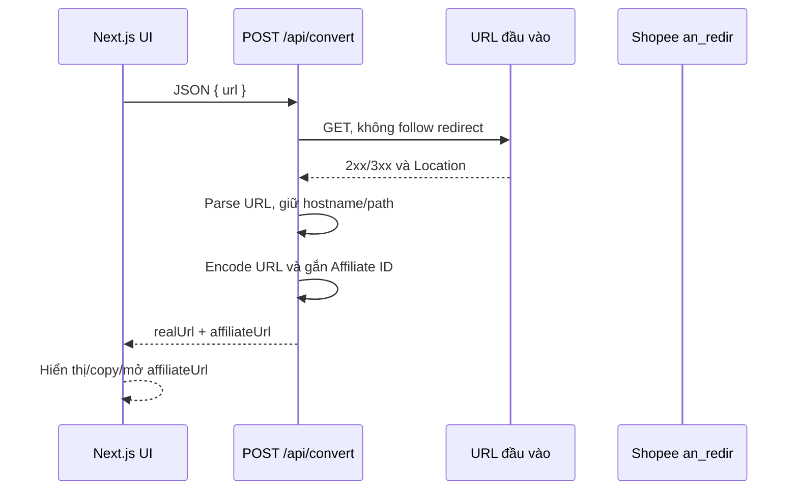
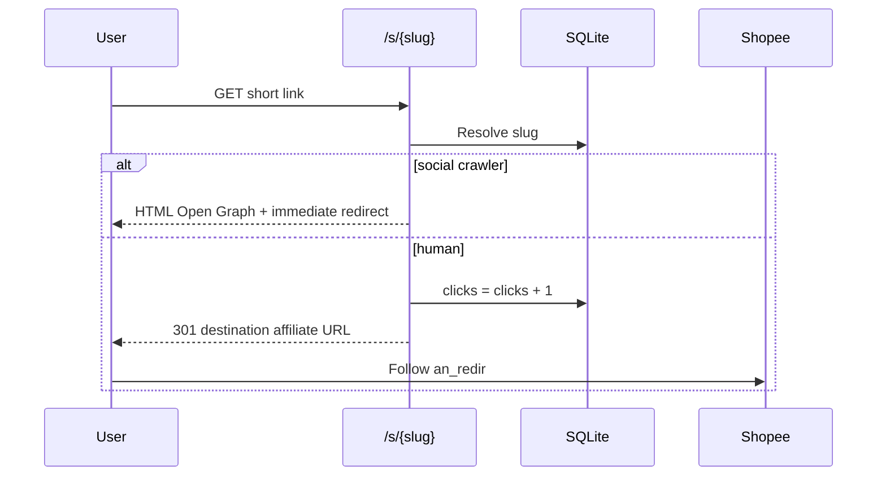
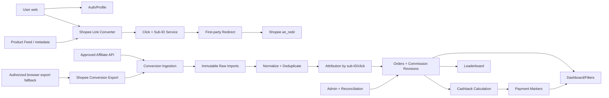
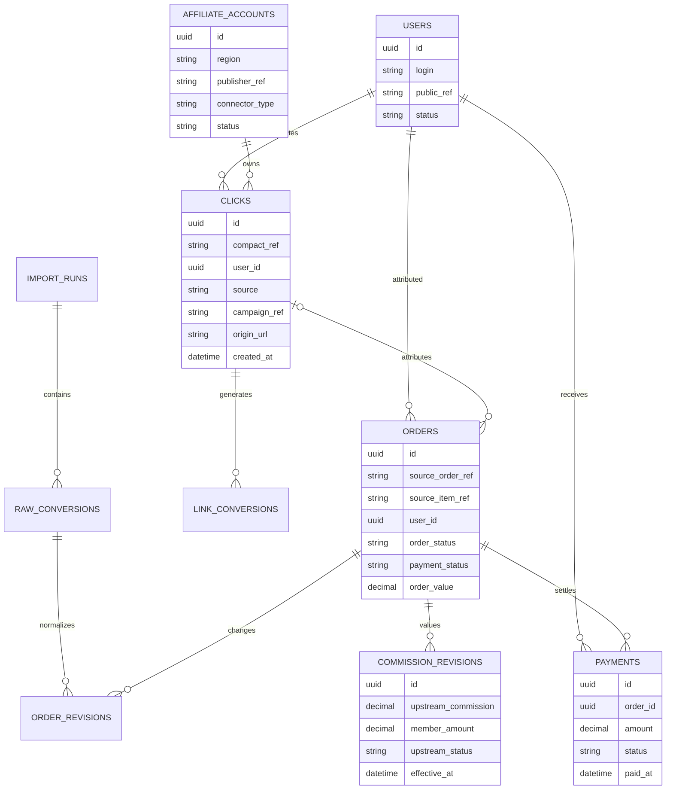

# Đánh giá kỹ thuật các repo Shopee Affiliate và đặc tả MVP clone System A

**Ngày kiểm chứng:** 2026-07-23  
**Trọng tâm:** Shopee Affiliate Việt Nam  
**Mục tiêu:** Đánh giá ba repo công khai, xác định cơ chế tạo link/đọc conversion, đối chiếu với System A và đề xuất MVP có chức năng tương đương  
**Phạm vi an toàn:** Phân tích mã nguồn read-only; không sử dụng credential trong repo; không gọi API private bằng thông tin xác thực; không sao chép cookie; không tạo click, conversion hoặc đơn hàng thật

## 1. Repo và phiên bản đã kiểm tra

| Repo                                                                                      | Revision kiểm tra | Công nghệ                            | Vai trò thực tế                                                 |
| ----------------------------------------------------------------------------------------- | ----------------- | ------------------------------------ | --------------------------------------------------------------- |
| [duykhanhit/affiliate-shopee](https://github.com/duykhanhit/affiliate-shopee)             | `873019b`         | Next.js 16, React 19, TypeScript     | Trang đổi link Shopee rất nhỏ                                   |
| [roywikan/shopee-affiliate-api-bot](https://github.com/roywikan/shopee-affiliate-api-bot) | `143ed0e`         | Python, Requests, MySQL, social APIs | Bot đăng sản phẩm, dùng Shopee Affiliate GraphQL vùng Indonesia |
| [benaasia/affreels](https://github.com/benaasia/affreels)                                 | `4ee1546`         | PHP, SQLite, cURL, JavaScript        | Trích xuất/chuyển đổi/rút gọn link và đếm click                 |

Mức kiểm tra:

| Repo   | Kiểm tra thực hiện                        | Kết quả                                                                                                 |
| ------ | ----------------------------------------- | ------------------------------------------------------------------------------------------------------- |
| Repo 1 | Cài dependency, lint và production build  | Lint đạt; build không đạt do TypeScript coi Affiliate ID fallback có thể là `undefined`                 |
| Repo 2 | Compile tĩnh toàn bộ Python source        | Đạt; không gọi API thật vì không sử dụng credential từ repo                                             |
| Repo 3 | Đọc toàn bộ luồng PHP/JS và schema SQLite | Chỉ kiểm tra tĩnh vì máy kiểm tra không có PHP runtime; remote API đóng cũng không thể kiểm tra độc lập |

Các kiểm tra runtime không gửi request được xác thực đến Shopee, không tạo link/click thật và không thay đổi dữ liệu.

## 2. Kết luận điều hành

1. **Quan sát từ mã nguồn:** Không repo nào “vượt cookie Shopee”. Hai repo tạo link mà không cần cookie; repo Python dùng App ID/secret của chương trình affiliate, không dùng session cookie.
2. **Quan sát từ mã nguồn:** `duykhanhit/affiliate-shopee` chỉ tạo `an_redir` với một Affiliate ID cố định. Bản gốc để `sub_id` rỗng theo cấu trúc năm ô và không có database, user, click, order hoặc commission.
3. **Quan sát từ mã nguồn:** Một số fork của repo thứ nhất bổ sung `subId`, nhưng một fork chỉ dùng giá trị cấu hình cố định; fork khác nhận `body.subId` nhưng giao diện không gửi trường đó. Không fork nào nhập đơn hàng.
4. **Quan sát từ mã nguồn:** `roywikan/shopee-affiliate-api-bot` là repo duy nhất có code đọc conversion. Nó ký request GraphQL bằng App ID/secret và gọi endpoint Affiliate tại Indonesia. Nó không chứng minh API hoặc quyền tương đương tồn tại cho một publisher Việt Nam.
5. **Quan sát từ mã nguồn:** `benaasia/affreels` chỉ theo dõi click trên short domain của chính nó. Nó không theo dõi order/commission. Metadata và giải nén link phụ thuộc một remote API đóng; một endpoint sản phẩm Shopee không được tài liệu public hỗ trợ cũng được dùng làm fallback.
6. **Được tài liệu Shopee xác nhận:** Tạo `an_redir` bằng `origin_link`, `affiliate_id` và tối đa năm thành phần `sub_id` là phương thức được Shopee hướng dẫn. Đây là nền móng phù hợp cho link service.
7. **Chưa xác minh:** Chưa có tài liệu chính thức công khai xác nhận Shopee Vietnam cung cấp publisher conversion GraphQL API giống endpoint Indonesia.
8. **Kết luận:** Ba repo cung cấp các mảnh ghép, không repo nào clone được System A:
   - repo 1: link composer;
   - repo 2: ví dụ connector conversion theo quyền đối tác Indonesia;
   - repo 3: URL expansion, metadata, short link và click counter;
   - phần user attribution, import đơn Việt Nam, chia commission, dashboard, payment và leaderboard vẫn phải tự xây.

## 3. Câu trả lời trực tiếp về cookie

### 3.1 Tạo link không cần cookie

Shopee hướng dẫn định dạng:

```text
https://s.shopee.vn/an_redir
  ?origin_link=<ENCODED_SHOPEE_URL>
  &affiliate_id=<APPROVED_AFFILIATE_ID>
  &sub_id=<PART_1>-<PART_2>-<PART_3>-<PART_4>-<PART_5>
```

Do đó, một link generator đúng phạm vi không cần đăng nhập dashboard cho mỗi lần chuyển đổi.

### 3.2 Lấy đơn không nên dựa vào cookie

Cookie dashboard chỉ chứng minh một browser session đang đăng nhập. Dùng nó làm connector production có các vấn đề:

- hết hạn hoặc bị rotate;
- có thể bị CAPTCHA hoặc step-up authentication;
- ràng buộc thiết bị/IP;
- API nội bộ thay đổi không báo trước;
- khó kiểm soát quyền và audit;
- rủi ro lộ toàn bộ tài khoản;
- không phải data contract được hỗ trợ.

Thứ tự nguồn conversion nên là:

1. API publisher/partner được Shopee phê duyệt;
2. Product Feed và conversion report được cấp cho tài khoản;
3. export báo cáo định kỳ;
4. browser automation trong browser profile đã đăng nhập, chỉ làm fallback;
5. manual upload/reconciliation.

Cookie không được xuất khỏi browser profile hoặc ghi vào database/log.

## 4. Repo 1 — `duykhanhit/affiliate-shopee`

### 4.1 Cấu trúc

Repo chỉ có các thành phần đáng kể:

```text
app/page.tsx
app/api/convert/route.ts
lib/site-config.ts
```

Không có:

- database;
- ORM;
- authentication;
- session;
- users;
- order importer;
- conversion report;
- commission;
- scheduler;
- webhook;
- admin;
- tests.

### 4.2 Luồng chuyển đổi link



Định dạng kết quả:

```text
an_redir
  + encoded origin URL
  + Affiliate ID từ environment/fallback
  + sub_id=-----
```

### 4.3 Repo có theo dõi đơn không?

**Không.**

`affiliate_id` giúp Shopee ghi nhận conversion về tài khoản publisher nếu link và đơn hợp lệ. Tuy nhiên:

- không có click ID;
- không có user reference;
- `sub_id` không mang định danh;
- không lưu click;
- không có conversion ingestion;
- không có order table.

Repo chỉ tạo link dùng chung cho một tài khoản affiliate.

### 4.4 Các fork đáng chú ý

#### Fork nhận `subId`

- Route nhận `body.subId`.
- Lọc còn chữ, số, `_` và `-`.
- Cắt chuỗi theo giới hạn do tác giả tự đặt.
- Frontend gốc không gửi `subId`, nên tính năng không hoạt động qua UI nếu không sửa client.

#### Fork dùng `SUBID` cấu hình

- Thêm một `SUBID` cố định vào cấu hình.
- Mọi người dùng dùng chung giá trị.
- Không giải quyết attribution theo user/click.

Không fork nào có order ingestion.

### 4.5 Lỗi và rủi ro

| Vấn đề                   | Bằng chứng                                                       | Tác động                                            |
| ------------------------ | ---------------------------------------------------------------- | --------------------------------------------------- |
| Build hiện tại thất bại  | TypeScript xác định fallback Affiliate ID có thể `undefined`     | Không deploy sạch từ revision hiện tại              |
| Dependency findings      | `npm audit` báo nhiều finding, gồm mức high/critical             | Phải nâng và audit lại trước khi dùng               |
| SSRF                     | Server GET URL trước khi xác thực domain                         | Có thể yêu cầu server truy cập địa chỉ ngoài ý muốn |
| Host validation yếu      | Dùng `hostname.includes("shopee.vn")`                            | Domain chứa chuỗi đó vẫn có thể qua kiểm tra        |
| Redirect resolution mỏng | Chỉ đọc một `Location`, không xử lý relative/multi-hop chắc chắn | Short link có thể lỗi                               |
| Mất query                | Canonical URL chỉ giữ pathname                                   | Có thể làm mất variant/deep-link/context cần thiết  |
| Hard-coded fallback      | Có giá trị publisher fallback trong source                       | Dễ ghi commission nhầm tài khoản                    |
| Không rate limit         | Public POST route không có quota                                 | Có thể bị abuse làm outbound request                |
| Không idempotency/audit  | Không lưu conversion request                                     | Không điều tra được tranh chấp                      |

### 4.6 Giá trị có thể tái sử dụng

- UI dán/xóa/copy link;
- API route cơ bản;
- ý tưởng chuẩn hóa link;
- định dạng `an_redir`.

Không nên tái sử dụng nguyên trạng phần URL resolver hoặc configuration.

## 5. Repo 2 — `roywikan/shopee-affiliate-api-bot`

### 5.1 Bản chất

Đây là bot affiliate/social automation viết năm 2023, trọng tâm Indonesia. Nó:

- đọc account/app configuration từ MySQL;
- lấy sản phẩm/nội dung;
- tạo short link Shopee;
- đăng lên Twitter, Facebook, Telegram và Pinterest;
- chạy tác vụ theo lịch;
- đọc conversion report để tính tổng số conversion và commission ước tính.

Đây không phải web cashback.

### 5.2 Xác thực Affiliate GraphQL

Class `ShopeeAffiliate` nhận:

```text
App ID
App secret
```

Nó tạo chữ ký:

```text
SHA256(
  app_id
  + unix_timestamp
  + JSON request body
  + app_secret
)
```

Sau đó gửi request đến Affiliate GraphQL host vùng Indonesia với header authorization chứa credential ID, signature và timestamp.

**Quan sát:** Đây là app credential authentication, không phải cookie authentication.

### 5.3 Tạo short link

Mutation được code sử dụng có dạng:

```graphql
mutation {
  generateShortLink(
    input: { originUrl: "<origin>", subIds: ["<social-source>", "<account-ref>"] }
  ) {
    shortLink
  }
}
```

Điểm tốt:

- có sub-ID theo nguồn và account;
- link do upstream tạo;
- không phải tự ghép affiliate ID ở client.

Điểm chưa đủ:

- không có click ID riêng cho mỗi lần click;
- không ánh xạ user cashback;
- không lưu link-generation event có cấu trúc;
- API và entitlement là vùng/tài khoản cụ thể.

### 5.4 Conversion report

Query sử dụng:

```graphql
conversionReport(
  purchaseTimeStart: <timestamp>
  purchaseTimeEnd: <timestamp>
  scrollId: "<cursor>"
  limit: 500
  orderStatus: <status>
)
```

Các field được code đọc/yêu cầu:

- estimated total commission;
- gross commission;
- capped commission;
- brand commission;
- checkout ID;
- purchase time;
- page cursor;
- has-next-page.

Pagination dùng `scrollId`. Wrapper `report()` cộng:

- số conversion;
- tổng commission ước tính.

### 5.5 Có dùng được cho Việt Nam không?

**Chưa thể kết luận.**

- Endpoint thuộc vùng Indonesia.
- Repo không kèm tài liệu entitlement.
- Shopee Vietnam chưa được xác minh có publisher GraphQL API công khai tương đương.
- Một tài liệu tích hợp của Affise năm 2026 mô tả endpoint Indonesia và yêu cầu App ID/secret lấy từ tài khoản Shopee, đồng thời nói tài liệu affiliate không công khai.

Phân loại:

| Claim                                          | Phân loại            |    Tin cậy |
| ---------------------------------------------- | -------------------- | ---------: |
| Endpoint/code từng được dùng cho Indonesia     | Quan sát từ mã nguồn |        Cao |
| API vẫn tồn tại cho một số account             | Bên thứ ba báo cáo   | Trung bình |
| Có thể xin App ID/secret tại Việt Nam          | Chưa xác minh        |  Chưa biết |
| API phù hợp làm conversion source nếu được cấp | Suy luận             |        Cao |

### 5.6 Rủi ro chất lượng và bảo mật

- Repo cũ từ 2023.
- Có artifact cấu hình/credential được commit.
- Có thông tin truy cập database và social-account schema trong source/history.
- Secret phải được coi là đã lộ và không bao giờ tái sử dụng.
- Không có retry/backoff chuẩn.
- Không có timeout/retry classification ngoài request timeout cơ bản.
- Không có raw response archive.
- Không có deduplication.
- Không có ledger.
- Exception làm vòng report dừng, không checkpoint lỗi có cấu trúc.
- Tổng hợp float cho tiền tệ.
- Query GraphQL được xây bằng string interpolation.
- Social automation và conversion ingestion trộn trong cùng codebase.

### 5.7 Giá trị có thể tái sử dụng

Chỉ nên dùng làm tài liệu tham khảo cho connector:

- signature algorithm;
- GraphQL request envelope;
- `generateShortLink`;
- `conversionReport`;
- cursor pagination;
- status/time filtering.

Không sử dụng credential, database dump hoặc social bot code.

## 6. Repo 3 — `benaasia/affreels`

### 6.1 Bản chất

AffReels là một PHP link tool có:

- nhập link Shopee hoặc nội dung/Reels;
- remote API để extract/expand/scrape;
- lấy metadata sản phẩm;
- ghép affiliate redirect;
- tạo short slug trên domain riêng;
- đếm click;
- admin quản lý link, branding và API subscription;
- bookmarklet/extension guide.

Nó có giấy phép MIT, nhưng remote API mà client phụ thuộc không nằm trong repo.

### 6.2 Remote API

Client gửi request đến một dịch vụ bên thứ ba với:

- endpoint như `extract`, `expand`, `scrape`, `check`, `check_status`;
- API key;
- domain hiện tại;
- form-urlencoded body.

Các việc quan trọng—giải nén link, scrape Facebook và một phần metadata—được thực hiện ngoài repo.

**Suy luận — độ tin cậy cao:** Remote service là sản phẩm/licensing backend của tác giả.  
**Giải thích thay thế:** Nó có thể chỉ là proxy mỏng tới Shopee/Facebook; source server không công khai nên không xác minh được.

### 6.3 Shopee metadata

Nếu remote API không trả tên/ảnh, code:

1. tải trang đích với Facebook-like user agent để đọc Open Graph;
2. nếu URL chứa shop/item ID, gọi một endpoint `api/v4/item/get` của web Shopee;
3. lấy name và image;
4. dựng một canonical product-like path.

Endpoint này là endpoint web nội bộ quan sát được, không phải public Open Platform API được hỗ trợ. Nó có thể đổi schema, bị chặn hoặc yêu cầu thêm browser context.

### 6.4 Link conversion

Hai nhánh chính:

#### Direct Shopee converter

- extract/expand link;
- bỏ query để có clean URL;
- xác định affiliate ID từ input hoặc do người dùng cung cấp;
- ghép `an_redir`;
- thêm một số channel/content/deep-link parameter;
- ở một trang converter khác, `sub_id` chỉ là giá trị tĩnh theo nguồn.

#### Link có affiliate ID sẵn

- thử đọc `affiliate_id`/`aff_id` từ URL;
- thử suy ra từ UTM source dạng affiliate;
- giữ affiliate ID;
- wrap lại thành `an_redir`.

Không có user-specific `sub_id` hoặc click ID.

### 6.5 Short link và click counter

Schema:

```text
links(
  slug,
  destination_url,
  clicks,
  source_url,
  affiliate_id,
  created_at
)
```

Luồng:



Đây chỉ là first-hop click counting. Nó không chứng minh Shopee ghi nhận conversion.

### 6.6 Admin

Admin hỗ trợ:

- session login;
- đổi password;
- link CRUD;
- bulk delete;
- search/sort/pagination;
- click statistics;
- source URL và affiliate ID;
- branding/domain;
- notification;
- remote API key/plan;
- update helper.

Không có:

- end-user accounts;
- role-based access;
- order;
- commission;
- settlement;
- cashback;
- payment;
- leaderboard theo người mua.

### 6.7 Rủi ro

| Vấn đề                                                 | Tác động                                                      |
| ------------------------------------------------------ | ------------------------------------------------------------- |
| Phụ thuộc remote API đóng                              | Không tự chủ link resolution/metadata; có thể ngừng hoạt động |
| Tắt TLS verification trong nhiều cURL flow             | Có thể chấp nhận response giả mạo                             |
| Có default admin credential trong tài liệu/source flow | Rủi ro takeover nếu không đổi                                 |
| Không thấy CSRF token                                  | Admin POST có rủi ro CSRF                                     |
| Short slug dùng `str_shuffle`                          | Không phải random generator phù hợp bảo mật                   |
| SQLite file chứa dữ liệu được commit                   | Rò rỉ link/affiliate configuration và khó migration           |
| Internal Shopee endpoint                               | Không có stability/support contract                           |
| Weak URL/domain validation                             | SSRF/open-redirect/scrape abuse                               |
| Long URL đưa trực tiếp vào HTML/script crawler path    | Có khả năng injection nếu validation bị vượt                  |
| 301 cho affiliate redirect                             | Cache lâu, khó sửa attribution destination                    |
| Click counting sync trên SQLite                        | Lock/contention khi traffic tăng                              |
| Undefined helper trong một nhánh                       | Một flow non-Shopee có thể lỗi runtime                        |

### 6.8 Giá trị có thể tái sử dụng

- UX nhập/extract/copy;
- short-domain concept;
- source URL lineage;
- click counter concept;
- admin link browser;
- bookmarklet/share tooling;
- SQLite prototype schema.

Nên viết lại remote resolver, security boundaries và persistence.

## 7. So sánh ba repo

| Khả năng                  |          Repo 1 |                                        Repo 2 |                                        Repo 3 |
| ------------------------- | --------------: | --------------------------------------------: | --------------------------------------------: |
| Tạo `an_redir` trực tiếp  |              Có |                        Không phải luồng chính |                                            Có |
| Tạo link qua upstream API |           Không |                                            Có |                     Qua remote API bên thứ ba |
| Cookie Shopee             |           Không |                                         Không |                                         Không |
| App ID/secret affiliate   |           Không |                                            Có |                                         Không |
| User-specific sub-ID      | Không ở bản gốc | Source/account, chưa phải click/user cashback |                  Không; chủ yếu static/source |
| Click ID duy nhất         |           Không |                                         Không | Short slug, nhưng không đưa vào Shopee sub-ID |
| Lưu click                 |           Không |                                         Không |                            Có, tổng theo slug |
| Product metadata          |           Không | Dữ liệu bot/product ngoài phạm vi class chính |           Có, remote scrape/internal endpoint |
| Conversion report         |           Không |                   Có, Indonesia/partner scope |                                         Không |
| Order/item persistence    |           Không |                    Không theo cashback domain |                                         Không |
| Commission                |           Không |                            Chỉ query/tổng hợp |                                         Không |
| End-user auth             |           Không |                                         Không |                                         Không |
| Dashboard user            |           Không |                                         Không |                                         Không |
| Admin                     |           Không |                                         Không |                                    Link admin |
| Payment/cashback          |           Không |                                         Không |                                         Không |
| Phù hợp System A          |   Khoảng 10–15% |               Khoảng 15–25% connector backend |              Khoảng 25–35% link/admin surface |

Các tỷ lệ chỉ là đánh giá phạm vi chức năng, không phải code-quality score.

## 8. System A nhiều khả năng hoạt động như thế nào

### 8.1 Phần đã quan sát

System A có:

- login và remember-login;
- dashboard tổng đơn/commission;
- bảng đơn, bộ lọc và pagination;
- leaderboard;
- profile và đổi password;
- converter Shopee;
- JSON endpoint nhận `slug`, `name`, `content`;
- response có product ID, product name, price, image, commission, rate và affiliate URL;
- member commission;
- payment marker theo order.

### 8.2 Giả thuyết link/attribution

**Inferred — high confidence:** `slug` hoặc một mapping phát sinh từ nó được đưa vào affiliate tracking parameter.

**Bằng chứng:**

- converter nhận cả `slug` và tên;
- dashboard gắn order với từng user;
- Shopee hỗ trợ `sub_id`;
- không có checkout trên System A.

**Giải thích thay thế:**

- server có thể tạo click ID riêng rồi map click với user;
- upstream network có sub-publisher field riêng;
- operator có thể import và gán order thủ công.

### 8.3 Giả thuyết order ingestion

**Inferred — medium/high confidence:** Đơn được nhập bất đồng bộ từ report/API affiliate.

**Bằng chứng:**

- có order state và payment state;
- người dùng mua ở Shopee, không mua trong System A;
- repo Python chứng minh một mô hình conversion-report connector có tồn tại ở vùng khác;
- Shopee dashboard Việt Nam có conversion report/export.

**Giải thích thay thế:**

- manual CSV upload;
- browser automation định kỳ;
- một affiliate network trung gian.

### 8.4 Điều không thể làm chỉ bằng link

`an_redir` tạo attribution upstream, nhưng không tự:

- gửi order về app;
- trả commission;
- xác nhận refund;
- cho biết đơn thuộc user nào nếu `sub_id` không được report trả lại;
- đánh dấu paid;
- xử lý duplicate.

Muốn clone System A phải có cả link attribution và conversion ingestion.

## 9. Kiến trúc MVP clone System A



## 10. Thiết kế `sub_id`

Theo ví dụ chính thức, năm thành phần có thể biểu diễn:

| Slot | Giá trị đề xuất       | Mục đích                                |
| ---- | --------------------- | --------------------------------------- |
| 1    | opaque user reference | Gắn conversion với user, không chứa PII |
| 2    | compact click ID      | Gắn chính xác click                     |
| 3    | source code           | web, app, creator, community            |
| 4    | campaign/version      | Rule/campaign tại thời điểm tạo link    |
| 5    | checksum/reserved     | Kiểm tra hoặc mở rộng                   |

Nguyên tắc:

- không email, số điện thoại hoặc username thô;
- dùng ID ngắn, không đoán được;
- lưu full context server-side;
- snapshot affiliate account và rule version;
- kiểm tra tập ký tự/độ dài bằng tài liệu quyền đối tác thực;
- không giả định mọi report đều trả đủ năm slot cho đến khi kiểm tra sample.

Ví dụ logic, không phải production code:

```text
sub_id =
  user_ref
  + "-"
  + click_ref
  + "-"
  + source
  + "-"
  + campaign_ref
  + "-"
  + schema_version
```

## 11. Data model tối thiểu



Khóa dedupe khởi đầu:

```text
connector
+ affiliate account
+ upstream order ID
+ upstream item ID
+ commission type
```

Không chỉ dùng order ID vì một order có thể có nhiều item, rate hoặc correction.

## 12. API nội bộ cho clone

### Auth

```http
POST /api/auth/login
POST /api/auth/logout
GET  /api/me
POST /api/me/password
```

### Converter

```http
POST /api/shopee/links/convert
GET  /api/shopee/links/{id}
GET  /r/{click_ref}
```

Request:

```json
{
  "content": "<Shopee URL or text>",
  "source": "web",
  "campaignRef": "<optional>"
}
```

Response:

```json
{
  "clickRef": "<opaque>",
  "canonicalUrl": "<redacted-example>",
  "affiliateUrl": "<redacted-example>",
  "product": {
    "sourceItemRef": "<opaque>",
    "name": "<text>",
    "imageUrl": "<public-url>",
    "priceMinor": 0
  },
  "commissionEstimate": {
    "rateBps": 0,
    "upstreamMinor": 0,
    "memberMinor": 0,
    "ruleVersion": "<version>"
  }
}
```

### Orders/dashboard

```http
GET /api/orders
GET /api/orders/{id}
GET /api/dashboard/summary
GET /api/leaderboard
```

Filters:

- order status;
- payment status;
- order time range;
- payment time range;
- page/page size;
- sort.

### Import/reconciliation

```http
POST /api/admin/imports/shopee
GET  /api/admin/imports/{id}
POST /api/admin/imports/{id}/replay
GET  /api/admin/reconciliation
POST /api/admin/orders/{id}/payment-marker
```

## 13. State model tương đương System A

### Order

```text
unmatched
→ processing
→ completed
→ cancelled
```

Thực tế nên bổ sung:

```text
tracked
→ pending
→ confirmed
→ rejected/cancelled
→ corrected
```

### Commission

```text
estimated
→ pending_validation
→ approved
→ adjusted/rejected
→ locked
```

### Member payment

Để clone System A:

```text
unpaid
→ paid
```

Thiết kế nội bộ nên chi tiết hơn:

```text
not_payable
→ payable
→ payment_queued
→ paid
→ failed
→ reversed
```

UI có thể tiếp tục hiển thị hai trạng thái đơn giản, trong khi backend giữ state đầy đủ.

## 14. Nguồn product metadata

Thứ tự ưu tiên:

1. Shopee Product Feed được cấp;
2. metadata trả về từ approved affiliate API;
3. Open Graph từ public product page với cache và rate control;
4. manual fallback;
5. internal web endpoint chỉ dùng như connector thử nghiệm, không làm contract lâu dài.

Không tính commission từ HTML nếu upstream report/feed cung cấp rate chính thức.

## 15. Nguồn conversion cho Shopee Việt Nam

### Phương án A — approved partner API

Tốt nhất nếu tài khoản được cấp:

- App ID/secret hoặc OAuth;
- link API;
- conversion report;
- status/correction;
- sub-ID fields;
- pagination/history.

Phải lấy tài liệu và sample trực tiếp từ Shopee.

### Phương án B — dashboard export

Phù hợp MVP:

- operator tải conversion CSV;
- upload vào admin;
- raw file giữ bất biến;
- parser versioned;
- dedupe và replay;
- reconciliation theo kỳ.

### Phương án C — browser-assisted export

Chỉ fallback:

- browser profile được user đăng nhập;
- automation điều khiển giao diện export;
- không đọc/lưu cookie;
- file được đưa vào cùng import pipeline;
- có cảnh báo khi session hết hạn.

### Phương án D — network trung gian

Nếu Shopee direct chưa cấp:

- AccessTrade hoặc network được phê duyệt;
- conversion truth và settlement đến từ network;
- vẫn tạo first-party click ID;
- lưu connector lineage.

## 16. Gap matrix so với System A

| Chức năng System A   | Repo 1 |                Repo 2 |           Repo 3 |             Phải xây |
| -------------------- | -----: | --------------------: | ---------------: | -------------------: |
| Login/remember       |  Không |                 Không |       Admin-only |                   Có |
| Dashboard summary    |  Không |                 Không | Click-only admin |                   Có |
| Order table/filter   |  Không |                 Không |            Không |                   Có |
| Commission history   |  Không |            Query tổng |            Không |                   Có |
| Payment marker       |  Không |                 Không |            Không |                   Có |
| Leaderboard          |  Không |                 Không |            Không |                   Có |
| Profile/password     |  Không |                 Không |   Admin password |                   Có |
| Shopee converter     | Cơ bản |              API link |       Khá đầy đủ |             Viết lại |
| Product metadata     |  Không | Có thể có ngoài class |  Remote/internal |        Connector mới |
| Commission estimate  |  Không |           Report-side |            Không |          Rule engine |
| Per-user attribution |  Không |    Chỉ source/account |            Không | Click/sub-ID service |
| Conversion ingestion |  Không |     Indonesia GraphQL |            Không |  VN connector/import |
| Admin/reconciliation |  Không |                 Không |       Link admin |                   Có |

## 17. Phạm vi “clone 100%”

Có thể clone 100% **hành vi sản phẩm quan sát được**, bao gồm:

- layout/navigation tương đương;
- login/logout/remember;
- dashboard KPI;
- order filters/pagination;
- trạng thái đơn và payment;
- leaderboard;
- profile;
- password change;
- converter;
- commission estimate;
- admin-assisted registration/recovery;
- operator payment marker.

Không nên clone:

- credential/session/cookie implementation;
- private endpoint;
- lỗi bảo mật;
- dữ liệu, branding hoặc nội dung riêng;
- commission formula chưa được xác minh;
- behavior không quan sát được.

“100% UI” không đồng nghĩa “100% nguồn dữ liệu”. Phần quyết định là quyền conversion Shopee.

## 18. Kế hoạch MVP Shopee-first

### Sprint 0 — entitlement và sample data

- đăng nhập Shopee Affiliate bằng browser profile;
- xác định loại publisher;
- kiểm tra Product Feed;
- kiểm tra conversion export;
- lấy schema CSV ẩn danh;
- xác định `sub_id` có xuất trong report;
- xác định status và correction;
- xác minh payment schedule.

### Sprint 1 — product shell

- auth;
- users;
- dashboard shell;
- order/profile/leaderboard routes;
- admin-assisted onboarding;
- RBAC admin/member.

### Sprint 2 — link attribution

- secure URL resolver;
- Shopee allowlist;
- click ID;
- five-slot sub-ID;
- `an_redir`;
- first-party redirect;
- click audit;
- Product Feed/metadata cache.

### Sprint 3 — conversion ingestion

- CSV upload;
- raw import archive;
- parser;
- dedupe;
- user attribution;
- order revisions;
- status mapping;
- replay.

### Sprint 4 — commission/payment

- versioned commission share;
- estimated/member commission;
- payment marker;
- reconciliation dashboard;
- leaderboard aggregates;
- notifications.

### Sprint 5 — connector automation

- approved API nếu được cấp;
- hoặc browser-assisted report export;
- scheduled imports;
- retry/DLQ;
- operational metrics.

## 19. Điều kiện go/no-go

Không nên bắt đầu phần payout thật trước khi trả lời được:

1. Conversion report có trả `sub_id` hoặc click reference không?
2. Order/item ID có ổn định qua correction không?
3. Status nào là được duyệt và status nào còn đảo ngược?
4. Có line-item commission không?
5. Report được phép truy xuất trong bao lâu?
6. Payment statement nối với conversion bằng khóa nào?
7. Affiliate ID có được phép dùng cho cashback/incentive model không?
8. Product Feed/API entitlement thuộc tài khoản hiện tại hay cần hợp đồng khác?

Nếu report không trả lại user/click reference, không thể tự động hoàn tiền chính xác chỉ bằng `an_redir`.

## 20. Khuyến nghị cuối

### Dùng

- định dạng `an_redir` từ repo 1 và tài liệu chính thức;
- ý tưởng App ID/secret + conversion cursor từ repo 2 nếu Shopee VN cấp quyền;
- short link/click/source lineage từ repo 3;
- UI converter của repo 1/3 làm tham khảo.

### Viết lại

- URL resolver;
- validation;
- link/click service;
- database;
- user attribution;
- conversion importer;
- commission engine;
- admin;
- authentication;
- security.

### Không dùng

- credential đã commit;
- cookie copy;
- hard-coded publisher identifiers;
- remote API đóng làm dependency bắt buộc;
- TLS verification bị tắt;
- internal Shopee endpoint làm nguồn dữ liệu chính;
- default admin credential;
- SQLite file chứa dữ liệu mẫu trong production.

## 21. Nguồn

Tất cả nguồn được kiểm tra ngày **2026-07-23**.

- [Repo `duykhanhit/affiliate-shopee`](https://github.com/duykhanhit/affiliate-shopee)
- [Repo `roywikan/shopee-affiliate-api-bot`](https://github.com/roywikan/shopee-affiliate-api-bot)
- [Repo `benaasia/affreels`](https://github.com/benaasia/affreels)
- [Shopee Vietnam — hướng dẫn tạo affiliate short link và Product Feed](https://help.shopee.vn/portal/10/article/172955-H%C6%B0%E1%BB%9Bng-d%E1%BA%ABn-t%E1%BA%A1o-link-Ti%E1%BA%BFp-th%E1%BB%8B-li%C3%AAn-k%E1%BA%BFt-r%C3%BAt-g%E1%BB%8Dn)
- [Shopee Vietnam — hướng dẫn Affiliate Dashboard](https://help.shopee.vn/portal/10/article/152867-H%C6%B0%E1%BB%9Bng-d%E1%BA%ABn-s%E1%BB%AD-d%E1%BB%A5ng-h%E1%BB%87-th%E1%BB%91ng-Shopee-Affiliate)
- [Shopee Vietnam — dashboard operations](https://help.shopee.vn/portal/10/article/122906-H%C6%B0%E1%BB%9Bng%20d%E1%BA%ABn%20thao%20t%C3%A1c%20tr%C3%AAn%20trang%20Affiliate%20Dashboard)
- [Shopee Vietnam — commission and payment reconciliation](https://help.shopee.vn/portal/10/article/123042-Quy-tr%C3%ACnh-thanh-to%C3%A1n-%C4%91%E1%BB%91i-so%C3%A1t-hoa-h%E1%BB%93ng)
- [Affise — third-party Shopee connector description](https://help-center.affise.com/en/articles/9730106-shopee)

## 22. Kết luận

Không có “cookie trick” nào trong ba repo. Tạo link Shopee Affiliate vốn không cần cookie. Bài toán khó của System A là:

```text
user
→ click/sub-ID
→ Shopee attribution
→ conversion report
→ order revision
→ commission split
→ payment marker
```

Repo Python chứng minh hình dạng của một affiliate conversion connector, nhưng chỉ trong bối cảnh entitlement Indonesia. AffReels chứng minh short-link/click/admin UX, còn repo Next.js chứng minh link composer tối giản. MVP clone System A cần kết hợp ba ý tưởng này với một nguồn conversion Shopee Vietnam được phê duyệt hoặc report export có `sub_id`.

## 23. Nghiên cứu bổ sung: triển khai không có App ID/App Secret

Audit repo `bcat95/shopee-aff`, Shopee Product Data API và chiến lược dùng direct
link kết hợp dashboard report được tách thành tài liệu:

- [Shopee Affiliate Việt Nam không có App ID/App Secret: đánh giá nguồn và chiến lược triển khai](./shopee_affiliate_no_appid_strategy_vi.md)
