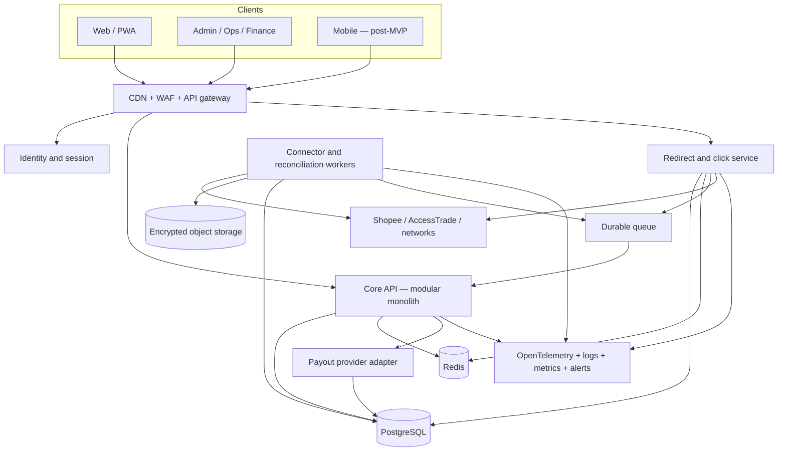
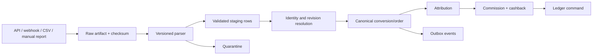
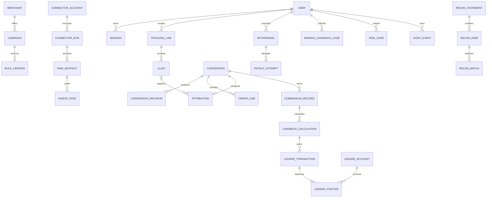
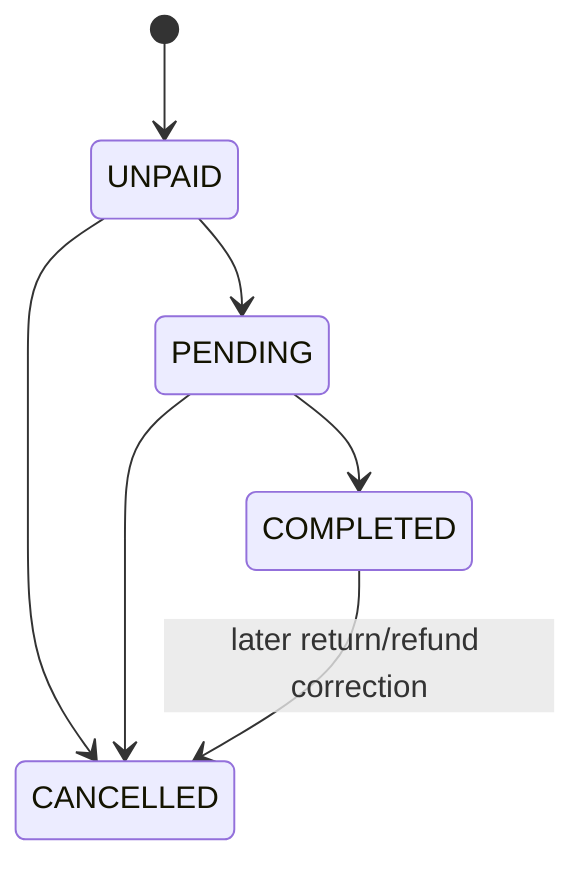
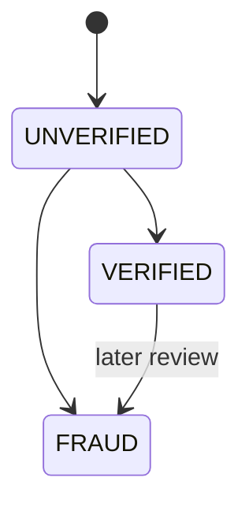
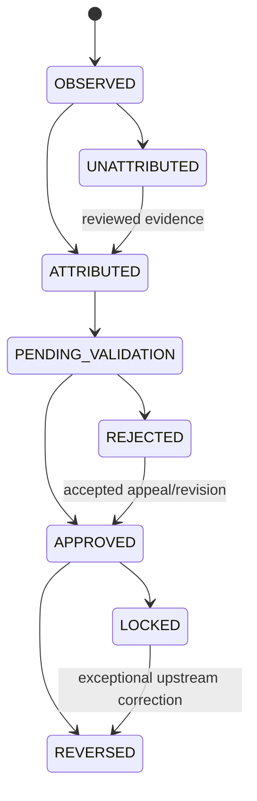
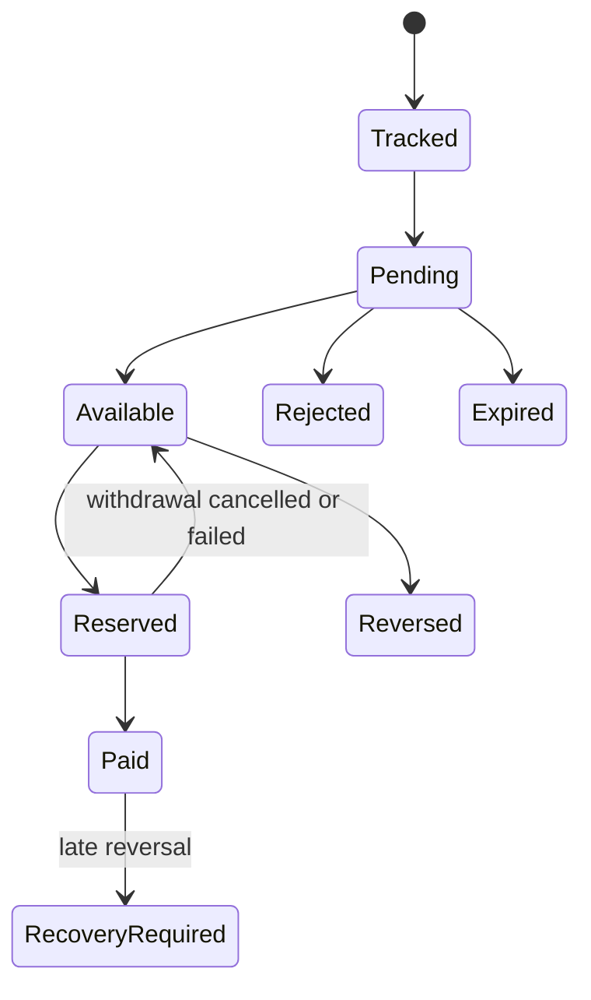
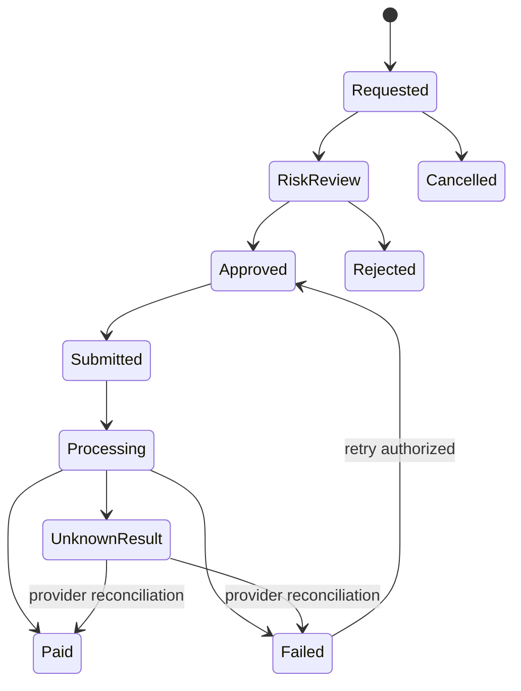
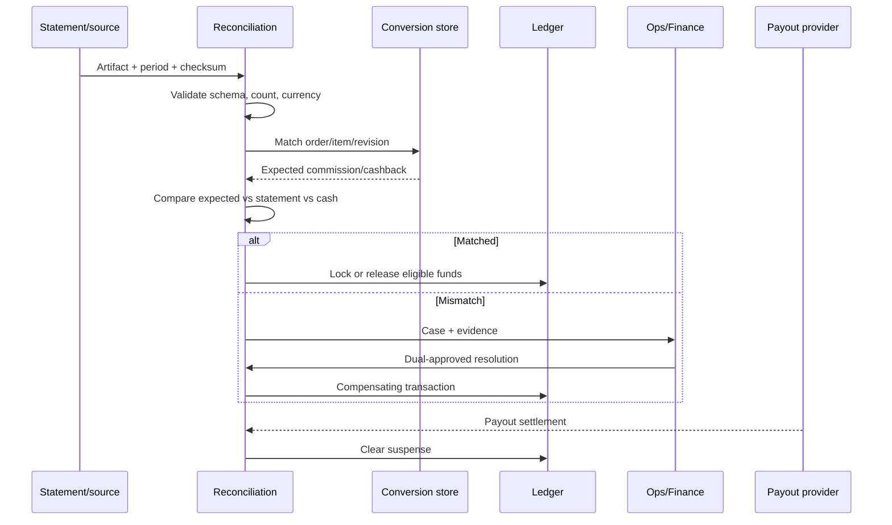

# TDD — Vietnam Cashback and Affiliate Platform

**Version:** 1.0  
**Language:** English  
**Consolidation date:** 2026-07-24  
**Status:** Technical baseline for MVP  
**Related BRD:** [English BRD](../brd/cashback_affiliate_platform_brd_en.md)  
**Equivalent document:** [TDD tiếng Việt](./cashback_affiliate_platform_tdd_vi.md)

## 1. Purpose and scope

This TDD translates the `BRD-FR-*` and `BRD-NFR-*` requirements into an
implementation-ready design for a Shopee-first cashback and affiliate platform
in Vietnam.

Technical scope:

- web/PWA and administration portal;
- identity, sessions, and RBAC;
- merchant, campaign, voucher, and rule catalog;
- affiliate-link generation, redirects, and first-party click tracking;
- marketplace/network connectors, CSV reports, webhooks, and polling;
- conversion and order normalization and attribution;
- commission and cashback calculation;
- double-entry wallet ledger;
- withdrawal, payout, and reconciliation;
- fraud controls, missing-cashback cases, notifications, and audit;
- logs, metrics, traces, alerts, backup, and recovery.

This design does not include bypassing authentication, signatures, CAPTCHA,
access controls, partner approval, or rate limits.

## 2. Evidence labels and conventions

| Label                   | Meaning in this TDD                                       |
| ----------------------- | --------------------------------------------------------- |
| `Observed`              | Directly verified through permitted account or system use |
| `Officially documented` | Confirmed by a current first-party source                 |
| `Inferred`              | Plausible from evidence but not a production contract     |
| `Third-party reported`  | Secondary evidence requiring contract tests               |
| `Proposed`              | A design decision for the new platform                    |
| `Unknown`               | Requires a sample, entitlement, or commercial agreement   |

Conventions:

- internal identifiers use UUIDv7 or an equivalent random identifier;
- public references and click tokens are opaque and contain no PII;
- money uses `BIGINT amount_minor` plus ISO-4217 currency;
- rates use integer ppm or basis points, never floating point;
- canonical timestamps are UTC while source timezone and business date are
  retained;
- sensitive upstream identifiers are encrypted for controlled display and
  HMAC-indexed for equality lookup;
- schemas are versioned and raw upstream evidence is immutable.

## 3. Architecture decisions

### ADR-001 — Start with a modular monolith

`Proposed`

The core API is a modular monolith with explicit transaction and domain
boundaries. Connector workers run as separate processes/deployments. The
redirect service is deployed separately because it has a materially different
latency and traffic profile.

This minimizes MVP operational overhead, supports strong transactions between
conversion, commission, ledger, and outbox records, and leaves domain ports
available for later service extraction.

### ADR-002 — PostgreSQL is the system of record

PostgreSQL owns durable clicks, conversion revisions, attribution decisions,
rule snapshots, the financial ledger, withdrawals, payout attempts,
reconciliation, audit, and the transactional outbox.

Redis is restricted to disposable cache, expiring locks, rate limits, and
rebuildable projections. It never owns balances or financial state.

### ADR-003 — At-least-once delivery plus idempotency

Webhook delivery, report replay, polling, queue delivery, and job retries are
assumed to be at least once. Every ingress record, revision, ledger
transaction, and payout attempt therefore has a unique idempotency key.

### ADR-004 — Preserve immutable raw evidence

Every upstream response, webhook payload, and imported report is retained in
encrypted object storage with checksum, schema fingerprint, source metadata,
and retention class. Parsed records reference, but do not replace, the raw
artifact.

### ADR-005 — Append-only financial ledger

Balances are projections of balanced debit/credit postings. Corrections,
refunds, expirations, and payout reversals use compensating transactions.
Posted ledger rows are never edited or deleted.

### ADR-006 — Shopee-first, connector-neutral core

Shopee direct links and conversion-report ingestion are the first delivery
path. Core domains use canonical fields and states; Shopee-specific fields stay
inside connector extensions and raw evidence.

### ADR-007 — Private browser endpoints are not contracts

UI-private endpoints observed in browser traffic or community repositories
must not be called by production backends using copied cookies. A
browser-assisted fallback may operate only in an operator-controlled signed-in
profile and may return only an exported file to the standard ingestion
pipeline.

## 4. High-level architecture



## 5. Deployment topology

### 5.1 Components

| Component               | Scale unit                | Durable state                     |
| ----------------------- | ------------------------- | --------------------------------- |
| `web`                   | request/instance          | none                              |
| `api`                   | request/instance          | transactions in PostgreSQL        |
| `redirect`              | request/instance          | durable click outside the process |
| `worker-connector`      | connector/partition       | cursor and run state in DB        |
| `worker-reconciliation` | statement/period          | job state in DB                   |
| `worker-notification`   | queue partition           | idempotent delivery state         |
| PostgreSQL              | primary/replica/backup    | source of truth                   |
| Redis                   | shard/managed instance    | disposable cache                  |
| Object storage          | immutable object/checksum | raw artifacts                     |

### 5.2 Environments

- `local`: simulators and synthetic fixtures; no production credential.
- `test`: isolated integration and contract databases.
- `staging`: production-like deployment and dedicated sandbox/staging
  credentials where a provider offers them.
- `production`: least privilege, egress allowlists, secret rotation, and
  dual approval for financial operations.

Production payloads must not be copied to local or test. Fixtures are synthetic
or irreversibly anonymized, with source identifiers replaced.

### 5.3 Reference stack

| Layer                  | Reference choice                               |
| ---------------------- | ---------------------------------------------- |
| Web/admin              | Next.js and TypeScript                         |
| API/redirect/workers   | TypeScript with Fastify, NestJS, or equivalent |
| Database               | PostgreSQL                                     |
| Queue                  | Managed durable queue or RabbitMQ              |
| Cache/rate limiting    | Redis                                          |
| Raw storage            | S3-compatible object storage                   |
| API/schema             | OpenAPI 3.1 and JSON Schema                    |
| Observability          | OpenTelemetry                                  |
| Infrastructure as code | Terraform or equivalent                        |

## 6. Domain boundaries

| Domain/module  | Owns                                                         | Internal public port    |
| -------------- | ------------------------------------------------------------ | ----------------------- |
| Identity       | user, credential reference, session, verification, role      | `IdentityService`       |
| Catalog        | merchant, program, campaign, voucher, rule version           | `CatalogService`        |
| Tracking       | tracking link, click, trip, destination snapshot             | `TrackingService`       |
| Connector      | configuration reference, capability, cursor, run, raw ingest | `ConnectorPort`         |
| Conversion     | conversion aggregate, order, line, revision                  | `ConversionService`     |
| Attribution    | decision, candidate, and evidence                            | `AttributionService`    |
| Commission     | commission record and cashback calculation                   | `CommissionService`     |
| Ledger         | account, transaction, posting, balance projection            | `LedgerService`         |
| Payout         | withdrawal, beneficiary reference, payout attempt            | `PayoutService`         |
| Reconciliation | statement, row, match, discrepancy, close                    | `ReconciliationService` |
| Promotion      | referral, bonus, quest, leaderboard definition               | `PromotionService`      |
| Risk           | signal, score, hold, case, and decision                      | `RiskService`           |
| Support        | missing-cashback case, evidence reference, SLA               | `CaseService`           |
| Admin/Audit    | command, approval, and audit event                           | `AdminCommandService`   |
| Notification   | template, preference, and delivery                           | `NotificationService`   |

A domain must not write another domain's tables directly. The ledger accepts a
validated business command and does not independently reinterpret upstream
rules.

## 7. Shopee integration design

### 7.1 Capability matrix

| Capability                 | MVP without App ID/App Secret                            | After approved API access            |
| -------------------------- | -------------------------------------------------------- | ------------------------------------ |
| Standard product/shop link | Official direct redirect pattern                         | API or direct pattern                |
| XTRA/brand/exclusive link  | Dashboard factory/operator flow                          | API only if entitled                 |
| Product metadata           | Product Feed where available; cached adapter/OG fallback | Approved product/feed API            |
| Click evidence             | First-party redirect plus Shopee click report            | First-party plus approved report API |
| Conversion ingestion       | Exported conversion report                               | Approved API polling                 |
| Refund/correction          | Overlapping report re-import                             | Revision polling plus report repair  |
| Settlement                 | Invoice/payment reports                                  | API/report according to entitlement  |

### 7.2 Direct link contract

`Officially documented`: the researched Shopee direct redirect pattern accepts:

```text
origin_link
affiliate_id
sub_id = slot1-slot2-slot3-slot4-slot5
```

The member never supplies an Affiliate ID. The connector/account configuration
selects the authorized publisher identity.

| Slot | Proposed value                  |
| ---- | ------------------------------- |
| 1    | opaque user reference           |
| 2    | opaque click reference          |
| 3    | source/channel code             |
| 4    | campaign/rule-version reference |
| 5    | schema version/check value      |

`Observed` in the Vietnam affiliate UI:

```text
slot_value = [A-Za-z0-9]+
"-" is only the delimiter between slots
```

No email address, phone number, username, upstream order identifier, or
sequential database ID is placed in a SubID.

### 7.3 Link modes

```ts
type ShopeeLinkMode = "DIRECT_REDIRECT" | "DASHBOARD_OFFER_FACTORY" | "APPROVED_API";
```

- Standard product/shop URLs may use `DIRECT_REDIRECT`.
- An opaque short link must be resolved first; query parameters must not be
  appended blindly.
- XTRA, brand, and exclusive offers use
  `DASHBOARD_OFFER_FACTORY` until an approved API contract explicitly supports
  them.
- The link record stores `link_mode`, source URL checksum, authorized publisher
  account, and destination snapshot.

### 7.4 Observed conversion-report contract

`Observed` through authorized Vietnam account use:

- previous-day data is normally updated between 09:00 and 12:00 on the
  following day and may be delayed;
- the order-time query window covers the most recent three months;
- UI values are rounded to two decimal places while export retains original
  values;
- the report can filter by SubID;
- Checkout ID identifies a checkout/cart level;
- Order ID identifies a shop order;
- Promotion ID identifies a transaction/promotion package;
- Model ID identifies a product variant;
- order status includes unpaid, pending, completed, and cancelled;
- cancellation may include seller cancellation, buyer cancellation,
  return/refund, invalid order, or unpaid expiry;
- fraud status includes unverified, verified, and fraud;
- product commission is a line/product breakdown;
- order commission is the order-level amount;
- net affiliate commission is the KOL share after an MCN agreement.

`Unknown` until a real, redacted export fixture is available:

- exact headers, delimiter, encoding, and precision;
- stable line-level identifier;
- round-trip representation of all five SubID slots;
- whether fraud state exists in export or only in the UI/API;
- exact correction, cancellation, return, and refund representation.

### 7.5 CSV ingestion schedule

- Attempt scheduled ingestion after 12:15 `Asia/Ho_Chi_Minh`.
- Retry with backoff if the previous business-day partition is not yet present.
- Re-import an overlapping recent window, initially 14 days, to capture
  revisions.
- Periodically backfill the complete report window still available.
- Archive every export before the upstream three-month query window expires.
- Keep manual import available as a supported recovery path.
- Browser assistance, if used, may download only the report file and must not
  export cookies, sessions, or browser storage.

### 7.6 Canonical Shopee row v0

```ts
interface ShopeeConversionRowV0 {
  sourceSchemaFingerprint: string;
  purchaseTimeRaw: string;
  completionTimeRaw?: string;
  checkoutRefHmac?: string;
  orderRefHmac?: string;
  lineRefHmac?: string;
  promotionRef?: string;
  itemRef?: string;
  modelRef?: string;
  quantity?: number;
  orderStatusRaw: string;
  fraudStatusRaw?: string;
  currency: "VND";
  purchaseValueMinor?: bigint;
  productCommissionMinor?: bigint;
  orderCommissionMinor?: bigint;
  netAffiliateCommissionMinor?: bigint;
  mcnManagementFeeMinor?: bigint;
  commissionTypeRaw?: string;
  channelRaw?: string;
  attributionTypeRaw?: string;
  buyerStatusRaw?: string;
  subIdRawCiphertext?: string;
  subId1?: string;
  subId2?: string;
  subId3?: string;
  subId4?: string;
  subId5?: string;
  extraEncrypted: Record<string, unknown>;
}
```

These are internal canonical names, not claims about Shopee's literal CSV
headers.

## 8. AccessTrade and TikTok connectors

### 8.1 AccessTrade

`Officially documented` capabilities identified in the research include token
authentication, campaign and cashback-campaign data, product-link generation,
transaction/order/order-product reporting, datafeed, voucher/offer data,
`sub1..sub4`, transaction and order states, and rejection reasons. Some
documented transaction/order endpoints have a published limit of 10 requests
per minute.

Implementation:

- poll by update time with an overlap window;
- treat line/transaction revisions as the detailed source of truth;
- use order aggregates as a projection and reconciliation check;
- archive each raw response;
- reconcile against downloadable reports/statements;
- create an immutable campaign and rule version for every material change.

### 8.2 TikTok Shop

- Direct affiliate access depends on approval and the correct seller, creator,
  or partner scope.
- The MVP may expose TikTok campaigns through AccessTrade when the publisher
  account is approved there.
- A direct TikTok connector is not an MVP critical path.
- Seller APIs do not imply publisher conversion or commission visibility.

## 9. Redirect and click tracking

### 9.1 Request path

```text
GET /r/{public_link_id}
```

Processing:

1. Validate that the public link is active and in its effective period.
2. Load the destination, rule, and publisher-account snapshot.
3. Apply rate limiting and pre-click risk evaluation.
4. Generate `click_id` and a compact opaque click reference.
5. Ask the connector to create the affiliate URL.
6. Persist the durable click and destination snapshot.
7. Write the event to the transactional outbox.
8. Return a redirect with `Cache-Control: no-store`.

### 9.2 URL security

- allow only `https`;
- match an exact canonical hostname allowlist;
- canonicalize IDN/punycode;
- resolve DNS and block private, loopback, link-local, and metadata addresses;
- revalidate every redirect hop;
- limit hop count, timeout, and response size;
- never forward member cookies or authorization headers;
- avoid fetching a body when only a `Location` header is required;
- never use substring hostname matching;
- never accept an Affiliate ID from a member request.

### 9.3 Click persistence

The synchronous request writes a minimal durable row:

```text
click_id
public_link_id
user_id nullable
visitor_id_hmac
publisher_account_id
connector
sub_id_schema_version
destination_url_ciphertext
destination_url_hash
source_channel
rule_version_id
occurred_at
ip_prefix_hmac
user_agent_class
risk_score
```

The raw IP and full user agent are not retained unless a separately approved,
time-limited security use case requires them.

### 9.4 Attribution

Candidate order:

1. exact validated click reference from SubID;
2. exact opaque member reference plus campaign and time;
3. network-provided attribution identifier;
4. no attribution, routed to an operations queue.

Every decision stores strategy version, evidence references, candidates,
reason, confidence, and decision timestamp. Re-attribution never rewrites
financial history; it creates a reviewed correction.

## 10. Ingestion and normalization

### 10.1 Unified ingress



Each connector run records source period, cursor, artifact checksum, parser
version, row counts, warning/error counts, outcome, and retry lineage.

### 10.2 CSV parser

- detect byte-order mark and encoding from an allowlist;
- identify schema by normalized header fingerprint;
- parse quoted delimiters and embedded newlines safely;
- retain raw decimal text and convert by currency rules;
- parse source time using an explicit source timezone;
- reject formula-capable cells from later spreadsheet exports;
- quarantine unknown schemas instead of guessing;
- support dry run and row-level validation results;
- make a same-checksum re-import a no-op.

### 10.3 Mandatory fixtures

Before production, obtain redacted fixtures for:

- header-only/empty export;
- unpaid, pending, completed, and cancelled orders;
- verified and fraud states when available;
- multi-shop checkout;
- multiple variants and quantities;
- all five SubID slots;
- MCN and non-MCN commission;
- a correction after an earlier import;
- malformed and unknown columns.

### 10.4 Natural key

The adapter emits:

```text
source_conversion_key
source_revision_key
source_order_key
source_line_key
```

If no stable source line key exists, use a connector-versioned composite from
the HMACed order reference, item/model, promotion, and deterministic line
ordinal. Changing a fallback-key algorithm requires a migration, not a silent
parser change.

## 11. Data model



### 11.1 Principal tables and constraints

| Table                   | Principal constraints                                         |
| ----------------------- | ------------------------------------------------------------- |
| `users`                 | unique normalized identity; status enum                       |
| `sessions`              | hashed token family; expiry; revocation and rotation metadata |
| `merchants`             | unique connector plus source merchant reference               |
| `campaigns`             | effective interval and source campaign reference              |
| `rule_versions`         | immutable after activation; effective interval                |
| `tracking_links`        | unique public ID; destination hash; publisher account         |
| `clicks`                | primary `click_id`; time partition candidate                  |
| `connector_runs`        | unique connector, account, source period/cursor, attempt      |
| `raw_artifacts`         | unique source plus checksum                                   |
| `conversions`           | unique connector account plus source conversion key           |
| `conversion_revisions`  | unique conversion plus source revision key                    |
| `attributions`          | one active decision per conversion                            |
| `cashback_calculations` | unique commission plus calculation version                    |
| `ledger_transactions`   | unique idempotency key and immutable business reference       |
| `ledger_postings`       | transaction postings sum to zero per currency                 |
| `withdrawals`           | unique public reference and state version                     |
| `payout_attempts`       | unique provider idempotency key                               |
| `recon_rows`            | unique statement plus normalized row key                      |
| `outbox_events`         | unique event ID; atomic with aggregate write                  |
| `audit_events`          | append-only hash-chained sequence per tenant/partition        |

### 11.2 Sensitive source identifiers

For an upstream order, checkout, or transaction identifier:

```text
*_ciphertext = authenticated encryption for authorized display
*_hmac       = keyed equality index for matching
*_last4      = optional masked support display
```

The encryption and HMAC keys are independent and versioned. Application logs
receive only the internal aggregate ID and masked display value.

## 12. State machines

### 12.1 Shopee order and fraud axes

The connector preserves the two independent source axes:





An order being `COMPLETED` does not imply fraud verification or commission
locking.

### 12.2 Canonical conversion



Every source transition creates a revision. Invalid regressions are retained
and raised as anomalies rather than discarded.

### 12.3 Cashback



`Paid` is not deleted by a late reversal. A recovery receivable/negative
available balance is posted according to the approved policy.

### 12.4 Withdrawal and payout



The ledger reservation occurs before `Approved` can be sent to a provider.
Unknown provider results are reconciled before retry; an automatic blind retry
is prohibited.

## 13. Rule, commission, and cashback engine

### 13.1 Rule version

```ts
interface CampaignRuleVersion {
  id: string;
  merchantId: string;
  programId: string;
  campaignId: string;
  effectiveFrom: string;
  effectiveTo?: string;
  customerType?: "NEW" | "EXISTING" | "ALL";
  productType?: string;
  eligibleCategories: string[];
  excludedCategories: string[];
  rateType: "PERCENTAGE" | "FIXED" | "REVENUE_SHARE";
  cashbackRatePpm?: number;
  fixedCashbackMinor?: bigint;
  memberSharePpm?: number;
  capPerOrderMinor?: bigint;
  capPerUserPeriodMinor?: bigint;
  confirmationPolicy: string;
  roundingMode: "DOWN" | "HALF_UP";
  termsUrl?: string;
  termsChecksum: string;
  version: number;
}
```

A published rule is immutable. A click retains the applicable
`rule_version_id` and disclosure checksum.

### 13.2 Calculation

Generic percentage/fixed rules:

```text
eligible_base =
  item_subtotal
  - excluded_discount
  - excluded_shipping
  - excluded_tax
  - excluded_fee

estimated_cashback =
  min(cap, round(eligible_base × rate))

final_cashback =
  min(
    estimated_cashback_after_final_value,
    approved_commission - protected_platform_cost
  )
```

Revenue-share rules:

```text
final_cashback =
  round_down(approved_commission × member_share_ppm / 1_000_000)
```

Shopee rule:

```text
commission_base =
  net_affiliate_commission
    when MCN-linked and the field is valid
  otherwise
    order_commission

Never add:
  product_commission_total + order_commission
```

The product commission is treated as a breakdown when the order commission is
the aggregate. A connector fixture must prove any exception.

### 13.3 Calculation version

```text
HMAC(
  conversion_revision
  + attribution_decision_version
  + rule_version
  + calculator_version
  + commission_base
  + currency
)
```

The same fingerprint cannot create another commission, cashback calculation,
or ledger posting.

## 14. Double-entry ledger

### 14.1 Account model

Conceptual accounts are separated by tenant and currency:

- pending commission receivable;
- approved commission receivable;
- pending cashback liability;
- available cashback liability;
- deferred platform revenue;
- earned platform revenue;
- promotion subsidy expense/liability;
- payout suspense;
- network clearing;
- cash;
- fees/tax;
- platform loss/recovery.

### 14.2 Example posting

For commission 100, cashback 70, and platform margin 30:

```text
Pending:
  Debit  Pending commission receivable  100
  Credit Pending cashback liability      70
  Credit Deferred platform revenue       30

Approved:
  Move pending receivable → approved receivable
  Move pending liability → available liability
  Move deferred revenue → earned revenue

Withdrawal requested:
  Debit  Available cashback liability
  Credit Payout suspense

Payout succeeded:
  Debit  Payout suspense
  Credit Cash
```

A rejection, refund, reversal, or failed payout creates a compensating
transaction that references the original transaction.

### 14.3 Invariants

- Debits equal credits per currency in every transaction.
- Transactions and postings are append-only.
- `business_event + purpose + calculation_version` is unique.
- An adjustment references the transaction being adjusted.
- Neither admins nor APIs may edit an existing posting.
- Balance projections are rebuildable from postings.
- Ledger write and outbox event commit in the same database transaction.

### 14.4 Concurrency

Withdrawal reservation:

1. Lock the user's available-liability account or use a serializable
   transaction.
2. Recompute available balance against a versioned projection.
3. Validate minimum threshold, holds, and risk.
4. Insert the withdrawal.
5. Insert the balanced reservation transaction.
6. Insert the outbox event.
7. Commit.

A repeated idempotency key with the same request hash returns the existing
resource. The same key with a different hash returns
`409 IDEMPOTENCY_CONFLICT`.

## 15. Withdrawal and payout

### 15.1 Withdrawal guard

- active account and verified contact/beneficiary;
- sufficient available balance;
- configured minimum threshold;
- no active risk or beneficiary cooling hold;
- no recovery balance beyond policy;
- supported currency/provider;
- valid idempotency key.

### 15.2 Provider adapter

```ts
interface PayoutProvider {
  validateBeneficiary(ref: string): Promise<ValidationResult>;
  submit(input: PayoutInstruction): Promise<SubmissionResult>;
  getStatus(providerReference: string): Promise<PayoutStatus>;
  cancel?(providerReference: string): Promise<CancelResult>;
  downloadSettlement(period: TimeWindow): Promise<SettlementArtifact[]>;
}
```

A timeout is not classified as failure. It becomes `UnknownResult` and requires
status lookup and/or settlement reconciliation.

### 15.3 Batch approval

- batch creator and approver are different actors;
- approval requires MFA/step-up;
- the batch has a checksum and currency totals;
- beneficiary changes after cutoff invalidate the included instruction;
- approval signs the exact batch version;
- every submission/result has an audit record and correlation ID.

## 16. Reconciliation and settlement



Mismatch taxonomy:

- missing internally;
- missing upstream;
- amount or state mismatch;
- currency or FX mismatch;
- duplicate;
- late correction;
- unmatched order line;
- payout-provider mismatch;
- incomplete or corrupt statement.

A period may close only when artifact completeness passes, critical mismatches
are resolved or explicitly carried forward, cash receipt and payout batches
match, the ledger balances, the late-arrival threshold has elapsed, and dual
approval plus an audit record exists.

## 17. Missing cashback, risk, and fraud

### 17.1 Missing cashback

```text
draft → submitted → auto_check
→ waiting_for_user / waiting_for_upstream
→ accepted / rejected → closed
```

Guards:

- an eligible click/trip exists or an exception reason is recorded;
- the merchant's normal tracking wait has elapsed;
- user, device, and merchant case rates are limited;
- uploaded evidence is malware-scanned, encrypted, and retained by policy;
- support cannot directly credit a wallet;
- goodwill adjustments require approval;
- upstream ticket and reconciliation item are linked when applicable.

### 17.2 Risk signals

Pre-click:

- bot/scraper velocity;
- URL or token tampering;
- repeated click patterns;
- account/device velocity.

Conversion:

- cross-connector duplicate;
- one order claimed by multiple members;
- self-referral or suspicious account/device/beneficiary graph;
- abnormal click-to-order delay;
- conversion, order-value, or commission outlier;
- upstream fraud status.

Pre-payout:

- recent beneficiary change;
- beneficiary shared by an abnormal account cluster;
- withdrawal velocity;
- exposure to negative adjustments;
- account, device, or session anomaly.

The risk engine can place a hold, require step-up, or create a case. It cannot
write ledger postings directly.

## 18. REST API

### 18.1 Conventions

- Base path: `/v1`.
- UTF-8 JSON.
- Cursor pagination for large collections.
- Mutations accept `Idempotency-Key`.
- `X-Correlation-ID` is accepted or generated.
- Timestamps use RFC 3339 UTC.
- Monetary values use:

```json
{
  "amountMinor": 10000,
  "currency": "VND"
}
```

Error envelope:

```json
{
  "error": {
    "code": "VALIDATION_ERROR",
    "message": "Request is invalid",
    "correlationId": "opaque-id",
    "details": [{ "field": "destinationUrl", "reason": "UNSUPPORTED_HOST" }]
  }
}
```

Responses never expose upstream secrets, raw tokens, full source order IDs, or
stack traces.

### 18.2 Identity

```text
POST   /v1/auth/sessions
DELETE /v1/auth/sessions/current
POST   /v1/auth/recovery-challenges
POST   /v1/auth/recovery-challenges/{id}/verify
GET    /v1/me
PATCH  /v1/me
GET    /v1/me/sessions
DELETE /v1/me/sessions/{sessionId}
```

### 18.3 Catalog

```text
GET /v1/merchants
GET /v1/merchants/{merchantId}
GET /v1/campaigns
GET /v1/campaigns/{campaignId}
GET /v1/vouchers
```

A campaign response includes effective time, rate/cap/exclusion summary,
confirmation estimate, source freshness, terms snapshot reference, and an
estimated/not-guaranteed disclosure.

### 18.4 Link generation

```text
POST /v1/tracking-links
GET  /v1/tracking-links/{id}
GET  /r/{publicLinkId}
```

```json
{
  "destinationUrl": "https://allowed-marketplace.example/product/opaque",
  "merchantId": "opaque-id",
  "campaignId": "opaque-id",
  "source": "web"
}
```

```json
{
  "id": "opaque-id",
  "publicUrl": "https://first-party.example/r/opaque",
  "destination": {
    "host": "allowed-marketplace.example",
    "displayPath": "/product/…"
  },
  "cashbackEstimate": {
    "amountMinor": 0,
    "currency": "VND",
    "state": "ESTIMATED",
    "ruleVersion": "opaque-version"
  }
}
```

The complete upstream affiliate URL is not returned when the client does not
need it.

### 18.5 Activity, wallet, and withdrawal

```text
GET  /v1/cashback-activity
GET  /v1/cashback-activity/{id}
GET  /v1/wallet/balance
GET  /v1/wallet/transactions
POST /v1/withdrawals
GET  /v1/withdrawals/{id}
```

### 18.6 Missing cashback

```text
POST /v1/missing-cashback-cases
GET  /v1/missing-cashback-cases
GET  /v1/missing-cashback-cases/{id}
POST /v1/missing-cashback-cases/{id}/evidence
```

Evidence uses a short-lived pre-signed upload and is finalized only after
security scanning.

### 18.7 Connector and administration

```text
POST /v1/connectors/{connectorId}/sync
GET  /v1/connectors/{connectorId}/runs
POST /v1/connectors/{connectorId}/reports
POST /v1/connectors/{connectorId}/webhooks/{topic}

POST /v1/admin/campaign-rules/{ruleId}/publish
POST /v1/admin/conversions/{conversionId}/reattribute
POST /v1/admin/imports/{batchId}/replay
POST /v1/admin/ledger-adjustments
POST /v1/admin/payout-batches
POST /v1/admin/payout-batches/{batchId}/approve

POST /v1/reconciliation/statements
GET  /v1/reconciliation/items
POST /v1/reconciliation/items/{itemId}/resolve
POST /v1/reconciliation/periods/{periodId}/close
```

Every admin command carries actor, reason, exact resource version, and audit
context.

## 19. Event contract

### 19.1 Envelope

```json
{
  "eventId": "opaque-uuid",
  "eventType": "conversion.status_changed",
  "eventVersion": 1,
  "aggregateType": "conversion",
  "aggregateId": "opaque-id",
  "aggregateVersion": 4,
  "source": "connector-name",
  "occurredAt": "2026-07-24T00:00:00Z",
  "receivedAt": "2026-07-24T00:00:02Z",
  "correlationId": "opaque-id",
  "causationId": "opaque-id",
  "idempotencyKey": "keyed-digest",
  "dataClassification": "confidential",
  "payload": {
    "status": "approved",
    "amountMinor": 10000,
    "currency": "VND"
  }
}
```

Events exclude PII, credentials, complete source order identifiers, complete
affiliate URLs, and beneficiary details.

### 19.2 Event catalog

- `click.recorded.v1`
- `raw_ingest.received.v1`
- `raw_ingest.quarantined.v1`
- `conversion.normalized.v1`
- `conversion.attributed.v1`
- `conversion.unattributed.v1`
- `conversion.status_changed.v1`
- `commission.calculated.v1`
- `cashback.pending.v1`
- `cashback.available.v1`
- `cashback.reversed.v1`
- `withdrawal.requested.v1`
- `withdrawal.approved.v1`
- `payout.submitted.v1`
- `payout.succeeded.v1`
- `payout.failed.v1`
- `statement.imported.v1`
- `reconciliation.mismatch_detected.v1`
- `risk.hold_applied.v1`

Consumers deduplicate by `eventId`, enforce aggregate-version rules, and make
each handler idempotent.

## 20. Connector interface

```ts
interface AffiliateConnector {
  identity(): {
    connectorType: string;
    market: string;
    capabilities: Array<
      | "CAMPAIGNS"
      | "PRODUCTS"
      | "VOUCHERS"
      | "LINK_GENERATION"
      | "CONVERSION_POLL"
      | "ORDER_POLL"
      | "WEBHOOK"
      | "REPORT_DOWNLOAD"
      | "STATEMENT_DOWNLOAD"
    >;
  };

  validateConfig(secretRef: string): Promise<void>;
  syncCampaigns(cursor?: Cursor): Promise<Page<ExternalCampaign>>;
  syncProducts?(cursor?: Cursor): Promise<Page<ExternalProduct>>;
  syncVouchers?(cursor?: Cursor): Promise<Page<ExternalVoucher>>;
  createTrackingLink(input: LinkInput): Promise<ExternalTrackingLink>;
  pollConversions(window: TimeWindow, cursor?: Cursor): Promise<Page<RawConversion>>;
  pollOrders?(window: TimeWindow, cursor?: Cursor): Promise<Page<RawOrder>>;
  downloadReports?(period: StatementPeriod): Promise<ReportArtifact[]>;
  downloadStatements?(period: StatementPeriod): Promise<StatementArtifact[]>;
  verifyWebhook?(request: RawHttpRequest): Promise<VerifiedWebhook>;
  normalize(raw: RawIngest): Promise<NormalizedRevision[]>;
  classifyError(error: unknown): {
    retryable: boolean;
    authFailure: boolean;
    rateLimited: boolean;
    retryAfterMs?: number;
  };
}
```

Capabilities are discovered by connector and authorized account; they are not
globally hard-coded.

## 21. Idempotency, ordering, retry, and DLQ

### 21.1 Key strategy

| Layer                | Key                                                       |
| -------------------- | --------------------------------------------------------- |
| HTTP mutation        | tenant + actor + route + key + request hash               |
| Raw ingress          | connector + event/file checksum + source row key          |
| Conversion aggregate | connector instance + canonical business key               |
| Revision             | aggregate + state + amounts + source update + fingerprint |
| Attribution          | conversion + decision version                             |
| Commission           | revision + rule + calculator version                      |
| Ledger               | business event + purpose + calculation version            |
| Withdrawal           | user + client idempotency key                             |
| Provider payout      | provider + internal withdrawal reference                  |
| Statement            | source + period + object checksum                         |

### 21.2 Ordering

- No global order is required.
- Normalization assigns a version per aggregate.
- Out-of-order revisions are retained.
- A reducer derives the current projection from valid revisions.
- Source `updated_at` is evidence; `received_at` is a tie-breaker.
- A stale event does not downgrade state unless it is a valid correction.

### 21.3 Retry

- retry timeouts, 429, and 5xx using exponential backoff and jitter;
- honor `Retry-After`;
- do not blindly retry authentication, signature, or schema errors;
- apply a circuit breaker by connector and market;
- checkpoint a cursor only after a successful page;
- enforce retry budgets and maximum elapsed time per job.

### 21.4 Dead-letter queue

A DLQ record includes artifact/payload reference, connector and run, error
class, attempt history, first and last failure time, schema/parser version,
replay eligibility, and actor/approval for replay. Operators never modify the
raw payload in the DLQ.

## 22. Security model

### 22.1 Identity and session

- OIDC/OAuth, or Argon2id if passwords are stored;
- HttpOnly, Secure, and SameSite cookies;
- CSRF tokens for browser mutations;
- session rotation after sign-in and step-up;
- device/session revocation;
- mandatory staff MFA, preferably WebAuthn or TOTP;
- recovery responses resistant to account enumeration.

### 22.2 Authorization

- permission-based RBAC plus resource/tenant ownership checks;
- masked finance, risk, and support views;
- dual approval for sensitive financial commands;
- time-limited, justified, and alerted break-glass access;
- no direct database mutation by operators.

### 22.3 Secrets and upstream access

- use a secret manager; the database retains only `secret_ref`;
- egress allowlists per connector;
- webhook signature, timestamp, and replay-window verification;
- token rotation and authorization-expiry alerts;
- sensitive request headers are excluded from logs;
- browser session cookies are never copied into application storage.

### 22.4 Data

- TLS in transit and encryption at rest;
- field-level encryption for beneficiary and source identifiers;
- KMS key rotation and key version metadata;
- object checksums and encrypted backups;
- event/log allowlists instead of blacklist-only redaction;
- PII classification and retention by field.

### 22.5 Import and upload

- content-type and file-size limits;
- malware scanning;
- parser timeout, memory, and row limits;
- CSV formula-injection neutralization on re-export;
- object quarantine;
- authorized download with short-lived URLs;
- immutable raw artifacts.

### 22.6 Software supply chain

- lockfiles and software bill of materials;
- secret scanning, SAST, and DAST;
- image signing;
- reviewed database migrations;
- no hard-coded publisher or admin credentials;
- audit the network egress and data handling of extensions/libraries before use.

## 23. Observability and SLOs

### 23.1 Metrics

- redirect availability, p50/p95/p99, and error rate;
- durable-click write loss or fallback;
- connector request rate, 429, 5xx, and auth failure;
- polling lag, cursor age, and page lag;
- parse error, quarantine, and DLQ age;
- attribution matched, unmatched, and conflicting;
- conversion pending age, rejection, and reversal;
- expected-versus-approved commission variance;
- ledger imbalance count;
- withdrawal/payout success, latency, and unknown results;
- stuck suspense;
- reconciliation mismatch count and amount.

User, order, click, or conversion IDs are never metric labels.

### 23.2 SLOs

| SLO                              |                          Target |
| -------------------------------- | ------------------------------: |
| Redirect availability            |                          99.99% |
| Redirect p95                     | <100 ms, excluding external hop |
| Webhook durable acceptance p95   |                         <500 ms |
| Ledger imbalance                 |                               0 |
| Payout without required approval |                               0 |
| Duplicate payout                 |                               0 |
| Connector freshness              |              connector-specific |

### 23.3 Correlation

```text
public_link
→ click
→ raw_ingest
→ conversion/revision
→ attribution
→ commission
→ cashback
→ ledger transaction
→ withdrawal/payout
→ reconciliation
```

Traces and logs use opaque internal IDs only.

### 23.4 Required runbooks

- connector authorization expiry;
- quota exhaustion/429;
- upstream schema drift;
- stuck cursor;
- duplicate spike;
- attribution-rate drop;
- ledger invariant failure;
- payout timeout/unknown result;
- settlement mismatch;
- corrupt/incomplete report;
- secret rotation;
- DLQ replay.

## 24. Data retention, archive, and recovery

- Retain immutable raw conversions/reports according to business and audit
  policy.
- Archive Shopee reports before the three-month query window expires.
- Retain clicks through the attribution, claim, and dispute period.
- Give session/security logs a shorter policy than financial audit data.
- Retain uploaded evidence only as long as required, then securely delete it.
- Retain append-only ledger and audit history long term.
- Version the lifecycle and keys for PII/source ciphertext and HMAC indexes.

Recovery controls include PostgreSQL point-in-time recovery, periodic restore
drills, object versioning and checksums, cursor rebuild from raw artifacts, and
projection rebuild from revisions and ledger postings. RPO and RTO must be
approved before closed beta.

## 25. Test strategy

### 25.1 Unit and property tests

- money/rate rounding and caps;
- category and campaign exclusions;
- state-transition guards;
- natural key and fingerprint stability;
- URL canonicalization and allowlists;
- SubID charset and five-slot round trip;
- debit-equals-credit ledger property;
- unknown source-state handling.

### 25.2 Integration tests

- PostgreSQL transaction and concurrency behavior;
- transactional outbox;
- object checksum;
- queue retry and DLQ;
- payout unknown result;
- file quarantine;
- session, CSRF, and RBAC.

### 25.3 Connector contract tests

Each connector uses recorded, redacted, or synthetic fixtures for pagination,
empty/last page, quota response, auth expiry, schema drift, duplicates,
corrections/refunds, out-of-order events, and report replay. Fixtures contain no
credential or sensitive header.

### 25.4 End-to-end tests

- synthetic click → pending → available → payout;
- click → unattributed → reviewed evidence → attributed;
- approved conversion → late reversal;
- partial refund;
- Shopee CSV import and replay;
- checkout containing multiple shops/orders;
- missing cashback accepted and rejected paths;
- payout timeout followed by status reconciliation.

### 25.5 Performance and resilience tests

- redirect p95/p99 under load;
- connector worker within quota;
- database failover and retry;
- queue outage;
- slow object storage;
- maximum supported CSV;
- backup restore;
- cursor resume after worker crash.

### 25.6 Security tests

- authentication, fixation, rotation, and revocation;
- CSRF and IDOR/tenant escape;
- SSRF, open redirect, and DNS rebinding;
- malicious upload and CSV formula injection;
- webhook signature and replay;
- rate limits and automation abuse;
- secret/log leakage;
- RBAC and dual approval.

## 26. Delivery plan

### Phase 0 — Contract and data proof

- synthetic canonical fixtures;
- one authorized report/connector sample;
- Shopee header and five-slot SubID evidence;
- parser and normalizer contract;
- ledger property tests;
- raw replay demonstration.

### Phase 1 — Internal MVP

- repository, CI, and infrastructure as code;
- identity, RBAC, and audit;
- catalog and immutable rules;
- redirect and click tracking;
- Shopee direct links and CSV ingestion;
- AccessTrade polling when the account is approved;
- conversion, attribution, commission, and ledger;
- operations dashboard.

### Phase 2 — Closed beta

- member wallet and activity;
- withdrawal and payout;
- missing-cashback workflow;
- risk controls;
- reconciliation;
- notifications;
- SLO, security, load, and recovery testing.

### Phase 3 — Production and scale

- runbooks and on-call;
- second mature connector;
- warehouse/read models;
- creator/community features;
- direct Shopee or TikTok connector only after entitlement and economics
  justify it.

## 27. Requirement traceability

| BRD requirement  | TDD implementation/test                                    |
| ---------------- | ---------------------------------------------------------- |
| BRD-FR-001..005  | Identity API, session, RBAC, security tests                |
| BRD-FR-010..014  | Catalog schema/API and immutable rule versions             |
| BRD-FR-020..026  | Shopee link, redirect security, click and attribution      |
| BRD-FR-030..038  | Raw ingest, parser, revisions, commission, and fraud       |
| BRD-FR-040..045  | Ledger, withdrawal, payout adapter, reconciliation         |
| BRD-FR-050..053  | Promotion module, subsidy accounts, leaderboard read model |
| BRD-FR-060..063  | Missing-cashback case and evidence workflow                |
| BRD-FR-070..076  | Connector runs, admin commands, reconciliation, audit      |
| BRD-NFR-001..002 | Redirect SLO and load tests                                |
| BRD-NFR-003..004 | Ledger and payout invariants                               |
| BRD-NFR-005..006 | Audit, encryption, and redaction tests                     |
| BRD-NFR-007..008 | Raw replay, cursor restoration, freshness dashboards       |
| BRD-NFR-009..010 | Web accessibility and localization                         |

## 28. Open conditions before production

1. Exact Shopee CSV headers, encoding, precision, and stable line key.
2. Verified round trip for all five SubID slots.
3. Availability and representation of fraud status in export.
4. Shopee statement/payment keys and correction semantics.
5. Actual AccessTrade campaign entitlement, quota, and data retention.
6. Payout-provider idempotency and status contract.
7. Approved minimum payout, hold, expiry, and late-reversal policies.
8. Owner-approved RPO, RTO, and retention periods.
9. Finance-approved chart of accounts.
10. Campaign-specific merchant incentives and cashback eligibility.

## 29. Source documents

- [English BRD](../brd/cashback_affiliate_platform_brd_en.md)
- [Vietnamese research report](../research/cashback_affiliate_research_report_vi.md)
- [English research report](../research/cashback_affiliate_research_report.md)
- [Implementation blueprint](../research/cashback_platform_implementation_blueprint_vi.md)
- [Shopee strategy without App ID/App Secret](../research/shopee_affiliate_no_appid_strategy_vi.md)
- [Shopee repository assessment](../research/shopee_affiliate_repo_technical_assessment_vi.md)
- [Market research](../research/cashback_affiliate_market_research_2026_vi.md)
- [API availability matrix](../research/api_availability_matrix.csv)
