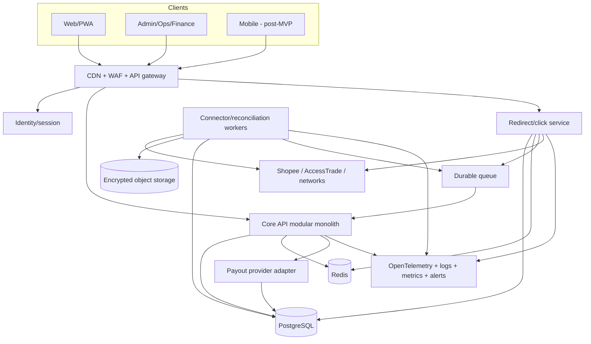
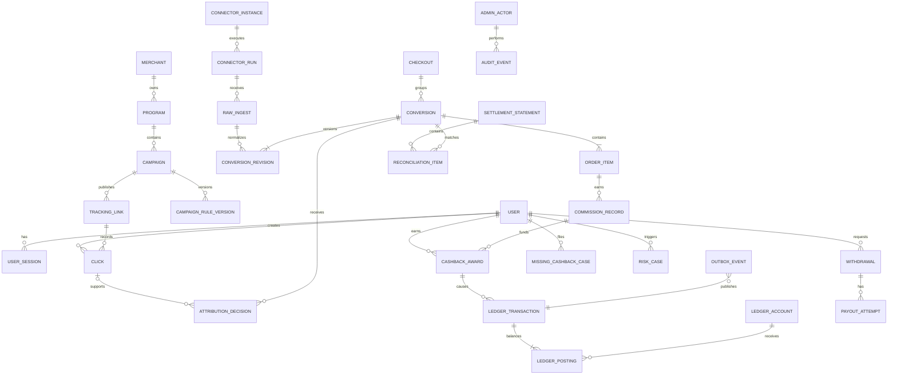
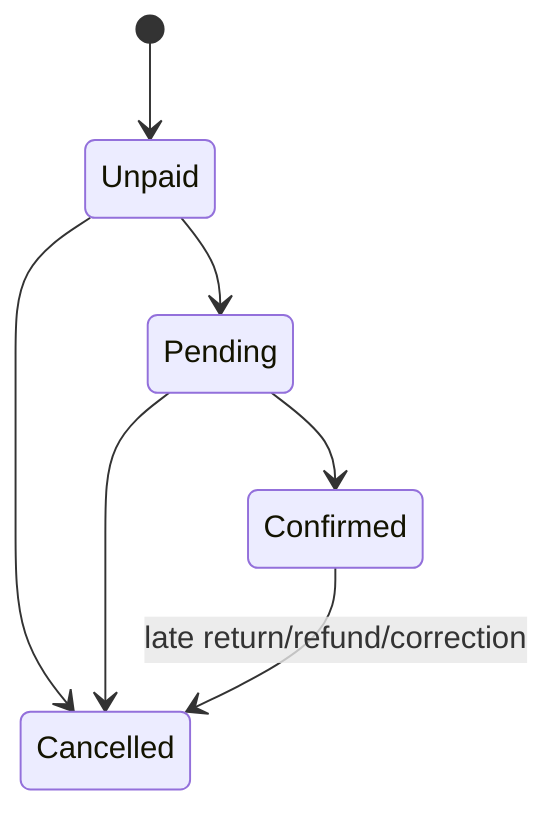
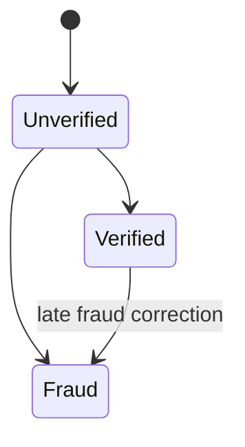
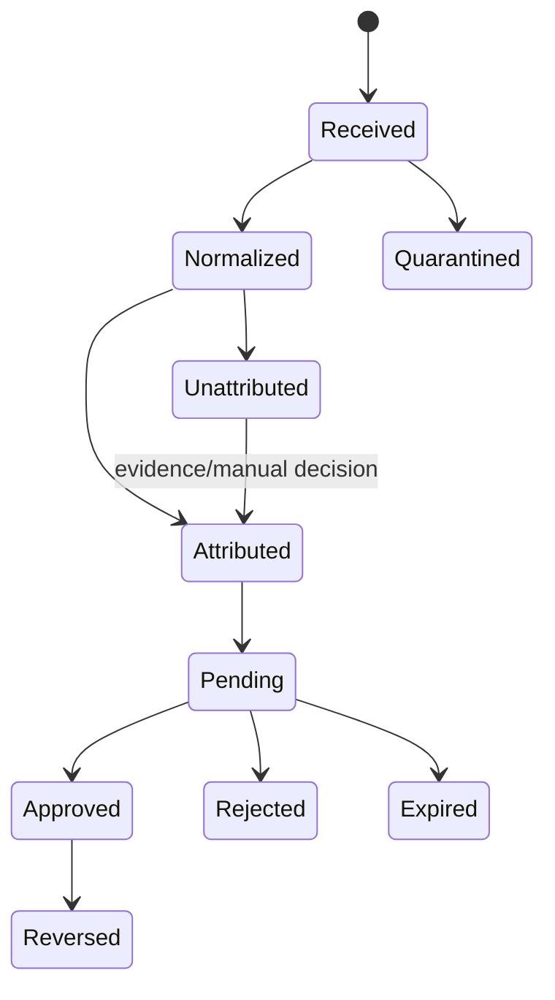
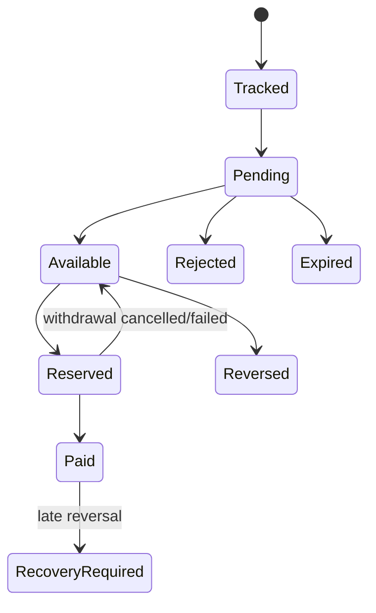
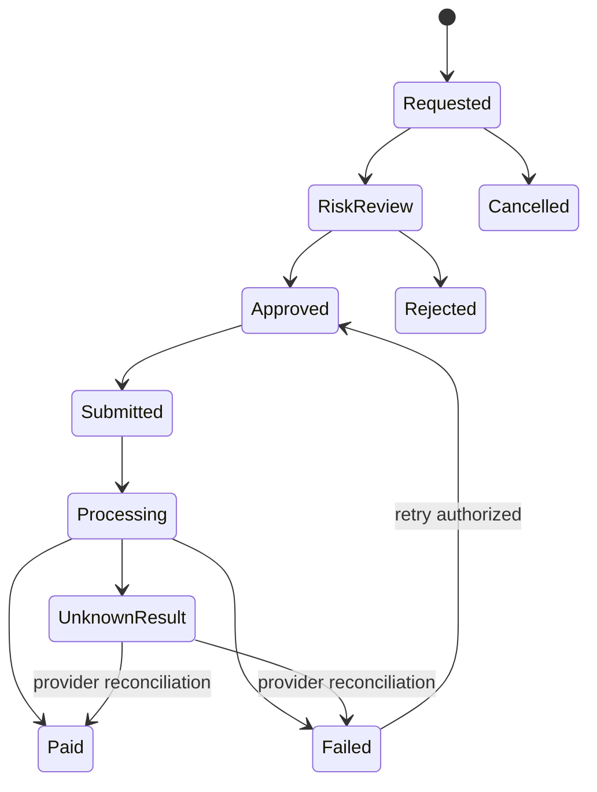
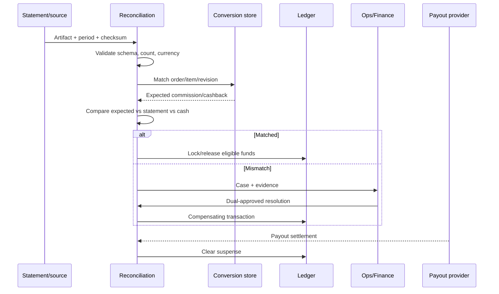

# TDD — Nền tảng Cashback và Affiliate Việt Nam

**Phiên bản:** 1.0  
**Ngôn ngữ:** Tiếng Việt  
**Ngày hợp nhất:** 2026-07-24  
**Trạng thái:** Baseline kỹ thuật cho MVP  
**BRD liên quan:** [BRD tiếng Việt](../brd/cashback_affiliate_platform_brd_vi.md)  
**Bản tương đương:** [TDD English](./cashback_affiliate_platform_tdd_en.md)

## 1. Mục đích và phạm vi

TDD này chuyển các yêu cầu `BRD-FR-*` và `BRD-NFR-*` thành thiết kế có thể triển
khai cho một nền tảng cashback/affiliate ưu tiên Shopee tại Việt Nam.

Phạm vi kỹ thuật:

- web/PWA và admin portal;
- identity, session và RBAC;
- merchant/campaign/rule catalog;
- link generation, redirect và click tracking;
- connector, CSV/report, webhook và polling;
- conversion/order normalization và attribution;
- commission/cashback calculation;
- double-entry ledger;
- withdrawal, payout và reconciliation;
- fraud, missing cashback, notification và audit;
- logging, metrics, tracing, alert và recovery.

Không thiết kế cách vượt xác thực, chữ ký, CAPTCHA hoặc quyền đối tác.

## 2. Phân loại bằng chứng và quy ước

| Nhãn                    | Cách dùng trong TDD                                  |
| ----------------------- | ---------------------------------------------------- |
| `Observed`              | Đặc tính đã thấy trong tài khoản/hệ thống được phép  |
| `Officially documented` | Contract được nguồn chính thức công bố               |
| `Inferred`              | Hình dạng khả dĩ; không dùng như contract production |
| `Third-party reported`  | Tham khảo, cần contract test                         |
| `Proposed`              | Thiết kế của nền tảng mới                            |
| `Unknown`               | Phải đóng bằng sample/quyền/hợp đồng                 |

Quy ước:

- ID nội bộ dùng UUIDv7 hoặc UUID ngẫu nhiên tương đương.
- Public reference và click token là opaque, không chứa PII.
- Tiền dùng `BIGINT amount_minor` và ISO-4217 currency.
- Rate dùng `ppm` hoặc `bps`, không dùng float.
- Thời gian chuẩn là UTC; giữ timezone/business date của nguồn.
- Source identifier được mã hóa để hiển thị có kiểm soát và HMAC để lookup.

## 3. Quyết định kiến trúc

### ADR-001 — Modular monolith trước, không microservice sớm

`Proposed`

Core API là modular monolith với transaction boundary rõ. Worker connector chạy
process/deployment riêng. Redirect service tách riêng vì SLO và traffic khác.

Lý do:

- giảm chi phí vận hành MVP;
- cho phép transaction mạnh giữa conversion, commission và outbox;
- vẫn giữ domain interface để tách service sau này;
- tránh distributed transaction khi chưa có volume.

### ADR-002 — PostgreSQL là nguồn sự thật

PostgreSQL sở hữu:

- click durable record;
- conversion/revision;
- attribution;
- rule snapshot;
- ledger;
- withdrawal/payout state;
- reconciliation/audit/outbox.

Redis chỉ dùng cache, rate limit, lock có expiry và projection tạm; không sở hữu
balance hoặc trạng thái tài chính.

### ADR-003 — At-least-once + idempotency

Webhook, polling, report replay và event delivery đều được giả định at-least-once.
Mọi ingress, revision, ledger transaction và payout request có unique idempotency
key.

### ADR-004 — Raw evidence bất biến

Raw API response, webhook body và report file được lưu bất biến trong object
storage, có checksum, encryption, schema fingerprint và retention.

### ADR-005 — Ledger append-only

Balance là projection từ double-entry postings. Không update balance trực tiếp.
Correction/refund/payout failure dùng compensating transaction.

### ADR-006 — Shopee-first, connector-neutral core

Shopee direct link + report import là đường đầu tiên. Core không chứa field hoặc
state chỉ dùng được cho Shopee; connector map vào canonical model.

### ADR-007 — Private browser endpoint không phải contract

Endpoint UI-private quan sát từ extension/repo không được backend production gọi
bằng copied cookie. Browser-assisted export chỉ điều khiển UI trong profile do
operator đăng nhập và chuyển file về cùng pipeline.

## 4. Kiến trúc tổng quan



## 5. Topology triển khai

### 5.1 Thành phần

| Thành phần              | Scale unit               | State                             |
| ----------------------- | ------------------------ | --------------------------------- |
| `web`                   | request/instance         | stateless                         |
| `api`                   | request/instance         | stateless, transaction trong DB   |
| `redirect`              | request/instance         | stateless, durable click external |
| `worker-connector`      | connector/partition      | cursor trong DB                   |
| `worker-reconciliation` | statement/period         | job state trong DB                |
| `worker-notification`   | queue partition          | idempotent delivery               |
| PostgreSQL              | primary + replica/backup | source of truth                   |
| Redis                   | shard/managed instance   | disposable cache                  |
| Object storage          | object/checksum          | immutable raw artifact            |

### 5.2 Môi trường

- `local`: simulator và fixture; không dùng production credential.
- `test`: contract/integration database tách biệt.
- `staging`: production-like, secret và account staging/sandbox nếu có.
- `production`: least privilege, egress allowlist, dual approval.

Không copy raw production payload vào test/local. Fixture phải synthetic hoặc được
ẩn danh và thay source identifiers.

### 5.3 Stack tham chiếu

| Lớp                 | Lựa chọn                                |
| ------------------- | --------------------------------------- |
| Web/admin           | Next.js + TypeScript                    |
| API/redirect/worker | TypeScript + Fastify/NestJS tương đương |
| Database            | PostgreSQL                              |
| Queue               | Managed durable queue hoặc RabbitMQ     |
| Cache/rate limit    | Redis                                   |
| Raw storage         | S3-compatible                           |
| Schema/API          | OpenAPI 3.1 + JSON Schema               |
| Observability       | OpenTelemetry                           |
| IaC                 | Terraform tương đương                   |

## 6. Domain boundaries

| Domain/module  | Sở hữu                                             | Public interface nội bộ |
| -------------- | -------------------------------------------------- | ----------------------- |
| Identity       | user, credential ref, session, verification, role  | `IdentityService`       |
| Catalog        | merchant, program, campaign, voucher, rule version | `CatalogService`        |
| Tracking       | tracking link, click, trip, destination snapshot   | `TrackingService`       |
| Connector      | config ref, capability, cursor, run, raw ingest    | `ConnectorPort`         |
| Conversion     | conversion aggregate, order, line, revision        | `ConversionService`     |
| Attribution    | decision, candidate, evidence                      | `AttributionService`    |
| Commission     | commission record, cashback calculation            | `CommissionService`     |
| Ledger         | account, transaction, posting, balance projection  | `LedgerService`         |
| Payout         | withdrawal, beneficiary ref, attempt               | `PayoutService`         |
| Reconciliation | statement, row, match, discrepancy, close          | `ReconciliationService` |
| Promotion      | referral, bonus, quest, leaderboard definition     | `PromotionService`      |
| Risk           | signal, score, hold, case, decision                | `RiskService`           |
| Support        | missing cashback case, evidence ref, SLA           | `CaseService`           |
| Admin/Audit    | command, approval, audit event                     | `AdminCommandService`   |
| Notification   | template, preference, delivery                     | `NotificationService`   |

Domain không được ghi trực tiếp bảng của domain khác ngoài repository/service
interface. Ledger chỉ nhận business command đã validate, không đọc rule upstream.

## 7. Thiết kế tích hợp Shopee

### 7.1 Capability matrix

| Năng lực                  | MVP không App ID/Secret                         | Khi được duyệt API               |
| ------------------------- | ----------------------------------------------- | -------------------------------- |
| Link product/shop chuẩn   | Direct documented redirect                      | API hoặc direct                  |
| Link XTRA/brand/exclusive | DashboardLinkFactory/operator flow              | API nếu contract hỗ trợ          |
| Product metadata          | Product Feed nếu có, adapter/cache, OG fallback | Approved product/feed API        |
| Click                     | First-party redirect + Shopee report            | First-party + API report         |
| Conversion                | CSV/report import                               | Approved API polling             |
| Correction/refund         | Overlapping report import                       | Revision polling + report repair |
| Settlement                | Statement/payment report                        | API/report tùy entitlement       |

### 7.2 Direct link contract

`Officially documented`: Shopee hỗ trợ redirect gồm:

```text
origin_link
affiliate_id
sub_id = slot1-slot2-slot3-slot4-slot5
```

Không lưu Affiliate ID trong client hoặc nhận từ member request. Connector/account
configuration phát hành ID phù hợp.

SubID slot:

| Slot | Giá trị                         |
| ---- | ------------------------------- |
| 1    | opaque user reference           |
| 2    | opaque click reference          |
| 3    | source/channel code             |
| 4    | campaign/rule version reference |
| 5    | schema version/check value      |

Ràng buộc quan sát từ UI Việt Nam:

```text
slot_value = [A-Za-z0-9]+
"-" chỉ là delimiter giữa slot
```

Không đặt email, số điện thoại, username, source order ID hoặc sequential database
ID vào SubID.

### 7.3 Link type

```ts
type ShopeeLinkMode = "DIRECT_REDIRECT" | "DASHBOARD_OFFER_FACTORY" | "APPROVED_API";
```

- URL product/shop chuẩn có thể dùng `DIRECT_REDIRECT`.
- Shortlink opaque không được nối query/SubID trực tiếp.
- Offer XTRA/brand/exclusive có context đặc biệt đi qua
  `DASHBOARD_OFFER_FACTORY` hoặc contract API được duyệt.
- Resolver lưu `link_mode`, source URL checksum và destination snapshot.

### 7.4 Conversion report contract quan sát được

`Observed` từ account Việt Nam:

- dữ liệu ngày trước cập nhật khoảng 09:00–12:00 ngày sau và có thể trễ;
- query theo thời gian mua trong cửa sổ ba tháng gần nhất;
- UI làm tròn hai chữ số, export giữ giá trị gốc;
- report có filter SubID;
- Checkout ID ở cấp giỏ/lượt thanh toán;
- Order ID ở cấp shop/order;
- Promotion ID ở cấp gói giao dịch;
- Model ID ở cấp biến thể;
- order status: unpaid, pending, completed, cancelled;
- fraud status: unverified, verified, fraud;
- product commission là breakdown;
- order commission là tổng cấp order;
- net affiliate commission là phần KOL sau thỏa thuận MCN.

`Unknown` cho tới khi có CSV row thật:

- exact header;
- delimiter/encoding;
- money unit/precision;
- stable line key;
- full năm SubID round-trip;
- fraud status có trong CSV hay chỉ UI/API;
- correction/refund representation.

### 7.5 CSV ingest schedule

- primary export/import sau 12:15 `Asia/Ho_Chi_Minh`;
- retry có backoff khi partition ngày trước chưa xuất hiện;
- overlap 14 ngày cho recent correction;
- periodic backfill toàn bộ cửa sổ date picker cho phép;
- immutable archive để không mất dữ liệu quá cửa sổ ba tháng;
- manual import luôn có;
- browser-assisted automation chỉ tải file và không export cookie.

### 7.6 Canonical Shopee row v0

```ts
interface ShopeeConversionRowV0 {
  sourceSchemaFingerprint: string;
  purchaseTimeRaw: string;
  completionTimeRaw?: string;
  checkoutRefHmac?: string;
  orderRefHmac?: string;
  lineRefHmac?: string;
  promotionRef?: string;
  itemRef?: string;
  modelRef?: string;
  quantity?: number;
  orderStatusRaw: string;
  fraudStatusRaw?: string;
  currency: "VND";
  purchaseValueMinor?: bigint;
  productCommissionMinor?: bigint;
  orderCommissionMinor?: bigint;
  netAffiliateCommissionMinor?: bigint;
  mcnManagementFeeMinor?: bigint;
  commissionTypeRaw?: string;
  channelRaw?: string;
  attributionTypeRaw?: string;
  buyerStatusRaw?: string;
  subIdRawCiphertext?: string;
  subId1?: string;
  subId2?: string;
  subId3?: string;
  subId4?: string;
  subId5?: string;
  extraEncrypted: Record<string, unknown>;
}
```

Tên field trên là canonical contract nội bộ, không phải tuyên bố về header CSV
Shopee.

## 8. Connector AccessTrade và TikTok

### 8.1 AccessTrade

`Officially documented` capability đã nghiên cứu:

- token authentication;
- campaign/cashback campaign;
- product link generation;
- transaction, order và order products;
- datafeed, voucher/offer;
- SubID `sub1..sub4`;
- transaction/order status và reject reason;
- một số endpoint transaction/order công bố giới hạn 10 request/phút.

Chiến lược:

- poll theo update window với overlap;
- transaction line là revision truth;
- order aggregate dùng projection/check;
- raw response archive;
- report/statement dùng reconciliation;
- campaign/rule sync tạo immutable version.

### 8.2 TikTok Shop

- Direct Affiliate API cần approval và scope seller/creator/partner phù hợp.
- MVP dùng campaign TikTok qua AccessTrade nếu account được duyệt.
- Direct connector không phải đường găng.
- Seller API không thay thế publisher conversion truth.

## 9. Redirect và click tracking

### 9.1 Request path

```text
GET /r/{public_link_id}
```

Luồng:

1. Validate public link active/effective.
2. Load destination/rule/account snapshot từ cache hoặc DB.
3. Evaluate pre-click risk và rate limit.
4. Sinh `click_id` và compact click reference.
5. Tạo affiliate URL bằng connector.
6. Ghi durable click.
7. Publish outbox event.
8. Trả redirect với `Cache-Control: no-store`.

### 9.2 URL security

- chỉ `https`;
- exact hostname allowlist;
- IDN/punycode canonicalization;
- resolve DNS và chặn private, loopback, link-local, metadata IP;
- revalidate sau mỗi redirect hop;
- giới hạn hop, timeout và response bytes;
- không forward user cookie/auth header;
- không fetch body nếu chỉ cần `Location`;
- không dùng `hostname.includes()`;
- không để member cung cấp Affiliate ID.

### 9.3 Click persistence

Preferred:

- synchronous append-only insert vào PostgreSQL;
- unique compact click reference;
- transaction tạo click + outbox.

Degraded mode tùy hạ tầng:

- durable managed queue/buffer có giới hạn;
- redirect chỉ tiếp tục khi buffer xác nhận durable;
- alert ngay khi fallback active;
- Redis đơn lẻ không được dùng làm fallback durable.

### 9.4 Attribution

Attribution decision là immutable version:

```ts
interface AttributionDecision {
  conversionId: string;
  decisionVersion: number;
  selectedClickId?: string;
  method: "UPSTREAM_SUBID" | "UPSTREAM_CLICK_ID" | "MANUAL_EVIDENCE" | "NONE";
  confidence: "HIGH" | "MEDIUM" | "LOW";
  ruleVersion: string;
  evidenceRefs: string[];
  alternativeClickIds: string[];
  engineVersion: string;
  decidedAt: string;
}
```

Chỉ `HIGH` với evidence duy nhất mới tự ghi cashback. Không dùng fingerprint xác
suất để tự cộng tiền.

## 10. Ingestion và normalization

### 10.1 Unified ingress

```text
webhook/API poll/report upload
→ raw artifact
→ checksum/idempotency claim
→ schema detection
→ parser/normalizer version
→ validation/quarantine
→ conversion aggregate/revision
→ attribution
→ commission
→ ledger/outbox
```

### 10.2 CSV parser

- UTF-8 và UTF-8 BOM;
- delimiter detection có allowlist;
- Unicode NFC và trim header;
- schema fingerprint từ normalized header;
- alias map versioned;
- raw value giữ trước typed parse;
- money parse theo explicit field config, không đoán bằng magnitude;
- status lạ → `unknown`;
- unknown header → encrypted `extra`, không drop;
- invalid row → quarantine với reason code;
- file checksum và row hash;
- parser resource/size limits.

### 10.3 Fixture bắt buộc

- pending single item;
- duplicate row/file;
- pending → completed → cancelled;
- partial/full refund;
- checkout nhiều shop/order/item;
- full/partial/missing SubID;
- unknown status/header;
- timestamp thiếu timezone;
- UI-rounded vs raw precision;
- completed + fraud unverified;
- completed + fraud;
- MCN fee + net affiliate commission;
- out-of-order revisions.

### 10.4 Natural key

Ưu tiên:

```text
connector_instance
+ affiliate_account
+ source_order
+ source_line
```

Shopee fallback nếu không có line ID:

```text
connector_instance
+ affiliate_account
+ order_ref
+ item_ref
+ model_ref
+ promotion_ref
+ quantity
```

Checkout ID là parent, không dùng một mình để dedupe. Collision hoặc thiếu key đi
vào `needs_identity_resolution`.

## 11. Mô hình dữ liệu



### 11.1 Bảng và constraint chính

| Bảng                           | Constraint                                          |
| ------------------------------ | --------------------------------------------------- |
| `users`                        | unique normalized identity; opaque ID               |
| `user_sessions`                | token hash unique; revoked/expired                  |
| `roles/permissions/user_roles` | explicit grant; no implicit finance admin           |
| `merchants`                    | canonical merchant identity                         |
| `programs`                     | connector + external key unique                     |
| `campaigns`                    | program + external key unique                       |
| `campaign_rule_versions`       | immutable; effective range non-overlap              |
| `tracking_links`               | public ID unique; destination checksum              |
| `clicks`                       | compact reference unique; immutable context         |
| `connector_instances`          | secret reference only                               |
| `poll_cursors`                 | connector + stream unique; version CAS              |
| `connector_runs`               | run type/time/status/counters                       |
| `raw_ingests`                  | source event/file checksum unique                   |
| `checkouts`                    | connector/account/checkout HMAC unique when present |
| `conversions`                  | connector + canonical business key unique           |
| `conversion_revisions`         | conversion + fingerprint unique                     |
| `order_items`                  | conversion + source line key unique                 |
| `attribution_decisions`        | conversion + decision version unique                |
| `commission_records`           | item/order + calculation version unique             |
| `cashback_awards`              | commission + user + version unique                  |
| `ledger_transactions`          | business idempotency key unique                     |
| `ledger_postings`              | transaction/currency balanced                       |
| `withdrawals`                  | user + idempotency key unique                       |
| `payout_attempts`              | provider + provider request key unique              |
| `settlement_statements`        | source + period + checksum unique                   |
| `reconciliation_items`         | statement row + match version unique                |
| `risk_cases`                   | aggregate + active rule/case unique as configured   |
| `audit_events`                 | append-only                                         |
| `outbox_events`                | aggregate + event version unique                    |

### 11.2 Source identifier handling

Mỗi source identifier có thể có:

- `*_ciphertext`: field-level encrypted để authorized reveal;
- `*_hmac`: keyed digest để lookup/dedupe;
- `*_masked`: projection cho UI.

Không đưa source identifier plaintext vào URL nội bộ, event, metric label hoặc log.

## 12. State machines

### 12.1 Shopee order và fraud





### 12.2 Conversion



### 12.3 Cashback



### 12.4 Withdrawal/payout



Không retry payout từ `UnknownResult` trước khi status lookup/reconciliation kết
luận lần trước không thành công.

## 13. Rule, commission và cashback engine

### 13.1 Rule version

```ts
interface CampaignRuleVersion {
  id: string;
  merchantId: string;
  programId: string;
  campaignId: string;
  effectiveFrom: string;
  effectiveTo?: string;
  customerType?: "NEW" | "EXISTING" | "ALL";
  productType?: string;
  eligibleCategories: string[];
  excludedCategories: string[];
  rateType: "PERCENTAGE" | "FIXED" | "REVENUE_SHARE";
  cashbackRatePpm?: number;
  fixedCashbackMinor?: bigint;
  memberSharePpm?: number;
  capPerOrderMinor?: bigint;
  capPerUserPeriodMinor?: bigint;
  confirmationPolicy: string;
  roundingMode: "DOWN" | "HALF_UP";
  termsUrl?: string;
  termsChecksum: string;
  version: number;
}
```

Rule đã publish là immutable. Click giữ `rule_version_id` và disclosure checksum.

### 13.2 Calculation

Generic:

```text
eligible_base =
  item_subtotal
  - excluded_discount
  - excluded_shipping
  - excluded_tax
  - excluded_fee

estimated_cashback =
  min(cap, round(eligible_base × rate))

final_cashback =
  min(
    estimated_cashback_after_final_value,
    approved_commission - protected_platform_cost
  )
```

Revenue share:

```text
final_cashback =
  round_down(approved_commission × member_share_ppm / 1_000_000)
```

Shopee:

```text
commission_base =
  net_affiliate_commission
    nếu MCN-linked và field hợp lệ
  ngược lại
    order_commission

Không cộng:
  product_commission_total + order_commission
```

### 13.3 Calculation version

Fingerprint:

```text
HMAC(
  conversion_revision
  + attribution_decision_version
  + rule_version
  + calculator_version
  + commission_base
  + currency
)
```

Cùng fingerprint không được tạo commission/cashback/ledger posting mới.

## 14. Double-entry ledger

### 14.1 Account model

Tài khoản khái niệm theo tenant/currency:

- commission receivable pending;
- commission receivable approved;
- cashback liability pending;
- cashback liability available;
- platform revenue deferred;
- platform revenue earned;
- promotional subsidy expense/liability;
- payout suspense;
- network clearing;
- cash;
- fees/tax;
- platform loss/recovery.

### 14.2 Posting ví dụ

Commission 100, cashback 70, platform margin 30:

```text
Pending:
  Debit  Commission receivable pending  100
  Credit Cashback liability pending      70
  Credit Platform revenue deferred       30

Approved:
  Chuyển receivable pending → approved
  Chuyển liability pending → available
  Chuyển revenue deferred → earned

Withdrawal requested:
  Debit  Cashback liability available
  Credit Payout suspense

Payout succeeded:
  Debit  Payout suspense
  Credit Cash
```

Reject/refund/reversal tạo transaction đảo/compensating có tham chiếu transaction
gốc.

### 14.3 Invariant

- Tổng debit = tổng credit theo currency trong mỗi transaction.
- Transaction append-only.
- Unique `business_event + purpose + calculation_version`.
- Adjustment tham chiếu transaction bị điều chỉnh.
- Không admin/API nào update posting cũ.
- Balance projection có thể rebuild từ postings.
- Ledger write + outbox event cùng DB transaction.

### 14.4 Concurrency

Reserve withdrawal:

1. Lock user available-liability account hoặc dùng serializable transaction.
2. Recompute available balance từ projection có version.
3. Validate minimum/hold/risk.
4. Insert withdrawal.
5. Insert balanced reserve transaction.
6. Insert outbox.
7. Commit.

Idempotency key giống nhau + request hash giống nhau trả lại resource cũ. Cùng key
nhưng hash khác trả `409 IDEMPOTENCY_CONFLICT`.

## 15. Withdrawal và payout

### 15.1 Withdrawal guard

- account active và contact/beneficiary verified;
- available balance đủ;
- minimum threshold;
- không active risk/beneficiary cooling hold;
- không negative recovery vượt policy;
- currency/provider được hỗ trợ;
- request idempotency hợp lệ.

### 15.2 Provider adapter

```ts
interface PayoutProvider {
  validateBeneficiary(ref: string): Promise<ValidationResult>;
  submit(input: PayoutInstruction): Promise<SubmissionResult>;
  getStatus(providerReference: string): Promise<PayoutStatus>;
  cancel?(providerReference: string): Promise<CancelResult>;
  downloadSettlement(period: TimeWindow): Promise<SettlementArtifact[]>;
}
```

Không coi timeout là thất bại. Timeout tạo `UnknownResult`, sau đó lookup/reconcile.

### 15.3 Batch approval

- creator và approver khác actor;
- MFA/step-up;
- batch checksum và tổng amount theo currency;
- beneficiary changes sau cutoff bị loại;
- approval ký vào exact batch version;
- mọi submit/result có audit và correlation ID.

## 16. Reconciliation và settlement



Mismatch taxonomy:

- missing internal;
- missing upstream;
- amount/status mismatch;
- currency/FX mismatch;
- duplicate;
- late correction;
- unmatched order line;
- payout provider mismatch;
- incomplete/corrupt statement.

Close-period guard:

- artifact completeness đạt;
- critical mismatch đã đóng hoặc approved carry-forward;
- cash receipt/payout batch match;
- ledger balanced;
- late-arrival threshold qua;
- dual approval và audit event tồn tại.

## 17. Missing cashback, risk và fraud

### 17.1 Missing cashback

State:

```text
draft → submitted → auto_check
→ waiting_for_user / waiting_for_upstream
→ accepted / rejected → closed
```

Guard:

- click/trip phù hợp hoặc exception reason;
- merchant waiting window đã qua;
- rate limit user/device/merchant;
- evidence malware scan, encryption và retention;
- support không direct credit;
- goodwill adjustment có approval;
- upstream ticket và reconciliation item được liên kết.

### 17.2 Risk signals

Pre-click:

- bot/scraper velocity;
- URL/token tampering;
- repeated click pattern;
- device/account velocity.

Conversion:

- cross-connector duplicate;
- same order claimed by multiple users;
- self-referral/account-device-beneficiary graph;
- abnormal click-to-order time;
- conversion/AOV/commission outlier;
- upstream fraud state.

Pre-payout:

- beneficiary change;
- beneficiary shared across abnormal account cluster;
- withdrawal velocity;
- negative adjustment exposure;
- account/device/session anomaly.

Risk engine chỉ tạo hold, step-up hoặc case; không trực tiếp ghi ledger.

## 18. REST API

### 18.1 Convention

- Base path `/v1`.
- JSON UTF-8.
- Cursor pagination cho danh sách lớn.
- Mutation nhận `Idempotency-Key`.
- `X-Correlation-ID` được nhận hoặc phát hành.
- Timestamp RFC 3339 UTC.
- Money:

```json
{
  "amountMinor": 10000,
  "currency": "VND"
}
```

Error envelope:

```json
{
  "error": {
    "code": "VALIDATION_ERROR",
    "message": "Request is invalid",
    "correlationId": "opaque-id",
    "details": [{ "field": "destinationUrl", "reason": "UNSUPPORTED_HOST" }]
  }
}
```

Không trả upstream secret, raw token, full source order ID hoặc stack trace.

### 18.2 Identity

```text
POST   /v1/auth/sessions
DELETE /v1/auth/sessions/current
POST   /v1/auth/recovery-challenges
POST   /v1/auth/recovery-challenges/{id}/verify
GET    /v1/me
PATCH  /v1/me
GET    /v1/me/sessions
DELETE /v1/me/sessions/{sessionId}
```

### 18.3 Catalog

```text
GET /v1/merchants
GET /v1/merchants/{merchantId}
GET /v1/campaigns
GET /v1/campaigns/{campaignId}
GET /v1/vouchers
```

Campaign response phải có:

- effective time;
- rate/cap/exclusion summary;
- confirmation ETA;
- source freshness;
- terms snapshot reference;
- estimated/not-guaranteed label.

### 18.4 Link

```text
POST /v1/tracking-links
GET  /v1/tracking-links/{id}
GET  /r/{publicLinkId}
```

Request:

```json
{
  "destinationUrl": "https://allowed-marketplace.example/product/opaque",
  "merchantId": "opaque-id",
  "campaignId": "opaque-id",
  "source": "web"
}
```

Response:

```json
{
  "id": "opaque-id",
  "publicUrl": "https://first-party.example/r/opaque",
  "destination": {
    "host": "allowed-marketplace.example",
    "displayPath": "/product/…"
  },
  "cashbackEstimate": {
    "amountMinor": 0,
    "currency": "VND",
    "state": "ESTIMATED",
    "ruleVersion": "opaque-version"
  }
}
```

Không trả affiliate URL đầy đủ nếu client không cần.

### 18.5 Activity, wallet và withdrawal

```text
GET  /v1/cashback-activity
GET  /v1/cashback-activity/{id}
GET  /v1/wallet/balance
GET  /v1/wallet/transactions
POST /v1/withdrawals
GET  /v1/withdrawals/{id}
```

### 18.6 Missing cashback

```text
POST /v1/missing-cashback-cases
GET  /v1/missing-cashback-cases
GET  /v1/missing-cashback-cases/{id}
POST /v1/missing-cashback-cases/{id}/evidence
```

Evidence upload dùng pre-signed upload ngắn hạn; finalize sau scan.

### 18.7 Connector/admin

```text
POST /v1/connectors/{connectorId}/sync
GET  /v1/connectors/{connectorId}/runs
POST /v1/connectors/{connectorId}/reports
POST /v1/connectors/{connectorId}/webhooks/{topic}

POST /v1/admin/campaign-rules/{ruleId}/publish
POST /v1/admin/conversions/{conversionId}/reattribute
POST /v1/admin/imports/{batchId}/replay
POST /v1/admin/ledger-adjustments
POST /v1/admin/payout-batches
POST /v1/admin/payout-batches/{batchId}/approve

POST /v1/reconciliation/statements
GET  /v1/reconciliation/items
POST /v1/reconciliation/items/{itemId}/resolve
POST /v1/reconciliation/periods/{periodId}/close
```

Admin command yêu cầu actor, reason, exact version và audit context.

## 19. Event contract

### 19.1 Envelope

```json
{
  "eventId": "opaque-uuid",
  "eventType": "conversion.status_changed",
  "eventVersion": 1,
  "aggregateType": "conversion",
  "aggregateId": "opaque-id",
  "aggregateVersion": 4,
  "source": "connector-name",
  "occurredAt": "2026-07-24T00:00:00Z",
  "receivedAt": "2026-07-24T00:00:02Z",
  "correlationId": "opaque-id",
  "causationId": "opaque-id",
  "idempotencyKey": "keyed-digest",
  "dataClassification": "confidential",
  "payload": {
    "status": "approved",
    "amountMinor": 10000,
    "currency": "VND"
  }
}
```

Event không chứa PII, credential, full source order ID, full affiliate URL hoặc
beneficiary details.

### 19.2 Event catalog

- `click.recorded.v1`
- `raw_ingest.received.v1`
- `raw_ingest.quarantined.v1`
- `conversion.normalized.v1`
- `conversion.attributed.v1`
- `conversion.unattributed.v1`
- `conversion.status_changed.v1`
- `commission.calculated.v1`
- `cashback.pending.v1`
- `cashback.available.v1`
- `cashback.reversed.v1`
- `withdrawal.requested.v1`
- `withdrawal.approved.v1`
- `payout.submitted.v1`
- `payout.succeeded.v1`
- `payout.failed.v1`
- `statement.imported.v1`
- `reconciliation.mismatch_detected.v1`
- `risk.hold_applied.v1`

Consumer kiểm tra `eventId` và aggregate version; event handler phải idempotent.

## 20. Connector interface

```ts
interface AffiliateConnector {
  identity(): {
    connectorType: string;
    market: string;
    capabilities: Array<
      | "CAMPAIGNS"
      | "PRODUCTS"
      | "VOUCHERS"
      | "LINK_GENERATION"
      | "CONVERSION_POLL"
      | "ORDER_POLL"
      | "WEBHOOK"
      | "REPORT_DOWNLOAD"
      | "STATEMENT_DOWNLOAD"
    >;
  };

  validateConfig(secretRef: string): Promise<void>;
  syncCampaigns(cursor?: Cursor): Promise<Page<ExternalCampaign>>;
  syncProducts?(cursor?: Cursor): Promise<Page<ExternalProduct>>;
  syncVouchers?(cursor?: Cursor): Promise<Page<ExternalVoucher>>;
  createTrackingLink(input: LinkInput): Promise<ExternalTrackingLink>;
  pollConversions(window: TimeWindow, cursor?: Cursor): Promise<Page<RawConversion>>;
  pollOrders?(window: TimeWindow, cursor?: Cursor): Promise<Page<RawOrder>>;
  downloadReports?(period: StatementPeriod): Promise<ReportArtifact[]>;
  downloadStatements?(period: StatementPeriod): Promise<StatementArtifact[]>;
  verifyWebhook?(request: RawHttpRequest): Promise<VerifiedWebhook>;
  normalize(raw: RawIngest): Promise<NormalizedRevision[]>;
  classifyError(error: unknown): {
    retryable: boolean;
    authFailure: boolean;
    rateLimited: boolean;
    retryAfterMs?: number;
  };
}
```

Capability được phát hiện theo connector/account, không hard-code toàn platform.

## 21. Idempotency, ordering, retry và DLQ

### 21.1 Key strategy

| Layer                | Key                                                        |
| -------------------- | ---------------------------------------------------------- |
| HTTP mutation        | tenant + actor + route + key + request hash                |
| Raw ingress          | connector + event/file checksum + source row key           |
| Conversion aggregate | connector instance + canonical business key                |
| Revision             | aggregate + status + amounts + source update + fingerprint |
| Attribution          | conversion + decision version                              |
| Commission           | revision + rule + calculator version                       |
| Ledger               | business event + purpose + calculation version             |
| Withdrawal           | user + client idempotency key                              |
| Provider payout      | provider + internal withdrawal reference                   |
| Statement            | source + period + object checksum                          |

### 21.2 Ordering

- Không cần global order.
- Version theo aggregate sau normalization.
- Lưu out-of-order revision.
- Reducer tính current projection từ revision hợp lệ.
- Source `updated_at` là tín hiệu, `received_at` là tie-breaker.
- Stale event không tự hạ state trừ correction hợp lệ.

### 21.3 Retry

- timeout, 429 và 5xx: exponential backoff + jitter;
- tôn trọng `Retry-After`;
- không retry mù auth/signature/schema error;
- circuit breaker theo connector/market;
- cursor checkpoint sau page thành công;
- retry budget và max elapsed time theo job.

### 21.4 DLQ

DLQ entry:

- payload/artifact reference;
- connector/run;
- error class;
- attempts/first/last failure;
- schema/parser version;
- replay eligibility;
- actor/approval khi replay.

Operator không sửa raw payload trong DLQ.

## 22. Security

### 22.1 Identity/session

- OIDC/OAuth hoặc Argon2id nếu giữ password;
- HttpOnly, Secure, SameSite cookie;
- CSRF token cho browser mutation;
- session rotation sau login/step-up;
- device/session revoke;
- MFA bắt buộc staff; WebAuthn/TOTP ưu tiên;
- recovery chống account enumeration.

### 22.2 Authorization

- permission-based RBAC;
- resource/tenant ownership check;
- finance/risk/support data masking;
- dual approval;
- break-glass có expiry, reason và alert;
- không direct DB mutation cho operator.

### 22.3 Secret và upstream

- secret manager; DB chỉ giữ `secret_ref`;
- egress allowlist theo connector;
- webhook signature + timestamp + replay window;
- token rotation và auth-expiry alert;
- không log request header nhạy cảm;
- không lưu/copied browser session cookie.

### 22.4 Data

- TLS in transit;
- encryption at rest và field-level cho beneficiary/source ID;
- KMS key rotation;
- object checksum;
- backup encrypted;
- event/log allowlist thay vì blacklist;
- PII classification và retention per field.

### 22.5 Import/upload

- content type/size limit;
- malware scan;
- parser timeout/memory/row limit;
- CSV formula injection neutralization khi re-export;
- object quarantine;
- authorized download qua short-lived URL;
- raw artifact immutable.

### 22.6 Supply chain

- dependency lockfile và SBOM;
- secret scanning;
- SAST/DAST;
- image signing;
- migration review;
- không dùng hard-coded publisher/admin credential;
- audit network egress của extension/library trước cài đặt.

## 23. Observability và SLO

### 23.1 Metrics

- redirect availability, p50/p95/p99, error;
- click durable-write loss/fallback;
- connector rate, 429, 5xx, auth failure;
- poll lag, cursor age, page lag;
- raw-to-normalized error, quarantine, DLQ age;
- attribution match/unmatch/conflict;
- conversion pending age, reject/reversal;
- expected-vs-approved commission variance;
- ledger imbalance count;
- withdrawal/payout success, latency, unknown result;
- stuck suspense;
- reconciliation mismatch count/amount.

Không dùng user/order/click ID làm metric label.

### 23.2 SLO

| SLO                            |                         Mục tiêu |
| ------------------------------ | -------------------------------: |
| Redirect availability          |                           99,99% |
| Redirect p95                   | <100 ms, không tính external hop |
| Webhook durable acceptance p95 |                          <500 ms |
| Ledger imbalance               |                                0 |
| Payout thiếu approval          |                                0 |
| Duplicate payout               |                                0 |
| Connector freshness            |         SLO riêng theo connector |

### 23.3 Trace

Correlation:

```text
public_link
→ click
→ raw_ingest
→ conversion/revision
→ attribution
→ commission
→ cashback
→ ledger transaction
→ withdrawal/payout
→ reconciliation
```

Trace/log chỉ dùng opaque internal IDs.

### 23.4 Runbook

- connector authorization expired;
- 429/quota exhaustion;
- upstream schema drift;
- cursor stuck;
- duplicate spike;
- attribution drop;
- ledger invariant failure;
- payout timeout/unknown;
- settlement mismatch;
- corrupt/incomplete report;
- secret rotation;
- DLQ replay.

## 24. Data retention, archive và recovery

- Raw conversion/report: retention theo business/audit policy; immutable.
- Shopee report: archive trước khi vượt query window ba tháng.
- Click: giữ đủ attribution, claim và dispute window.
- Session/security logs: retention ngắn hơn financial audit, theo policy.
- Evidence upload: minimum required retention, sau đó secure delete.
- Ledger/audit: append-only, retention dài hạn.
- PII/source ciphertext và HMAC có lifecycle/key version.

Recovery:

- PostgreSQL PITR;
- periodic restore drill;
- object versioning/checksum;
- cursor rebuild từ raw artifact;
- projection rebuild từ ledger/revision;
- RPO/RTO được chốt trước closed beta.

## 25. Test strategy

### 25.1 Unit/property

- money/rate rounding;
- cap/exclusion;
- state guards;
- natural key/fingerprint;
- URL canonicalization/allowlist;
- SubID charset/slot round-trip;
- ledger debit=credit property;
- status mapper unknown handling.

### 25.2 Integration

- PostgreSQL transaction/concurrency;
- outbox delivery;
- object storage checksum;
- queue retry/DLQ;
- payout unknown result;
- file quarantine;
- session/CSRF/RBAC.

### 25.3 Connector contract

Mỗi connector có recorded/synthetic fixtures:

- pagination/cursor;
- empty/last page;
- rate limit;
- auth expiry;
- schema drift;
- duplicate;
- correction/refund;
- out-of-order event;
- report replay.

Không record credential/header nhạy cảm trong fixture.

### 25.4 End-to-end

- synthetic click → pending → approved → available → payout;
- click → unattributed → manual evidence → attributed;
- approved → late reversed;
- partial refund;
- Shopee CSV import/replay;
- checkout nhiều shop/order;
- missing cashback accepted/rejected;
- payout timeout then status reconciliation.

### 25.5 Performance/resilience

- redirect p95/p99 under load;
- connector worker under quota;
- DB failover/retry;
- queue outage;
- slow object storage;
- large CSV at configured limit;
- backup restore;
- cursor resume after crash.

### 25.6 Security

- auth/session fixation/revocation;
- CSRF;
- IDOR/tenant escape;
- SSRF/open redirect/DNS rebinding;
- upload malware/formula injection;
- webhook replay/signature;
- rate limit/bot;
- secret/log leakage;
- privilege and dual approval.

## 26. Delivery plan

### Phase 0 — Contract/data proof

- synthetic canonical fixtures;
- sample authorized connector/report;
- Shopee SubID/header evidence;
- parser/normalizer contract;
- ledger property tests;
- raw replay demo.

### Phase 1 — Internal MVP

- repo/CI/IaC;
- identity/RBAC/audit;
- catalog/rule;
- redirect/click;
- Shopee link/CSV;
- AccessTrade polling khi được duyệt;
- conversion/attribution/commission/ledger;
- ops dashboard.

### Phase 2 — Closed beta

- wallet/activity;
- withdrawal/payout;
- missing cashback;
- fraud/risk;
- reconciliation;
- notification;
- SLO/security/load/recovery test.

### Phase 3 — Production

- runbook/on-call;
- second connector;
- warehouse/read model;
- creator/community;
- direct Shopee/TikTok connector khi entitlement và economics đạt.

## 27. Requirement traceability

| BRD requirement  | TDD component/test                                         |
| ---------------- | ---------------------------------------------------------- |
| BRD-FR-001..005  | Identity API, session, RBAC, security tests                |
| BRD-FR-010..014  | Catalog schema/API, immutable rule version                 |
| BRD-FR-020..026  | Shopee link, redirect, URL security, attribution           |
| BRD-FR-030..038  | Raw ingest, parser, revision, commission, fraud            |
| BRD-FR-040..045  | Ledger, withdrawal, payout adapter/reconcile               |
| BRD-FR-050..053  | Promotion module, subsidy accounts, leaderboard read model |
| BRD-FR-060..063  | Missing cashback case/evidence workflow                    |
| BRD-FR-070..076  | Connector runs, admin commands, reconciliation/audit       |
| BRD-NFR-001..002 | Redirect SLO/load test                                     |
| BRD-NFR-003..004 | Ledger/payout invariants                                   |
| BRD-NFR-005..006 | Audit, encryption, redaction tests                         |
| BRD-NFR-007..008 | Raw replay, cursor restore, freshness dashboards           |
| BRD-NFR-009..010 | Web accessibility/localization                             |

## 28. Điều kiện còn mở trước production

1. Shopee CSV header, encoding, precision và line key.
2. Full five-slot SubID round-trip.
3. Fraud status trong export.
4. Shopee statement/payment key và correction semantics.
5. AccessTrade campaign entitlement, quota thật và retention.
6. Payout provider idempotency/status contract.
7. Minimum payout, hold và late-reversal policy.
8. RPO/RTO và retention được owner phê duyệt.
9. Chart of accounts được finance/accounting xác nhận.
10. Merchant incentive/cashback eligibility theo campaign.

## 29. Tài liệu nguồn

- [BRD tiếng Việt](../brd/cashback_affiliate_platform_brd_vi.md)
- [Báo cáo nghiên cứu tiếng Việt](../research/cashback_affiliate_research_report_vi.md)
- [Blueprint triển khai](../research/cashback_platform_implementation_blueprint_vi.md)
- [Chiến lược Shopee không App ID/App Secret](../research/shopee_affiliate_no_appid_strategy_vi.md)
- [Đánh giá repo Shopee](../research/shopee_affiliate_repo_technical_assessment_vi.md)
- [Nghiên cứu thị trường](../research/cashback_affiliate_market_research_2026_vi.md)
- [Ma trận API](../research/api_availability_matrix.csv)
